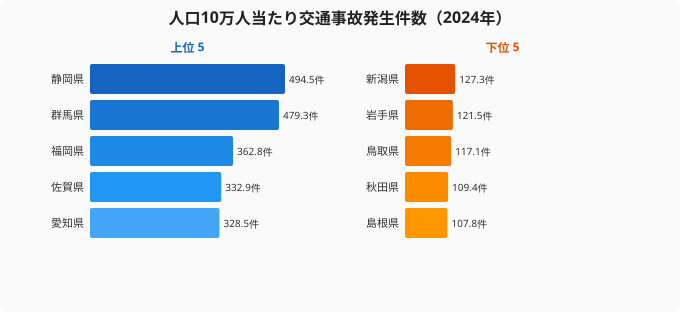
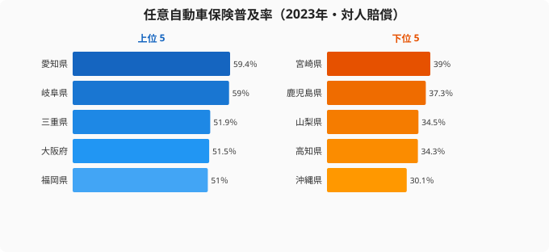

群馬県の人口10万人当たり交通事故発生件数は**527.8件**。島根県は**116.3件**。同じ日本なのに、交通事故リスクにはおよそ**4.5倍もの開き**があります。

しかも、事故の少なさと「安全さ」は必ずしも一致しません。事故件数が少ない県の中には、いったん事故が起きると死亡に至る確率──**致死率**──が全国平均を大きく上回る県があります。「事故が少ないから安全」と言い切れない、この逆説にこそ注目すべきデータが隠れています。

では、本当に安全な県には何か**共通する特徴**があるのでしょうか。e-Statの統計データと交通安全白書の分析を組み合わせ、「安全な県の条件」を5つの切り口で解き明かしていきます。先に結論を言えば、安全な県には「都市型」と「地方型」の2つのタイプがあり、両者を分けるのは事故件数そのものではなく、事故が起きたときに人が死なないための条件の差なのです。

## 交通事故が少ない県──人口当たりの事故発生件数ランキング

まずはランキングそのものを確認しましょう。比較の「ものさし」は[人口当たりの交通事故発生件数](/ranking/traffic-accident-count-per-population)です。単純な件数で比べると人口の多い都道府県が上位に来てしまうため、公平に比べるには人口で割る必要があります。

<source-link href="/ranking/traffic-accident-count-per-population">交通事故発生件数ランキングをもっと見る</source-link>

上位（事故が多い側）に並ぶのは静岡県・群馬県・福岡県といった県で、下位（事故が少ない側）には島根県・秋田県・鳥取県・岩手県・新潟県が連なります。「都会が多くて地方が少ないはず」と予想した方もいるかもしれませんが、実はそう単純ではありません。事故が多い側には大都市の東京や大阪ではなく、地方の県が顔を出しています。

> [!NOTE]
> このランキングは「人口10万人当たり」の発生件数です。総件数では人口の多い東京・大阪・愛知が上位に来ますが、人口で割ると順位は大きく入れ替わります。「事故が多い県」を語るときは、必ず分母が件数なのか人口比なのかを確かめてください。年度によって上位・下位の顔ぶれや倍率は変動します。

### なぜ群馬・静岡が上位（事故が多い側）なのか

上位に並ぶ群馬県と静岡県には、共通する構造的な背景があります。

- **圧倒的な車社会**: 群馬県は自家用車保有台数が1世帯あたり約1.6台と全国トップクラスです。通勤・通学・買い物のほぼすべてが車移動で、運転する機会そのものが多くなります
- **幹線道路の交通量**: 静岡県は東名高速・国道1号など東西の大動脈が県を横断し、長距離トラックを含む通過交通量が多いです。県内の移動に加え、他県から流入する交通も事故リスクを押し上げています
- **郊外型のロードサイド開発**: 広い平野部に幹線道路沿いの商業施設が点在する構造は、右折事故や出合い頭事故を生みやすいです

つまり、これらの県は「ドライバーのマナーが悪い」わけではなく、**車への依存度の高さと道路構造が、事故を生みやすい環境を作っている**のです。ここからは、その背景にある5つの要因を掘り下げていきます。

## 特徴① 「道路インフラの充実度」が事故を減らす

最初に検証するのは、道路インフラと事故の関係です。直感的には「道路が整備されている県ほど安全」と思えますが、データはどうなっているのでしょうか。

主要道路（国道・県道）の舗装率は全国的に高い水準にあり、都道府県間の差は限定的です。むしろ差がつくのは**市町村道の舗装率**──住民が日常的に使う生活道路の整備度合いです。[市町村道舗装率](/ranking/municipal-road-paving-rate)が低い県ほど事故が多い傾向が見られます。大きな幹線道路だけでなく、日常の生活道路の整備こそが事故を減らすカギになります。

歩行者と車を「物理的に分ける」[立体横断施設](/ranking/grade-separated-pedestrian-crossings-per-1000-km)（歩道橋・アンダーパス）の整備状況も、事故リスクに関わります。白書でも、ゾーン30プラスの整備エリアで死亡重傷事故が**28.7%減少**したことが報告されており、「車と人を物理的に分ける」仕組みの効果はデータで裏付けられています。生活道路の舗装と歩車分離は、派手さはないものの、もっとも費用対効果の高い安全対策の一つだといえます。

> [!TIP]
> 道路インフラを見るときは「幹線道路」より「市町村道」に注目してください。幹線はどの県も整備が進んでいて差がつきません。住民の生活圏に最も近い市町村道の整備度合いこそが、その県の安全水準を映す鏡になります。

<ad-slot></ad-slot>

## 特徴② 「交通量と道路密度」のバランス

道路インフラだけでなく、そこを走る車の量と道路網のバランスも重要です。

意外にも、[道路平均交通量](/ranking/average-road-traffic-volume)と事故件数の相関は強くありません。交通量が多い大都市圏は信号機や車線分離などのインフラも充実しており、車が多いわりに事故が抑えられています。「車が多い＝危険」という単純な図式は成り立たないのです。

逆に問題なのは、道路密度（面積当たりの道路延長）が低い──つまり[道路](/ranking/road-length-per-km2)が少ない地域です。**道路密度が低い県ほど、事故の[致死率](/ranking/traffic-accident-deaths-per-100-accidents)が高い**という傾向があります。これは冒頭で述べた「事故が少ないのに死亡率が高い」逆説の正体です。道路が少ない地域では、1本の幹線道路に交通が集中します。片側1車線の道路を高速で走るため、いったん事故が起きると正面衝突など重大事故になりやすいのです。白書のデータでも、事故類型の最多が「正面衝突等」であることと一致します。

つまり「安全な県」には2つのタイプがあることが分かります。

- **都市型の安全**: 事故件数はそこそこあるものの、インフラが充実しているため致死率が低い
- **地方型の安全**: 交通量が少ないため事故件数自体が少ない

逆に、「事故件数は少ないが致死率が高い」県は、見た目の安全さに反して深刻なリスクを抱えています。

> [!WARNING]
> 事故件数ランキングの下位（事故が少ない側）に並ぶ県を、そのまま「安全な県」と読むのは危険です。地方の県は事故件数が少なくても、一件あたりの致死率が高い場合があります。件数の少なさと「死ににくさ」は別の指標であり、両方を見て初めて本当の安全度が分かります。

## 特徴③ 「警察体制の充実」──警察官の多さと違反検挙

3つ目の特徴は、交通取締りの体制です。ここで注意が必要なのが、「**検挙件数が多い＝危険な県**」ではないという点です。

[道路交通法違反検挙件数](/ranking/road-traffic-law-violation-arrest-count-per-population)と事故件数の関係を、検挙の多寡と事故の多寡で4つのパターンに分けて読むと、次のように整理できます。

- **検挙が少なく事故も少ない**: そもそも違反が少なく安全な状態です
- **検挙が多く事故が少ない**: 取締りが機能して事故を抑えている、望ましい状態です
- **検挙が少なく事故が多い**: 取締りが足りず事故が起きている可能性があります
- **検挙も事故も多い**: 違反も事故も多く、根本的な課題を抱えている状態です

「安全な県」の多くは、違反そのものが少ない県か、あるいは積極的に取り締まって事故を抑え込んでいる県のいずれかに当てはまります。検挙件数の数字だけを見て「取締りが厳しい＝危ない県」と早合点しないことが大切です。取締りは事故を生む原因ではなく、事故を抑えるための手段だからです。

<ad-slot></ad-slot>

## 特徴④ 「高齢化率」との相関はあるか

白書のデータによれば、交通事故死者の**56.8%が65歳以上の高齢者**です。80歳以上の歩行中死者に至っては、人口10万人当たりで全年齢平均の**3.9倍**にのぼります。では、高齢化率が高い県ほど事故が多いのでしょうか。

[65歳以上人口割合](/ranking/ratio-65-plus)と[交通事故致死率](/ranking/traffic-accident-deaths-per-100-accidents)のあいだには、**正の相関**が鮮明に表れます──高齢化率が高い県ほど、事故が起きたとき「死に至る確率」が高くなります。

ただし、この相関は「高齢者が事故を起こしやすい」という話だけではありません。高齢化が進んだ地域は同時に、人口減少による道路インフラの維持困難、公共交通の縮小によるマイカー依存の強まり、警察体制の手薄さなど、複数の不利な条件を抱えています。つまり、高齢化率と致死率の相関の背後には、これまで見てきた特徴①〜③のすべてが絡み合っているのです。高齢化は単独の原因ではなく、いくつもの不利な条件を束ねる「結節点」として効いていると読むのが正確でしょう。

> [!WARNING]
> 「高齢化率と致死率に正の相関がある」ことは、「高齢者が悪い」という結論を意味しません。相関は因果ではありません。高齢化が進んだ地域は、インフラ維持の困難・公共交通の縮小・救急搬送までの距離の長さなど、致死率を押し上げる別の条件も同時に抱えています。相関の数字を読むときは、背後で何が一緒に動いているかを必ず疑ってください。

## 特徴⑤ 「任意保険の普及率」が映す安全意識

最後に見るのは、少し変わった指標です。[任意自動車保険の普及率](/ranking/private-auto-insurance-penetration-rate-vehicle)──これが交通安全とどう関係するのでしょうか。

普及率の上位には愛知県・岐阜県・三重県といった東海の県が並び、下位には沖縄県・高知県・山梨県・鹿児島県・宮崎県が連なります。

<source-link href="/ranking/private-auto-insurance-penetration-rate-vehicle">任意自動車保険普及率ランキングをもっと見る</source-link>

保険普及率が高い県ほど事故が少ない傾向がありますが、これは「保険に入ると安全になる」という話ではなく、所得水準やインフラ整備など複数の要因が共通の背景として作用している結果です。任意保険への加入はドライバーの義務ではなく、あくまで「自発的な選択」です。ただし、普及率の高さを単純に「安全意識の高さ」と読むのは早計です。保険普及率には**所得水準**が強く影響しており、「意識の高さ」と「保険料を払える経済的余裕」は分けて考える必要があります。

保険普及率が高い県の特徴を整理すると、以下の傾向があります。

- **所得水準が高い県ほど普及率が高い**（保険料の支払い余力が最大の要因です）
- 都市部は普及率が高くなります（代理店の多さ・情報アクセスの良さによります）
- 結果的に、経済的に豊かで事故率が低い県と、普及率が高い県が重なります

もちろん「保険に入れば事故が減る」という因果関係はありません。しかし、保険普及率は所得水準、情報アクセスの良さ、そしてリスクに対する意識の高さが複合的に反映された指標です。これらの条件が揃った地域では、結果的に交通事故も少ない傾向にあります。あなたの県の任意保険普及率は全国で何番目でしょうか。もし低い方に位置しているなら、この機会に自動車保険の見直しを検討してみてもいいかもしれません。

> [!TIP]
> 任意保険の普及率を「県民の安全意識」だけで読むと、本質を見誤ります。普及率の高さの最大の要因は所得水準、つまり保険料を払える経済的余裕です。意識の指標としてではなく、その地域の経済力と情報アクセスの良さを映す鏡として読むと、他の指標とのつながりが見えてきます。

<ad-slot></ad-slot>

## まとめ──安全な県の「5つの条件」

本記事で見てきた5つの特徴を整理すると、安全な県の条件は次のようにまとめられます。

- **市町村道など生活道路の整備が進んでいる**こと（特徴①）
- **道路密度が高く、交通が1本の道に集中しない**こと（特徴②）
- **取締りが機能し、違反そのものが少ない**こと（特徴③）
- **高齢化に伴う不利な条件が重なっていない**こと（特徴④）
- **所得水準やインフラなど、安全を支える経済的・社会的基盤が整っている**こと（特徴⑤）

そして最も重要なのは、「事故件数が少ない＝安全」ではないという視点です。本当に安全な県を見極めるには、事故の「件数」と「致死率」を必ずセットで見る必要があります。あなたの県は、5つの条件のうちいくつ当てはまるでしょうか。[交通事故発生件数のランキングページ](/ranking/traffic-accident-count-per-population)では、ここで取り上げた指標を都道府県別に確認でき、相関分析で自由に2つの指標を掛け合わせることもできます。移住先の安全性を調べたい方、地元の現状を知りたい方は、ぜひ活用してみてください。

## データ出典

- e-Stat 社会・人口統計体系（[交通事故発生件数ほか](https://www.e-stat.go.jp/dbview?sid=0000010211)）
- 総務省・国土交通省が整備し e-Stat 経由で公開している都道府県別統計
- 内閣府「交通安全白書」（高齢者死者割合・ゾーン30プラスの効果ほか）
