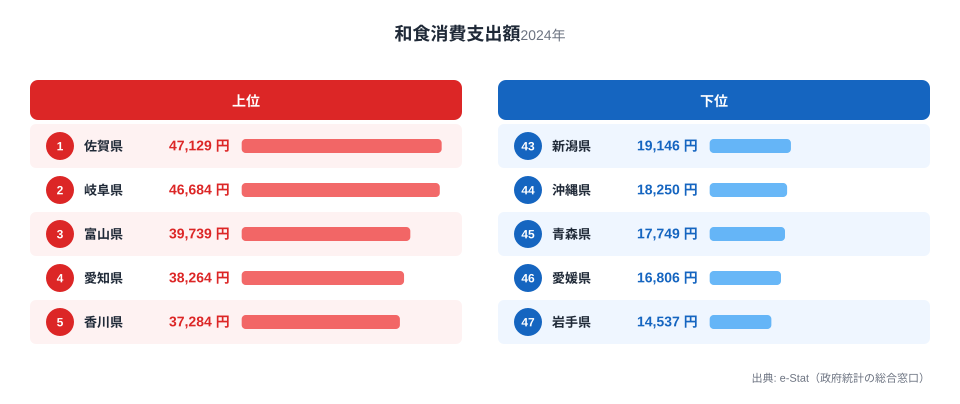
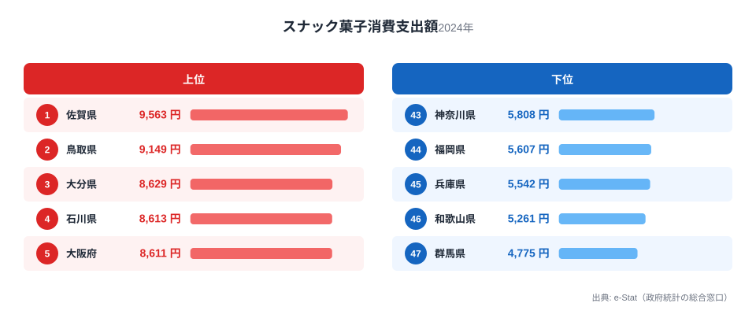
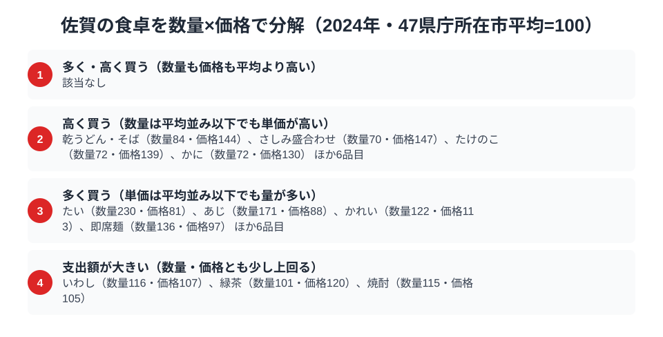

佐賀県の食卓と聞いて、すぐに具体的な料理を思い浮かべる人は多くないかもしれません。しかし家計調査の数字を見ると、佐賀の食卓には全国1位の指標が2つも隠れています。総務省の家計調査（品目別）で佐賀市の二人以上世帯を見ると、和食の消費支出額は47,129円で全国1位。2位の岐阜県46,684円をわずかに上回り、日本で最も和食にお金をかけている県が佐賀なのです。

さらにスナック菓子の消費支出額も9,563円で全国1位、有明海の恵みである干しのりも4,934円で全国2位につけています。この記事では、和食・干しのり・スナック菓子という3つの品目を軸に、佐賀県民の食卓を読み解きます。なぜ佐賀の食卓は「和食王国」なのか、その構造をデータから探ります。

> [!NOTE]
> 家計調査の都道府県データは、県庁所在市（佐賀県は佐賀市）の二人以上世帯を対象にした年間支出額です。県全体ではなく佐賀市在住世帯の家計簿から見た傾向であり、支出「金額」であって消費「量」そのものではない点にご注意ください。

## 和食 — 全国1位47,129円、日本一の和食王国

<source-link href="/ranking/japanese-food-dining-consumption-expenditure">和食消費支出額ランキングをもっと見る</source-link>

佐賀県の和食消費支出額は47,129円で全国1位です。2位は岐阜県で46,684円、3位は富山県で39,739円と続きますが、佐賀はこの中でもわずかに頭一つ抜けています。最下位の岩手県は14,537円で、佐賀と比べると3.2倍もの開きがあり、地域による和食外食への支出の差が非常に大きいことがわかります。

佐賀は有明海・玄界灘という2つの海に面し、稲作も盛んな県です。米・魚・野菜がバランスよく揃う土地柄が、寿司や煮物、季節の惣菜といった和食を扱う店の多さや利用頻度の高さにつながっていると考えられます。また佐賀市は城下町として古くから料亭文化が根づいており、慶事や来客時に和食の店を利用する習慣が今も色濃く残っていることも、支出額を押し上げている要因と考えられます。

## 干しのり — 全国2位4,934円、有明海苔の実力

<source-link href="/ranking/dried-nori-consumption-expenditure">干しのり消費支出額ランキングをもっと見る</source-link>

干しのりの消費支出額では、佐賀県は4,934円で全国2位です。首位の徳島県は4,972円で、その差はわずか38円です。3位の静岡県は4,255円にとどまっており、佐賀はこれを大きく引き離しています。最下位の奈良県は2,341円で、佐賀と比べると2.1倍の差があります。

佐賀県は有明海苔の日本一の産地として知られています。有明海は日本で最も干満差が大きい海域の一つで、栄養豊富な干潟が広がることから、色つや・柔らかさに優れた海苔が育ちます。地元で新鮮な海苔が手に入りやすい環境が、家庭での消費を底上げしていると考えられます。徳島がわずかに上回っているのは、鳴門近海でも良質な海苔が採れることに加え、地域の食文化として海苔の利用頻度が高いことが背景にあるとみられますが、産地としての知名度・生産量では佐賀（有明海苔）が全国トップクラスであることに変わりはありません。

## スナック菓子 — 全国1位9,563円、意外な菓子好きの県

<source-link href="/ranking/snack-consumption-expenditure">スナック菓子消費支出額ランキングをもっと見る</source-link>

佐賀県はスナック菓子の消費支出額でも9,563円で全国1位です。2位は鳥取県で9,149円、3位は大分県で8,629円と続き、最下位の群馬県は4,775円で、佐賀と比べると2.0倍の開きがあります。

和食支出が全国一の佐賀が、同時にスナック菓子でも全国一というのは一見意外に思えるかもしれません。しかしこれは佐賀に限った現象ではなく、鳥取・大分など地方都市圏で菓子類の支出が高くなる傾向は他の家計調査品目でもしばしば見られます。大型商業施設や車社会の生活スタイルの中で、日常のちょっとした買い物にスナック菓子が組み込まれやすいことが背景にあると考えられます。和食への支出とスナック菓子への支出は、食卓の「格式」と「日常のおやつ」という別の軸で共存しているとみるのが自然でしょう。

> [!WARNING]
> 家計調査は支出金額の調査であり、消費量そのものではありません。物価や単価の違いも金額に影響します。また呼子のイカや小城羊羹といった佐賀の名物は、家計調査の主要品目として個別集計されないため、順位だけでは佐賀の食文化の全体像は測れない点にご注意ください。

## 佐賀の食卓を貫くもの

佐賀県民の食卓を貫くのは、「有明海・玄界灘の恵み」と「和食を大切にする食文化」です。和食消費支出が全国1位という結果は、単なる偶然ではなく、良質な米と魚介が地元で手に入りやすい環境と、城下町として料亭文化が根づいてきた歴史が組み合わさった結果と考えられます。そこに、有明海苔という全国屈指の特産品と、日常のスナック菓子への支出も加わり、格式と日常が同居する食卓が浮かび上がります。

[熊本県の食卓](/blog/kumamoto-food-culture)が鶏肉という別の軸で全国トップを持つように、九州各県はそれぞれ異なる品目で食の全国トップを持っています。佐賀の場合はその軸が「和食」であり、隣県とは異なる形で九州の食文化の多様性を示している点が興味深いところです。

> [!TIP]
> ある県が1つの品目で全国1位を取ることは珍しくありませんが、佐賀のように「和食」という総合的なカテゴリで全国1位を取るケースは特徴的です。個別の食材ではなく食のスタイル全体への支出が高いことは、その土地の食文化の厚みを示す指標として読み解くとよいでしょう。

## 数量×価格で分解する佐賀市の食卓

<source-link href="/ranking/sea-bream-consumption-quantity">たい消費量ランキングをもっと見る</source-link>

> [!NOTE]
> ここでの指数は、家計調査で数量と支出額の両方が調べられている125品目について、47都道府県庁所在市の二人以上世帯（2024年）の単純平均を100とした値です。全国計そのものではなく、価格指数は品種やブランドの違いも反映するため、指数が高いからといって単純に「割高」を意味するとは限りません。

支出額は「数量×価格」に分解できます。佐賀市の食卓をこの物差しで見ると、和食・干しのり・スナック菓子という3つの1位・2位品目だけでは見えなかった、買い方の癖が浮かび上がります。125品目のうち、数量・価格のどちらも平均を大きく上回る品目は該当なしでした。代わりに目立つのは「量で稼ぐ」品目と「単価の高いものを選ぶ」品目の2系統です。

数量が突出して多いのは魚介と麺類です。たい消費量は指数230で全国1位につけながら、価格指数は81と平均より安く買われています。あじも数量指数171・価格指数88、即席麺も数量指数136・価格指数97と、いずれも「たくさん買うが単価は平均並みかそれ以下」という同じ形です。有明海・玄界灘という2つの漁場が近く、鮮魚が日常的に手に入りやすいことが、量を確保しながら単価を抑えられる背景にあると考えられます。こうした品目は他にかれい・ごぼう・牛肉・砂糖・れんこん・しょう油・かき（貝）を加えた10品目にのぼります。

逆に、数量は平均以下でも単価が高い品目には、乾うどん・そば（数量指数84・価格指数144）、さしみ盛合わせ（数量指数70・価格指数147）、かに（数量指数72・価格指数130）が並び、こんぶ・食塩・紅茶なども含めて10品目です。日常的に大量には買わないものの、買うときは質の高いものを選ぶ傾向がうかがえ、これは冒頭で見た「和食支出が全国1位」という結果とも重なります。数量・価格のどちらも突出せず、少しずつ両方で平均を上回るのが、いわし（数量指数116・価格指数107）、緑茶（数量指数101・価格指数120）、焼酎（数量指数115・価格指数105）の3品目（家計調査上の残余分類「他の生鮮肉」を除く）で、支出額としては全国上位に来やすいものの、量だけ・単価だけの突出とは違う伸び方をしています。

> [!TIP]
> 「数量指数が高く価格指数は平均以下」という組み合わせは、地元で新鮮な食材が手に入りやすい産地でよく見られるパターンです。逆に「価格指数だけが高い」品目は、量より質を選んで買っている可能性を示しています。佐賀市の食卓は、この2つのパターンが魚介と乾物・刺身でくっきり分かれているのが特徴です。

## まとめ

- 和食消費支出額は佐賀県が全国1位（47,129円）、2位岐阜県にわずかに勝る「和食王国」
- 干しのりは全国2位（4,934円）、有明海苔の一大産地としての実力
- スナック菓子も全国1位（9,563円）、和食志向と日常の菓子文化が共存
- 有明海・玄界灘の恵みと城下町の料亭文化が、佐賀の食卓の厚みを支えている

佐賀県の他の統計は[佐賀県の地域プロフィール](/areas/41000)、食品・家計消費の地域差は[経済カテゴリ一覧](/category/economy)からご覧いただけます。

## データ出典

総務省統計局「家計調査（品目別）」（2024年、都道府県庁所在市 二人以上世帯）をもとに、e-Stat（政府統計の総合窓口）経由で整備したデータを使用しています。
