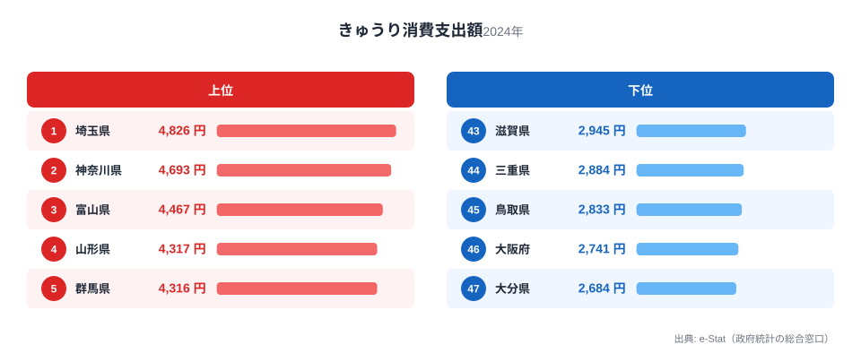
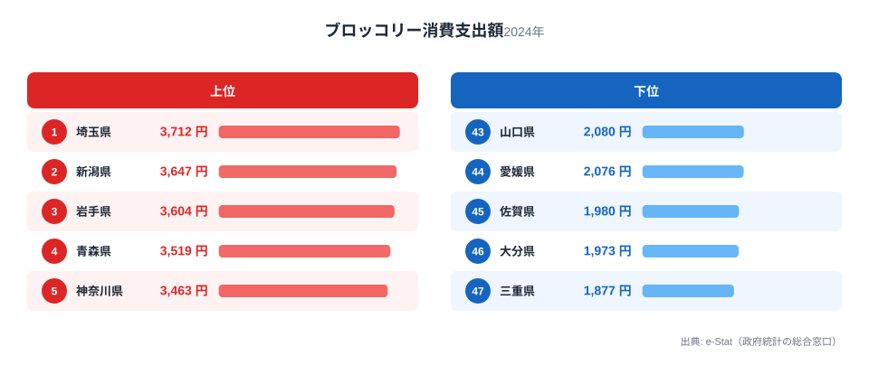
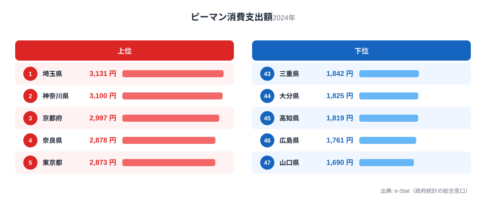
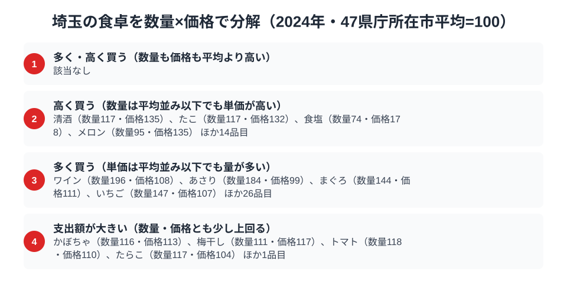

埼玉県というと東京のベッドタウンのイメージが強く、農業県という印象を持つ人は少ないかもしれません。ところが総務省「家計調査」の品目別データを都道府県庁所在市で比べると、埼玉県はきゅうり・ブロッコリー・ピーマンという3つの野菜の消費支出額でそろって全国1位に立っています。

なぜベッドタウンの県が、野菜の消費でここまで突出するのでしょうか。答えは家計調査が測っているのが「食べた量」ではなく「支出額」だという点と、埼玉が実は近郊農業の一大産地であるという事実の両方に隠れています。この記事では3つの野菜のランキングを1つずつ見ながら、埼玉の食卓を貫く共通点を探ります。

> [!NOTE]
> 本記事のデータは総務省統計局「家計調査（品目別）」2024年、都道府県庁所在市の二人以上世帯を対象にした消費支出額（円）です。世帯が1年間にその品目へ実際に支払った金額の平均であり、購入量そのものではありません。

## きゅうり — 全国1位4,826円、2位神奈川に133円差

<source-link href="/ranking/cucumber-consumption-expenditure">きゅうり消費支出額ランキングをもっと見る</source-link>

きゅうりの消費支出額は埼玉県が4,826円で全国1位でした。2位は神奈川県で4,693円、埼玉との差はわずか133円です。3位の富山県は4,467円で埼玉との差は359円にとどまり、上位が僅差でひしめく展開です。最下位は大分県の2,684円で、1位との差は1.8倍にとどまり、他の食品ランキングにありがちな極端な地域格差は見られません。

埼玉県は深谷市や熊谷市を中心に、きゅうりの産地として全国有数の出荷量を誇ります。夏場のハウス栽培・露地栽培が盛んで、都心への近さから鮮度を保ったまま出荷できる立地の強みがあります。地元産のきゅうりが日常的にスーパーへ並ぶことが、購入頻度と価格の両面で支出額を押し上げていると考えられます。上位に神奈川・千葉・東京といった首都圏勢が並ぶ一方で、山形・群馬・岐阜といった内陸の農業県も食い込んでおり、「産地であること」と「首都圏で流通の便が良いこと」の両方が効いている構図が見えます。

## ブロッコリー — 全国1位3,712円、下位三重の1.98倍

<source-link href="/ranking/broccoli-consumption-expenditure">ブロッコリー消費支出額ランキングをもっと見る</source-link>

ブロッコリーも埼玉県が3,712円で全国1位です。2位の新潟県は3,647円、3位の岩手県は3,604円と続き、こちらも上位3県の差はわずかです。最下位は三重県の1,877円で、1位埼玉との差は約2.0倍ときゅうりよりも格差が広がっています。

埼玉県はブロッコリーの産出量でも全国上位に位置し、深谷市周辺は夏秋どりブロッコリーの主要な産地として知られています。近年ブロッコリーは冷凍食品や外食向けの需要が伸びている品目ですが、そうした加工用需要とは別に、産地の県ではスーパーの店頭に地場産の新鮮なブロッコリーが並びやすく、家庭での購入頻度が上がりやすい傾向があります。2位・3位に新潟・岩手という東北・北陸の生産県が入っている点も、「産地=消費地」という同じパターンを裏づけています。

## ピーマン — 全国1位3,131円、僅差の神奈川を退ける

<source-link href="/ranking/green-pepper-consumption-expenditure">ピーマン消費支出額ランキングをもっと見る</source-link>

3品目目のピーマンも埼玉県が3,131円で全国1位でした。2位は神奈川県で3,100円、埼玉とはわずか31円差という大接戦です。3位は京都府の2,997円で、最下位は山口県の1,690円でした。1位との差は1.9倍で、きゅうり・ブロッコリーとほぼ同水準の格差にとどまっています。

ピーマンは茨城県や宮崎県が全国的な出荷量の上位県として知られますが、消費支出額では必ずしも生産量ランキングと一致しません。埼玉県では夏野菜としてピーマンの露地栽培が盛んで、地場産の流通に加えて首都圏の物価水準の高さも支出額を押し上げる一因と考えられます。同じく上位に入った神奈川県・京都府はいずれも大都市圏の県であり、ピーマンについては「生産地」よりも「都市部の購買力」が支出額を左右している可能性があります。

> [!WARNING]
> 家計調査の品目別支出額は購入量ではなく金額です。地場産品が安価で手に入る地域ではむしろ支出額が伸びにくいケースもあり、埼玉のきゅうり・ブロッコリー・ピーマンが1位なのは「よく食べている」ことに加えて「よく買っている」という購買行動の反映である点に注意が必要です。またここで扱った3品目以外にも埼玉が上位の食品（他調味料・おにぎり・ケーキなど）がありますが、本記事では近郊野菜の3品目に絞って紹介しています。

## 埼玉の食卓を貫くもの

きゅうり・ブロッコリー・ピーマンという3つの野菜に共通するのは、いずれも埼玉県が産地でありながら、同時に首都圏という巨大な消費地の一部でもあるという二重性です。産地であることが新鮮な地場野菜の日常的な流通を支え、首都圏であることが物価水準と購買力を押し上げる。この2つの要因が重なることで、埼玉県は野菜の消費支出額で全国上位の常連になっています。

これは[長野の食卓](/blog/nagano-food-culture)のように山間部の冷涼な気候を活かした特産品で全国トップに立つ県とは異なるパターンです。埼玉は「近郊農業＋大消費地」という都市近接型の食文化を体現しています。埼玉県の地域プロフィールは[埼玉県のページ](/areas/11000)でも確認できます。

> [!TIP]
> 3品目とも1位と2位の差が数十円〜100円台という僅差である点に注目です。きゅうりは神奈川に133円差、ピーマンはわずか31円差でした。これは埼玉が突出した特殊要因を持つというより、首都圏の近郊農業県（埼玉・神奈川・千葉）が横並びで高水準にあることを示しています。首都圏の食料自給や地産地消を考えるうえで、埼玉単独ではなく首都圏近郊農業ベルト全体として見る視点が有効です。関連する消費支出データは[経済カテゴリ一覧](/category/economy)でも確認できます。

## 数量×価格で分解するさいたま市の食卓

<source-link href="/ranking/wine-consumption-quantity">ワイン消費量ランキングをもっと見る</source-link>

埼玉県の食料支出額を家計調査の品目別データで「数量指数」と「価格指数」に分解すると、対象124品目のうち数量・価格の両方が47都道府県庁所在市の平均を大きく上回る品目は1つもありませんでした。埼玉が支出額で全国上位に立つ品目の多くは、単価が突出して高いのではなく、購入する量そのものが平均より多いことで支出額を押し上げているのです。

この記事で見てきたきゅうり・ブロッコリー・ピーマンも、いずれも「量が多い」区分に入ります。きゅうりの数量指数は130で価格指数は103、ブロッコリーは数量指数142に対し価格指数はむしろ平均を下回る94、ピーマンは数量指数125に価格指数108です。3品目とも支出指数は130台まで上がる一方、価格指数はいずれも110を超えません。埼玉が3野菜で1位になっているのは「高く買っている」からではなく「たくさん買っている」からだと、指数の面からも裏づけられます。

一方、「高く買う」区分の代表格は食塩（数量74・価格178）や清酒（数量117・価格135）で、量は平均並み以下でも単価の高いものを選ぶ品目です。「量が多い」区分で最も指数が高いのはワイン消費量で、数量指数196に対し価格指数は108にとどまります。埼玉の食卓は野菜に限らず、日常的に量をたくさん消費する傾向が広く見られます。

> [!TIP]
> 同じ「支出額が全国上位」でも、品目によって効いている指数は異なります。きゅうり・ブロッコリー・ピーマンは価格指数110以下の「たくさん買う」型ですが、食塩や清酒は数量指数が平均以下でも価格指数178・135という「高く買う」型です。あるランキングで支出額が上位に来たとき、数量指数と価格指数のどちらが押し上げているかを確認すると、その地域が「量で稼いでいるのか」「単価で稼いでいるのか」を見分けられます。

> [!NOTE]
> ここでの数量指数・価格指数・支出指数は、家計調査の品目別データが揃う47都道府県庁所在市の単純平均を100とした相対値で、家計調査の全国平均値そのものではありません。価格指数は支出額を数量で割った単価の相対水準なので、地域で買われている品種やブランドの違いも含んだ数字です。対象は二人以上世帯・年間の消費支出額と消費量（2024年）です。

## まとめ

- きゅうり消費支出額は埼玉県が4,826円で全国1位、2位神奈川県は4,693円で133円差
- ブロッコリー消費支出額も埼玉県が3,712円で全国1位、最下位三重県は1,877円で約2.0倍差
- ピーマン消費支出額は埼玉県が3,131円で全国1位、2位神奈川県は3,100円でわずか31円差
- 3品目に共通するのは「近郊農業の産地」と「首都圏の大消費地」という二重の性格で、上位には神奈川・千葉・東京など首都圏勢が並ぶ

## データ出典

総務省統計局「家計調査（品目別）」2024年、都道府県庁所在市 二人以上世帯（e-Stat 経由で整備）
