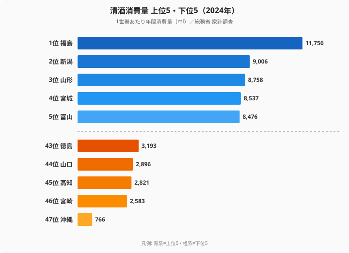

「日本酒の本場」と聞いて新潟を思い浮かべる方は多いでしょう。しかし2024年の実データが示す答えは異なります。総務省「家計調査」によると、1世帯あたり年間清酒消費量の1位は**福島県（11,756ml）**であり、2位の新潟県（9,006ml）を約31%も上回っています。最下位の沖縄県（766ml）との差は**15.35倍**に達し、日本列島における酒文化の地理的分断がくっきりと浮かび上がります。

> [!NOTE]
> 本データは総務省「家計調査」（2024年・二人以上の世帯）の都道府県庁所在市ベース。「清酒消費量（ml）」は1世帯あたりの年間購入数量で、外食での飲酒は含まれません。購入先が酒販店・スーパー等の家庭内消費を捉えた指標です。

## TOP5・最下位5 — 東北・北陸 vs 南方蒸留酒圏

<source-link href="/ranking/sake-consumption-quantity">清酒消費量ランキングをもっと見る（全47都道府県）</source-link>

上位5県（福島・新潟・山形・宮城・富山）はすべて東北・北陸地方です。冬の寒さが厳しいこれらの地域では、体を温める燗酒の文化が根付いており、地元の蔵元数も多くなっています。1位の福島県（11,756ml）から5位の富山県（8,476ml）まで、上位グループは1万ml前後の高水準で固まっており、東北・北陸という一つの帯として清酒消費の核を形成しています。下位5県（徳島3,193ml・山口2,896ml・高知2,821ml・宮崎2,583ml・沖縄766ml）はいずれも九州〜四国に集中しており、本格焼酎や泡盛が日常酒の役割を担う地域です。とりわけ沖縄県の766mlは下位グループの中でも突出して低く、上位県とは桁が一つ違うことが、この品目の地域差の大きさを物語っています。

一方、TOP10には東北・北陸以外から兵庫県（6位・8,147ml）と奈良県（7位・7,502ml）も入っています。灘五郷を抱える兵庫は日本最大の清酒生産地であり、日本酒発祥の地とされる奈良も蔵元集積地として有名です。生産地と消費地が一致する「産地消費」構造が、西日本の例外的な高水準を支えていると考えられます。[福島県の統計プロフィール](/areas/07000)では、清酒以外の食文化指標も確認できます。

## なぜ福島が新潟を抜いて1位なのか

長らく「日本酒王国」の代名詞だった新潟が2位にとどまる一方、福島が首位に立った背景には複数の要因があります。

福島県は会津・中通り・浜通りの三地域それぞれに有力な蔵元を抱えており、全国新酒鑑評会では2016年以降8年連続で最多金賞受賞県となっています。地酒への誇りと地元購買の習慣が家庭での消費を押し上げていると見られます。また、東日本大震災後の「福島を応援しよう」という消費行動が地酒ブームを加速させた面もあり、生産量ではなく「飲む文化」の厚さが数値に反映されています。

数字で見ると、福島県の11,756mlは2位新潟県の9,006mlを2,750mlも上回り、率にして約31%の差です。これは単なる僅差の首位交代ではなく、明確なリードと言えます。新潟が「越乃寒梅」に代表される銘柄ブランドで全国に名を知られる輸出型の酒どころであるのに対し、福島は県内三地域で完結する地元密着型の消費構造を持つ点が、家庭内消費を捉える家計調査では福島に有利に働いた可能性があります。「ブランド力」と「日常的に飲む量」は別物であり、本ランキングが後者を測っていることが、この逆転を読み解く鍵です。

> [!TIP]
> 清酒消費量と合わせて[清酒消費支出額ランキング](/ranking/sake-consumption-expenditure)も参照すると、「量は多いが単価が低い（普段飲み）」か「量は少ないが高単価（贈答・特別消費）」かの違いが見えてきます。両指標を比べると、消費スタイルの地域差がより鮮明になります。

## 最下位グループ — 蒸留酒が清酒を代替

最下位の沖縄県（766ml）は1位福島県の約6.5%に過ぎません。沖縄では泡盛という独自の蒸留酒文化が清酒需要をほぼ完全に代替しています。[沖縄県の統計プロフィール](/areas/47000)を見ると、消費パターン全体が本土と大きく異なることがわかります。

46位の宮崎県（2,583ml）を含む九州南部は本格焼酎（芋・麦）の本場であり、家庭での日常酒は焼酎が中心となっています。高知（2,821ml）・山口（2,896ml）も地域固有の蒸留酒文化と清酒消費の代替関係が強く、清酒の低消費を引き起こしていると考えられます。

> [!WARNING]
> 本データは都道府県庁所在市のみの調査であり、農村部・郊外の消費傾向とは一致しない可能性があります。また調査世帯数が少ない県では年次変動が大きくなるため、単年の順位変動には注意が必要です。

## 発見まとめ — 清酒文化の地理的分断

- **寒冷地ほど清酒消費が多くなっています**。東北6県のうち4県（福島・山形・宮城・秋田）がTOP10入りしており、燗酒で体を温める食文化と地酒蔵元の集積が消費を支えています
- **蒸留酒文化圏では清酒が劣勢になっています**。沖縄（泡盛）・宮崎（焼酎）・鹿児島（焼酎）など南方ほど清酒消費が低く、酒類カテゴリ間で明確な「棲み分け」が存在しています
- **生産地と消費地は概ね一致しています**。新潟・兵庫（灘）・奈良など歴史ある酒どころは自県内消費も高水準で、ローカル流通が大きな比重を占めています

[生活・食・衣料カテゴリ](/category/lifefoodclothing)では清酒以外の消費品目についても都道府県ランキングを掲載しています。

## まとめ

- 2024年の1世帯当たり清酒消費量は**福島県（11,756ml）が全国1位**、新潟県（9,006ml）を大きく上回りました
- 最下位の沖縄県（766ml）との格差は**15.35倍**で、清酒は地域差が極めて大きい品目です
- TOP10は東北・北陸が6県を占め、寒冷地と地酒蔵元集積地が重なっています
- 西日本では灘の兵庫（6位）と日本酒発祥の奈良（7位）が産地消費構造で高水準を維持しています
- 沖縄（泡盛）・九州南部（焼酎）は蒸留酒文化圏として清酒消費が極端に少ない傾向があります

## データ出典

- 総務省統計局「家計調査」2024年（品目分類・二人以上の世帯・都道府県庁所在市）
- e-Stat: 政府統計の総合窓口 https://www.e-stat.go.jp/
- 単位: ml/1世帯当たり年間消費量
