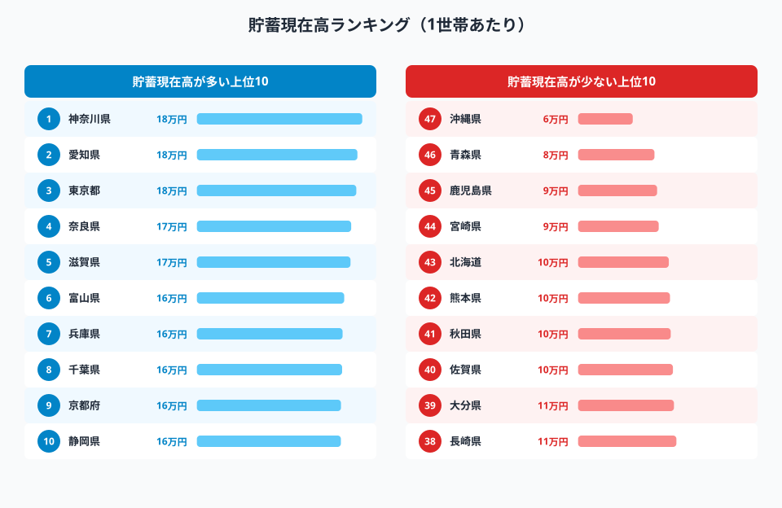
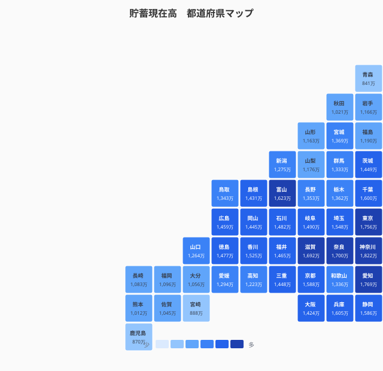
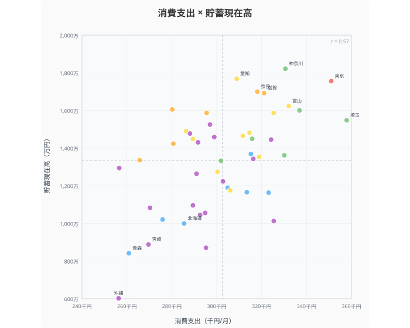
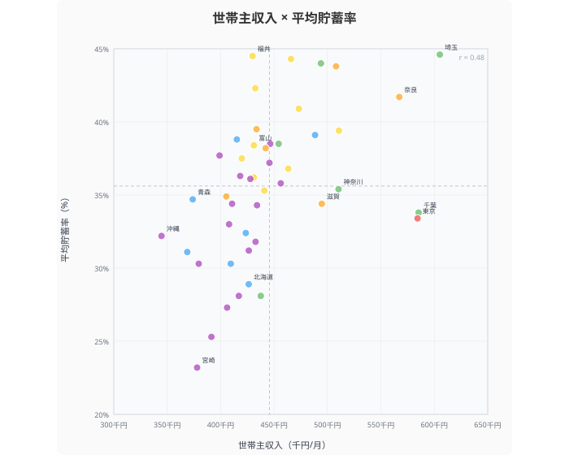
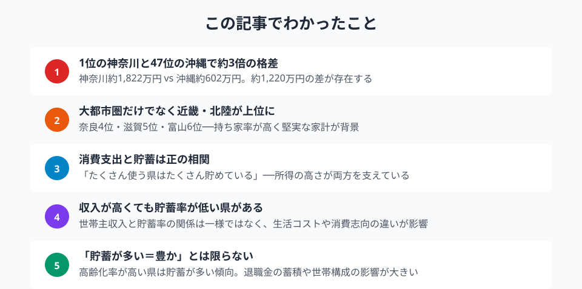

都道府県によって「貯蓄額」に大きな差があることをご存知でしょうか。**貯蓄現在高**は1位と47位で約1,200万円の開きがあります。単なる所得の差だけでは説明できない、地域ごとの「お金との付き合い方」を見ていきましょう。

> [!NOTE]
> 貯蓄現在高は、預貯金・生命保険・有価証券などを含む金融資産の総額。住宅ローンなどの負債は含みません。総務省「全国家計構造調査」（2019年）二人以上の世帯・1世帯あたりによる。

## 貯蓄現在高ランキング

<data-source url="https://www.e-stat.go.jp/dbview?sid=0000010112" label="e-Stat 社会・人口統計体系"></data-source>

**1位は[神奈川県](/areas/14000)の約1,822万円**。僅差で愛知県、東京都と続きますが、注目すべきは**4位の奈良県と5位の滋賀県**。大都市圏ではなく近畿の衛星都市が上位に食い込んでいます。奈良は大阪への通勤圏で持ち家率が高く、堅実な家計が多いことが背景です。

**6位の富山県**も特徴的。北陸は共働き率が高く世帯収入が厚い上、持ち家率全国1位の富山は住居費負担が少なく、貯蓄に回しやすい構造があります。

一方、下位には**[沖縄県](/areas/47000)（約602万円）、青森県（約841万円）、鹿児島県（約870万円）**が並びます。1位の神奈川と47位の沖縄では**約3倍の格差**。詳細は[都道府県別 貯蓄現在高ランキング](/ranking/current-savings-balance-multi-person-households)を参照。同じ日本でもお金の蓄積にこれほどの差があります。

### 全国マップ

<data-source url="https://www.e-stat.go.jp/dbview?sid=0000010112" label="e-Stat 社会・人口統計体系"></data-source>

マップを見ると、**三大都市圏と近畿・北陸**が濃い色で目立ちます。愛知・神奈川・東京に加え、奈良・滋賀・京都・兵庫と近畿全体が高水準。北陸の富山・福井も健闘しています。

逆に**東北・九州南部・沖縄**は色が薄く、所得水準の地域差と重なる部分が大きいですが、後述するように完全には一致しません。

<source-link href="/ranking/financial-assets-balance-current-savings-multi-person-households">47都道府県の貯蓄現在高ランキングをもっと見る</source-link>

## 「貯める県」vs「使う県」──貯蓄 × 消費支出の4象限

<data-source url="https://www.e-stat.go.jp/dbview?sid=0000010112" label="e-Stat 社会・人口統計体系"></data-source>

> [!NOTE]
> 消費支出は家計調査（2024年）、貯蓄現在高は全国家計構造調査（2019年）のため、データの時点が異なります。トレンドの把握としてご覧ください。

消費支出（月間）と貯蓄現在高の散布図を見ると、相関係数はr=0.57。正の相関はあるものの、興味深い外れ値が目立ちます。

**右上（高消費・高貯蓄）** には東京・神奈川・埼玉・千葉。所得が高いからこそ「使いながら貯められる」グループです。

**左上（低消費・高貯蓄）** に位置するのが奈良・滋賀。消費支出は全国平均以下なのに貯蓄は上位──まさに「堅実に貯める県」です。特に奈良は消費支出35位でありながら貯蓄4位。近畿圏の「倹約文化」が数字に表れています。

**右下（高消費・低貯蓄）** は目立つ県がなく、大半の県は消費と貯蓄が連動しています。

**左下（低消費・低貯蓄）** には沖縄・青森・宮崎が位置します。所得水準自体が低く、消費も貯蓄も全国最低クラス。地域の経済基盤の差がそのまま反映されています。

<source-link href="/correlation?x=consumption-expenditure-multi-person-households-per-month&y=financial-assets-balance-current-savings-multi-person-households">消費支出×貯蓄現在高の相関をもっと見る</source-link>

<ad-slot></ad-slot>

## 収入が高くても貯蓄率が低い県はどこ？

<data-source url="https://www.e-stat.go.jp/dbview?sid=0000010212" label="e-Stat 社会・人口統計体系"></data-source>

世帯主収入と平均貯蓄率の関係を見ると、相関係数はr=0.48。正の相関はあるものの、**収入が高いのに貯蓄率が低い県、収入が低いのに貯蓄率が高い県**が存在します。

**貯蓄率1位は埼玉県の44.6%**。世帯主収入も1位で、高収入を堅実に貯蓄に回しています。2位の福井県（44.5%）は世帯主収入が中位ながら高い貯蓄率を誇り、北陸の堅実な家計管理がうかがえます。

一方、**貯蓄率が最も低いのは宮崎県の23.2%**。世帯主収入も下位に位置し、所得の低さが貯蓄率に直結しています。鳥取県（25.3%）、佐賀県（27.3%）も同様のパターンです。

注目すべきは**東京都**。世帯主収入は3位と高水準ですが、貯蓄率はそれほど突出していません。家賃・物価の高さが「稼いでも貯めにくい」構造を生んでいると考えられます。

## まとめ

貯蓄の地域差は単なる所得格差では説明しきれません。神奈川約1,822万円に対し沖縄は約602万円と約3倍の開きがありますが、その背景には所得水準だけでなく、持ち家率・共働き率・消費志向・世帯構成など多くの要因が絡んでいます。

奈良・滋賀のように消費を抑えて堅実に貯める「倹約型」、東京・神奈川のように高収入で消費も貯蓄も多い「高回転型」──データが映し出すのは、47通りの「お金との付き合い方」です。

ただし「貯蓄が多い＝豊か」とは限りません。高齢化率が高い地域は退職金の蓄積で貯蓄が多くなる傾向があり、現役世代の家計状況とは必ずしも一致しません。所得や物価と合わせて見ることで、より立体的な「暮らしの姿」が浮かび上がります。

> [!TIP]
> 北陸（富山・福井）が高貯蓄率を実現できている背景には、高い共働き率と全国トップクラスの持ち家率の組み合わせがある。世帯収入が厚く住居費負担が軽い──この二つが重なることで、消費を抑えずとも貯蓄に回せる余力が生まれやすい。自分の県の持ち家率・共働き率は[県別ランキング](/category/economy)で確認できる。

## データ出典

本記事のデータはe-Stat（政府統計の総合窓口）を基に作成しています。

本記事の対象データ: [関連カテゴリ](/category/economy)
