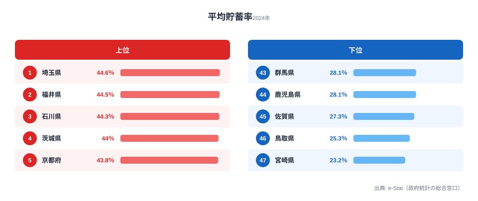
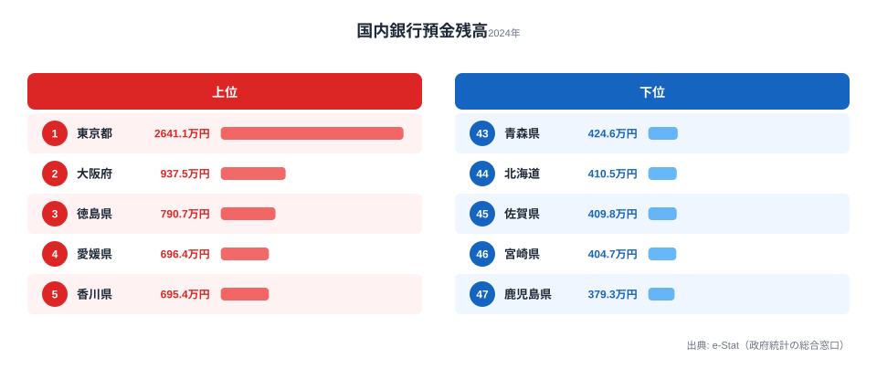

埼玉県の平均貯蓄率は44.6%で全国1位です。しかし1人当たり預金残高では中位にとどまります。一方の[東京都](/areas/13000)は貯蓄率33.4%と全国平均並みですが、**1人当たり預金残高は2,641万円で全国1位**。2位の大阪府938万円を大きく引き離しています。

つまり「毎月よく貯める県」と「資産が多く積み上がった県」は別物です。貯蓄率（フロー）と預金残高（ストック）の相関係数はわずか**r=0.08**──ほぼ無相関なのです。この記事では、なぜ「貯める力」と「貯まる力」がここまでズレるのか、47都道府県のデータからその構造を読み解きます。

> [!NOTE]
> 平均貯蓄率は可処分所得に対する貯蓄純増の割合（%）で、二人以上の勤労者世帯が対象です。一方の預金残高は世帯ではなく地域全体（個人・企業を含む）の銀行預金を人口で割った値です。両者は調査対象も「フロー／ストック」の性質も異なるため、単純比較ではなく構造の違いとして読むのがコツです。総務省「家計調査」・e-Stat 社会・人口統計体系（いずれも2024年）。

## 平均貯蓄率が高い県・低い県──埼玉44.6%、宮崎23.2%

**1位は埼玉県の44.6%**。僅差で福井（44.5%）・石川（44.3%）・茨城（44.0%）が続きます。上位には2つのパターンが見えます。

**パターン1：北陸の堅実型**──福井・石川・岐阜（40.9%）は共働き率が全国トップクラスです。世帯収入が厚いうえに持ち家率が高く住居費負担が少ないため、「二馬力で稼いで堅実に貯める」構造になっています。

**パターン2：大都市圏の通勤型**──埼玉・茨城は東京への通勤圏です。世帯主の収入が高い一方で、東京ほど家賃・物価が高くないため、可処分所得の余力が貯蓄に回ります。

**5位の[京都府](/areas/26000)**（43.8%）と**7位の奈良県**（41.7%）も特徴的です。大阪圏の衛星都市にあたり、消費支出を抑えつつ高い貯蓄率を維持する「近畿の倹約文化」がデータに表れています。

一方、**最下位は宮崎県の23.2%**。鳥取（25.3%）、佐賀（27.3%）と続き、九州・山陰が下位を占めます。所得水準の低さが貯蓄余力の少なさに直結しているとみられます。最上位の埼玉44.6%と最下位の宮崎23.2%では約1.9倍の開きがあります。

<source-link href="/ranking/avg-savings-rate-worker-households">47都道府県の平均貯蓄率ランキングをもっと見る</source-link>

<ad-slot></ad-slot>

## 預金残高が多い県・少ない県──東京2,641万円が突出

預金残高で見ると、上位の顔ぶれは貯蓄率とまるで違います。**1位は東京都の2,641万円**で、2位の大阪府938万円の約2.8倍。企業の預金本社一括計上や高所得層の資産が集中する「ストック集中型」の典型です。

注目は**3位の徳島県（791万円）**で、貯蓄率では中位（14位・38.5%）にとどまる県が、預金残高ではトップ3に入っています。4位の愛媛（696万円）・5位の香川（695万円）と合わせ、四国がベスト10に3県食い込んでいるのも特徴です。地方銀行への根強い預金文化が、ストックの厚みにつながっているとみられます。

逆に**埼玉県は預金残高では24位（514万円）**。貯蓄率は1位でも、蓄積された資産規模は中位にとどまります。毎月の家計管理は優秀でも、ストックの厚みは東京や四国には及ばないのです。最下位は鹿児島県の379万円で、東京とは7.0倍の開きがあります。

> [!WARNING]
> 預金残高は「個人の家計貯蓄額」ではありません。地域に立地する銀行支店の預金を人口で割った値なので、企業の本社や金融機関が集中する東京は実態以上に大きく出ます。逆に、地方で預金残高が厚い県（徳島・愛媛など）は、消費より預金を選ぶ地域性の表れであり、住民が裕福であることを直接意味するわけではありません。

<source-link href="/ranking/bank-deposit-balance-per-person">1人当たり銀行預金残高ランキングをもっと見る</source-link>

## 「貯蓄率が高い県＝預金が多い県」ではない

ここまでの2つのランキングを並べると、上位の顔ぶれがほとんど重ならないことがわかります。貯蓄率と預金残高の相関係数はわずか**r=0.08**で、ほぼ無相関です。「毎月どれだけ貯蓄に回すか（フロー）」と「銀行にいくら預けているか（ストック）」は、まったく別の構造なのです。

象徴的なのが**東京都**です。貯蓄率は33.4%（33位）と全国平均並みですが、預金残高は2,641万円で断トツの1位。これは住民が毎月せっせと貯めた結果ではなく、企業や富裕層の資産がストックとして積み上がった結果です。

逆に**埼玉県**は貯蓄率1位（44.6%）でありながら、預金残高は中位（24位）。フローは全国トップでも、ストックの蓄積では目立ちません。

**徳島県**はその中間にある興味深い県です。貯蓄率は14位（38.5%）と中位ながら、預金残高は791万円で全国3位。「派手に貯蓄率が高いわけではないが、地道に預金を積み上げてきた」というストック型の県だと読めます。

> [!TIP]
> フローとストックがズレるのは、ストックには「過去の蓄積」と「域内に立地する企業・金融機関」が効くからです。自分の家計を点検するときは、まず貯蓄率（毎月のフロー）を把握し、次に手元のストックを預金・証券・保険にどう配分するかを見直す──この2ステップで考えると、住んでいる県の順位に振り回されずに済みます。

[貯蓄率×預金残高をインタラクティブに確認](/correlation?x=avg-savings-rate-worker-households&y=bank-deposit-balance-per-person)

<ad-slot></ad-slot>

## なぜ貯蓄率に地域差が生まれるのか──3つの構造的要因

### 1. 共働き率と世帯収入

北陸3県（福井・石川・富山）は共働き率が全国上位です。世帯の総収入が厚いため、1人当たりの消費支出が同じでも貯蓄に回せる余力が大きくなります。貯蓄率上位に北陸が並ぶのは、この「二馬力効果」が主因だと考えられます。

### 2. 住居費の負担差

東京都の貯蓄率が33.4%にとどまるのは、家賃や住宅ローンの負担が重いためです。収入は全国トップクラスでも、住居費に吸収されて貯蓄に回りにくくなります。逆に持ち家率が高い北陸・近畿衛星都市は住居費が少なく、同じ収入でも貯蓄率が高くなります。

### 3. 所得水準と産業基盤

宮崎・鳥取・佐賀など貯蓄率下位の県は、そもそもの所得水準が低い地域です。生活必需品の支出は全国でそれほど変わらないため、所得が低いほど貯蓄に回す余力が少なくなる構造になっています。

> [!NOTE]
> 家計調査は都道府県ごとのサンプル数が限られるため、単年データの順位は変動しやすい点に注意が必要です。特に人口の少ない県では外れ値の影響を受けやすいため、複数年のトレンドで傾向を確認することをおすすめします。

## まとめ

- **貯蓄率1位は埼玉44.6%**、最下位は宮崎23.2%で、その差は約1.9倍。
- **預金残高1位は東京2,641万円**、最下位は鹿児島379万円で、その差は7.0倍と貯蓄率よりはるかに大きい。
- 貯蓄率上位は北陸（福井・石川）と東京通勤圏（埼玉・茨城）、近畿衛星都市（京都・奈良）が中心。
- 預金残高上位は東京の突出に加え、徳島・愛媛・香川の四国勢が目立つ。
- 貯蓄率（フロー）と預金残高（ストック）は相関係数r=0.08でほぼ無相関──「毎月いくら貯めるか」と「トータルでいくら持っているか」は別の話。

埼玉は毎月の家計管理で全国一でも預金残高は中位、東京は貯蓄率が平均並みでも預金残高は断トツ。データが示すのは、47都道府県それぞれの「お金との付き合い方」の違いです。さらに地域経済を見るなら[経済カテゴリのランキング一覧](/category/economy)もあわせてご覧ください。

## データ出典

- 総務省「家計調査」平均貯蓄率・消費支出（2024年）
- e-Stat 社会・人口統計体系（2024年）
