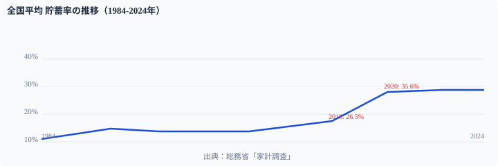

埼玉県の平均貯蓄率は44.6%で全国1位だ。しかし預金残高は中位にとどまる。一方の[東京都](/areas/13000)は貯蓄率33.4%と全国平均並みだが、**1人当たり預金残高2,641万円で全国2位以下（大阪938万円）を大きく引き離す**。

「毎月よく貯める県」と「資産が多く積み上がった県」は別物だ。貯蓄率（フロー）と預金残高（ストック）の相関係数はわずか**r=0.08**──ほぼ無相関である。

> [!NOTE]
> 平均貯蓄率は可処分所得に対する貯蓄純増の割合（%）。二人以上の勤労者世帯が対象。総務省「家計調査」（2024年）。

## 貯蓄率の推移──2020年に急騰した理由

<data-source url="https://www.e-stat.go.jp/dbview?sid=0000010212" label="e-Stat 社会・人口統計体系"></data-source>

全国平均の貯蓄率は1984年の**11.3%**を底にバブル期の所得増で20%前後まで回復。注目すべきは**2018年以降の急騰**だ。

背景には2段階の構造変化がある。

1. **「老後2,000万円問題」（2019年）**：金融審議会報告書が貯蓄への危機感を一気に高めた
2. **コロナ禍の強制貯蓄（2020年〜）**：外出自粛で消費支出が減り、貯蓄率が機械的に上昇

2024年時点で全国平均**35.6%**。コロナ後もリモートワーク定着や物価高への備えから、高い貯蓄率が維持されている。

## 平均貯蓄率ランキング──埼玉44.6%、宮崎23.2%

<data-source url="https://www.e-stat.go.jp/dbview?sid=0000010212" label="e-Stat 社会・人口統計体系"></data-source>

**1位は埼玉県の44.6%**。僅差で福井・石川・茨城が続く。上位には2つのパターンがある。

**パターン1：北陸の堅実型**──福井・石川・岐阜は共働き率が全国トップクラス。世帯収入が厚い上に持ち家率が高く住居費負担が少ないため、「二馬力で稼いで堅実に貯める」構造だ。

**パターン2：大都市圏の通勤型**──埼玉・茨城は東京への通勤圏。世帯主の収入が高い一方、東京ほど家賃・物価が高くないため、可処分所得の余力が貯蓄に回る。

**5位の[京都府](/areas/26000)**（43.8%）と**7位の奈良県**（41.7%）も特徴的。大阪圏の衛星都市で、消費支出を抑えつつ高い貯蓄率を維持する「近畿の倹約文化」がデータに表れている。

一方、**最下位は宮崎県の23.2%**。鳥取（25.3%）、佐賀（27.3%）と続き、九州・山陰が下位を占める。所得水準の低さが貯蓄余力の少なさに直結している。

[47都道府県の平均貯蓄率ランキング](/ranking/avg-savings-rate-worker-households)

<ad-slot></ad-slot>

## 「貯蓄率が高い県＝預金が多い県」ではない

貯蓄率と預金残高の散布図で、**相関係数はわずかr=0.08**。ほぼ無相関だ。「毎月どれだけ貯蓄に回すか（フロー）」と「銀行にいくら預けているか（ストック）」は、まったく別の構造だ。

**東京都**が象徴的。貯蓄率は33.4%と全国平均並みだが、**1人当たり預金残高は2,641万円**で2位以下（大阪938万円）を大きく引き離す。企業の預金や高所得層の資産が集中する「ストック集中型」だ。

逆に**埼玉県**は貯蓄率1位（44.6%）でありながら、預金残高は中位。毎月の家計管理は優秀でも、蓄積された資産規模は東京には遠く及ばない。

**徳島県**も興味深い外れ値だ。貯蓄率は中位ながら、預金残高は791万円で全国3位。四国の地方銀行への根強い預金文化が、ストックの厚みにつながっている。

> [!TIP]
> 貯蓄率は「家計のやりくり上手」を、預金残高は「資産の蓄積」を測る指標。自分の財務状況を改善するなら、まず貯蓄率（フロー）を把握し、次にストックの配分（預金・証券・保険の比率）を最適化するという2ステップが有効だ。

[貯蓄率×預金残高をインタラクティブに確認](/correlation?x=avg-savings-rate-worker-households&y=bank-deposit-balance-per-person)

<ad-slot></ad-slot>

## なぜ地域差が生まれるのか──3つの構造的要因

### 1. 共働き率と世帯収入

北陸3県（福井・石川・富山）は共働き率が全国上位。世帯の総収入が厚いため、1人当たりの消費支出が同じでも貯蓄に回せる余力が大きくなる。貯蓄率上位に北陸が並ぶのは「二馬力効果」が主因だ。

### 2. 住居費の負担差

東京都の貯蓄率が33.4%にとどまるのは、家賃や住宅ローンの負担が重いためだ。収入は全国トップクラスでも、住居費に吸収されて貯蓄に回りにくい。逆に持ち家率が高い北陸・近畿衛星都市は住居費が少なく、同じ収入でも貯蓄率が高くなる。

### 3. 所得水準と産業基盤

宮崎・鳥取・佐賀など貯蓄率下位の県は、そもそもの所得水準が低い地域。生活必需品の支出は全国でそれほど変わらないため、所得が低いほど貯蓄に回す余力が少なくなる構造だ。

> [!WARNING]
> 家計調査は都道府県ごとのサンプル数が限られるため、単年データの順位は変動しやすい。特に人口の少ない県では外れ値の影響を受けやすい。複数年のトレンドで傾向を確認することを推奨する。

## まとめ

貯蓄率の地域差は所得だけでは説明しきれない。

埼玉44.6%に対し宮崎23.2%と約2倍の開きがあるが、背景には共働き率・持ち家率・住居費・消費文化など複合的な要因がある。

さらに興味深いのは、貯蓄率（フロー）と預金残高（ストック）がほぼ無相関であるという事実。東京は預金残高で圧倒的だが貯蓄率は平均並み。逆に北陸は毎月の貯蓄率トップクラスでも、預金残高では目立たない。

「毎月いくら貯められるか」と「トータルでいくら持っているか」は別の話──データが示すのは、47都道府県それぞれの「お金との付き合い方」の違いだ。

## データ出典

- 総務省「家計調査」平均貯蓄率・消費支出（2024年）
- e-Stat 社会・人口統計体系（2024年）
