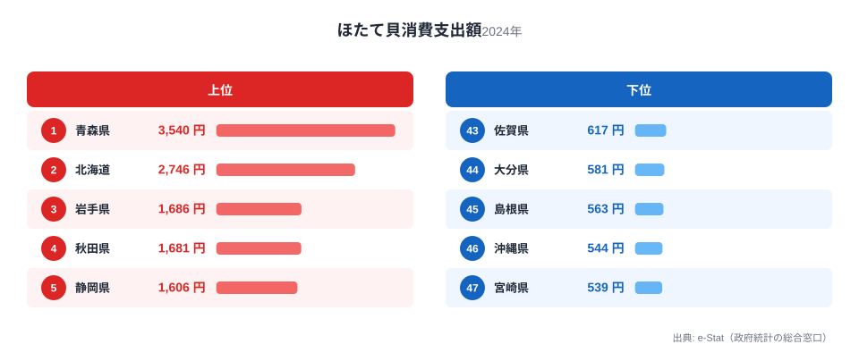

「同じ日本でも、住む県でほたて貝を食べる量がこんなに違う」――総務省の家計調査によると、2024年の1世帯あたりほたて貝消費支出額は、1位の青森県が3,540円、最下位の宮崎県が539円と、実に6.6倍の差があります。

ほたて貝といえば北海道のイメージが強いかもしれませんが、実際の消費支出でトップに立つのは青森県です。北海道は2位で僅差の2,746円。この記事では、なぜ東北・北陸の一部の県で消費が突出するのか、そして九州・沖縄でなぜ少ないのかを、47都道府県のデータから読み解きます。

> [!NOTE]
> ほたて貝消費支出額は総務省「家計調査」に基づく、二人以上の世帯における年間の品目別支出額（円）です。実際に購入した金額であり、消費量そのもの（kg）とは異なります。贈答用・冷凍加工品も含まれるため、産地以外の県でも一定の支出が発生します。

## 上位と下位の対比

<source-link href="/ranking/scallop-consumption-expenditure">ほたて貝消費支出額ランキングをもっと見る</source-link>

上位を見ると、1位青森県（3,540円）、2位北海道（2,746円）、3位岩手県（1,686円）、4位秋田県（1,681円）、5位静岡県（1,606円）と続きます。青森・北海道の突出ぶりは、日本のほたて貝養殖の二大産地であることと直結しています。青森県の陸奥湾は波が穏やかな内湾で、稚貝を垂下式で育てる養殖に適した地形を持ち、全国有数の水揚げ量を誇ります。八戸港は日本屈指のほたて貝の水揚げ拠点であり、地元での消費・加工が盛んです。北海道はオホーツク海沿岸や噴火湾で地まき式・垂下式の両方の養殖が行われ、青森と並ぶ二大産地となっています。

注目したいのは3位岩手県、4位秋田県という東北勢の強さです。岩手県は三陸沿岸でほたて貝養殖が行われており、隣接する青森・北海道の消費文化が波及していると考えられます。秋田県は必ずしも主要産地ではありませんが、東北地方全体で魚介類消費の水準が高い食文化圏に属しており、そのなかでほたて貝も相対的に消費が多い可能性があります。5位静岡県は焼津・清水など水産加工業が盛んな地域を抱え、流通拠点としての側面から支出額が押し上げられていると見られます。

## 最下位グループの傾向

下位を見ると、43位佐賀県、44位大分県、45位島根県、46位沖縄県、47位宮崎県と、九州・沖縄・山陰勢が並びます。これらの地域はほたて貝の主要産地ではなく、地元で優先的に消費される他の魚介類（九州なら養殖ブリ・カンパチ、沖縄なら県産の熱帯・亜熱帯性の魚類や海藻類）が食卓の中心にあるため、相対的にほたて貝の購入機会が少ないと考えられます。

沖縄県は地理的にも本州の主要産地から遠く、輸送コストの面でほたて貝が割高になりやすい事情もあります。宮崎県・大分県・佐賀県は畜産業（宮崎の地鶏・豚肉、佐賀の佐賀牛など）が食文化の中心という側面もあり、水産物のなかでも地元で獲れる近海魚が優先される傾向がうかがえます。[宮崎県の地域データ](/areas/45000)を見ると、農林水産業のなかでも畜産の比重が高いことが確認できます。

> [!WARNING]
> 家計調査は都道府県庁所在地及び政令指定都市の世帯を対象としたサンプル調査であり、県内全域の消費実態を完全に代表するものではありません。また年による変動もあるため、単年データでの断定的な解釈には注意が必要です。

## 発見: 産地=消費地の法則と東北の魚食文化

このランキングから見えてくるのは、「産地=消費地」という水産物特有の構造です。ほたて貝は冷凍・加工技術の発達で全国流通が可能になったとはいえ、産地では鮮度の良い個体が地元市場に優先的に回り、贈答文化や直売所での購入機会も多いため、消費支出が高止まりしやすい傾向があります。

もう一つの発見は、青森県が生鮮魚介全体でも消費支出額全国1位（全国平均の約1.5倍）という「魚食県」であることです。ほたて貝はその代表格に過ぎず、刺身・貝焼き味噌・バター焼きなど郷土料理としても定着しています。[仮説] この魚食文化全体の高さが、ほたて貝消費支出の突出をさらに押し上げている可能性がありますが、他の魚介品目との相関を個別に検証する必要があります。魚介消費の地域差をさらに掘り下げた記事として、[かつおと牡蠣の消費地図を比べた記事](/blog/bonito-vs-oyster-fish-map)も参考になります。

> [!TIP]
> ほたて貝消費支出は「産地に近いほど高い」という単純な地理法則だけでなく、東京都（12位・1,309円）や神奈川県（6位・1,564円）のように大消費地・流通拠点としての側面から支出額が押し上げられる県もあります。産地由来か流通拠点由来かを見分けるには、その県が実際に漁獲・養殖を行っているかどうかを併せて確認するとよいでしょう。

家計の水産物支出は地域の経済構造や食文化とも密接に関わっています。都道府県ごとの経済指標を横断的に見たい場合は、[経済カテゴリ一覧](/category/economy)から他の消費支出ランキングも確認できます。

## まとめ

- **1位は青森県（3,540円）**：陸奥湾養殖・八戸港の水揚げを背景に全国トップ
- **最下位は宮崎県（539円）**：畜産文化が中心で、6.6倍の差
- **2位北海道（2,746円）**：オホーツク・噴火湾の二大産地の一角
- **3-4位は岩手・秋田**：東北の魚食文化圏で産地に近い消費傾向
- **下位は九州・沖縄・山陰に集中**：主要産地から地理的に離れ、他の水産物・畜産物が食文化の中心

## データ出典

総務省統計局「家計調査」（2024年）を基に、e-Stat（政府統計の総合窓口）経由で整備したデータです。
