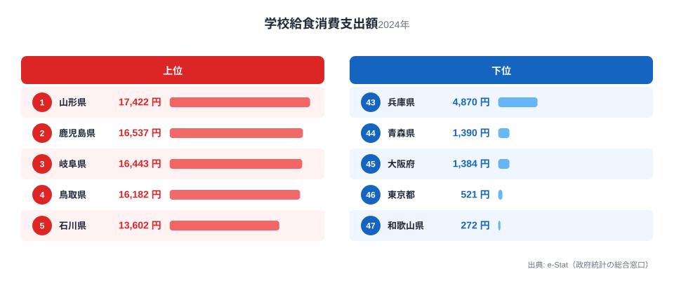
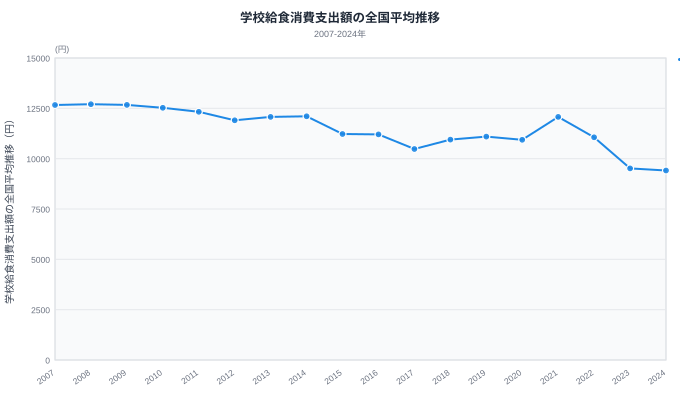

「給食費は全国どこでも同じくらい」と思っていませんか。実は都道府県庁所在市の家計調査を見ると、学校給食にかける年間支出額には最大64倍もの開きがあります。2024年のデータで最も高いのは山形市の17,422円、最も低いのは和歌山市のわずか272円です。

同じ「給食費」という項目なのに、なぜここまで差が出るのでしょうか。答えの手がかりは、支出額が極端に低い都市に共通する「給食費無償化」という政策にあります。この記事では、上位・下位の顔ぶれと、全国平均が2007年から2024年にかけてどう変化してきたかを合わせて見ることで、支出額の裏にある構造を探ります。

> [!NOTE]
> このランキングは総務省「家計調査」の品目別支出のうち、二人以上の世帯における「学校給食」の年間消費支出額（都道府県庁所在市）です。給食そのものの「質」や「量」ではなく、**世帯が実際に支払った金額**を集計した指標である点に注意してください。自治体が給食費を補助・無償化すれば、給食の中身が変わらなくても家計調査上の支出額は下がります。

## 上位と下位、64倍の格差

2024年の上位5都市は、山形（17,422円）、鹿児島（16,537円）、岐阜（16,443円）、鳥取（16,182円）、石川（13,602円）でした。地方の県庁所在市が目立ち、東京・大阪・名古屋といった三大都市圏の中心都市は上位に一つも入っていません。

一方の下位5都市は、兵庫（4,870円）、青森（1,390円）、大阪（1,384円）、東京（521円）、和歌山（272円）です。ここで注目したいのは、下位に大都市（東京・大阪）と地方都市（青森・和歌山）が混在している点です。人口密度や都市規模だけでは、この順位を説明できません。

<source-link href="/ranking/school-lunch-consumption-expenditure">学校給食消費支出額ランキングをもっと見る</source-link>

上位の県に共通する背景として考えられるのは、無償化・補助の広がりがまだ限定的で、保護者負担分がそのまま家計調査に反映されやすい地域だという点です（この点は本ランキングの支出額推移からの推測であり、実施率そのもののデータではないため仮説として扱います）。[山形県](/areas/06000)や鳥取県は人口減少に悩む地方県ですが、時系列で見ても支出額の急落が見られず、給食費の保護者負担を維持したまま質・食材費に力を入れている可能性があります。

## 下位グループに共通する「無償化」の影

下位5都市のうち、東京・大阪・和歌山・青森の4都市は、2023年前後から支出額が急落しています。時系列で見ると、この急落のタイミングが「学校給食費の無償化」を打ち出した時期と重なります。

> [!WARNING]
> 家計調査は「世帯が支払った金額」を集計するため、自治体が給食費を無償化・補助すれば、たとえ給食の提供自体は続いていても支出額はゼロに近づきます。**支出額が低い＝給食の質が低い、というわけではありません。** むしろ保護者負担が軽い＝子育て支援が手厚い地域である可能性があります。

[東京都](/areas/13000)は2023年に5,189円だった支出額が、2024年には521円まで落ち込みました。同時期、都内の区市町村では学校給食費の負担軽減・無償化を進める動きが広がっており、支出額の急減はこの流れと符合します。大阪府も2019年の6,730円から2020年に4,084円、2021年に1,786円、2022年には746円まで急落し、その後も低水準で推移しています。[和歌山県](/areas/30000)はさらに劇的で、2022年の5,453円から2023年に1,427円、2024年にはわずか272円まで下がりました。

<source-link href="/ranking/dining-out-consumption-expenditure">外食消費支出額ランキングを見る</source-link>

青森県は2022年の12,155円から2023年に807円へと1年で93%落ち込み、2024年は1,390円とやや戻しています。東京・大阪・和歌山が2023年以降も低水準を維持しているのに対し、青森だけ翌年にリバウンドしている点は無償化の定着だけでは説明しきれません。給食実施方式の一時的な変更や、集計対象世帯の特殊要因が重なった可能性もあり、これは仮説の域を出ません（検証には文部科学省の学校給食費無償化調査で青森県内自治体の実施時期・対象範囲を確認する必要があります）。

## 全国平均も右肩下がり、2023年以降は急落

47都道府県庁所在市の学校給食消費支出額の単純平均は、2007年の12,668円から緩やかに減少し、2022年には11,061円でした。ところが2023年に9,516円、2024年に9,413円と、直近2年でおよそ15%も急落しています。

<source-link href="/ranking/school-lunch-consumption-expenditure">学校給食消費支出額ランキングをもっと見る</source-link>

この急落は、東京・大阪・和歌山・青森だけでなく、給食費無償化・補助を打ち出す自治体が全国的に増えていることを示唆します（仮説。検証には文部科学省の学校給食費無償化等実施状況調査で自治体数の推移を年次別に確認する必要があります）。家計調査の全国平均にもその影響が表れ始めていると見られます。

> [!TIP]
> 学校給食費のランキングだけを見ると「支出が少ない県ほど損」と誤解しがちですが、無償化が進んだ地域ほど支出額は下がります。地域の子育てコストを比較したいときは、給食費単体ではなく授業料などの他の教育関連支出とあわせて見ることをおすすめします。

一方で山形・鹿児島・岐阜・鳥取のように高水準を維持している県は、無償化の動きがまだ限定的か、あるいは給食の質・食材費に重点を置く方針を取っている可能性があります。無償化が「進んでいる／進んでいない」で二極化が進めば、今後さらに支出額の地域差は拡大していくかもしれません。家計にまつわる他の支出項目は[家計・くらしカテゴリ](/category/economy)からまとめて確認できます。

## まとめ

- **1位**は山形（17,422円）、**最下位**は和歌山（272円）で、**約64倍**の格差がある
- 下位グループには東京・大阪という大都市と、青森・和歌山という地方都市が混在し、人口規模だけでは説明できない
- 東京・大阪・和歌山・青森は2023年前後に支出額が急落しており、**給食費無償化・補助の広がり**が背景にあると考えられる（仮説、要検証）
- 全国平均は2007年12,668円から2024年9,413円へ約26%減少し、特に2023-2024年の下落が急
- 支出額が低い地域は「給食の質が低い」のではなく、むしろ子育て世帯の負担が軽い地域である可能性が高い

## データ出典

総務省統計局「家計調査」（都道府県庁所在市、二人以上の世帯、品目別支出「学校給食」）をもとに、e-Stat（政府統計の総合窓口）経由で整備したデータです。集計年は2007年から2024年までの各年（暦年）です。
