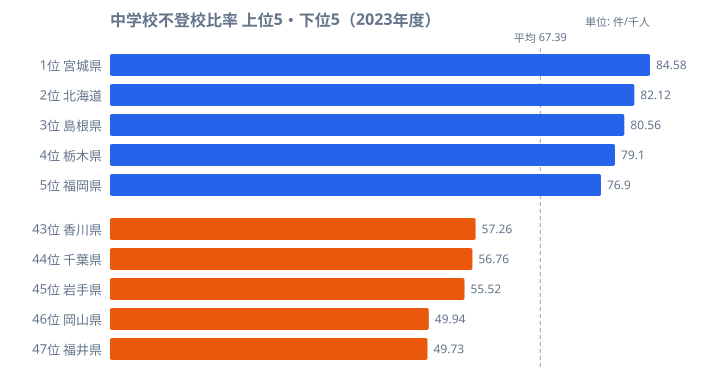
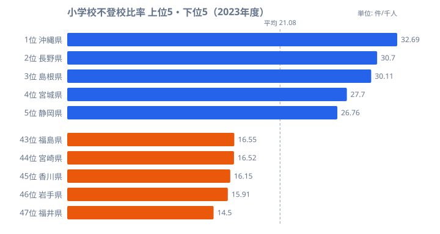
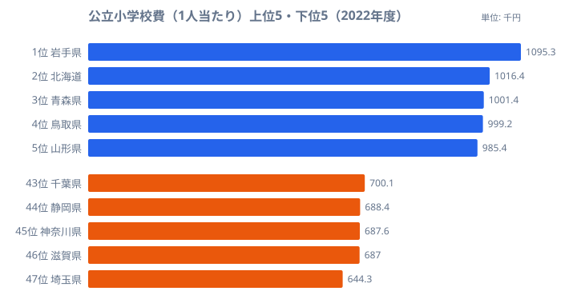

「不登校の子どもが過去最多を更新」──そう報じられる一方で、都道府県によって深刻度は大きく異なります。宮城県は中学校の不登校比率が1,000人当たり84.58（全国で最も高い）、[福井県](/areas/18000)は49.73（全国で最も低い）と、約1.7倍の差があります。そして福井は小学校でも全国で最も低い水準です。

注目したいのは「小学校で多い県は中学校でも多い」という連動です。小学校段階で不登校が少なかった県が、中学校で急に最多になることはほとんどありません。なぜ福井は小中ともに最低水準を保てるのか。そしてなぜ東京（30位）・大阪（23位）は上位ではないのか。ランキングと散布図の切り口で、不登校の地域差の構造を読み解いていきます。

## 中学校の不登校比率──宮城・北海道が高く、福井・岡山が低い

不登校比率が最も高いのは[宮城県](/areas/04000)（84.58/千人）です。北海道（82.12）、島根県（80.56）、栃木県（79.10）、福岡県（76.90）と続きます。都道府県の平均は67.39で、上位の県はいずれも平均を大きく上回っています。一方で最も低いのは福井県（49.73）です。岡山県（49.94）、[岩手県](/areas/03000)（55.52）、千葉県（56.76）、香川県（57.26）が下位に並び、最も高い宮城県と最も低い福井県では約1.7倍の差があります。

なぜ宮城・北海道・島根といった県が上位に集まり、福井・岡山・岩手が下位にとどまるのでしょうか。ここで効いてくるのは、人口規模や都市化率そのものではないという点です。北海道や島根のような人口密度の低い地域が上位に入り、東京（30位・65.88）や大阪（23位・68.22）はむしろ平均付近にとどまっています。不登校の多寡は「都会だから多い」という単純な図式では説明できず、各地域の支援体制・学校文化・相談窓口の充実度といった、数字に表れにくい要因が絡んでいると考えられます。なお同じ東北でも傾向は一様ではなく、宮城が全国1位である一方、岩手は45位と最下位グループに入ります。地方ブロックでひとくくりにできるほど単純な偏りではない点も、この指標の難しさを物語っています。

> [!NOTE]
> ここでいう「不登校」は、年度間に30日以上の欠席があり、その理由が病気・経済的理由以外のものを指します。病気などを含む長期欠席全体とは定義が異なるため、ニュースで見る「長期欠席者数」とは数値が一致しません。

> [!WARNING]
> このランキングは「比率が高い＝1位」で並べています。順位が上位（数字が小さい）ほど不登校が多い県であり、上位が良いわけではありません。下位（福井・岡山）が「少ない＝相対的に落ち着いている」県です。読み違えやすいので注意してください。

<source-link href="/ranking/junior-high-school-long-absence-ratio-nonattendance-over-30days-per-1000">不登校による中学校長期欠席生徒比率ランキングをもっと見る</source-link>

<ad-slot></ad-slot>

## 小学校の不登校比率──ここでも福井が最も低い

小学校の不登校比率も見ておきましょう。都道府県の平均は21.08/千人で、中学校（67.39）の約3分の1にとどまります。最も高いのは沖縄県（32.69/千人）です。長野県（30.70）、島根県（30.11）、宮城県（27.70）、静岡県（26.76）と続きます。中学校で1位だった宮城県は、小学校では4位という位置です。

最も低いのは、中学校と同じく福井県（14.50）でした。岩手県（15.91）、香川県（16.15）、宮崎県（16.52）、福島県（16.55）が下位に並びます。注目すべきは、小学校で下位だった福井・岩手・香川が、中学校でも下位にそのまま残っている点です。逆に小学校で上位の島根・宮城・沖縄は、中学校でも高い水準にとどまっています。つまり小学校で多いか少ないかが、そのまま中学校の傾向を先取りしているように見えます。なぜこうした連動が起きるのか──次の散布図で正面から確かめます。

> [!NOTE]
> 小学校は中学校に比べて全体的に不登校比率が低いものの、近年は小学校の増加率のほうが大きく、低年齢化が進んでいると指摘されています。「小学校はまだ少ないから安心」とは言い切れない局面に入っています。

<source-link href="/ranking/elementary-school-long-absence-ratio-nonattendance-over-30days-per-1000">不登校による小学校長期欠席児童比率ランキングをもっと見る</source-link>

## 散布図──小学校と中学校の不登校は強く連動する

横軸に小学校、縦軸に中学校の不登校比率をとると、右肩上がりの正の相関がはっきり現れます。小学校で不登校比率が高い県は、中学校でも高い傾向にあるということです。平均線で4象限に区切ると、各県の立ち位置がさらに見やすくなります。

右上（小中ともに平均超え）には宮城・島根・長野・沖縄が入ります。小学校段階から不登校が多く、中学校でさらに増えていく県です。対して左下（小中ともに平均未満）に位置するのが福井・岩手・香川・岡山で、小学校も中学校も全国平均を下回ります。北海道や栃木のように、小学校では平均付近でも中学校で大きく増える県もあり、中学進学時に不登校が増えるパターンの存在もうかがえます。逆に「小学校は高いのに中学校で大きく下がる」県はほとんど見当たりません。一度高くなると中学校でも高いままになりやすい、という非対称な関係が読み取れます。

この正の相関が示すのは、小学校段階での早期発見・早期対応が、中学校の不登校を抑えることにもつながりうるという可能性です。中学校だけを切り出して対策しても遅く、小学校のうちから手を打てている県が、結果として小中そろって低水準を保てているという見方ができます。

> [!TIP]
> 「左下」に位置する福井・岩手・香川・岡山の共通点を探ることが、不登校対策の手がかりになります。福井は学力水準の高さで知られますが、それを支える教育支援体制や小学校段階での丁寧な個別対応が、不登校の少なさとも関連している可能性があります。ランキングを見るときは、中学校の数字だけでなく、その県の小学校の数字とセットで眺めると構造が見えてきます。

<source-link href="/ranking/elementary-school-long-absence-ratio-nonattendance-over-30days-per-1000">小学校長期欠席児童比率ランキングをもっと見る</source-link>

<ad-slot></ad-slot>

## 公立小学校費と不登校──お金の多さでは説明できない

<data-source url="https://www.e-stat.go.jp/dbview?sid=0000010205" label="e-Stat 社会・人口統計体系（文部科学）"></data-source>

「左下の県」の共通点を、お金の面からも確かめてみます。公立小学校費（児童1人当たりの支出）の最も多いのは岩手県（1,095千円）です。北海道（1,016千円）、青森県（1,001千円）が続きます。福井県は19位（842千円）と全国の中位にとどまっています。

ここで興味深いのは、教育費の絶対額が多い上位の県が、必ずしも不登校比率の低い県と一致しないことです。たしかに岩手は支出も多く不登校も少ない県ですが、支出が多い北海道は中学校の不登校が2位と高く、福井は支出が中位でも小中ともに最少です。つまり「お金をかけているから不登校が少ない」という単純な関係は見られません。支出の中身が人的支援に向いているのか施設整備に向いているのか、あるいは地域コミュニティの結びつきの強さといった、金額では測れない要因が効いている可能性があります。相関と因果は別物であり、ここでは「支出額は不登校の少なさを直接は説明しない」という所までしか言えません。

> [!WARNING]
> 公立小学校費は2022年度、不登校比率は2023年度の数値で、年度が1年ずれています。また支出は「1人当たり」であり、人口の少ない県ほど固定費の按分で高く出やすい点にも注意が必要です。額の大小をそのまま政策効果と結びつけることはできません。

<source-link href="/ranking/per-child-public-elementary-school-expenditure-pref-municipal">公立小学校費（1人当たり）ランキングをもっと見る</source-link>

## まとめ──小学校段階の対応が連鎖を左右する

不登校の地域差を、中学校・小学校のランキングと小中相関の散布図から読み解いてきました。

福井県が小学校・中学校ともに全国最少の水準を保てているのは、小学校段階からの丁寧な個別対応と地域コミュニティの結びつきが機能しているためと考えられます。「左下」の県（福井・岩手・香川・岡山）の取り組みには、他の地域が学べるヒントがありそうです。一方で、東京や大阪のような大都市が上位ではないという事実は、不登校が「都市の問題」ではなく、どの地域でも起こりうる課題であることを示しています。

ただし、数値が低いことが必ずしも「問題がない」ことを意味するわけではありません。不登校の背景は子ども一人ひとりで異なり、数字だけでは見えない実態もあります。このデータをきっかけに、各地域の支援のあり方を考える材料にしていただければと思います。

## データ出典

- [e-Stat 社会・人口統計体系（文部科学）](https://www.e-stat.go.jp/dbview?sid=0000010205) ── 不登校による長期欠席比率（小・中学校）、公立小学校費（1人当たり）
