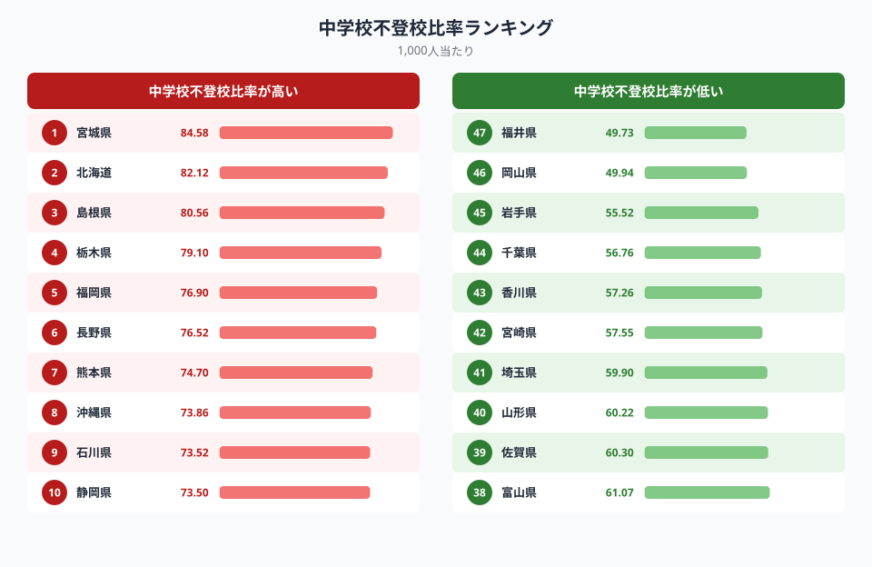
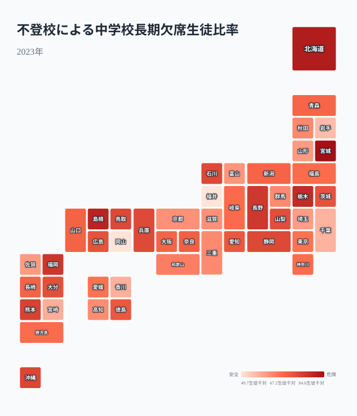
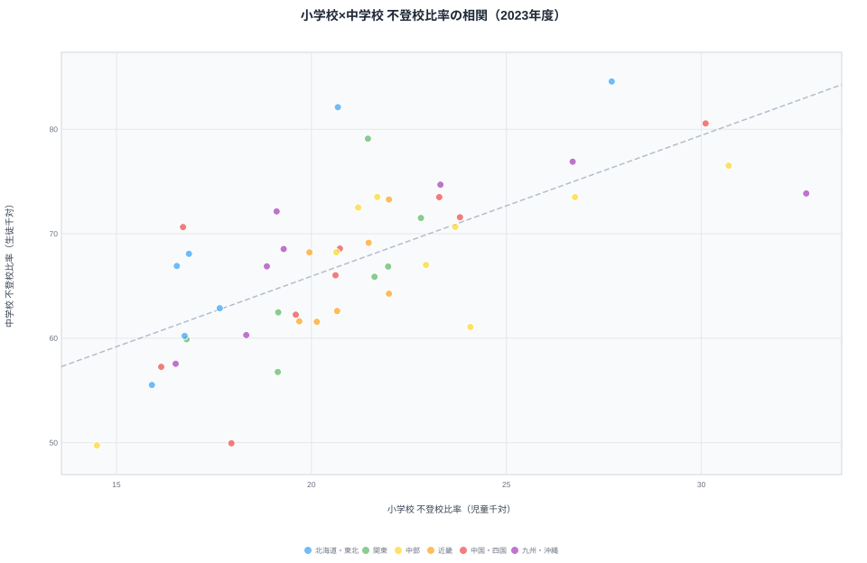
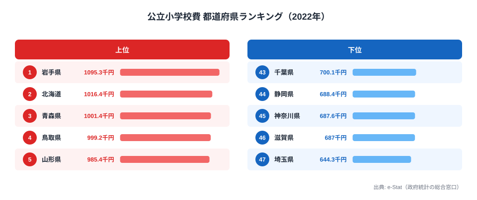
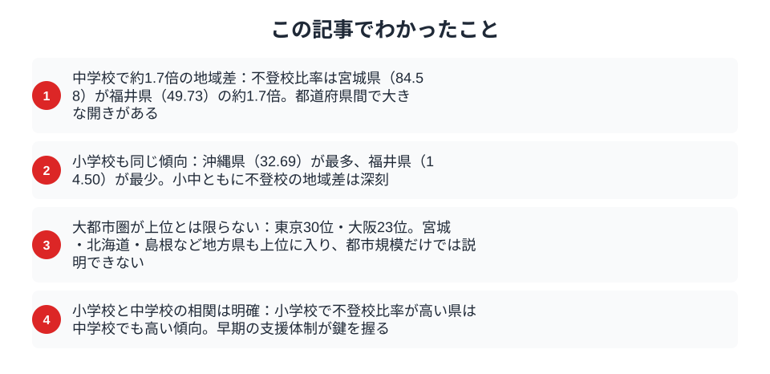

「不登校の子どもが過去最多を更新」──そう報じられる一方で、都道府県によって深刻度は大きく異なります。宮城県は中学校不登校比率が1,000人当たり84.58（全国最高）、[福井県](/areas/18000)は49.73（全国最少）と約1.7倍の差があります。そして福井は小学校でも全国最少です。

ここで先に結論を述べておきます。不登校の地域差は「大都市ほど多い」のではなく、小学校で多い県は中学校でも多いという小中連動が軸になっています。なぜ福井は小中ともに全国最低水準を達成できるのか。そしてなぜ東京（30位）・大阪（23位）は上位ではないのか。ランキング・地図・散布図の3つの切り口で、不登校の地域差の構造を明らかにします。

## 中学校不登校比率ランキング──宮城・北海道が上位、福井・岡山が最少

**不登校比率が最も高いのは宮城県**（84.58/千人）です。北海道（2位）、島根県（3位）と続きます。都道府県平均は67.39で、上位3県はいずれも平均を大きく上回っています。

**最も低いのは福井県**（49.73）です。岡山県・[岩手県](/areas/03000)が続き、1位の宮城県と最少の福井県では**約1.7倍の差**があります。

上位に並ぶのは宮城・北海道・島根・栃木といった地方県で、人口規模の大きい都市部は見当たりません。一方で最少の福井をはじめ、岡山・岩手も地方県です。つまり上位にも下位にも地方県が混在しており、「都市か地方か」という軸だけでは説明がつかないことが、このランキングから最初に読み取れます。地域差を生んでいるのは人口規模ではなく、各県の学校現場の運用や支援体制の違いだと考えられます。

> [!NOTE]
> 「不登校」は年度間に30日以上の欠席があり、その理由が病気・経済的理由以外のものを指します。病気や経済的理由を含む「長期欠席全体」とは別の集計なので、新聞報道の「長期欠席◯万人」とは数字が一致しない点に注意してください。

<source-link href="/ranking/junior-high-school-long-absence-ratio-nonattendance-over-30days-per-1000">不登校による中学校長期欠席生徒比率ランキング</source-link>

## 都道府県マップ──大都市が突出していない意外な構造

マップから読み取れるのは、**大都市圏が突出しているわけではない**という意外な事実です。

- **東北・北海道が濃い色**──宮城県（1位）、北海道（2位）、栃木県（4位）が目立ちます
- **東京は30位、大阪は23位**──首都圏・関西圏は全国的に見て中位にとどまります
- **福井・岡山・岩手が薄い色**──日本海側や東北の一部が低水準です

色の濃淡を地理で眺めても、隣接県どうしで揃っているわけではありません。宮城が濃いのに同じ東北の福井・岩手は薄く、北海道は濃いのに日本海側は薄いといった具合に、ブロック単位の傾向では捉えきれない散らばり方をしています。不登校の多寡は人口規模や都市化率だけでは説明できず、各地域の教育支援体制・学校文化・相談窓口の充実度といった、県ごとの運用の違いが複合的に絡んでいると考えられます。

<ad-slot></ad-slot>

## 小学校の不登校比率──中学校と同じく福井が最少

小学校の不登校比率も確認しておきます。都道府県平均は21.08/千人で、中学校（67.39）の約3分の1です。

**小学校で最も高いのは[沖縄県](/areas/47000)**（32.69）です。次いで長野県・島根県と続きます。中学校で1位だった宮城県は、小学校では4位（27.70）です。

**最も低いのは福井県**（14.50）で、中学校と同じく全国最少の座を占めています。岩手県（15.91）、香川県（16.15）も低水準です。

注目したいのは、最少の福井をはじめ岩手・香川が小学校でも下位に並ぶ点です。中学校ランキングで下位だった顔ぶれと重なっており、特定の県が「小学校でも中学校でも少ない」という一貫性を見せています。逆に沖縄・長野・島根のように小学校で多い県は、後述の散布図でも中学校側で高い位置に来ます。学校段階が変わっても順位がそろうという事実は、不登校の地域差が一時的なものではなく、その県に根づいた構造であることを示しています。

> [!NOTE]
> 小学校は中学校に比べ全体的に不登校比率が低いものの、近年は小学校の増加率のほうが大きく、低年齢化が進んでいます。今の小学校の数字は、数年後の中学校の数字を先読みする手がかりになります。

<source-link href="/ranking/elementary-school-long-absence-ratio-nonattendance-over-30days-per-1000">不登校による小学校長期欠席児童比率ランキング</source-link>

## 散布図──小学校と中学校の強い正相関

横軸に小学校、縦軸に中学校の不登校比率をとると、**右肩上がりの正の相関**が確認できます。小学校で不登校比率が高い県は、中学校でも高い傾向があります。

4象限で見ると各県の特徴が浮かび上がります。

- **右上**（小中ともに高い）: 宮城・島根・長野・沖縄──小学校段階から不登校が多く、中学校でさらに増えます
- **左下**（小中ともに低い）: 福井・岩手・香川・岡山──小学校も中学校も全国平均を下回ります
- **左上**（小学校は低い・中学校は高い）: 北海道・栃木──小学校では平均並みでも、中学進学とともに不登校が急増しています
- **右下**（小学校は高い・中学校は低い）: 該当する県はほぼ見当たりません──小学校で高ければ中学校も高い、という一方向の関係です

特に目を引くのが「左上」の北海道・栃木です。北海道は小学校では20.68と平均並みなのに、中学校では82.12（全国2位）まで跳ね上がります。栃木も同様に、小学校21.45から中学校79.10へと大きく増えています。小学校時点では目立たなくても、中学進学を境に不登校が一気に増える県があるということです。この正相関が示すのは、**小学校段階での早期発見・早期対応**が、中学校での不登校の連鎖を抑える手がかりになる可能性です。

<source-link href="/ranking/elementary-school-long-absence-ratio-nonattendance-over-30days-per-1000">不登校による小学校長期欠席児童比率ランキング</source-link>

> [!TIP]
> 「左下」に位置する福井・岩手・香川・岡山の共通点を探ることが、不登校対策の手がかりになるかもしれません。福井は学力水準の高さで知られますが、それを支える教育支援体制や小学校段階での丁寧な個別対応が、不登校の少なさとも関連している可能性があります。

<ad-slot></ad-slot>

## 公立小学校費と不登校の関係

<data-source url="https://www.e-stat.go.jp/dbview?sid=0000010205" label="e-Stat 社会・人口統計体系（文部科学）"></data-source>

公立小学校費（1人当たり支出）の1位は岩手県（1,095千円）、2位は北海道（1,016千円）、3位は青森県（1,001千円）です。福井県は19位（842千円）と全国中位に位置しています。ここで興味深いのは、支出1位の岩手は不登校が少ない「左下」の県である一方、支出2位の北海道は中学校不登校が全国2位の「左上」の県だという点です。教育費の絶対額が多い上位県が必ずしも不登校比率が低いわけではなく、支出額と不登校の間に単純な相関は見られません。お金をかけているかどうかではなく、その使い道、つまり人的支援に振り向けているか施設整備に充てているかといった中身が、結果を分けている可能性があります。

> [!WARNING]
> 公立小学校費は2022年度、不登校比率は2023年度と集計年が1年ずれています。また支出には校舎の建設費や老朽校舎の改修費など一時的な要因が含まれるため、その年だけ突出することがあります。単年の金額だけで「支援が手厚い県」と判断するのは危険です。

<source-link href="/ranking/per-child-public-elementary-school-expenditure-pref-municipal">公立小学校費（1人当たり）ランキング</source-link>

## まとめ──小学校段階の対応が連鎖を左右する

不登校の地域差を、ランキング・マップ・散布図の3視点で分析しました。要点は次の通りです。

- **最大1.7倍の地域差**: 中学校不登校比率は宮城84.58 vs 福井49.73。都市規模では説明できません
- **大都市は上位でない**: 東京30位・大阪23位。上位は宮城・北海道・島根など地方県です
- **福井は小中とも全国最少**: 中学校49.73・小学校14.50で、両段階で最低水準を維持しています
- **小中は強い正相関**: 小学校で多い県は中学校でも多く、早期対応が連鎖の抑制につながります
- **中学で急増する県も**: 北海道・栃木は小学校では平均並みでも中学校で全国上位に跳ね上がります

福井県が小学校・中学校ともに全国最少水準を維持できるのは、小学校段階からの丁寧な個別対応と地域コミュニティの結合力が機能しているためと考えられます。「左下」の県（福井・岩手・香川・岡山）の取り組みには、他の地域が学べるヒントがあります。とりわけ、北海道・栃木のように小学校では目立たなくても中学校で急増する県があることを踏まえると、小学校段階での見守りこそが連鎖を断つ起点になります。

一方で、数値が低いことが必ずしも「問題がない」ことを意味するわけではありません。不登校の背景は個々の子どもによって異なり、数字だけでは見えない実態もあります。本記事のデータをきっかけに、各地域の支援のあり方を考える材料にしていただければと思います。

## データ出典

- [e-Stat 社会・人口統計体系（文部科学）](https://www.e-stat.go.jp/dbview?sid=0000010205) ── 不登校による長期欠席比率（小・中学校）
