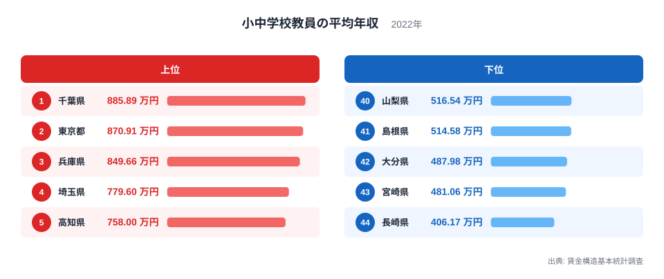
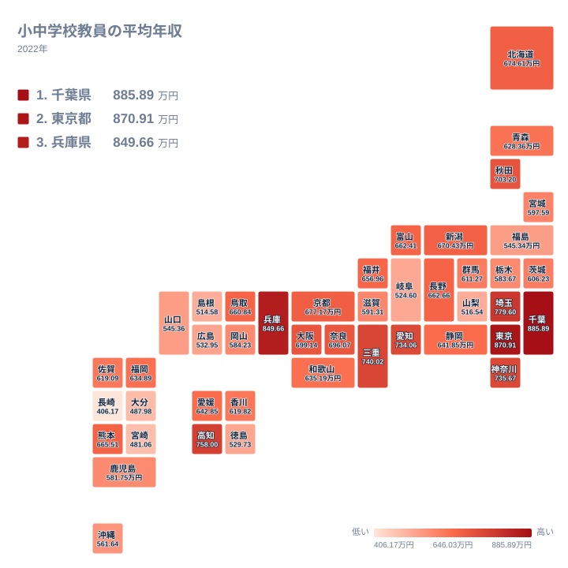

首都圏で最も年収が高いのはどの都県でしょうか。多くの人は東京都を思い浮かべるかもしれませんが、小中学校教員の平均年収に限ると、実際に1位になっているのは千葉県です。この記事では、賃金構造基本統計調査による2022年のデータを使い、なぜ千葉県が東京都を上回っているのか、そして地方圏で年収が下がる背景を読み解いていきます。

> [!NOTE]
> このデータは、公立学校教員だけに限定した統計ではありません。6月のきまって支給する現金給与額を年換算し、前年1年間の賞与その他特別給与額を加えた、税・社会保険料等控除前の標本平均であり、個人ごとの実際の年収そのものではありません。

## 小中学校教員の平均年収の全国順位 - なぜ千葉県が首位なのか

2022年の小中学校教員の平均年収で全国1位となったのは千葉県で、885.89万円という金額になっています。2位は東京都の870.91万円で、首都圏の中心である東京都よりも千葉県の方が高い水準にあるという結果です。3位は兵庫県の849.66万円、4位は埼玉県の779.6万円、5位は高知県の758万円と続いています。千葉県の他の統計は[千葉県のデータ](/areas/12000)から確認できます。

<source-link href="/ranking/school-teacher-annual-income">小中学校教員の平均年収ランキングをもっと見る</source-link>

千葉県が東京都を上回っているという結果は一見すると意外に映りますが、教員給与は地域手当の支給割合や、勤続年数の分布、管理職の割合など、複数の要素が積み重なって決まる金額です。[仮説] 東京都は若手教員の採用数が多く教員全体の平均年齢が相対的に低いのに対し、千葉県では勤続年数の長い教員の割合が高いことが平均年収を押し上げている可能性がありますが、この点は年齢構成に関する別の統計と合わせて確認する必要があります。3位の兵庫県、4位の埼玉県、5位の高知県のように、首都圏以外の県も上位に入っている点も、単純な都市規模だけでは説明できない要素があることを示しています。東京都のほかの統計は[東京都のデータ](/areas/13000)から確認できます。

さらに上位10県を見ると、6位の三重県は740.02万円、7位の神奈川県は735.67万円、8位の愛知県は734.06万円、9位の秋田県は703.2万円、10位の大阪府は699.14万円となっています。とりわけ9位の秋田県は人口減少が進む地方県でありながら上位10県に入っており、都市部かどうかだけでは説明できない結果になっています。[仮説] 地方の県では教員一人あたりが担当する校務が多く、管理職への昇任年齢が早い傾向があるという見方もできますが、この記事のデータだけでは確認できません。

## 最下位グループは九州・中国地方に集中 - 長崎・宮崎・大分の共通点

下位に目を向けると、44位の長崎県は406.17万円、43位の宮崎県は481.06万円、42位の大分県は487.98万円、41位の島根県は514.58万円、40位の山梨県は516.54万円となっており、九州や中国地方の県が下位グループに並んでいます。

地図で見ると、年収が高い県は関東・近畿の都市圏に多く分布し、九州や中国地方に向かうほど数値が下がる傾向が見られます。長崎県や宮崎県のように離島や中山間地域を多く抱える県では、地域手当の支給水準が都市部より低く設定されている自治体が多いことが、平均年収の差につながっていると考えられます。42位の大分県は487.98万円、41位の島根県は514.58万円となっており、こちらも九州・中国地方の中山間地域を多く抱える県です。地域手当は勤務地が都市部か否かで支給率に段階が設けられており、離島や山間部の勤務地が多い県ほど平均額が下がりやすい仕組みになっています。

> [!WARNING]
> このデータは全国47都道府県のうち44都道府県分のみが収録されています。岩手県、山形県、石川県の3県は数値が示されていません。[仮説] これは標本数が少なく統計的な精度を確保できなかったためと考えられますが、詳しい理由は元の調査には明記されていません。

## 数字から見える給与構造の地域差

千葉県の885.89万円と長崎県の406.17万円を比べると、同じ職種でもこれほど大きな開きがあることが分かります。上位5県のうち千葉県、東京都、兵庫県、埼玉県は首都圏または近畿圏の都市部にあり、地域手当の支給率が高く設定されている自治体が多い地域です。一方で5位の高知県、9位の秋田県のように、都市部ではない県が上位に入っている例もあり、教員給与の地域差が単純な都市規模だけでは説明しきれないことがうかがえます。教育分野のほかの統計は[同じカテゴリの統計一覧](/category/educationsports)から確認できます。

このように、教員の平均年収は都市部か地方かという単純な軸だけでは決まらず、勤続年数の分布や管理職の割合、地域手当の支給率といった複数の要因が組み合わさって都道府県ごとの水準を形づくっています。ランキングの上位と下位を単純に「都会か地方か」で片付けず、高知県や秋田県のような例外に注目することで、教員給与制度の複雑さがより具体的に見えてきます。

> [!TIP]
> このデータは44都道府県分のみを対象に1位から44位まで順位づけされています。「44位」という表記は全国最下位という意味ではなく、収録されている44都道府県の中での最下位であることに注意してください。

## まとめ

- 1位は千葉県で885.89万円となっており、2位の東京都870.91万円を上回っています
- 3位は兵庫県、4位は埼玉県、5位は高知県となっており、都市部以外の県も上位に入っています
- 最下位は長崎県の406.17万円で、宮崎県、大分県、島根県、山梨県が下位グループに続いています
- このデータは岩手県、山形県、石川県を除く44都道府県分のみが収録されています
- 小中学校教員の平均年収は税・社会保険料等控除前の標本調査による平均であり、個人の実年収ではありません

## データ出典

出典: 賃金構造基本統計調査（厚生労働省）。2022年のデータです。
