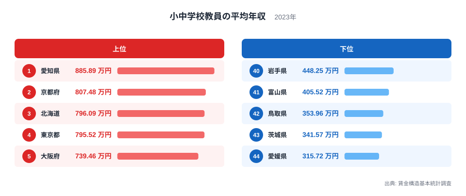
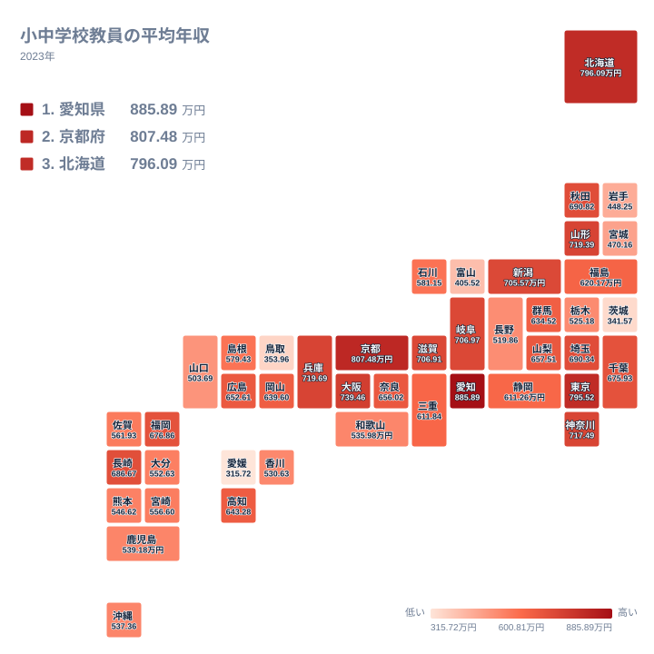
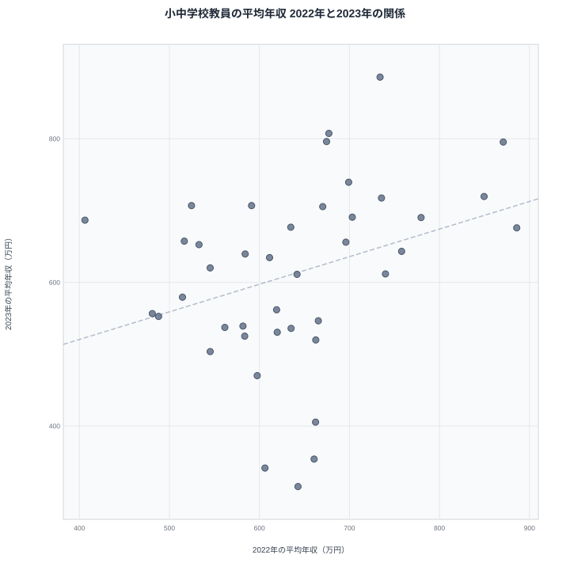

小中学校教員の平均年収を都道府県別に並べると、2023年の1位は愛知県で885.89万円、最下位は愛媛県で315.72万円となり、2.8倍の開きがあります。ところが同じ指標を2022年で見ると、1位は千葉県でした。さらにさかのぼると、2021年は京都府、2020年は東京都が首位で、1位が4年連続で別の県になっています。

この記事では、賃金構造基本統計調査を元にした2023年の順位を紹介したうえで、順位が毎年大きく入れ替わる理由として何が考えられるかを整理します。先に結論をお伝えすると、この指標は1年分の順位から「どの県の教員の給与が高いか」を言い切れる種類のデータではありません。順位が入れ替わる理由を断定できる材料はこのデータにはなく、分かるのは入れ替わりの大きさまでです。

> [!NOTE]
> このデータは、公立学校の教員だけに限定した統計ではありません。一般労働者・男女計の小・中学校教員について、6月のきまって支給する現金給与額を12倍し、前年1年間の賞与その他特別給与額を加えた推計年収で、税・社会保険料等控除前の標本平均です。個人ごとの実際の年収ではありません。

## 2023年の小中学校教員の平均年収 - 上位と下位

2023年の1位は愛知県の885.89万円です。2位は京都府の807.48万円で、1位との差は78.41万円あります。3位は北海道の796.09万円、4位は東京都の795.52万円で、3位と4位の差は0.57万円しかありません。5位は大阪府の739.46万円です。愛知県のほかの統計は[愛知県のデータ](/areas/23000)から確認できます。

<source-link href="/ranking/school-teacher-annual-income">小中学校教員の平均年収ランキングをもっと見る</source-link>

下位に目を向けると、44位は愛媛県の315.72万円、43位は茨城県の341.57万円、42位は鳥取県の353.96万円、41位は富山県の405.52万円、40位は岩手県の448.25万円です。1位の愛知県と44位の愛媛県を比べると、年収の差は570.17万円にのぼります。愛媛県のほかの統計は[愛媛県のデータ](/areas/38000)から確認できます。

上位10県まで広げると、6位は兵庫県の719.69万円、7位は山形県の719.39万円、8位は神奈川県の717.49万円、9位は岐阜県の706.97万円、10位は滋賀県の706.91万円です。6位から10位までの5県は、13万円足らずの範囲に収まっています。このように中位から上位にかけては数万円の違いで順位が入れ替わるため、1つの順位が1つ違うことに大きな意味はありません。

> [!WARNING]
> 2023年の値があるのは44都道府県で、福井県、青森県、徳島県の3県は値がありません。「44位」は全国最下位ではなく、値がある44都道府県の中での最下位を指します。値がない理由は、このデータからは確かめられません。

## 地図で見る地域のばらつき - 上位も下位も1つの地方に集まらない

次の地図は、同じ2023年の値を都道府県ごとに色分けしたものです。地方の区分は、北海道・東北・関東・中部・近畿・中国・四国・九州沖縄の8区分で数えています。

上位10県を地方別に数えると、近畿が京都府・大阪府・兵庫県・滋賀県の4県、関東が東京都・神奈川県の2県、中部が愛知県・岐阜県の2県、そして北海道と東北の山形県が1県ずつです。近畿に4県が入っている点は目立ちますが、上位10県は5つの地方にまたがっています。

下位5県はさらにばらけています。愛媛県は四国、茨城県は関東、鳥取県は中国、富山県は中部、岩手県は東北に属し、5県が5つの異なる地方に分かれています。つまり「都市部は高く、地方は低い」「九州や中国地方が低い」といった単純な図式は、この年のデータでは成り立ちません。関東だけを見ても、東京都は4位、神奈川県は8位である一方、茨城県は43位です。

地域のくくりでは説明できないとなると、次に気になるのは、県ごとの給与水準そのものの差なのか、それとも別の要因なのかという点です。その手がかりは、同じ県の順位が年によってどう動くかにあります。

## 同じ県でも年が変わると順位が大きく動く

年別の比較には、2020年から2022年の値も使います。2023年の図は2023年のデータ、この節の年別の比較は同じ指標を各年で取り直した値で、年が違うのは意図したものです。この節の散布図は2022年と2023年を比べるため、両方の年に値がある41県だけを描いています。2020年は38県、2021年は43県、2022年は44県、2023年は44県分の値があり、年によって値がある県の数も違います。

1位と最下位を年別に並べると、次のようになります。2020年の1位は東京都の813.8万円で、最下位は茨城県の322.2万円です。2021年の1位は京都府の822.17万円で、最下位は石川県の245.16万円です。2022年の1位は千葉県の885.89万円で、最下位は長崎県の406.17万円です。2023年は、愛知県が1位、愛媛県が最下位です。1位も最下位も、4年間で一度も同じ県になっていません。

なお、2022年の千葉県と2023年の愛知県は、どちらも885.89万円で同じ値です。取り込みの重複ではなく、偶然の一致です。賃金構造基本統計調査の元の統計表(統計表ID 0003445758)で計算すると、千葉県は月給454.6千円の12倍に賞与3,403.7千円を足した値、愛知県は月給516.1千円の12倍に賞与2,665.7千円を足した値で、内訳が違うまま同じ8,858.9千円になりました。

個別の県を見ると、動きの大きさがよく分かります。愛媛県は2021年の692.05万円で11位、2022年の642.85万円で20位でしたが、2023年は315.72万円で44位です。1年で327.13万円も下がっており、教員の給与表が1年で半分近くになったとは考えにくい動きです。反対に長崎県は、2022年に406.17万円で44位でしたが、2023年は686.67万円で14位になり、1年で280.5万円上がりました。北海道は、2020年の435.78万円で34位、2021年の589.68万円で25位、2022年の674.61万円で13位、2023年の796.09万円で3位と、年を追うごとに順位を上げています。

横軸が2022年、縦軸が2023年の平均年収です。前年に高い県が翌年も高いなら、点は右上がりの線に沿って並びますが、実際の点は広く散らばっています。愛媛県は横軸の642.85万円から縦軸の315.72万円へ、長崎県は406.17万円から686.67万円へ動いており、1年で大きく位置を変えた県があることが図からも読み取れます。

同じ県の前年との関係を数字にすると、関連はあるものの弱いことが分かります。両方の年に値がある県どうしで前年の年収と翌年の年収の相関係数を計算すると、2020年と2021年は0.34、2021年と2022年は0.37、2022年と2023年は0.32でした。いずれも正の相関ですが、1に近いほど「前年に高い県は翌年も高い」と言える水準には遠く、前年の順位は翌年の順位を予想する手がかりとしては弱いデータです。

> [!TIP]
> この指標を読むときは、1つの年の順位より、複数年にわたって上位や下位に居続けるかどうかを見るほうが安全です。上の4年間で3位以内に2回以上入った県は、2020年に2位、2021年に3位、2023年に1位の愛知県と、2020年に1位、2021年に2位、2022年に2位の東京都と、2021年に1位、2023年に2位の京都府の3県でした。千葉県、大阪府、兵庫県、北海道は、3位以内に入ったのが4年間で1回だけです。

順位がここまで動く理由について、この記事のデータだけで原因を断定することはできません。ただし、この指標が標本平均であることは手がかりになります。県内で調査の対象に入った小中学校教員の人数が少ない場合、数人の入れ替わりや、管理職のように給与の高い人が含まれるかどうかで、平均が数百万円単位で動く可能性があります。ただし、このデータには県ごとの標本の大きさが含まれていないため、実際にそうなっているかは確かめられません。入れ替わりの理由を断定する材料がない以上、この記事が示せるのは、順位が毎年これだけ大きく動くという事実までです。

## データについて

この記事の2023年の値と順位は、ランキング画面と同じ小中学校教員の平均年収の値を、値の高い順に並べたものです。値の単位は万円で、2023年は44都道府県分です。

年別の比較に使った2020年から2022年の値も、同じ指標を同じ方法で取得したものです。相関係数は、2つの年の両方に値がある都道府県だけを対象にして、年収そのものの値からピアソンの相関係数を計算しました。対象になった県の数は、2020年と2021年で36県、2021年と2022年で40県、2022年と2023年で41県です。

## まとめ

- 2023年の1位は愛知県の885.89万円、最下位は愛媛県の315.72万円で、最大と最小の差は2.8倍です
- 2位は京都府の807.48万円、3位は北海道の796.09万円、4位は東京都の795.52万円で、3位と4位の差は0.57万円です
- 上位10県は5つの地方に、下位5県は5つの異なる地方に分かれており、特定の地方に集まっていません
- 1位は2020年が東京都、2021年が京都府、2022年が千葉県、2023年が愛知県と、毎年変わっています
- 前年との相関係数は0.32から0.37にとどまるため、1年分の順位から各県の教員の給与水準を判断することはできません
