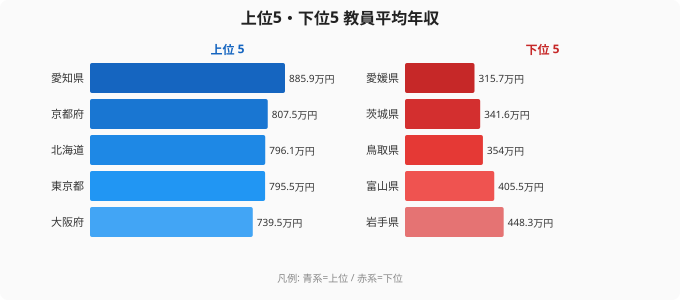

「公務員の給与は国が法律で決める」——多くの人がそう思っています。実際、公立学校教員の給与は国が示した給料表をベースに、各都道府県の条例に沿って設定されます。ところが2023年のデータを見ると、1位の愛知県（885.9万円）と最下位の愛媛県（315.7万円）では平均年収が大きく開いています。さらに意外なのは、上位に北海道や山形が食い込み、東京は4位にとどまり、静岡や宮城はむしろ下位寄りに位置することです。「大都市ほど高いはず」という直感が当てはまらないこの並びを解くと、教員給与が「基本給」より「平均値の作られ方」で決まっている構造が見えてきます。

## 上位5県と下位5県：どれだけ違うのか

<source-link href="/ranking/school-teacher-annual-income">教員平均年収ランキングの全件データを見る</source-link>

2023年データの上位5県は、愛知（885.9万円・1位）・京都（807.5万円・2位）・北海道（796.1万円・3位）・東京（795.5万円・4位）・大阪（739.5万円・5位）でした。ここで早くも直感が崩れます。北海道が3位に入り、京都が東京を上回って2位につけているのです。「三大都市圏が上位を独占する」という単純な構図は成り立っていません。

一方、下位5県は愛媛（315.7万円・44位）・茨城（341.6万円・43位）・鳥取（354.0万円・42位）・富山（405.5万円・41位）・岩手（448.3万円・40位）です。こちらも地方の小規模県ばかりが並ぶわけではありません。首都圏に隣接し人口の多い茨城が下位2番目に沈んでいます。富山も北陸の中では決して人口希薄な県ではありません。

上位の愛知と最下位の愛媛を比べると、平均年収の開きはおよそ570万円。比率にすると2.8倍近くにのぼります。同じ国の給料表を出発点にしているはずなのに、これだけの差がつく点が本稿の出発点です。

> [!NOTE]
> ここでの「教員平均年収」は常勤の公立学校教員（小・中・高・特別支援学校等）を対象とし、校長・教頭などの管理職を含む単純平均です。非常勤講師や臨時採用は原則として含まれません。管理職比率が高い県やベテランが多い県では、同じ給料表でも平均値が上振れします。つまりこのランキングは「教員一人ひとりの待遇の高さ」ではなく「その県の教員集団の年齢・職位構成を映した平均」だという点に注意して読む必要があります。

## なぜ国基準があるのに、これほど開くのか

公立教員の給与は、国が示す給料表という共通の土台の上に、いくつかの変動要素が積み重なって決まります。今回の並びが「大都市＝高給」で説明できないのは、この変動要素が地域手当だけではないからです。

第一に効くのが**経験年数・年齢の分布**です。平均年収は在籍する教員全体の年齢構成に強く左右されます。ベテラン教員の比率が高い県では平均が押し上げられ、若手を大量採用している県では平均が下がります。北海道が3位、京都が2位に入る背景には、定年に近い層を多く抱える年齢構成が働いている可能性があります。逆に、首都圏で採用数が多い県では若手の比重が増し、平均が抑えられやすくなります。

第二が**管理職比率**です。校長・教頭などの管理職は給与が高く、平均を引き上げます。小規模校が多く一校あたりの教員数が少ない県ほど、教員全体に占める管理職の割合は相対的に高くなる傾向があり、これが平均値を押し上げる方向に働きます。

第三が**地域手当**です。物価・地価の高い地域では基本給に上乗せがあり、東京や愛知・大阪の主要都市はこの恩恵を受けます。ただし上のとおり地域手当だけでは京都2位・北海道3位・東京4位という並びは説明できず、地域手当は数ある要因の一つにすぎません。

第四が**退職・再任用の時期**です。定年退職者が年度内に多く出ると、高給のベテランが抜けて年間の在籍者平均が下がります。退職後に給与の低い再任用として残る人の比率も県ごとに異なり、単年の平均を上下させます。

> [!WARNING]
> 都道府県間の比較には注意が必要です。集計対象や方法が完全には統一されておらず、政令指定都市の教員を含むか否かで数値が変わる場合があります。茨城（43位）や静岡（25位）のように人口規模の割に低い県は、若手採用の多さや管理職比率の低さといった構成要因が効いている可能性があり、その県の教員の待遇が一律に低いと断定はできません。単年の数値だけで結論づけず、経年の動きと合わせて読むのが安全です。

[労働・賃金カテゴリの他の指標を見る](/category/laborwage)

## 愛知が1位の理由、愛媛が最下位の理由

愛知が東京を抑えて1位になるのは、地域手当だけでは説明しきれません。愛知は自動車産業を中心に製造業が集積し、民間の給与水準が高い県です。公務員給与は民間準拠で調整されるため教員給与にも引き上げ圧力がかかりやすく、加えて名古屋市の地域手当が県全体の平均を押し上げています。さらに、ベテラン層を厚く抱える年齢構成が重なれば、平均は一段と高くなります。

[愛知県の統計データを見る](/areas/23000)

東京が地域手当は最高水準でありながら4位にとどまるのは、若手教員の絶対数の多さが効いていると考えられます。毎年大量に採用するため平均年齢が下がりやすく、地域手当の高さを年齢構成の若さが相殺している構図です。京都（2位）や北海道（3位）が東京を上回るのは、地域手当よりも年齢・職位構成のほうが平均値を左右する場面があることを示しています。

[京都府の統計データを見る](/areas/26000)

最下位の愛媛は、地域手当がほぼ設定されない市町村が多く、給料表ベースに上乗せがほとんど乗りません。43位の茨城は首都圏に隣接して人口も多い県ですが、若手採用の比重や管理職比率の構成が平均を押し下げていると見られます。両県に共通するのは「県が貧しいから安い」という単純な話ではありません。地域手当の薄さと教員集団の構成が重なった結果という点です。

> [!TIP]
> 教員年収を「職業選択」の観点で見るときは、額面だけでなく「退職金」「共済年金」「残業の実態」を合わせて検討すると実像に近づきます。教員には「教職調整額」として給与の一定割合が一律支給される代わりに、いわゆる残業代が支払われない仕組みがあります。このため、額面の平均が高く見えても実質的な時間あたり賃金は別の公務員より低くなりやすく、長時間労働問題と表裏一体です。平均年収の数字だけで「待遇が良い県」と判断しないことが大切です。

## この並びが投げかける「教員不足」への含意

愛媛・茨城・鳥取のように平均年収が低い県は、教員採用の競争力という観点でも不利になりがちです。給与が伸びにくく、都市部に比べて生活コストの節約効果も限られる地域では、優秀な人材が教職を選ぶ動機が弱まります。

ただし、平均年収の低さがそのまま「待遇の悪さ」を意味するわけではない点には注意が必要です。茨城のように若手が多い県では、ベテランになるにつれ給与が伸びる余地が大きいとも読めます。平均値は集団の構成を映す鏡であり、個々の教員の処遇とは別の話です。文部科学省が進める教員確保策を評価するうえでも、平均年収という一つの数字だけでなく、年齢構成・管理職比率・地域手当といった内訳まで踏み込んで見ることが欠かせません。

## まとめ

- 1位は**愛知県（885.9万円）**、最下位は**愛媛県（315.7万円）**で、開きはおよそ2.8倍
- 上位5は愛知・京都・北海道・東京・大阪で、**北海道3位・京都2位**と「大都市独占」ではない
- 下位5は愛媛・茨城・鳥取・富山・岩手で、**首都圏隣接の茨城が43位**と地方限定でもない
- 並びを左右する主因は**年齢・経験年数の分布**と**管理職比率**で、地域手当はその一つにすぎない
- 平均年収はその県の教員集団の構成を映す指標であり、個々の教員の待遇の高低とは区別して読む必要がある

## データ出典

文部科学省「学校教員統計調査」および各都道府県教育委員会の給与実態報告（2023年）。e-Stat 経由で整備。常勤の公立学校教員（小・中・高・特別支援学校等）を対象とし、管理職を含む。非常勤講師・臨時採用教員は原則として含まない。一部県は数値が得られず本ランキングには含まれていない。
