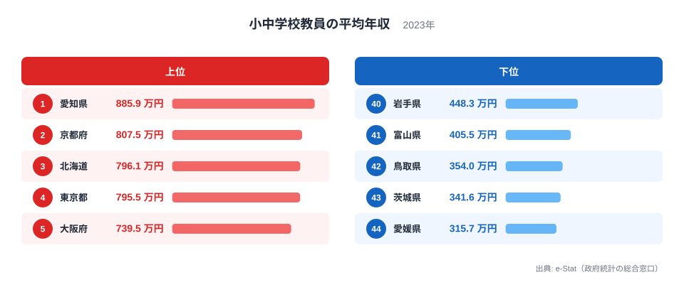
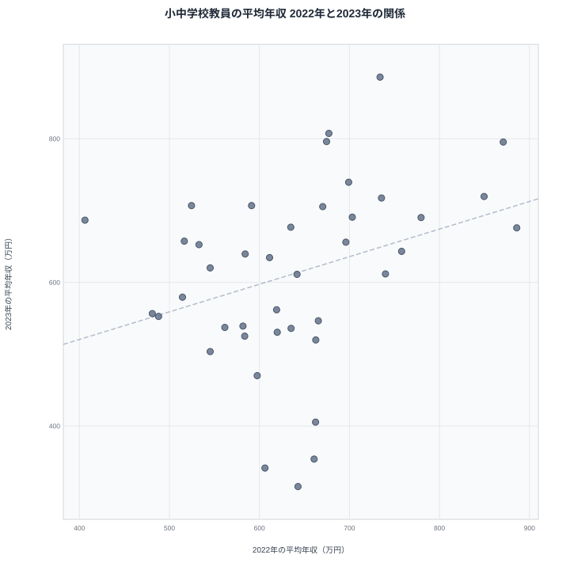

「公務員の給与は国が法律で決める」——多くの人がそう思っています。実際、公立学校教員の給与は国が示した給料表をベースに、各都道府県の条例に沿って設定されます。ところが2023年のデータを見ると、1位の愛知県は885.9万円、最下位の愛媛県は315.7万円と、平均年収が大きく開いています。さらに意外なのは、上位に北海道や山形が食い込み、東京は4位にとどまり、静岡や宮城はむしろ下位寄りに位置することです。「大都市ほど高いはず」という直感が当てはまらないこの並びを解くと、教員給与が「基本給」より「平均値の作られ方」で決まっている構造が見えてきます。

## 上位5県と下位5県：どれだけ違うのか

<source-link href="/ranking/school-teacher-annual-income">教員平均年収ランキングの全件データを見る</source-link>

2023年データの上位5県は、1位の愛知が885.9万円、2位の京都が807.5万円、3位の北海道が796.1万円、4位の東京が795.5万円、5位の大阪が739.5万円でした。ここで早くも直感が崩れます。北海道が3位に入り、京都が東京を上回って2位につけているのです。「三大都市圏が上位を独占する」という単純な構図は成り立っていません。

一方、下位5県は、44位の愛媛が315.7万円、43位の茨城が341.6万円、42位の鳥取が354.0万円、41位の富山が405.5万円、40位の岩手が448.3万円です。こちらも地方の小規模県ばかりが並ぶわけではありません。首都圏に隣接し人口の多い茨城が下位2番目に沈んでいます。富山も北陸の中では決して人口希薄な県ではありません。

上位の愛知と最下位の愛媛を比べると、平均年収の開きはおよそ570万円。比率にすると2.8倍近くにのぼります。同じ国の給料表を出発点にしているはずなのに、これだけの差がつく点が本稿の出発点です。

> [!NOTE]
> ここでの「教員平均年収」は小中学校教員の平均年収で、公立学校の教員だけに限った統計ではありません。賃金構造基本統計調査（統計表ID 0003445758）から、一般労働者・男女計について、6月のきまって支給する現金給与額を12倍し、前年1年間の賞与その他特別給与額を加えた推計年収で、税・社会保険料等を引く前の標本平均です。個人ごとの実際の年収ではなく、調査に入った人の平均なので、その県の教員集団の年齢構成や標本の偏りに左右されます。「教員一人ひとりの待遇の高さ」とは区別して読む必要があります。

## なぜ国基準があるのに、これほど開くのか

公立教員の給与は、国が示す給料表という共通の土台の上に、いくつかの変動要素が積み重なって決まります。今回の並びが「大都市＝高給」で説明できないのは、この変動要素が地域手当だけではないからです。

第一に効くのが**経験年数・年齢の分布**です。平均年収は在籍する教員全体の年齢構成に強く左右されます。ベテラン教員の比率が高い県では平均が押し上げられ、若手を大量採用している県では平均が下がります。北海道が3位、京都が2位に入る背景には、定年に近い層を多く抱える年齢構成が働いている可能性があります。逆に、首都圏で採用数が多い県では若手の比重が増し、平均が抑えられやすくなります。

第二が**管理職比率**です。校長・教頭などの管理職は給与が高く、平均を引き上げます。小規模校が多く一校あたりの教員数が少ない県ほど、教員全体に占める管理職の割合は相対的に高くなる傾向があり、これが平均値を押し上げる方向に働きます。

第三が**地域手当**です。物価・地価の高い地域では基本給に上乗せがあり、東京や愛知・大阪の主要都市はこの恩恵を受けます。ただし上のとおり地域手当だけでは京都2位・北海道3位・東京4位という並びは説明できず、地域手当は数ある要因の一つにすぎません。

第四が**退職・再任用の時期**です。定年退職者が年度内に多く出ると、高給のベテランが抜けて年間の在籍者平均が下がります。退職後に給与の低い再任用として残る人の比率も県ごとに異なり、単年の平均を上下させます。

> [!WARNING]
> 都道府県間の比較には注意が必要です。集計対象や方法が完全には統一されておらず、政令指定都市の教員を含むか否かで数値が変わる場合があります。43位の茨城や25位の静岡のように人口規模の割に低い県は、若手採用の多さや管理職比率の低さといった構成要因が効いている可能性があり、その県の教員の待遇が一律に低いと断定はできません。単年の数値だけで結論づけず、経年の動きと合わせて読むのが安全です。

[労働・賃金カテゴリの他の指標を見る](/category/laborwage)

## 愛知が1位の理由、愛媛が最下位の理由

愛知が東京を抑えて1位になるのは、地域手当だけでは説明しきれません。愛知は自動車産業を中心に製造業が集積し、民間の給与水準が高い県です。公務員給与は民間準拠で調整されるため教員給与にも引き上げ圧力がかかりやすく、加えて名古屋市の地域手当が県全体の平均を押し上げています。さらに、ベテラン層を厚く抱える年齢構成が重なれば、平均は一段と高くなります。

[愛知県の統計データを見る](/areas/23000)

東京が地域手当は最高水準でありながら4位にとどまるのは、若手教員の絶対数の多さが効いていると考えられます。毎年大量に採用するため平均年齢が下がりやすく、地域手当の高さを年齢構成の若さが相殺している構図です。2位の京都や3位の北海道が東京を上回るのは、地域手当よりも年齢・職位構成のほうが平均値を左右する場面があることを示しています。

[京都府の統計データを見る](/areas/26000)

最下位の愛媛は、地域手当がほぼ設定されない市町村が多く、給料表ベースに上乗せがほとんど乗りません。43位の茨城は首都圏に隣接して人口も多い県ですが、若手採用の比重や管理職比率の構成が平均を押し下げていると見られます。両県に共通するのは「県が貧しいから安い」という単純な話ではありません。地域手当の薄さと教員集団の構成が重なった結果という点です。

> [!TIP]
> 教員年収を「職業選択」の観点で見るときは、額面だけでなく「退職金」「共済年金」「残業の実態」を合わせて検討すると実像に近づきます。教員には「教職調整額」として給与の一定割合が一律支給される代わりに、いわゆる残業代が支払われない仕組みがあります。このため、額面の平均が高く見えても実質的な時間あたり賃金は別の公務員より低くなりやすく、長時間労働問題と表裏一体です。平均年収の数字だけで「待遇が良い県」と判断しないことが大切です。

## 同じ県でも年が変わると順位が大きく動く

ここまでは2023年の1年分の順位を見てきましたが、同じ指標を2020年から2023年まで取り直すと、順位が毎年大きく入れ替わっていることが分かります。なお、年によって値がある県の数は違い、2020年は38県、2021年は43県、2022年は44県、2023年は44県です。

1位と最下位を年別に並べてみます。2020年の1位は813.8万円の東京都でした。最下位は322.2万円の茨城県でした。2021年の1位は822.17万円の京都府でした。最下位は245.16万円の石川県でした。2022年の1位は885.89万円の千葉県でした。最下位は406.17万円の長崎県でした。2023年は愛知県が1位、愛媛県が最下位です。1位も最下位も、4年間で一度も同じ県になっていません。なお、2022年の千葉県と2023年の愛知県は、どちらも885.89万円で、同じ値です。

図は、横軸が2022年、縦軸が2023年の平均年収で、両方の年に値がある41県だけを描いています。前年に高い県が翌年も高いなら、点は右上がりの線に沿って並びますが、実際の点は広く散らばっています。愛媛県の平均年収は、2021年が692.05万円、2022年が642.85万円、2023年が315.72万円と推移し、2023年は1年で327.13万円、ほぼ半分に下がりました。順位でいえば、11位、20位、44位と動いた計算です。反対に長崎県は、2022年の406.17万円から2023年の686.67万円へ280.5万円上がり、44位から14位に上がっています。北海道は、年を追うごとに平均年収が上がり続けました。2020年は435.78万円、2021年は589.68万円、2022年は674.61万円、2023年は796.09万円で、順位も34位、25位、13位、3位と上がっています。

前年との関係を数字にしても、関連はあるものの弱いことが分かります。両方の年に値がある県どうしで、前年の年収と翌年の年収の相関係数を計算すると、2020年と2021年は0.34、2021年と2022年は0.37、2022年と2023年は0.32でした。いずれも正の相関ですが、1に近いほど「前年に高い県は翌年も高い」と言える水準には遠く、前年の順位は翌年の順位を予想する手がかりとしては弱いデータです。4年間で3位以内に2回以上入ったのは、東京都と愛知県が各3回、京都府が2回の3県だけです。大阪府、兵庫県、千葉県、北海道は、3位以内に入ったのが4年間で1回だけでした。

この指標は標本平均なので、県内で調査の対象に入った小中学校教員の人数が少なければ、数人の入れ替わりや、給与の高い人が含まれるかどうかで平均が数百万円単位で動く可能性があります。**[仮説]** 愛媛県や長崎県の大きな動きは、制度の違いよりも標本の入れ替わりを映しているかもしれません。ただし、このデータには県ごとの標本の大きさが含まれていないため、実際にそうなっているかは確かめられません。前の節で挙げた年齢構成・管理職比率・地域手当は順位を左右する候補ですが、1年で半分近くに変わるような動きを、それらの制度的な要因だけで説明するのは難しいと言えます。入れ替わりの理由を断定できる材料がない以上、この記事が示せるのは、順位が毎年これだけ大きく動くという事実までです。

## この並びが投げかける「教員不足」への含意

愛媛・茨城・鳥取のように平均年収が低い県は、教員採用の競争力という観点でも不利になりがちです。給与が伸びにくく、都市部に比べて生活コストの節約効果も限られる地域では、優秀な人材が教職を選ぶ動機が弱まります。

ただし、平均年収の低さがそのまま「待遇の悪さ」を意味するわけではない点には注意が必要です。茨城のように若手が多い県では、ベテランになるにつれ給与が伸びる余地が大きいとも読めます。平均値は集団の構成を映す鏡であり、個々の教員の処遇とは別の話です。文部科学省が進める教員確保策を評価するうえでも、平均年収という一つの数字だけでなく、年齢構成・管理職比率・地域手当といった内訳まで踏み込んで見ることが欠かせません。

## データについて

この記事の2023年の値と順位は、ランキングページと同じ小中学校教員の平均年収を、値の高い順に並べたものです。値の単位は万円で、2023年は44都道府県分あり、青森県・福井県・徳島県の3県には値がありません。「44位」は全国の最下位ではなく、値がある44都道府県の中での最下位を指します。値がない理由は、このデータからは確かめられません。

年別の比較に使った2020年から2022年の値も、同じ指標を同じ方法で取得したものです。相関係数は、2つの年の両方に値がある都道府県だけを対象に、年収そのものの値からピアソンの相関係数を計算しました。対象になった県の数は、2020年と2021年で36県、2021年と2022年で40県、2022年と2023年で41県です。散布図の41県は、2022年と2023年のどちらか一方、または両方に値がない青森県、岩手県、山形県、石川県、福井県、徳島県の6県を除いています。

## まとめ

- 1位は**愛知県の885.9万円**、最下位は**愛媛県の315.7万円**で、開きはおよそ2.8倍
- 上位5は愛知・京都・北海道・東京・大阪で、**北海道3位・京都2位**と「大都市独占」ではない
- 下位5は愛媛・茨城・鳥取・富山・岩手で、**首都圏隣接の茨城が43位**と地方限定でもない
- 並びを左右する要因の候補は**年齢・経験年数の分布**と**管理職比率**で、地域手当はその一つにすぎない
- 1位は2020年が東京都、2021年が京都府、2022年が千葉県、2023年が愛知県と毎年変わり、前年との相関係数も0.32から0.37にとどまるため、1年分の順位だけで県ごとの待遇差とは言い切れない
- 平均年収はその県の教員集団の構成を映す指標であり、個々の教員の待遇の高低とは区別して読む必要がある
