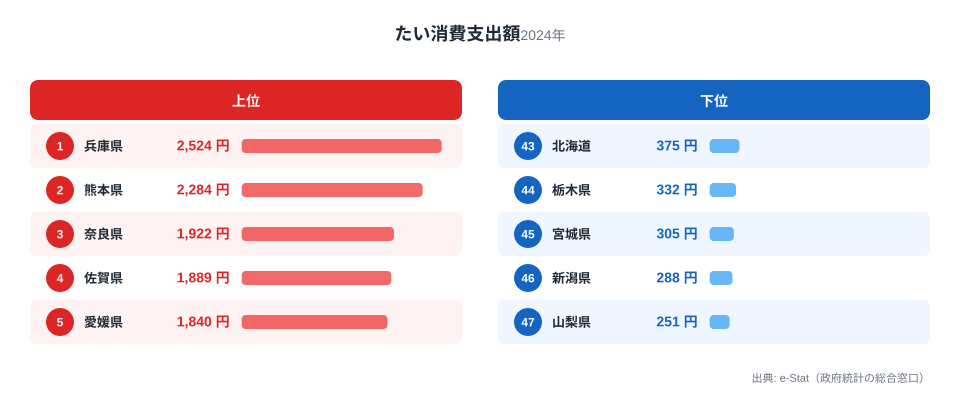

「腐っても鯛」という言葉があるほど、たいは日本人にとって特別な魚です。しかし家計調査のデータを見ると、その特別さを実感できるかどうかは住む県によって大きく違うことがわかります。

総務省家計調査（品目別）によると、2024年の都道府県庁所在市におけるたい消費支出額は、1位の兵庫県が2524円、最下位の山梨県が251円で、その差はおよそ10倍に達します。同じ日本の食卓でも、たいがどれだけ身近かはまったく違うのです。

この記事では、なぜたいの消費が西日本に偏るのか、上位県と下位県の地理的パターンから読み解きます。

> [!NOTE]
> 本データは総務省「家計調査（品目別）」の都道府県庁所在市・二人以上世帯を対象にした年間支出額です。県全体ではなく県庁所在市（例: 兵庫県なら神戸市）のみの調査である点に注意してください。

## 上位県と下位県

<source-link href="/ranking/sea-bream-consumption-expenditure">たい消費支出額ランキングをもっと見る</source-link>

1位は[兵庫県](/areas/28000)の2524円、2位は熊本県の2284円、3位は奈良県の1922円です。上位10県を並べると、兵庫・熊本・奈良・佐賀・愛媛・高知・長崎・山口・福岡・和歌山と、近畿・中国・四国・九州の顔ぶれがそのまま並びます。関東や東北の県は上位10県に一つも入っていません。

この偏りは偶然ではなく、たいが古くから「祝いの魚」として西日本の食文化に組み込まれてきたことが大きく関係しています。関西では出産後の「お食い初め」や結婚式の引き出物にたいの尾頭付きを用いる習慣が根強く残っており、日常の献立というより「ハレの日」の食材として消費されてきました。奈良県が3位に入っているのも、海に面していない内陸県でありながら祝い事の食文化が消費を押し上げていると考えられます。

もう一つの要因が産地の近さです。兵庫県の明石海峡や徳島県の鳴門海峡は激しい潮流で育つ「明石鯛」「鳴門鯛」の天然真鯛の産地として知られ、地元での流通量が多いことが消費量にも反映されやすい構造があります。加えて愛媛県や熊本県は養殖マダイの一大産地で、全国の養殖生産量の多くをこの2県が占めています。地元で獲れる・育てられるたいが、そのまま地元の食卓に上りやすいという地産地消的な傾向がうかがえます。

> [!TIP]
> 養殖マダイの生産量は愛媛県が全国トップクラスで、熊本県・三重県・愛媛県で全国生産量の大半を占めます。ただし三重県は消費支出額では493円と中位にとどまっており、「産地=高消費」が単純には成り立たない例もあります。

## 下位グループの特徴

下位を見ると、[山梨県](/areas/19000)251円、新潟県288円、宮城県305円、栃木県332円、北海道375円と、東北・北関東・内陸県が並びます。これらの地域に共通するのは、たい以外の魚介がすでに食文化の中心にあることです。かつお・かきの消費でも東西で似た偏りが見られます（[かつお・かき消費の地域差](/blog/bonito-vs-oyster-fish-map)）。

北海道はサケ・ホタテ・カニなど独自の海産物文化が強く根付いており、たいを積極的に選ぶ必然性が薄いと考えられます。宮城県・新潟県も同様に、サンマやサケ、寒ブリなど地元で水揚げされる別の魚種が食卓の主役になりやすい地域です。山梨県は内陸県で海産物全般への支出が相対的に低い傾向があり、たいに限らず鮮魚消費全体が伸びにくい構造があります。

栃木県も内陸県で、たいのような高級魚よりも日常的に手に入りやすい川魚や加工品が食卓の中心になりやすいと考えられます。「祝いの魚」という位置づけが薄い地域では、そもそも購入する機会自体が少ないのです。

## なぜこれほど差が生まれるのか

たいの消費支出額の地域差が10倍にも達する理由は、単純な「好み」の違いではなく、複数の要因が重なった結果だと考えられます。

まず食文化としての位置づけです。西日本、特に関西圏では慶事に欠かせない魚として認識されているため、価格が比較的高くても購入されやすい構造があります。一方、東北や北海道では他の魚種がすでに食文化の中心を占めており、たいへの支出が優先されにくい状況です。

次に流通・鮮度の問題です。天然・養殖を問わずたいの主要産地が瀬戸内海周辺や九州に集中しているため、地元では鮮度の良いたいが手頃な価格で流通しやすく、遠方では輸送コストや鮮度劣化により価格が上がりやすい可能性があります。

> [!WARNING]
> 本データは支出「額」であり、消費「量」とは異なります。価格が高い地域ほど支出額が押し上げられる可能性があるため、量ベースの地域差とは一致しない場合がある点に注意してください。

## まとめ

- 1位は兵庫県（2524円）、最下位は山梨県（251円）で約10倍の差
- 上位10県は近畿・中国・四国・九州（西日本）に集中し、東北・関東は下位に偏る
- 背景には「祝いの魚」としての西日本の食文化と、明石・鳴門などの天然産地、愛媛・熊本の養殖産地の存在がある
- 下位県は北海道のサケ・ホタテ、東北のサンマ・寒ブリなど、別の魚介文化が食卓の中心を占める傾向がある
- 支出額データのため、価格差の影響も考慮する必要がある

家計消費の地域差は他の品目にも見られます。合わせて[経済カテゴリの他ランキング](/category/economy)も確認してみてください。

## データ出典

総務省統計局「家計調査（品目別）」（都道府県庁所在市・二人以上世帯、2024年）を基に作成。e-Stat（政府統計の総合窓口）経由で取得したデータを集計しています。
