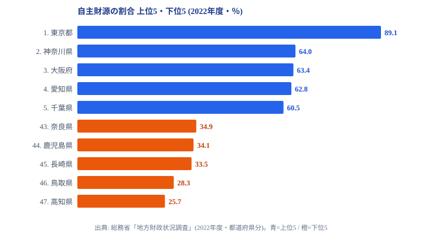

「同じ47都道府県でも、自前で稼げる割合がこれほど違うのか」──都道府県の歳入をめぐって、そんな格差が静かに広がっています。

「自主財源の割合」とは、都道府県の歳入のうち、国に頼らない自前の収入(地方税・分担金・使用料など)が占める比率のことです。この比率が高いほど財政的に自立しており、低いほど地方交付税や国庫支出金など国からの移転に依存している構造を意味します。

総務省「地方財政状況調査」(2022年度)によると、首位の東京都は歳入の89.1%を自前で賄います。一方で最下位の高知県は25.7%にとどまり、歳入の約4分の3を国に依存しています。両者の差は3.5倍です。この記事では「自治体は自前で食えているのか」という観点から、どの地域が財政的に自立し、どの地域が交付税に支えられているのか、その地理を読み解いていきます。

## 自主財源の割合 上位5・下位5(2022年度)

まず上位5県と下位5県を1枚の図で対比します。青が上位、橙が下位です。

首位の東京都(89.1%)は突出しています。9割近くを自前で稼ぐのは47都道府県で東京だけで、2位以下に25ポイント以上の差をつけています。2位の神奈川県(64.0%)、3位の大阪府(63.4%)、4位の愛知県(62.8%)と、三大都市圏の中核が続き、5位には首都圏近郊の千葉県(60.5%)が入ります。上位を占めるのは、いずれも人口と企業が集積し、地方税(住民税・法人関係税・固定資産税)が厚い地域です。法人や住民が多く稼ぐほど税源が太くなるため、自前で歳入を賄える比率が高くなります。

対照的に、下位5県は西日本と中四国に集中します。最下位の高知県(25.7%)は、東京の約3.5分の1の水準で、歳入の4分の3を国の交付税・国庫支出金に頼る構造です。46位の鳥取県(28.3%)、45位の長崎県(33.5%)、44位の鹿児島県(34.1%)、43位の奈良県(34.9%)が続きます。これらの県は人口減少と高齢化が進み、企業集積も限られるため、地方税収が伸びにくいという共通点を抱えています。行政サービスを維持するには国からの補填が欠かせず、その財源不足を埋めているのが[地方交付税](/ranking/local-allocation-tax-prefecture)の制度です。

> [!NOTE]
> 自主財源比率は「歳入総額に占める地方税・使用料・分担金などの割合」を指します。同じ「財政の強さ」を測る指標でも、基準財政需要額と収入額の比で算出する「財政力指数」とは計算式が異なります。本記事の数値は財政力指数ではなく、歳入に占める自前収入の比率です。

<source-link href="/ranking/self-financing-ratio">自主財源の割合ランキングをもっと見る</source-link>

## なぜ三大都市圏が高く、地方が低いのか

自主財源比率の高低は、つきつめれば「その地域にどれだけ税源(企業と住民の所得・資産)が集積しているか」を反映しています。

上位の三大都市圏では、本社・事業所が密集し、給与所得者と高額資産が集中しています。これが住民税・法人関係税・固定資産税という地方税の三本柱を太くします。東京都の89.1%が突出するのは、全国の大企業の本社機能が集まり、税源が極端に偏在しているためです。8位の宮城県(55.5%)は仙台という東北の中枢都市を抱え、9位の栃木県・群馬県(ともに55.1%)は北関東の工業地帯を持つことで、地方の中でも比較的安定した税収基盤を確保しています。

一方、下位の県では生産年齢人口の流出と高齢化が進み、課税対象となる所得・法人活動そのものが縮小しています。自前の税収が細るため、行政サービスの水準を保つには国からの移転が不可欠になります。地方交付税は、こうした財源の偏りを国が調整し、どの地域に住んでも一定の行政サービスを受けられるようにするための再分配の仕組みです。下位県の比率の低さは、その県の努力不足というより、税源そのものが地理的に偏在していることの結果だと読むのが妥当でしょう。財政の自立度をさらに掘り下げたい場合は、[行政・財政カテゴリ](/category/administrativefinancial)の各指標とあわせて見ると立体的に把握できます。

> [!WARNING]
> 東京都は地方交付税の不交付団体であり、他県とは財政構造が大きく異なります。89.1%という数値は「交付税に頼らずに済む唯一の都」であることの裏返しでもあり、交付税を前提に運営する他の46道府県とそのまま同列に比べると実態を読み違えやすい点に注意してください。

## 「自前で稼げる県」と「交付税に支えられる県」の地理

自主財源比率を50%で線引きすると、地図はくっきり二分されます。

50%以上を確保しているのは、東京・神奈川・大阪・愛知・千葉・兵庫・福岡・宮城・栃木・群馬・埼玉・茨城・京都の13県だけです。残る34県は50%未満で、歳入の半分以上を国に依存しています。13県の顔ぶれは三大都市圏とその近郊、そして仙台・福岡という地方中枢都市圏にほぼ重なり、財政自立と人口・産業集積が強く結びついていることが読み取れます。

50%未満の地域は地方交付税の対象となり、財源不足を国が補填します。これは日本の地方財政制度の中核にある仕組みで、都市部に集中する税収を地方へ再分配することで、全国で行政サービスの水準を平準化しています。比率が低いこと自体は制度上想定された姿であり、ただちに財政破綻を意味するわけではありません。

ただし、30%を下回るのは鳥取県(28.3%)と高知県(25.7%)の2県のみで、これはかなり厳しい水準です。歳入の7割超を国に依存する状態が続けば、国の財政方針の変化に地域経済が大きく左右されかねません。地方創生や移住促進、産業誘致といった政策が、単なる人口対策にとどまらず、自治体の財政自立性を高める課題でもあることが、この2県の数字から見えてきます。比率ではなく自前収入の絶対額で比べたい場合は、[自主財源額のランキング](/ranking/independent-revenue-prefecture)もあわせて確認すると規模感の違いがつかめます。

> [!TIP]
> 自主財源比率は単年の景気や臨時の国庫支出金に左右されます。1つの年度だけで「自立度」を断ずるのではなく、複数年度の推移や、絶対額(自主財源額)・交付税額とあわせて読むと、その県の財政構造がより正確につかめます。

<source-link href="/ranking/local-allocation-tax-prefecture">地方交付税ランキングをもっと見る</source-link>

## まとめ

- 首位の東京都(89.1%)が突出し、上位は三大都市圏とその近郊に福岡が並びます
- 最下位の高知県(25.7%)との差は3.5倍に達します
- 50%以上を自前で賄えるのは13県のみで、残る34県は歳入の半分超を国に依存しています
- 30%を下回るのは鳥取(28.3%)と高知(25.7%)の2県だけです
- 比率の低さは努力不足ではなく税源の地理的偏在の結果であり、地方創生は「財政自立」も問う課題です

## データ出典

- 総務省「地方財政状況調査」(2022年度・都道府県分)
- e-Stat 経由で都道府県別に整備
