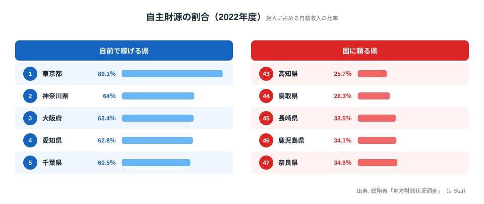

「自分たちの街は、自分たちのお金で運営できているのか」──そう問われたとき、胸を張って「はい」と答えられる都道府県は、実はごくわずかです。総務省「地方財政状況調査」の 2022 年度版を見ると、歳入の半分以上を自前で賄える県は **47 のうち 10 県だけ**。残り 37 県は、収入の半分超を国からの再分配に頼っています。

その自前度を測るのが「自主財源の割合」です。1 位の東京都は 89.1% とほぼ自立している一方、最下位の高知県は 25.7% にとどまり、歳入の 4 分の 3 を国に依存しています。差は 3.5 倍。この記事では、なぜ大半の県が「国頼み」になるのか、その地理的な構造を読み解いていきます。

> [!NOTE]
> 「自主財源」とは、都道府県が自分で集められる収入のことです。地方税・分担金・使用料・手数料・財産収入などが含まれます。逆に、地方交付税・国庫支出金・地方債のように国や借入に由来する収入は「依存財源」と呼ばれます。比率が高いほど財政的に自立し、低いほど国の補填で行政サービスを維持していることを意味します。

## 自前で稼げる県と国に頼る県（2022年度）

まず上位と下位を見てみましょう。自主財源比率が高い 5 県と低い 5 県を並べたのが次の図です。

1 位の東京都（89.1%）は突出しています。2 位以下は神奈川県（64.0%）・大阪府（63.4%）・愛知県（62.8%）・千葉県（60.5%）と、三大都市圏の中核と近郊圏が続きます。これらの県は企業の本社や大規模な事業所が集中し、法人関係の税収と人口に比例する地方税が厚いため、国に頼らなくても歳入を組み立てられます。東京都に至っては全国の法人が集まるため、自主財源比率が他県を大きく引き離します。

一方、下位は高知県（25.7%）を最下位に、鳥取県（28.3%）・長崎県（33.5%）・鹿児島県（34.1%）・奈良県（34.9%）が並びます。最下位の高知県は東京都のおよそ 29% の水準にすぎず、歳入の 4 分の 3 を国の交付税や国庫支出金で補っています。人口規模が小さく、税収の母体となる企業や所得の集積が乏しいことが、低い比率に直結しています。

<source-link href="/ranking/self-financing-ratio">自主財源の割合ランキング（47都道府県・各年版）を見る</source-link>

> [!TIP]
> 順位だけを追うと「都市は強く地方は弱い」で終わってしまいますが、ここで見たいのは**比率の絶対水準**です。50% を超えるか下回るかで、その県が「自前で半分以上を賄えるか」「半分以上を国に頼るか」が分かれます。次の章ではこの 50% という境界線で全体を眺めます。

## 50%の境界線で日本を分けると

自主財源比率を 50% で線引きすると、これを超えるのは東京・神奈川・大阪・愛知・千葉・兵庫・福岡・宮城・栃木・群馬の **10 県のみ**です。三大都市圏に福岡（地方の経済中心）と、仙台を抱える宮城、北関東の工業地帯を持つ栃木・群馬が加わる構図です。これらの県には、人口集積か産業集積のどちらか、あるいは両方があります。

8 位以下の宮城・栃木・群馬が境界線を越えられる理由は、必ずしも人口の多さだけではありません。宮城は東北の中枢である仙台に人と企業が集まり、栃木・群馬は自動車・電機などの製造業が立地して法人関係の税収を押し上げています。つまり「大都市圏でなくても、地域の核となる都市か、稼ぐ産業を持っていれば 50% に届く」ことを、この 3 県が示しています。

裏を返せば、残り **37 県は 50% 未満**で、歳入の半分以上を国に依存しています。半分以上が国頼みというのは例外ではなく、日本の地方財政ではむしろ標準的な姿だということが、この数字から見えてきます。

> [!WARNING]
> 自主財源比率が低いことは、ただちに「財政運営が下手」「不健全」を意味するわけではありません。地方交付税は、税収が少ない地域でも全国どこでも一定水準の行政サービスを受けられるよう、国が財源を再分配する制度です。比率の低さは、その再分配が設計どおり機能している裏返しでもあります。健全性そのものは、実質公債費比率や財政力指数など別の指標と合わせて判断する必要があります。

国が税収の多い都市部から財源を吸い上げ、税収の乏しい地方に配り直す。50% 未満の 37 県は、この再分配の受け手にあたります。財政力指数の高い県と低い県の構図を合わせて見ると、この依存と再分配の関係がより立体的に理解できます。

<source-link href="/ranking/local-allocation-tax-prefecture">地方交付税（国からの再分配額）ランキングを見る</source-link>

## 30%未満の県が抱える重さ

37 県のなかでも、自主財源比率が 30% を下回るのは高知県（25.7%）と鳥取県（28.3%）の 2 県だけです。この水準は、歳入のおよそ 7 割超を国に頼っていることを意味し、自前の収入だけでは行政の基礎的な運営すら成り立たない状態に近いといえます。

両県に共通するのは、人口規模の小ささと産業集積の乏しさです。人口が少なければ住民税や消費に連動する税収の母体が薄くなり、大企業の拠点が少なければ法人関係の税収も伸びません。さらに高齢化が進むと、税を納める現役世代の比率が下がり、自主財源はいっそう細くなります。

この構造を踏まえると、地方創生や移住促進、産業誘致といった施策は、単なる人口対策にとどまらないことが分かります。人口を増やし産業を呼び込むことは、そのまま **自治体が自前で稼ぐ力を取り戻す財政課題**でもあるのです。最下位の[高知県のエリアページ](/areas/39000)を見ると、人口・産業・財政の数字がどう噛み合っているかを具体的に確認できます。

<source-link href="/ranking/independent-revenue-prefecture">自主財源額（絶対額）ランキングを見る</source-link>

各県の人口・産業・財政の組み合わせを横断的に見たい場合は、[行政・財政カテゴリの一覧](/category/administrativefinancial)もあわせて参照してください。借入の残高との対比は[地方債現在高ランキング](/ranking/local-debt-current)で確認できます。

## まとめ

- 1 位の東京都（89.1%）が突出し、2 位以下は三大都市圏の中核と福岡・宮城・北関東が続く
- 最下位は高知県（25.7%）で、1 位との差は 3.5 倍
- 自主財源比率 50% を超え「自前で半分以上を賄える」県は 10 県のみで、残り 37 県は国に依存する
- 30% を下回るのは高知・鳥取の 2 県だけで、歳入の 7 割超を国に頼る構造
- 比率の低さは不健全さではなく、税収の多い都市から地方へ再分配する地方交付税制度が機能している裏返しでもある

## データ出典

- 総務省「地方財政状況調査」（2022 年度・都道府県分）
- e-Stat（政府統計の総合窓口）経由で都道府県別に整備
