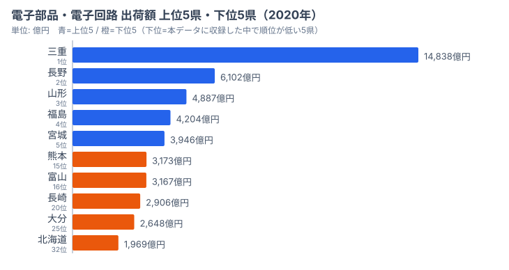
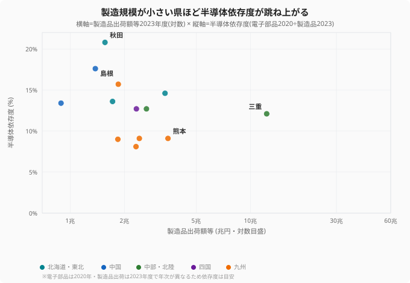

TSMC（台湾積体電路製造）の熊本進出で、「シリコンアイランド九州」が約30年ぶりに脚光を浴びています。子会社JASMの第1工場は2024年末に量産を開始し、第2工場の建設計画も進んでいます。ところが、電子部品・デバイス・電子回路製造業の出荷額地図を実際に開いてみると、報道のイメージとは違う顔が見えてきます。TSMC進出前の2020年時点で、九州勢は意外にも上位に少ないのです。

出荷額の主役はどこなのでしょうか。1位は三重県、2位は長野県、そして3〜5位には東北3県が並びます。日本の「半導体勢力図」は、ニュースで語られる九州中心の構図とは、はっきり異なる姿をしています。この記事では、電子部品の出荷額そのものと、それを製造業全体の規模と重ね合わせた「半導体依存度」という2つの角度から、勢力図のずれの正体を読み解いていきます。

## 電子部品の出荷額地図──主役は三重と東北、九州は中位

<source-link href="/ranking/manufacturing-shipment-amount">47都道府県の製造業ランキングをもっと見る</source-link>

電子部品・デバイス・電子回路製造業の出荷額で全国の主役は[三重県](/areas/24000)（約1兆4,838億円）です。2位の[長野県](/areas/20000)（約6,102億円）を2倍以上引き離しており、文字どおり別格の存在になっています。三重県にはキオクシア（旧東芝メモリ）四日市工場をはじめ、多数の半導体・電子部品工場が集積しているためです。県をまたいで部材を運ぶ手間が少なく、関連企業がひとつの地域にまとまっていることが、この突出した数字を支えています。

注目すべきは東北勢の健闘です。[山形県](/areas/06000)（3位：4,887億円）、福島県（4位：4,204億円）、宮城県（5位：3,946億円）と、上位5県のうち3つを東北が占めました。東北6県の出荷額合計は約2兆197億円にのぼり、九州7県の合計（約1兆6,366億円、沖縄を除く）を上回ります。なぜ東北なのでしょうか。豊富な高純度の水、冷涼な気候、地震リスクを首都圏から分散できる立地、そして用地コストの安さが、半導体工場の立地を長く促してきたからです。半導体の製造には大量のきれいな水と安定した電力が欠かせず、東北はその条件を満たしてきました。グラフの上位5県（青）を見れば、三重を頂点に東北が厚く連なる構図が一目でわかります。

北陸も存在感があります。石川県（7位：3,662億円）、福井県（11位：3,358億円）、富山県（16位：3,167億円）の3県が上位に名を連ねます。村田製作所やアイ・オー・データ機器など、電子部品メーカーの生産拠点が集中しているためです。三重・東北・北陸をつなぐと、太平洋側ではなく日本海側に厚い帯ができることが、この地図の隠れた特徴になっています。製造業というと太平洋ベルトを思い浮かべがちですが、電子部品に限ると重心は内陸・日本海側に寄るのです。

一方で、肝心の九州勢はどうでしょうか。グラフの下位5県（橙）には、熊本県（15位：3,173億円）、富山県（16位）に続いて、長崎県（20位：2,906億円）、大分県（25位：2,648億円）、そして北海道（32位：1,969億円）が並びます。ここでの「下位」は、本データに収録した12県のうち順位が低い側、という意味です。「シリコンアイランド」の名を持つ九州勢が、2020年時点ではこの中位グループにとどまっていた点が、この記事の出発点になります。ソニーセミコンダクタ（熊本）やTI（大分）といった大手の拠点はありますが、出荷額の規模で見ると三重・東北・北陸には届いていませんでした。九州の存在感は、これから本格化するTSMC投資によって、まさにこれから書き換えられようとしている段階なのです。

> [!NOTE]
> ここで扱う「電子部品・デバイス・電子回路製造業」は工業統計調査の業種区分で、半導体・コンデンサ・センサーなどを含みます。出荷額は工場の所在地で計上されるため、本社が別の県にあっても工場のある県の数字に積み上がります。「どの企業の県か」ではなく「どこで作っているか」の地図として読むのが正しい見方です。

> [!WARNING]
> 上の図の「下位5県」は47都道府県の最下位という意味ではなく、本記事で扱う収録12県のうち順位が低い5県（熊本15位〜北海道32位）を指します。電子部品の出荷がほとんど無い県は、47位グループとしてさらに下に存在します。図の橙色を「全国最下位」と読み違えないようご注意ください。

## 「半導体依存度」で見ると地図が一変する

ここで角度を変えてみます。電子部品の出荷額そのものではなく、製造品出荷額等の全体に占める電子部品の割合、つまり「半導体依存度」を計算すると、地図はまったく違う顔を見せます。横軸に製造品出荷額等（製造業全体の規模）、縦軸に半導体依存度をとって47都道府県をプロットしたのが次の散布図です。

<source-link href="/ranking/manufacturing-shipment-amount">47都道府県の製造品出荷額等ランキングをもっと見る</source-link>

散布図の右側（製造規模の大きい県）から見ていきましょう。分母となる製造品出荷額等を都道府県で並べると、1位は愛知県（58.0兆円）で、2位の静岡県（19.8兆円）以下を圧倒しています。下位には秋田県（43位：1.6兆円）、島根県（44位：1.4兆円）、鳥取県（45位：0.9兆円）、高知県（46位：0.7兆円）、沖縄県（47位：0.5兆円）が並びます。製造業そのものの規模は都道府県でケタ違いで、この分母の大小こそが、依存度の地図を一変させる鍵になります。散布図の横軸が対数目盛なのは、この規模差が大きすぎて等間隔では潰れてしまうためです。

依存度が最も高いのは秋田県（20.8%）です。散布図では左上、製造規模が小さいのに依存度が突き抜けて高い位置に秋田が跳ね上がっているのがわかります。秋田県は製造品出荷額等が約1.6兆円と下位グループにありますが、そのうち約3,251億円が電子部品で、TDKの本社・工場群が集中している影響が大きく出ています。分母である製造業全体が小さいため、電子部品の比率が一気に跳ね上がるのです。出荷額そのものでは目立たない県が、依存度ではトップに立つ──ここに地図が一変するからくりがあります。前の図（電子部品の出荷額）で最下位グループにいた秋田が、依存度の世界では首位に躍り出る、という逆転が起きているわけです。

散布図の左上には、秋田に続いて島根県（17.6%）も跳ね上がっています。さらに長崎県（15.7%）、山形県（14.6%）、青森県（13.6%）、鳥取県（13.4%）、徳島県（12.7%）、福井県（12.7%）、三重県（12.1%）と続きます。注目すべきは三重県の位置です。出荷額で断トツの主役だった三重県は、散布図では右下、製造規模が大きい側で依存度12.1%とむしろ低い位置に沈んでいます。製造業全体（約12.3兆円）が大きいため、電子部品が多くても全体の中では一部分にしかならないのです。前の図で最下位グループにいた島根や鳥取が、散布図の左上に来る点も、分母の効果をよく表しています。九州では熊本県（9.1%）が散布図の中央やや下に位置し、鹿児島県（9.1%）、宮崎県（9.0%）、佐賀県（8.1%）も10%前後で並びますが、TSMC進出後はこの数値が大きく動いていくでしょう。

> [!WARNING]
> 半導体依存度は、製造業の規模が小さい県ほど高く出る点に注意が必要です。秋田県のように分母（製造品出荷額等）が下位グループの県では、電子部品の比率が突出しやすくなります。「依存度が高い＝半導体が強い」ではなく、「半導体以外の製造業が薄い」結果でもあるのです。順位の高低だけを見て産業の強さを判断しないようにしてください。なお電子部品出荷額は2020年、製造品出荷額等は2023年のデータで、年度が異なるため依存度は目安としてお読みください。

> [!TIP]
> 依存度が高い県は、シリコンサイクル（半導体の好不況が3〜5年周期で繰り返される現象）の下降局面で地域経済が大きく揺さぶられるリスクを抱えています。秋田県（20.8%）や島根県（17.6%）のように依存度が高い県の産業構造は、[製造業カテゴリ](/category/miningindustry)のランキング群と合わせて見ると、半導体以外の柱がどれだけあるかが立体的に見えてきます。

## TSMC・Rapidusは地図をどう塗り替えるか

データが示す日本の「半導体勢力図」は、一般にイメージされる九州中心の構図とは異なっていました。2020年時点の電子部品出荷額では三重県が圧倒的な主役で、東北・北陸の存在感が際立ち、九州は「シリコンアイランド」の呼称にもかかわらず中位にとどまっていたのです。なぜこのずれが生まれるかと言えば、報道は新規投資のニュースを追う一方で、出荷額の地図は長年積み上がってきた既存の集積を映すからです。両者は見ている時間軸が違うのです。見かけ上「九州が半導体の中心」というイメージと、実データの主役が一致しない真因は、ここにあります。

しかし、この地図は今まさに塗り替えられようとしています。九州では、TSMC（JASM）の第1工場が2024年末に量産を開始し、第2工場も2027年の稼働を目指しています。ソニーセミコンダクタソリューションズの画像センサー工場の増設も進んでおり、これらの投資が本格化すれば、熊本県をはじめとする九州の電子部品出荷額は大幅に増える可能性があります。北海道でも、Rapidusが千歳市に最先端ロジック半導体の量産工場を建設中で、2027年の量産開始を目標としています。実現すれば、電子部品出荷額32位（約1,969億円）と中位以下にあった北海道の位置は、大きく動くことになるでしょう。

最後に押さえておきたいのが、依存度の高い県のリスクです。シリコンサイクルの下降局面や技術世代の交代期には、半導体に偏った地域経済全体が大きく揺さぶられます。秋田県（20.8%）や島根県（17.6%）のように依存度が高い県は、誘致の成果を喜ぶだけでなく、産業の多角化も並行して進める必要があります。次回の経済構造実態調査のデータが公表されれば、TSMC効果が数字として現れ始めるはずです。日本の半導体地図がどう変わっていくのか、引き続きデータで追いかけていきます。

## データ出典

- 電子部品・デバイス・電子回路製造業 出荷額（2020年）: e-Stat 工業統計調査（statsDataId 0003448099）
- 製造品出荷額等（2023年度）: e-Stat 経由で整備した都道府県統計
