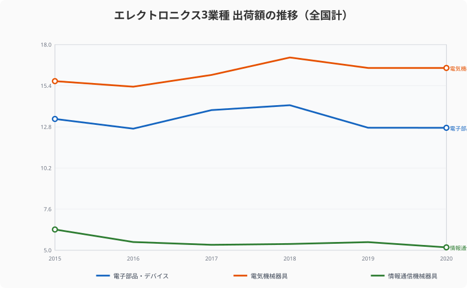
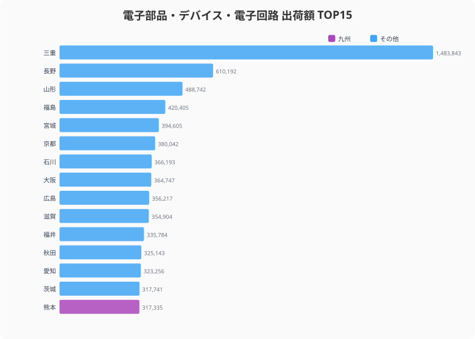
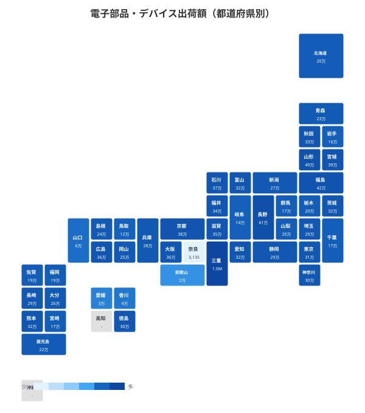
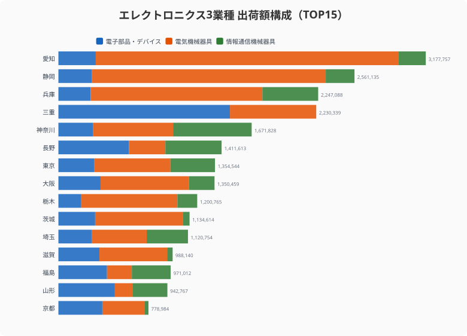
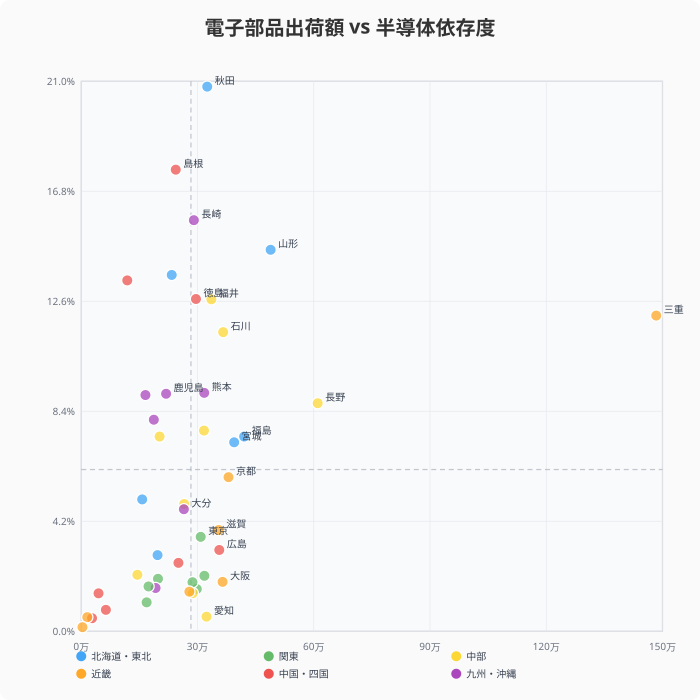
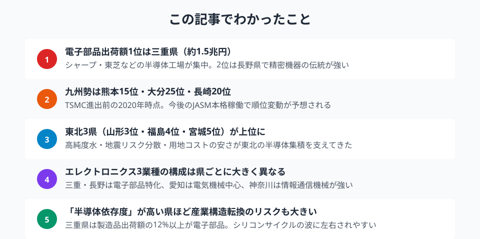

TSMC（台湾積体電路製造）の熊本進出で、「シリコンアイランド九州」が約30年ぶりに脚光を浴びている。子会社JASMの第1工場は2024年末に量産を開始し、第2工場の建設計画も進む。だが、電子部品・デバイス・電子回路製造業の出荷額ランキングを見ると、TSMC進出前の2020年時点で九州勢は意外にも上位に少ない。1位は三重県、2位は長野県、そして3〜5位には東北3県が並ぶ。日本の「半導体勢力図」は、報道のイメージとは異なる姿を見せている。

## 電子部品・デバイス出荷額の推移──シリコンサイクルと3業種の比較

<data-source url="https://www.e-stat.go.jp/dbview?sid=0003448099" label="e-Stat 工業統計調査"></data-source>

エレクトロニクス関連の主要3業種──電子部品・デバイス・電子回路製造業、電気機械器具製造業、情報通信機械器具製造業──の全国出荷額を比較すると、電気機械が最大（2020年：約16.5兆円）、電子部品が約12.7兆円、情報通信機械が約5.2兆円となっている。

電子部品は2018年の約14.2兆円をピークに2019〜2020年は12.7兆円へ減少した。これは半導体業界特有の「シリコンサイクル」（好不況が3〜5年周期で繰り返される現象）の影響だ。スマートフォンやデータセンター向けの需要変動に加え、2020年はコロナ禍による自動車生産の落ち込みも響いた。

情報通信機械は2015年の6.3兆円から2020年の5.2兆円へ縮小傾向にある。国内のパソコン・スマートフォン組立工場の海外移転が進んだことが背景にある。

<source-link href="/ranking/shipment-value-manufacturing-17">47都道府県の電子部品・デバイス・電子回路製造業 出荷額ランキングをもっと見る</source-link>
<source-link href="/ranking/shipment-value-manufacturing-18">47都道府県の電気機械器具製造業 出荷額ランキングをもっと見る</source-link>
<source-link href="/ranking/shipment-value-manufacturing-19">47都道府県の情報通信機械器具製造業 出荷額ランキングをもっと見る</source-link>

## 都道府県ランキング──九州だけじゃない、東北・北陸の存在感

<data-source url="https://www.e-stat.go.jp/dbview?sid=0003448099" label="e-Stat 工業統計調査"></data-source>

電子部品・デバイス・電子回路製造業の出荷額で全国1位は**[三重県](/areas/24000)**（約1兆4,838億円）。2位の[長野県](/areas/20000)（約6,102億円）を大きく引き離している。三重県にはキオクシア（旧東芝メモリ）四日市工場をはじめ、多数の半導体・電子部品工場が集積する。

注目すべきは**東北勢**の健闘だ。[山形県](/areas/06000)（3位：4,887億円）、福島県（4位：4,204億円）、宮城県（5位：3,946億円）がTOP5に3県入っている。東北6県の出荷額合計は約2兆197億円にのぼり、九州7県の合計（約1兆6,366億円、沖縄を除く）を上回る。豊富な高純度水、冷涼な気候、地震リスクの分散、そして用地コストの安さが、東北への半導体工場立地を促してきた。

**北陸**も存在感がある。石川県（7位：3,662億円）、福井県（11位：3,358億円）、富山県（16位：3,167億円）の3県が上位に名を連ねる。村田製作所やアイ・オー・データ機器など、電子部品メーカーの生産拠点が集中している。

一方、**九州勢**は熊本県が15位（3,173億円）、長崎県が20位（2,906億円）、大分県が25位（2,648億円）。「シリコンアイランド」の名にもかかわらず、2020年時点では中位にとどまっている。ソニーセミコンダクタ（熊本）やTI（大分）など大手の拠点はあるが、三重・東北・北陸に比べると出荷額は控えめだ。

<data-source url="https://www.e-stat.go.jp/dbview?sid=0003448099" label="e-Stat 工業統計調査"></data-source>

タイルグリッドマップを見ると、三重県の突出ぶりが一目瞭然だ。東北から北陸にかけての「日本海側ベルト」に濃い色が並び、九州は中程度の色合いとなっている。

<ad-slot></ad-slot>

## エレクトロニクス3業種の構成比──電子部品型 vs 電気機械型 vs 情報通信型

<data-source url="https://www.e-stat.go.jp/dbview?sid=0003448099" label="e-Stat 工業統計調査"></data-source>

エレクトロニクス関連3業種の出荷額を合算し、その構成比を見ると、県ごとに産業構造が大きく異なることがわかる。

**電気機械型**：愛知県（合計約3.2兆円、電気機械82.3%）と静岡県（合計約2.6兆円、電気機械79.1%）は電気機械器具が圧倒的。自動車用モーター・電装品やエアコンなどの家電製品が中心だ。

**電子部品特化型**：三重県はエレクトロニクス3業種合計約2.2兆円のうち66.5%が電子部品。長野県（43.2%）、山形県（51.8%）、福島県（43.3%）も電子部品の比率が高い。半導体やセンサーの生産に特化した産業構造だ。

**情報通信機械型**：神奈川県はエレクトロニクス3業種のうち情報通信機械が40.7%を占める。通信機器やコンピュータ周辺機器の開発・製造拠点としての顔がある。

**バランス型**：埼玉県（電子部品25.6%、電気機械42.5%、情報通信31.8%）は3業種が比較的均等に分布している。東京近郊の多様な製造業集積を反映している。

> [!TIP]
> 半導体依存度が高い県の経済リスクを理解するには、製造業の全体像と照らし合わせると有効だ。[三重県](/areas/24000)や[秋田県](/areas/05000)などの産業構造は [製造業カテゴリ](/category/miningindustry) のランキング群で多角的に確認できる。

## 「半導体依存度」散布図──製造品出荷額に占める電子部品比率が高い県

<data-source url="https://www.e-stat.go.jp/dbview?sid=0003448099" label="e-Stat 工業統計調査"></data-source>

散布図の縦軸は「製造品出荷額等に占める電子部品出荷額の割合」、つまり**半導体依存度**を示している。

依存度が最も高いのは**秋田県**（20.8%）。製造品出荷額等が約1.6兆円と全国43位ながら、そのうち約3,251億円が電子部品だ。TDKの本社・工場群が集中している影響が大きい。

次いで**島根県**（17.6%）、**長崎県**（15.7%）、**山形県**（14.6%）、**青森県**（13.6%）、**鳥取県**（13.4%）、**徳島県**（12.7%）、**福井県**（12.7%）、**三重県**（12.1%）と続く。

三重県は出荷額では断トツ1位だが、製造業全体（約12.3兆円）が大きいため依存度は12.1%にとどまる。一方、秋田県のように製造業の規模が小さい県では、電子部品の比率が突出する。こうした県は、シリコンサイクルの下降局面で地域経済への影響が大きくなるリスクを抱えている。

九州では熊本県（9.1%）、鹿児島県（9.1%）、宮崎県（9.0%）、佐賀県（8.1%）が10%前後で並ぶ。TSMC進出後はこの数値が大きく変動するだろう。

> [!NOTE]
> 電子部品出荷額は2020年、製造品出荷額等は2023年のデータを使用しています。年度が異なるため、依存度は目安としてお読みください。

<source-link href="/ranking/manufacturing-shipment-amount">47都道府県の製造品出荷額等ランキングをもっと見る</source-link>

<ad-slot></ad-slot>

## まとめ──TSMC・Rapidusは日本の半導体地図をどう変えるか

データが示す日本の「半導体勢力図」は、一般にイメージされる九州中心の構図とは異なっていた。

2020年時点の電子部品出荷額ランキングでは三重県が圧倒的な1位であり、東北・北陸の存在感が際立っていた。九州は「シリコンアイランド」の呼称にもかかわらず、中位にとどまっていた。

しかし、この地図は今まさに塗り替えられようとしている。

**九州**では、TSMC（JASM）の第1工場が2024年末に量産を開始。第2工場も2027年の稼働を目指す。ソニーセミコンダクタソリューションズの画像センサー工場の増設も進む。これらの投資が本格化すれば、熊本県をはじめとする九州の電子部品出荷額は大幅に増加する可能性がある。

**北海道**では、Rapidusが千歳市に最先端ロジック半導体の量産工場を建設中だ。2027年の量産開始を目標としている。実現すれば、電子部品出荷額32位（約1,969億円）の北海道のランキングが一変する。

一方で、**半導体依存度**の高い県には注意が必要だ。シリコンサイクルの下降局面や技術世代の交代期には、地域経済全体が大きく揺さぶられる。秋田県（20.8%）や島根県（17.6%）のように依存度が高い県は、産業の多角化も並行して進める必要がある。

次回の経済構造実態調査のデータが公表されれば、TSMC効果が数字として現れ始めるはずだ。日本の半導体地図がどう変わるか、引き続きデータで追っていきたい。

## データ出典

<data-source url="https://www.e-stat.go.jp/dbview?sid=0003448099" label="e-Stat 工業統計調査（2020年）"></data-source>

本記事の対象データ: [関連カテゴリ](/category/miningindustry)
