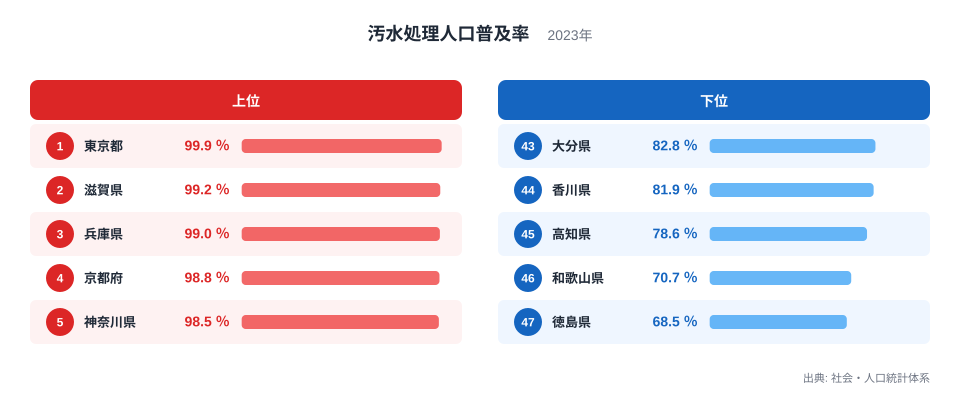
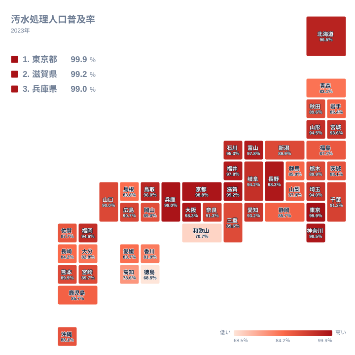

家庭から出る排水がどこまできちんと処理されているかは、住んでいる県によって大きく異なります。2023年の汚水処理人口普及率を都道府県別に見ると、最も高い東京都で99.9％、最も低い徳島県で68.5％となっており、同じ日本の中でもインフラの整備状況に開きがあります。この記事では、社会・人口統計体系による2023年のデータを使い、なぜ東京都や滋賀県が上位を占めているのか、そして四国で普及率が低くなる背景を読み解いていきます。

> [!NOTE]
> 汚水処理人口普及率とは、下水道や農業集落排水施設、浄化槽などによって汚水が適切に処理されている人口の割合を示す指標です。トイレが水洗であるかどうかだけでなく、その排水がきちんと処理施設につながっているかまでを含めた数値です。

## 汚水処理人口普及率の全国順位 - 東京都と滋賀県が上位の理由

2023年の汚水処理人口普及率で全国1位となったのは東京都で、99.9％というほぼ完全に近い普及率になっています。2位は滋賀県の99.2％、3位は兵庫県の99％、4位は京都府の98.8％、5位は神奈川県の98.5％と続いています。東京都のような大都市圏では人口密度が高く、下水道を面的に整備しやすいことが高い普及率につながっていると考えられます。東京都のほかの統計は[東京都のデータ](/areas/13000)から確認できます。

<source-link href="/ranking/sewage-treatment-coverage-rate">汚水処理人口普及率ランキングをもっと見る</source-link>

2位の滋賀県が99.2％という高い水準にあるのは、単純な都市規模だけでは説明できません。滋賀県は日本最大の湖である琵琶湖を抱えており、水質を守るために下水道整備を積極的に進めてきた歴史があります。[仮説] こうした継続的な投資が、大都市圏に匹敵するほど高い普及率につながっている可能性がありますが、具体的な投資額や整備の推移までは今回のデータからは確認できません。滋賀県の統計は[滋賀県のデータ](/areas/25000)から確認できます。6位の長野県は98.3％、7位の大阪府も98.3％、8位の富山県は97.8％、9位の福井県も97.8％、10位の北海道は96.5％となっており、上位10県には人口の多い都市圏と、水環境保全に力を入れてきた県の両方が並んでいます。

## 最下位グループは四国と近畿南部に集中 - 徳島・和歌山・高知の共通点

下位に目を向けると、47位の徳島県は68.5％、46位の和歌山県は70.7％、45位の高知県は78.6％、44位の香川県は81.9％、43位の大分県は82.8％となっており、四国4県のうち3県と、近畿・九州の一部が下位グループを占めています。

地図で見ると、普及率が低い地域は四国と紀伊半島南部に集中しており、山がちな地形と人口の分散が下水道整備を難しくしている様子がうかがえます。徳島県や和歌山県は、平地が少なく集落が山間部や海岸沿いに点在しているため、下水道のような面的なインフラを効率よく整備しにくい地理的な条件があります。この指標は下水道だけでなく浄化槽による処理も含めた合計値なので、下水道が引かれていない地域でも浄化槽が行き渡っていれば数値は上がります。それでも下位にとどまるということは、どの方式でも処理されていない世帯が残っていることを意味します。

大分県は43位82.8％で、こちらも山間部を多く抱える九州の県です。人口が県内の一部の都市に集中し、それ以外の地域が広く山間部に分散している県では、下水道を面的に整備するための費用対効果が下がりやすく、結果として普及率が伸び悩む傾向があると考えられます。

> [!WARNING]
> 浄化槽による処理はこの数値に含まれているため、「下水道が引かれていないだけで実際は処理されている」という読み替えはできません。数値が低い県では、いずれの方式でも処理されていない人口がその分だけ残っています。また分母は人口であって面積や世帯数ではないので、人口の少ない山間部にどれだけ未整備地域が広がっていても、普及率にはその人口分しか反映されません。

## 上位と下位の差から見えること

東京都の99.9％と徳島県の68.5％を比べると、はっきりとした開きがあることが分かります。とりわけ45位の高知県が78.6％であるのに対し、46位の和歌山県は70.7％、47位の徳島県は68.5％と、下位3県の中でも一段低い水準に落ち込んでおり、四国・近畿南部の一部の県で整備が特に遅れていることが読み取れます。上位に人口密集地の東京都だけでなく、滋賀県のような環境保全型の投資を続けてきた県が入っている点も、この指標が単純な都市化の度合いだけで決まるものではないことを示しています。

上位10県の顔ぶれをあらためて見渡すと、6位の長野県と7位の大阪府がどちらも98.3％、8位の富山県と9位の福井県がどちらも97.8％となっており、都市圏と地方圏の県が交互に近い水準で並んでいます。長野県や富山県、福井県は大都市圏ではありませんが、比較的平地が広く人口が分散しすぎていないため、下水道や集落排水施設の整備が進めやすかった地域だと考えられます。一方、四国4県のうち香川県だけが44位81.9％と踏みとどまっている点も見逃せません。[仮説] 香川県は瀬戸内海に面した平地が多く、徳島県や高知県のような山がちな地形とは条件が異なることが、普及率の差につながっている可能性がありますが、この点は地形統計と合わせたさらなる確認が必要です。

> [!TIP]
> 汚水処理人口普及率を読むときは、都市化の度合いだけでなく、地形や集落の分布といった地理的な条件も合わせて考えると、地域差の背景が理解しやすくなります。

インフラに関するほかの統計は[同じカテゴリの統計一覧](/category/infrastructure)からまとめて確認できます。

## まとめ

- 1位は東京都で99.9％となっており、滋賀県、兵庫県、京都府、神奈川県が上位に続いています
- 最下位は徳島県の68.5％で、和歌山県、高知県、香川県、大分県が下位グループに続いています
- 上位には大都市圏の東京都だけでなく、琵琶湖の水質保全に力を入れてきた滋賀県も入っています
- 下位グループは四国と紀伊半島南部に集中しており、地形と集落の分散が整備を難しくしていると考えられます
- この指標は下水道だけでなく浄化槽や農業集落排水施設による処理も合算した数値です

## データ出典

出典: 社会・人口統計体系（総務省統計局）。2023年のデータです。
