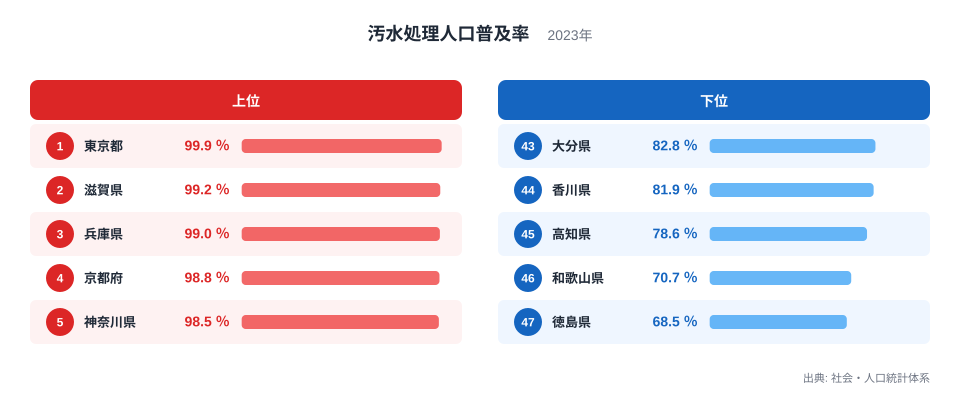
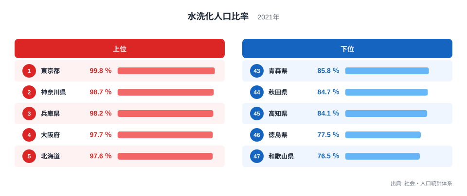
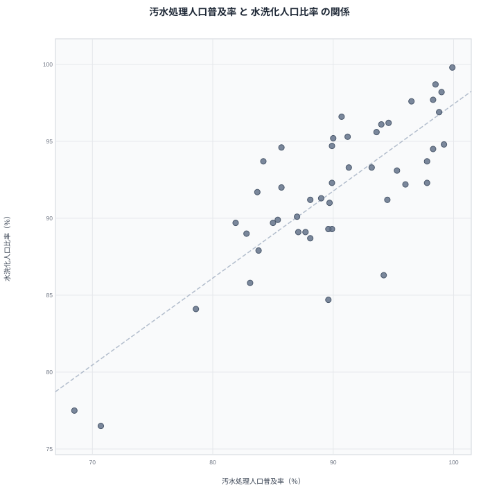

汚水処理人口普及率が高い県では、水洗トイレを使う人の割合も自然と高くなりそうです。実際にこの2つの指標には強い関係が見られますが、都道府県別に細かく見ていくと、必ずしも順位がぴったり一致しているわけではありません。この記事では、2023年の汚水処理人口普及率と2021年の水洗化人口比率のデータを使い、2つの指標がどこまで連動していて、どこでズレが生じているのかを読み解いていきます。

> [!NOTE]
> 汚水処理人口普及率は、下水道や農業集落排水施設、浄化槽などによって汚水が処理されている人口の割合です。一方の水洗化人口比率は、水洗トイレを使用している人口の割合を示す別の調査による指標で、集計の対象年も異なります。似た概念を扱う指標ですが、同一の調査から算出されたものではありません。

## 汚水処理人口普及率ランキング - 東京都と近畿圏が上位

2023年の汚水処理人口普及率で全国1位となったのは東京都で、99.9％というほぼ完全に近い普及率になっています。2位は滋賀県の99.2％、3位は兵庫県の99％、4位は京都府の98.8％、5位は神奈川県の98.5％と続いており、近畿圏と首都圏の府県が上位を占めています。東京都のほかの統計は[東京都のデータ](/areas/13000)から確認できます。

<source-link href="/ranking/sewage-treatment-coverage-rate">汚水処理人口普及率ランキングをもっと見る</source-link>

最下位の47位は徳島県で68.5％、46位は和歌山県で70.7％、45位は高知県で78.6％となっており、四国と紀伊半島南部の県が下位に並んでいます。滋賀県が2位という高い水準にあるのは、日本最大の湖である琵琶湖の水質を守るために下水道整備を積極的に進めてきた歴史があることと関係している可能性があります。滋賀県の統計は[滋賀県のデータ](/areas/25000)から確認できます。

## 水洗化人口比率ランキング - 広島県や宮城県も上位に

水洗化人口比率でも東京都が99.8％で全国1位となっており、2位の神奈川県98.7％、3位の兵庫県98.2％、4位の大阪府97.7％、5位の北海道97.6％と続いています。汚水処理人口普及率と同じく東京都や兵庫県が上位に入る一方で、6位に京都府96.9％、7位に広島県96.6％、8位に福岡県96.2％と、汚水処理人口普及率では上位に入っていなかった広島県や福岡県がここでは上位に顔を出しています。

広島県は水洗化人口比率では7位ですが、汚水処理人口普及率では21位にとどまっており、2つの指標の間に無視できないズレがあります。[仮説] これは、水洗トイレを使用していても、その排水が必ずしも下水道や浄化槽による本格的な処理を経ているとは限らないためかもしれませんが、この点は指標の定義に関するより詳しい調査が必要です。全国の水洗化人口比率は[水洗化人口比率ランキング](/ranking/flush-toilet-population-ratio)で確認できます。

## 2指標の相関を散布図で見る - 強い相関とわずかなズレ

汚水処理人口普及率と水洗化人口比率の関係を散布図にすると、右肩上がりの強い傾向が見て取れます。単純な相関係数を計算すると0.81に近い高い値になり、一方の指標が高い県はもう一方も高いという関係がはっきりと現れています。

興味深いのは、県の人口規模を統制したうえで計算した偏相関係数が0.75程度と、単純な相関係数からそれほど大きく下がらない点です。人口規模という第三の要因が両指標をつり上げているだけなら、統制した後の偏相関係数は大きく下がるはずですが、今回はそうなっていません。[仮説] これは、両指標がどちらも「排水処理インフラの整備状況」という共通の実態を測っており、人口規模というよりも指標そのものの性質が直接重なり合っているためだと考えられますが、断定するにはさらなる検証が必要です。それでも、滋賀県や広島県のように片方の指標だけが突出する県があることから、2つの指標を単純に同じものとして扱うのは適切ではありません。

上位10県をあらためて見渡すと、水洗化人口比率では9位に埼玉県96.1％、10位に宮城県95.6％が入っており、汚水処理人口普及率の上位10県には登場しない県です。埼玉県や宮城県は人口規模の大きい県ですが、汚水処理人口普及率では埼玉県が16位の94％、宮城県が17位の93.6％にとどまっており、水洗トイレの普及が先行し、下水道等による本格的な処理の整備が追いついてきている途中の県だと見ることもできます。

> [!WARNING]
> 汚水処理人口普及率は2023年、水洗化人口比率は2021年のデータであり、調査年が完全には一致していません。相関が強いからといって、一方の指標だけを見てもう一方の実態まで推測するのは避けてください。

> [!TIP]
> 散布図で全体の傾向から外れている県に注目すると、その県特有の事情が見えてくることがあります。広島県のように片方の指標だけ突出して高い県は、単純な相関だけでは説明できない要因を抱えている可能性が高い候補です。

排水・下水道に関するほかの統計は[同じカテゴリの統計一覧](/category/infrastructure)からまとめて確認できます。

## まとめ

- 汚水処理人口普及率の1位は東京都99.9％、水洗化人口比率の1位も東京都99.8％です
- 広島県は水洗化人口比率で7位の96.6％ですが、汚水処理人口普及率では21位の90.7％にとどまっています
- 2指標の単純な相関係数は0.81に近く、人口規模を統制した偏相関係数も0.75程度とあまり下がりません
- 徳島県と和歌山県は両方の指標で下位グループに入っており、四国・紀伊半島南部で整備の遅れがうかがえます
- 相関が強くても調査年が異なるため、一方の数値だけでもう一方の実態を断定しないよう注意が必要です

## データ出典

出典: 社会・人口統計体系（総務省統計局）。汚水処理人口普及率は2023年、水洗化人口比率は2021年のデータです。
