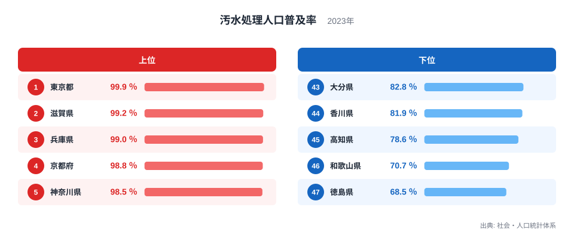
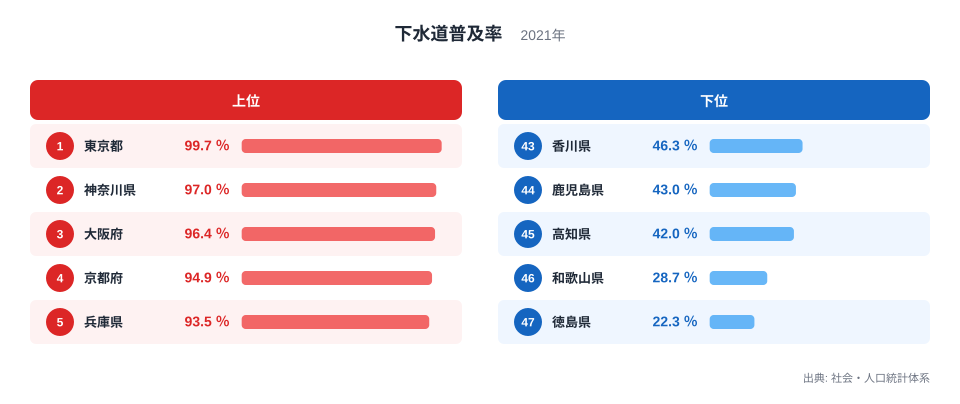
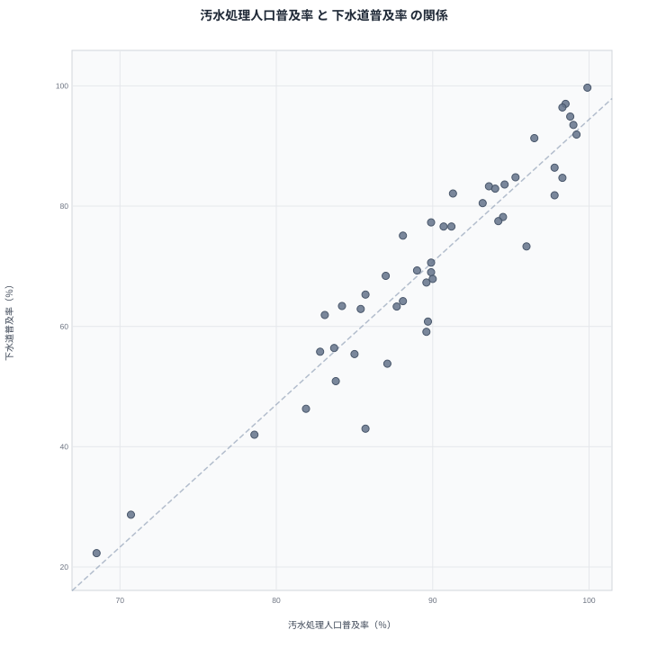

生活排水をどれだけきれいにしてから川や海に流せているかを示す指標に、汚水処理人口普及率と下水道普及率という2つの数字があります。名前が似ているため同じものだと思われがちですが、実は集計の範囲が違います。汚水処理人口普及率は下水道に加えて浄化槽や農業集落排水施設なども含めた総合的な数字で、下水道普及率はその中の下水道整備分だけを取り出した数字です。

社会・人口統計体系の2023年データによると、汚水処理人口普及率は全国で東京都が99.9パーセントと最も高く、徳島県が68.5パーセントと最も低くなっています。同じ社会・人口統計体系の2021年データでは、下水道普及率は東京都が99.7パーセントで最高、徳島県が22.3パーセントで最低です。この記事では2つの指標を重ね合わせ、どちらの数字を見るかで県の印象がどう変わるのかを探ります。

## 汚水処理人口普及率で見る上位と下位

<source-link href="/ranking/sewage-treatment-coverage-rate">汚水処理人口普及率ランキングをもっと見る</source-link>

上位には都市部と大都市圏に近い県が並びます。東京都は99.9パーセントで首位に立ち、滋賀県は99.2パーセントで続き、兵庫県は99パーセントで3位です。京都府と神奈川県もそれぞれ98パーセント台後半に位置しており、関西と首都圏の近郊県が上位を占める構図になっています。これらの地域は人口が集中しているため、下水道だけでなく浄化槽や集落排水施設の整備計画も早くから立てやすく、汚水処理施設への投資が効率的に回収できる土地柄だったといえます。

下位に目を移すと、徳島県が68.5パーセントで最も低く、和歌山県が70.7パーセント、高知県が78.6パーセントと続きます。四国と紀伊半島の南部という、山がちで集落が分散した地域が並んでいるのが特徴です。人口が広い面積に薄く散らばっている地域では、下水道のような集約型のインフラよりも、各戸に浄化槽を置く分散型の整備が現実的な選択肢になりますが、それでも整備には時間と予算がかかるため、全体の普及率としては伸び悩んでいます。

> [!NOTE]
> 汚水処理人口普及率は、下水道・農業集落排水施設・浄化槽・コミュニティプラントなど、生活排水を処理するあらゆる方式を合算した割合です。下水道の有無だけでは決まりません。

## 下水道普及率で見る上位と下位

下水道普及率でも東京都が99.7パーセントで首位を守り、神奈川県が97パーセントで2位、大阪府が96.4パーセントで3位につけています。ここまでは汚水処理人口普及率の順位とよく似ていますが、下位の顔ぶれは大きく変わります。徳島県は22.3パーセントで最下位、和歌山県は28.7パーセントで46位、高知県は42パーセントで45位です。同じ県が最下位グループに並んでいますが、下水道普及率で見ると差の開き方がずっと大きくなっています。

下水道普及率だけを見ると、徳島県は東京都のおよそ4分の1程度の水準にとどまっており、汚水処理人口普及率で見たときの穏やかな差とは印象がかなり異なります。これは、徳島県が生活排水の処理を下水道ではなく浄化槽に頼っている割合が高いことを示しています。下水道は本管を敷設する大規模な公共事業が必要で、山間部や集落が点在する地域では建設コストが跳ね上がるため、代わりに各戸で完結できる浄化槽の整備が進められてきました。

[下水道普及率ランキング](/ranking/sewerage-penetration-rate-2012on)を見ると、こうした整備方式の違いが順位の差としてはっきり表れていることが分かります。

## 2つの指標の関係を散布図で確かめる

散布図を見ると、多くの県が右肩上がりの帯の上に並んでおり、汚水処理人口普及率が高い県ほど下水道普及率も高い傾向がはっきり出ています。ただし、帯からわずかに外れる県もあり、汚水処理人口普及率では上位に近いのに下水道普及率では中位にとどまる県や、その逆のパターンも見られます。こうしたずれは、その県がどの処理方式に重点を置いてきたかという政策の選択を映しています。

この2つの指標が強く連動して見えるのは、当然のことでもあります。下水道普及率は汚水処理人口普及率を構成する要素の一つなので、下水道を増やせば汚水処理人口普及率も自動的に押し上げられる関係にあるからです。つまり相関があるからといって、両者が独立に同じ原因で動いているとは限りません。片方がもう片方を部分的に含んでいるという構造上の理由で、数値が一緒に動いて見えているだけの面もあります。

> [!WARNING]
> 散布図の右肩上がりは相関であって因果ではありません。下水道普及率は汚水処理人口普及率の内訳の一つなので、両者が連動するのは自然な結果です。「下水道を増やせば別の指標も上がる」と単純に読み替えないでください。

## なぜ集計年が違うのか

汚水処理人口普及率は2023年、下水道普及率は2021年と、この記事で扱う2つの数字は集計年がずれています。両方とも社会・人口統計体系にまとめられている数字ですが、原資料となる調査の公表周期が異なるため、最新年をそろえて比較することができません。数年のずれがあっても、県ごとの水準や順位は年をまたいで大きく動くものではないため、傾向をつかむ目的であれば大きな支障にはなりませんが、細かい年次比較をする際には注意が必要です。

[同じカテゴリの統計一覧](/category/infrastructure)には、上下水道や道路など生活インフラに関する他の指標もまとまっています。あわせて見ると、汚水処理の整備状況が地域全体のインフラ水準とどう関係しているかをより広い視点でとらえられます。

> [!TIP]
> 汚水処理人口普及率と下水道普及率のどちらか一方だけを見て地域の下水インフラを判断せず、両方をあわせて確認すると、下水道中心の整備なのか浄化槽中心の整備なのかが見えてきます。

## 上位県の内実にも違いがある

[東京都のデータ](/areas/13000)と[滋賀県のデータ](/areas/25000)を見比べると、どちらも汚水処理人口普及率と下水道普及率の両方で上位にランクインしていますが、たどってきた道のりは同じではありません。東京都は都心部から早期に下水道網を敷設してきた歴史があり、下水道普及率がそのまま汚水処理人口普及率を押し上げています。一方の滋賀県は琵琶湖の水質保全という地域固有の課題があり、下水道と浄化槽の両方を組み合わせて汚水処理人口普及率を高めてきた経緯があります。

同じ「上位県」というくくりでも、整備の中身まで見ないと実態を取り違えてしまいます。数字を比較するときは、単純な順位だけでなく、その県がどのような処理方式で普及率を積み上げてきたのかにも目を向けることが大切です。

## データ出典

- 社会・人口統計体系(2023年、2021年)
