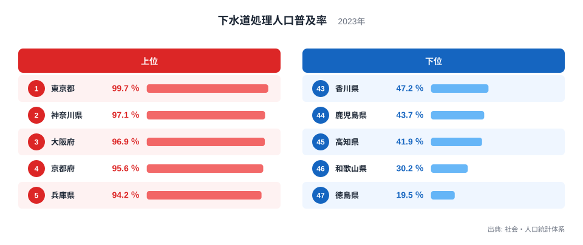
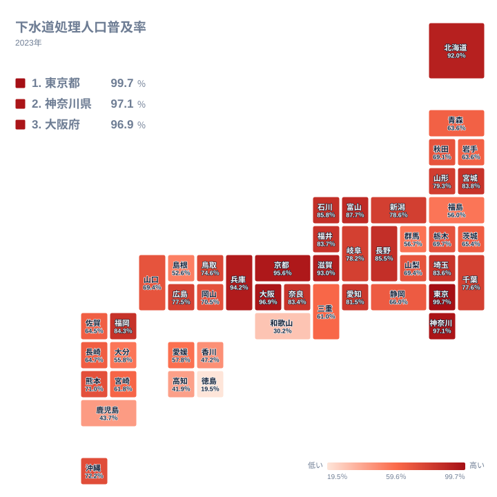

下水道処理人口普及率は、生活排水がどれだけ下水道で処理されているかを示す指標です。2023年のデータを見ると、全国順位の1位と47位の間には大きな開きがあります。東京都は普及率99.7％で全国1位となっており、ほぼすべての住民が下水道を利用できる状態です。一方で徳島県は19.5％にとどまり、全国で最も低い順位です。両者を比べると、その差は約5.1倍にもなります。

なぜこれほどまでに県ごとの差が生まれるのでしょうか。この記事では、上位と下位の顔ぶれ、地理的な分布、そして地域ごとの特徴を手がかりに、その理由を探っていきます。

> [!NOTE]
> 下水道処理人口普及率は、行政区域内の人口のうち下水道で汚水を処理している人口の割合を指します。各世帯や小規模な地区ごとに設置する浄化槽による処理は、この数値には含まれません。そのため、この普及率が低い地域が必ずしも汚水処理の取り組み全体で遅れているとは限らない点に注意が必要です。

## 普及率が高い県・低い県

<source-link href="/ranking/sewerage-coverage-rate">下水道処理人口普及率ランキングをもっと見る</source-link>

上位5県と下位5県を比べると、普及率の差がはっきりと見えてきます。上位は東京都99.7％、神奈川県97.1％、大阪府96.9％、京都府95.6％、兵庫県94.2％と、いずれも90％を超えています。下位は徳島県19.5％、和歌山県30.2％、高知県41.9％、鹿児島県43.7％、香川県47.2％と、上位とは対照的に50％を下回る県が並んでいます。

上位に並ぶ顔ぶれを見ると、近畿地方の存在感が際立ちます。大阪府は96.9％で3位です。京都府は95.6％で4位です。兵庫県は94.2％で5位です。滋賀県は93％で6位です。近畿地方の主要な府県が上位にそろって並んでいます。これらの地域は人口が密集しており、下水道管を敷く際に1人あたりの整備費用を抑えやすいという条件がそろっています。人口が集中しているほど、限られた予算で多くの住民をカバーできるため、整備が進みやすくなります。[東京都のデータ](/areas/13000)を見ると、こうした都市部での生活基盤整備の進み方がより詳しく分かります。

一方で下位に並ぶ徳島県、和歌山県、高知県、鹿児島県、香川県は、いずれも山間部や海沿いの集落が広く分散している地域です。集落が点在していると下水道管を長く敷く必要があり、1人あたりの建設費が跳ね上がります。こうした地域では下水道の代わりに、各世帯や小規模な地区ごとに設置する浄化槽による処理が選ばれる傾向があり、これが普及率の数値だけでは見えない部分になっています。

## 地理的な分布で見えてくること

全国の分布を地図で見ると、普及率の高い地域と低い地域がどのように広がっているかがよく分かります。

首都圏や近畿圏など人口が集中する地域の府県は、軒並み濃い色で示され、普及率の高さが視覚的にも確認できます。北海道も92％で7位となっており、寒冷地であっても都市部を中心に整備が進んできたことがうかがえます。富山県は87.7％で8位です。石川県は85.8％で9位です。北陸地方の県も上位に入っており、比較的コンパクトな都市構造を持つ地域で普及率が高くなりやすいことを示しています。[神奈川県のデータ](/areas/14000)でも、同様に高い普及率が確認できます。

対照的に、四国地方や南九州、紀伊半島南部といった山がちで集落が分散している地域は、地図上で薄い色にとどまっています。こうした地域では平地が少なく、下水道管を通す土木工事そのものが難しい場所も多くあります。地形の制約が、そのまま普及率の差につながっている様子が読み取れます。

> [!WARNING]
> 下水道処理人口普及率は年度末時点の数値であり、整備計画が進行している途中の状態を切り取ったものです。単純に「その県が豊かかどうか」を示す指標ではありません。また、浄化槽などの個別処理を合わせた「汚水処理人口普及率」とは別の統計であり、両者の数値をそのまま比較すると読み違いのもとになります。

## 発見: 同じ地方の中にも大きな差がある

都道府県別に見ていくと、同じ地方の中でも普及率に大きな差があることが分かります。四国地方の4県を見ると、香川県は47.2％で43位です。徳島県は19.5％で47位です。高知県は41.9％で45位です。いずれも全国平均を大きく下回っています。唯一愛媛県だけが57.8％で38位となっており、四国4県はいずれも全国平均を大きく下回る順位にまとまっています。地方全体として普及率が低い傾向が見えます。

首都圏では逆の現象が起きています。東京都が99.7％で1位、神奈川県が97.1％で2位と圧倒的な数値を示す一方、同じ関東地方の群馬県は56.7％で39位です。茨城県は65.4％で31位にとどまっています。都心部と郊外・地方部の間に、同じ関東地方であっても大きな開きがあることが分かります。

[仮説] 首都圏でこれほど差が開く背景には、都心部への人口集中が下水道整備を後押しする一方、郊外や地方部では人口密度が低く、浄化槽など個別の処理方式に頼らざるを得ない事情があると考えられます。ただし、これは数値と地理的な傾向から読み取れる推測にとどまり、各県の詳しい整備計画までは今回のデータからは確認できません。

> [!TIP]
> 下水道処理人口普及率だけを見て「その県の生活基盤整備が遅れている」と判断するのは早計です。人口密度が低い地域では、下水道よりも浄化槽の方が整備コストを抑えられる場合があります。この指標は「下水道という方式がどれだけ選ばれているか」を示すものであり、汚水処理全体の水準を測るには、浄化槽を含めた別の統計もあわせて確認する必要があります。[同じカテゴリの統計一覧](/category/infrastructure)では、関連する社会基盤の指標もまとめて見られます。

## まとめ

- 下水道処理人口普及率の全国1位は東京都で99.7％、最下位は徳島県で19.5％です
- 1位と47位の差は約5.1倍にのぼります
- 近畿地方は大阪府・京都府・兵庫県・滋賀県が上位にそろって並び、地域全体で普及率が高い傾向があります
- 四国地方は徳島県・高知県・香川県が下位に集中し、地方全体で普及率が低い傾向があります
- 同じ関東地方でも東京都・神奈川県と群馬県・茨城県の間には大きな開きがあります

## データ出典

出典: 社会・人口統計体系（2023年）
