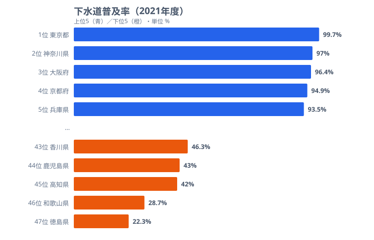

「下水道普及率が低い県は、汚水処理が遅れている」──そう思っていないでしょうか。下水道普及率を見ると、東京都は99.7%、徳島県はわずか22.3%。両者には77ポイント超の開きがあります。ところが、同じ徳島県の「水洗化率」を見ると77.5%に達します。下水道は22.3%しか通っていないのに、なぜ住民の8割近くが水洗トイレを使えるのでしょうか。この「ズレ」こそが、水インフラを読み解く鍵になります。

> [!NOTE]
> 「下水道普及率」は行政人口に対する下水道**利用可能**人口の割合。一方「水洗化率」は、下水道に加えて**合併処理浄化槽**（個別に汚水を浄化する設備）でカバーされる人口も含む。下水道普及率が低くても、浄化槽が普及していれば水洗化率は高くなる。この2つを混同すると地域の実態を読み違える。

## 下水道普及率は東京99.7%・徳島22.3%で4.5倍開く

まず下水道普及率そのものの分布を確認します。上位5県と下位5県を並べると、都市圏と地方の対比がはっきりと見えてきます。

上位は[東京都](/areas/13000)（99.7%）、神奈川県（97.0%）、[大阪府](/areas/27000)（96.4%）、京都府（94.9%）、兵庫県（93.5%）と、人口が集中する都市圏が並びます。下位は[徳島県](/areas/36000)（22.3%、全国最下位）、[和歌山県](/areas/30000)（28.7%、46位）、高知県（42.0%、45位）、鹿児島県（43.0%、44位）、香川県（46.3%、43位）で、四国・紀伊半島・九州南部に集中しています。首位の東京都と最下位の徳島県では普及率が約4.5倍も開きます。

この上下の分かれ目は、地形と人口分布でほぼ説明がつきます。下水道は管路を地中に張りめぐらせてネットワーク化する必要があるため、世帯が密集する都市部ほど1人あたりの整備コストが下がります。逆に四国山地や紀伊山地のように集落が山あいに散らばる地域では、同じ世帯数をつなぐのに何倍もの管路が要り、費用対効果が極端に悪くなります。徳島・和歌山・高知が下位に固まるのは「やる気がない」からではなく、地形そのものが下水道に不利だからです。だからこそ、これらの県では次に述べる別の仕組みが汚水処理を担ってきました。

<source-link href="/ranking/sewerage-penetration-rate-2012on">47都道府県の下水道普及率ランキングをもっと見る</source-link>

## 「下水道22%」の県でも、水洗トイレは8割が使える

下水道普及率の数字だけを見ると、徳島県（22.3%）や和歌山県（28.7%）は「住民の大半が水洗トイレを使えない」ように見えます。けれども、これは典型的な誤読です。

水洗化率（2021年、下水道＋浄化槽の合計）を並べると景色が変わります。下水道22.3%の徳島県でも、水洗化率は**77.5%**（46位）。下水道28.7%の和歌山県も水洗化率は**76.5%**（最下位）に達します。下水道普及率では77ポイント以上も離れていた徳島と東京が、水洗化率では同じ7割台に収束してくるのです。この差を埋めているのが合併処理浄化槽です。浄化槽は1戸ごとに設置でき、下水道と同等の浄化能力を持つため、管路を引けない地域の生活排水を実際に処理しています。

つまり「下水道が低い＝汚水処理が遅れている」という見立ては、下水道普及率という1つの指標だけを見たことによる錯覚です。徳島県は下水道22.3%から水洗化77.5%へと、差し引き55ポイント分を浄化槽で肩代わりしてきました。下水道という見出しの数字だけで「不衛生」と判断すると、その県が選んだもう一つの解を丸ごと見落とします。

> [!TIP]
> 下水道普及率と水洗化率の「差」が大きい県ほど、浄化槽でのカバー率が高い。徳島は下水道22.3%→水洗化77.5%で、差は55ポイント。この差分こそ浄化槽が担っている領域。「下水道が低い＝不衛生」と短絡せず、必ず水洗化率とセットで見ること。

<source-link href="/ranking/flush-toilet-population-ratio">47都道府県の水洗化人口比率ランキングをもっと見る</source-link>

## 上水道はどの県もほぼ均一──格差があるのは下水道だけ

ここで「水インフラ」のもう片方、給水側に目を向けます。下水道は最大4.5倍も開きましたが、上水道はまったく違う姿をしています。

上水道給水人口比率（2023年）は全47都道府県で88%を超え、ほぼ均一に行き渡っています。最も低い熊本県でも88.3%、次いで秋田県89.8%、大分県90.1%。トップの東京都は101.6%（流入人口を含むため100%超）です。下水道が22%から99%まで広く散らばるのに対し、上水道は88%から101%という狭い帯のなかに全県が収まります。

なぜ同じ水インフラでここまで姿が違うのでしょうか。背景には整備の「優先順位」と「タイミング」の差があります。戦後の復興期、政府はまず飲み水の安全確保を最優先し、コレラなど水系感染症を防ぐために上水道の全国整備を急ぎました。その結果、上水道は早期にほぼ全国へ行き渡りました。一方、下水道は生活排水・雨水の処理という性格上、本格化したのは高度経済成長期以降。都市部の水質汚濁が深刻化してから順に広がったため、人口が集中する大都市が先行し、地方は後回しになりました。この「数十年の出発点の差」が、給水側は均一・排水側は大格差という二系統の非対称を生んでいます。徳島県のように浄化槽で代替してきた地域は、あえて高コストの下水道に切り替える動機も乏しく、格差が固定化されやすいのです。

> [!WARNING]
> 上水道データは2023年、下水道・水洗化データは2021年で年次が異なる。給水率が100%を超える県（東京都101.6%、京都府101.5%）は、給水区域内に行政人口を上回る昼間人口・流入人口が含まれるため。上水道と下水道は「同じ水インフラ」でも整備の歴史が別で、片方が低いからもう片方も低いとは限らない。

<source-link href="/ranking/water-supply-population-ratio-2012on">47都道府県の上水道給水人口比率ランキングをもっと見る</source-link>

<ad-slot></ad-slot>

## なぜ下水道の格差は縮まらないのか

下水道整備が遅れる地域には共通の条件があります。

**人口密度の低さ**: 下水道は管路を敷設してネットワーク化する必要があるため、人口が分散した地域では1人あたりの整備コストが膨大になります。徳島県や高知県は急峻な山地が多く、集落が分散しています。

**財政力の制約**: 管路の敷設には自治体の負担が伴います。人口減少が進む地方自治体では投資回収の見通しが立たず、新規整備よりも既存施設の維持管理に予算が回ります。

**代替手段の存在**: 合併処理浄化槽は下水道と同等の水質浄化能力を持ち、個別設置できるため初期投資が少なくて済みます。下水道普及率が低い地域でも、生活排水処理そのものは浄化槽によってカバーされているのです。

全国平均で見ると、下水道普及率は2016年の78.2%から2021年の80.5%へと約2.3ポイント上昇しました。年間の改善ペースは約0.4ポイントです。80%を超えたとはいえ、残る約20%の未整備地域は人口密度が低い地域に集中しており、ここから先の底上げはコスト面で一段と難しくなります。浄化槽で十分に処理できている地域では、高コストの下水道へ無理に切り替える必然性も薄く、最下位付近の顔ぶれは今後も大きくは変わらないでしょう。

<ad-slot></ad-slot>

## 国土強靱化と水インフラの未来

2026年度から国土強靱化中期計画（事業規模20兆円超）がスタートします。柱の一つが老朽インフラの更新で、水道管路の老朽化対策も含まれます。ただし、新規の下水道整備よりも既設管路の更新や耐震化に重点が置かれる見込みで、普及率の低い地域への新規敷設が大きく進むかどうかは不透明です。

自治体の土木技術職員の減少も課題となっており、インフラを「作る」だけでなく「守る」人材の確保が求められています。

## まとめ

都道府県別の水インフラデータから、以下のポイントが浮かび上がりました。

- 下水道普及率の首位は東京都99.7%、最下位は徳島県22.3%で、約4.5倍の開きがあります。
- 下水道が最下位の徳島県でも、水洗化率は77.5%に達します。差を埋めているのは合併処理浄化槽です。
- 上水道給水人口比率は全県が88%超でほぼ均一。格差があるのは排水側（下水道）だけという非対称な構造です。
- 下水道が遅れる地域は、地形・人口密度・財政力という共通条件を抱えています。
- 全国平均は2016年78.2%→2021年80.5%と緩やかに上昇していますが、残る未整備地域の底上げはコスト面で難しくなります。

下水道は「見えないインフラ」ですが、生活の質を左右する最も基礎的な社会基盤です。普及率の格差は単なる数値の違いではなく、地形・人口密度・財政力・代替手段（浄化槽）といった複合的な要因が絡み合った結果です。今後は新規整備と老朽化対策の両面で、地域の実情に合った投資判断が求められます。

### データ出典

- 社会生活統計指標（e-Stat） -- 下水道普及率（2021年）、上水道給水人口比率（2023年）、水洗化人口比率（2021年）
