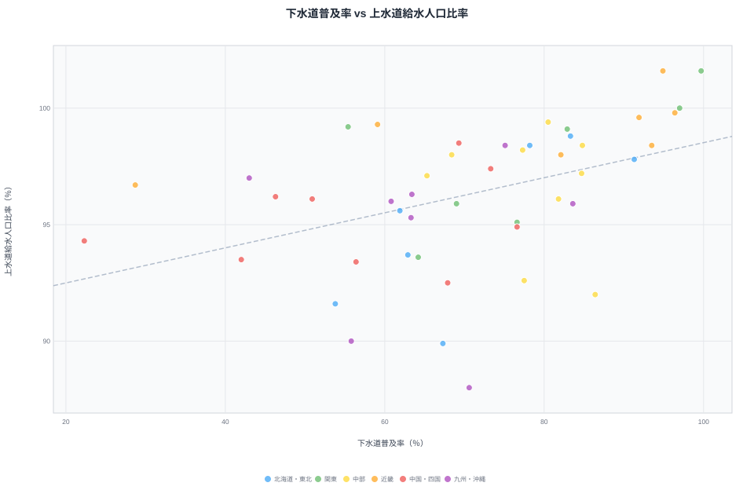
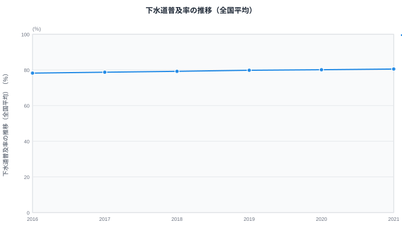
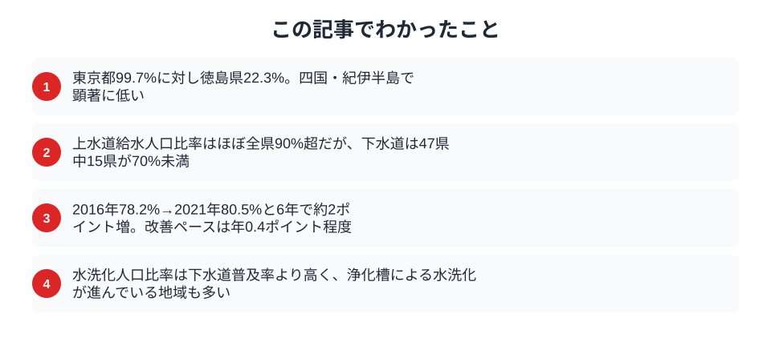

「下水道普及率が低い県は、汚水処理が遅れている」──そう思っていないだろうか。下水道普及率を見ると、東京都は99.7%、徳島県はわずか22.3%。両者には77ポイント超の開きがある。だが、同じ徳島県の「水洗化率」を見ると77.5%に達する。下水道は22.3%しか通っていないのに、なぜ住民の8割近くが水洗トイレを使えるのか。この"ズレ"こそが、水インフラを読み解く鍵だ。

> [!NOTE]
> 「下水道普及率」は行政人口に対する下水道**利用可能**人口の割合。一方「水洗化率」は、下水道に加えて**合併処理浄化槽**（個別に汚水を浄化する設備）でカバーされる人口も含む。つまり下水道普及率が低くても、浄化槽が普及していれば水洗化率は高くなります。この2つを混同すると地域の実態を読み違えます。

## 全国マップで見る下水道普及率

タイルグリッドマップを見ると、下水道普及率の地域パターンが明確に浮かび上がる。三大都市圏（東京・大阪・愛知周辺）は90%超の濃い色で塗られ、四国4県・紀伊半島（和歌山）は際立って薄い。

上位は[東京都](/areas/13000)（99.7%）、神奈川県（97.0%）、[大阪府](/areas/27000)（96.4%）、京都府（94.9%）、兵庫県（93.5%）と、人口が集中する都市圏が並ぶ。下位は[徳島県](/areas/36000)（22.3%）、[和歌山県](/areas/30000)（28.7%）、高知県（42.0%）、鹿児島県（43.0%）、香川県（46.3%）で、四国・九州南部に集中している。

<source-link href="/ranking/sewerage-penetration-rate-2012on">47都道府県の下水道普及率ランキングをもっと見る</source-link>

## 「下水道22%」の県でも、水洗トイレは8割が使える

下水道普及率の数字だけを見ると、徳島県（22.3%、全国最下位）や和歌山県（28.7%、46位）は「住民の大半が水洗トイレを使えない」ように見える。だが、これは誤読だ。

水洗化率（2021年、下水道＋浄化槽の合計）を並べると景色が変わる。下水道22.3%の徳島県でも、水洗化率は**77.5%**（46位）。下水道28.7%の和歌山県も水洗化率は**76.5%**（最下位）に達する。下水道普及率は55ポイント差でも、水洗化率では同じ7割台に収束する。差を埋めているのが合併処理浄化槽だ。

> [!TIP]
> 下水道普及率と水洗化率の「差」が大きい県ほど、浄化槽でのカバー率が高い。徳島は下水道22.3%→水洗化77.5%で、差は55ポイント。この差分こそ浄化槽が担っている領域です。「下水道が低い＝不衛生」と短絡せず、必ず水洗化率とセットで見ましょう。

散布図では、下水道普及率と上水道給水人口比率の相関は**弱い**。上水道は全都道府県で88%超とほぼ均一（縦軸のばらつきが小さい）なのに対し、下水道普及率は22%から99%まで横軸に広く分布する。東京都・神奈川県・大阪府は右上（両指標とも高）に集まるが、徳島県・和歌山県・高知県は左上（上水道は高いが下水道は低い）に位置しており、「排水だけが遅れている」という本記事の主論点をこの位置取りが視覚的に支持している。

<source-link href="/ranking/flush-toilet-population-ratio">47都道府県の水洗化人口比率ランキングをもっと見る</source-link>

## 上水道はどの県もほぼ均一──格差があるのは下水道だけ

水インフラの「給水」側、上水道給水人口比率（2023年）は全47都道府県で88%を超え、ほぼ均一に行き渡っている。最も低い熊本県でも88.3%、次いで秋田県89.8%、大分県90.1%。トップの東京都は101.6%（流入人口を含むため100%超）だ。

つまり上水道は早期に全国整備が完了し、県による差はほとんど無い。一方、下水道普及率は22.3%〜99.7%まで開く。同じ「水インフラ」でも、給水側は均一・排水側は大格差という**二系統の非対称**が、この分野の構造的特徴だ。

> [!NOTE]
> 上水道データは2023年、下水道・水洗化データは2021年で年次が異なります。給水率が100%を超える県（東京都101.6%、京都府101.5%）は、給水区域内に行政人口を上回る昼間人口・流入人口が含まれるためです。

<source-link href="/ranking/water-supply-population-ratio-2012on">47都道府県の上水道給水人口比率ランキングをもっと見る</source-link>

<ad-slot></ad-slot>

## なぜ格差は縮まらないのか

下水道整備が遅れる地域には共通の条件がある。

**人口密度の低さ**: 下水道は管路を敷設してネットワーク化する必要があるため、人口が分散した地域では1人当たりの整備コストが膨大になる。徳島県や高知県は急峻な山地が多く、集落が分散している。

**財政力の制約**: 管路の敷設には自治体の負担が伴う。人口減少が進む地方自治体では投資回収の見通しが立たず、新規整備よりも既存施設の維持管理に予算が回る。

**代替手段の存在**: 合併処理浄化槽は下水道と同等の水質浄化能力を持ち、個別設置できるため初期投資が少ない。下水道普及率が低い地域でも、生活排水処理そのものは浄化槽によってカバーされている。

### 上水道は普及したのに、なぜ下水道は遅れたのか

上水道と下水道で普及率に大きな差が生まれた背景には、整備の「優先順位」と「タイミング」がある。戦後の復興期、政府はまず飲み水の安全確保を最優先し、上水道の全国整備を急いだ。コレラなど水系感染症の防止が急務だったためだ。その結果、上水道は早期にほぼ全国へ行き渡った。

一方、下水道は生活排水・雨水の処理という性格上、整備が本格化したのは高度経済成長期以降。都市部の水質汚濁が深刻化してから順次広がったため、人口が集中する大都市が先行し、地方は後回しになった。この「数十年の出発点の差」が、上水道はほぼ均一・下水道は大きな格差という現在の非対称性を生んでいる。徳島県のように浄化槽で代替してきた地域は、あえて高コストの下水道に切り替える動機も乏しく、格差が固定化されやすい。

## 全国の下水道普及率は緩やかに上昇

全国平均で見ると、下水道普及率は2016年の78.2%から2021年の80.5%へと約2.3ポイント上昇した。年間の改善ペースは約0.4ポイント。80%を超えたとはいえ、残る約20%の未整備地域は人口密度が低い地域に集中しており、ここから先の底上げはコスト面で一段と難しくなる。

<ad-slot></ad-slot>

## 国土強靱化と水インフラの未来

2026年度から国土強靱化中期計画（事業規模20兆円超）がスタートする。柱の一つが老朽インフラの更新で、水道管路の老朽化対策も含まれる。ただし、新規の下水道整備よりも既設管路の更新や耐震化に重点が置かれる見込みで、普及率の低い地域への新規敷設が大きく進むかどうかは不透明だ。

自治体の土木技術職員の減少も課題となっており、インフラを「作る」だけでなく「守る」人材の確保が求められている。

## まとめ

都道府県別の水インフラデータから、以下のポイントが浮かび上がった。

下水道は「見えないインフラ」だが、生活の質を左右する最も基礎的な社会基盤である。普及率の格差は単なる数値の違いではなく、地形・人口密度・財政力・代替手段（浄化槽）といった複合的な要因が絡み合った結果だ。今後は新規整備と老朽化対策の両面で、地域の実情に合った投資判断が求められる。

### データ出典

- 社会生活統計指標（e-Stat） -- 下水道普及率（2021年）、上水道給水人口比率（2023年）、水洗化人口比率（2021年）
