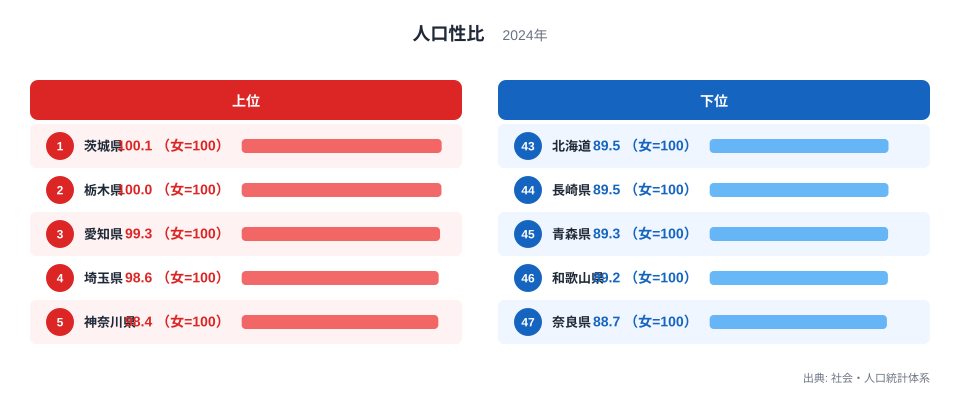
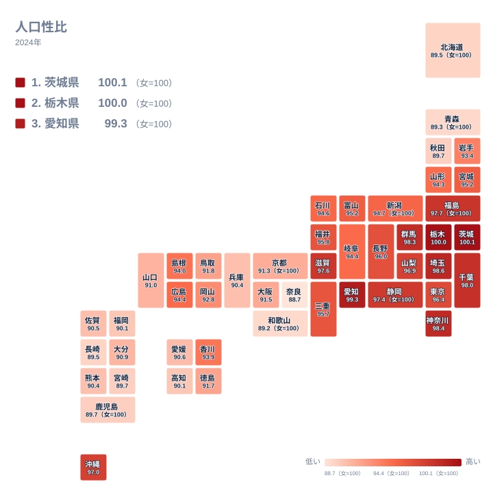

人口性比は、地域の男女構成を一つの値で表す指標です。2024年の都道府県データでは、茨城県が100.1で首位となり、100を超えています。続く栃木県は100で、男女の人数が指標上で同じ水準です。その一方で、ほかの県は100未満に並びます。ごくわずかな数値の違いに見えても、全国を並べると地域ごとの特徴がはっきり見えてきます。

この記事では、人口性比ランキングと地理分布を手がかりに、100を境にした値の意味を読み解きます。さらに、地域差について就業、進学、転居、年齢構成などの仮説を混同せず、次にどの統計を確認すべきかまで整理します。

> [!NOTE]
> 人口性比は女性を100としたときの男性の人数を示します。100.1なら女性100に対して男性100.1、100未満なら男性より女性が多い構成です。人口そのものの多さを示す値ではありません。

## 100を超えたのは茨城県だけです

<source-link href="/ranking/sex-ratio-total">人口性比ランキングをもっと見る</source-link>

上位を見ると、茨城県は100.1で首位、栃木県は100で続きます。愛知県は99.3、埼玉県は98.6、神奈川県は98.4です。上位に並ぶ県でも、茨城県と栃木県を除けば女性100に対する男性の人数は100を下回っています。ランキング上位という表現だけで「男性が多い県」と受け取ると、指標の意味を取り違えてしまいます。

下位では、奈良県が88.7、和歌山県が89.2、青森県が89.3です。長崎県と北海道はともに89.5となっています。下位の県では、女性100に対する男性の人数が上位県より少ないことが分かります。関西、東北、九州、北海道にまたがっているため、下位の並びも一つの地方だけに集中していません。

茨城県の値を詳しく見るときは、[茨城県のデータ](/areas/08000)で人口関連の指標を重ねると、単独の順位よりも地域像をつかみやすくなります。栃木県も同様に、[栃木県のデータ](/areas/09000)から別の人口指標へ進むと、100という値がどのような構成から生じているのかを考える入口になります。

ここで重要なのは、順位と100の境界を別々に見ることです。上位でも100未満なら女性のほうが多い構成であり、下位でも人口規模の大小は分かりません。最初に値の向きを落ち着いて丁寧に読み、次に県同士の位置関係を確かめると、ランキングの高低だけに引っぱられずに比較できます。

> [!WARNING]
> 人口性比は全年齢を合計した値です。出生時の男女差、世代ごとの人口差、進学や就職に伴う移動、男女で異なる寿命の影響を一つの値から分離できません。順位だけで地域の産業や暮らし方を原因と断定しない注意が必要です。

## 関東周辺の高さは地図で見えてきます

地図では、茨城県、栃木県、埼玉県、神奈川県、群馬県、千葉県が比較的高い側にまとまっています。東京都は96.4で、周辺県より低い位置です。同じ関東でも一様ではなく、中心部と周辺部をひとまとめに説明できない分布になっています。愛知県が99.3、福島県が97.7、滋賀県が97.6で上位に入るため、関東だけの現象でもありません。

一方、奈良県、和歌山県、青森県、長崎県、北海道は低い側です。さらに秋田県、宮崎県、鹿児島県は89.7で並びます。北から南まで低い県があるため、東西や寒暖といった単純な地理区分とは一致しません。上位側の関東周辺のまとまりと、下位側の広がりを分けて捉えることが、地図を読む第一歩です。

この分布は、隣接県を比べる視点の有効性も示しています。近い県なら広い地域条件をある程度共有しながら、都市への通勤圏、進学先、雇用の構成、世代別人口などの違いを検討できます。地図で似た色の県と異なる色の県を見つけ、その後に別の統計で仮説を確かめる順序が適切です。

## 産業の仮説は就業統計と照合します

上位にある県を見て、男性の就業者が集まりやすい産業が多いのではないかという仮説は立てられます。検証の入口になるのは、男女別の就業者と年齢階級別人口です。就業者の構成にも同じ傾向があれば産業との関係を調べる意味が増し、異なる傾向なら働いていない世代を含む人口構成へ目を向けられます。

東京都が96.4である点は、周辺県との比較対象になります。都市では進学や就職などに伴う転入と転出を検討できます。産業の種類に加え、居住地と勤務地の違いや、どの世代が移動したかを分けて調べると、東京都と周辺県の差を具体的な問いへ変えられます。

愛知県が99.3で上位にある一方、静岡県は97.4、三重県は95.7です。近隣県でも値は同じではありません。産業を候補に置く場合は、同じ年の就業構造を確認した後、男女別移動にも同じ地域差があるかを照合するのが次の作業です。

## 年齢構成と人口移動は順に確かめます

人口性比を読み解く次の候補は、世代の構成と地域間移動です。最初に年齢階級別の男女構成を見れば、全年齢の値が特定の世代に強く影響されているかを調べられます。その後に男女別の転入転出を見れば、進学や就職、結婚、住宅取得などの時期の移動を検討できます。

歴史的な人口移動は、現在値と過去の値を並べて扱います。人口性比の推移と世代別移動の変化が同じ時期に動いていれば、地域の産業史や都市化を調べる手がかりになります。現在の値だけではなく時系列を加えることで、長期の蓄積と直近の変化を分けて考えやすくなります。

茨城県が100.1、栃木県が100という境目にあることは、原因を考える出発点として有用です。ただし、両県の差を一つの要因に結びつけるより、年齢階級別人口、男女別の転入転出、就業構造を順に照合するほうが確実です。値が近い県同士でも内訳が同じとは限らないからです。

> [!TIP]
> まず100を基準に男性と女性のどちらが多い構成かを確認し、次に近隣県との差を地図で見ます。その後、年齢階級別人口と男女別移動を照合すると、人口性比の差を生む候補を混同しにくくなります。

## 100を基準に次の調査を決めます

人口性比ランキングでは、まず100を基準に男女構成の向きを確認します。次に、茨城県の100.1と栃木県の100を起点として、近隣県へ値がどう変わるかを地図で追います。東京都が周辺県より低いことは、都市中心部と周辺部の人口移動を比較する問いにつながります。

下位の県では、低い側の分布が特定の地方に集中しているかを確認します。そのうえで年齢階級別人口、男女別移動、就業構造の順に対象を絞れば、複数の背景を一度に混ぜずに検討できます。ランキングは県を評価する点数ではなく、追加調査の優先順位を決める入口です。

ほかの人口指標と比較するときは、[同じカテゴリの統計一覧](/category/population)から対象を選べます。年と定義をそろえたうえで、人口性比、年齢構成、移動の指標を重ねると、単独の順位では見えなかった違いを検証しやすくなります。

## データ出典

人口性比は、社会・人口統計体系の2024年データを使用しています。単位は女性を100とした値です。
