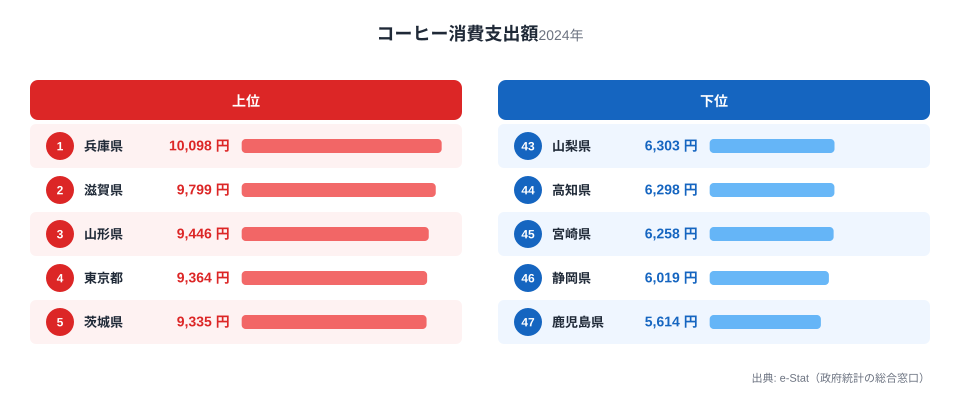
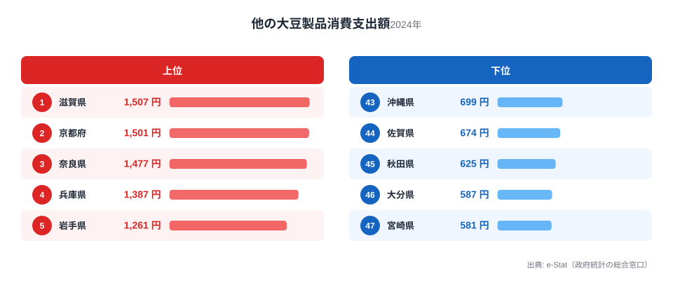
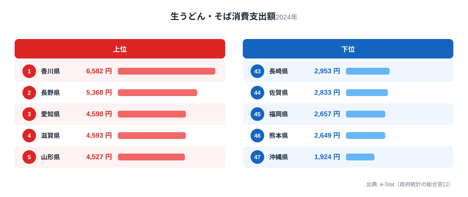
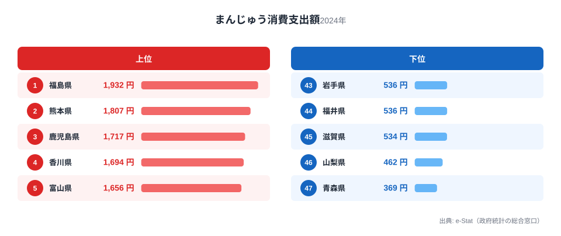
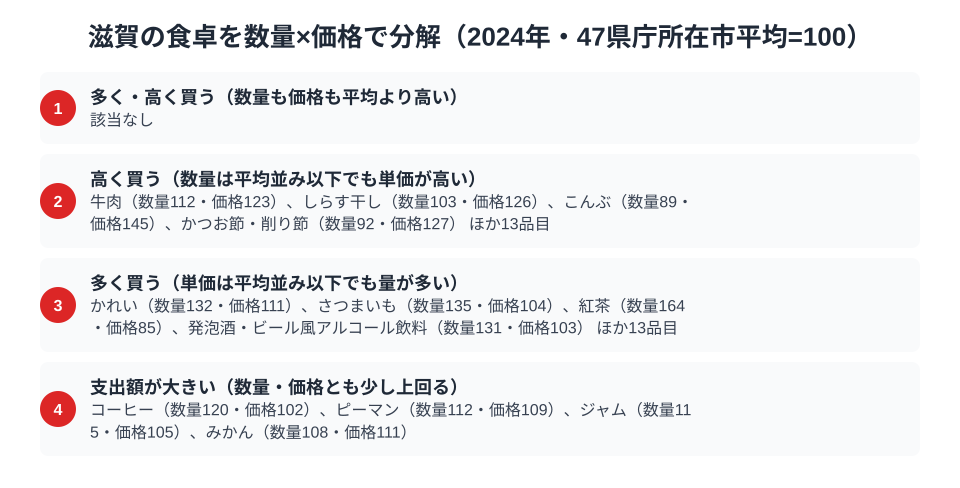

滋賀県というと近江牛や琵琶湖の魚介を思い浮かべる人が多いかもしれません。ところが総務省の家計調査（品目別）2024年で滋賀県（県庁所在市・大津市）の支出額を都道府県庁所在市ごとに比べると、目立って強いのは肉でも魚でもなく、コーヒーと大豆製品でした。

コーヒー消費支出額は全国2位の9,799円。他の大豆製品（豆腐・油揚げ・厚揚げなど）は全国1位の1,507円。生うどん・そばも全国4位の4,593円と健闘しています。その一方で、まんじゅうは45位の534円まで沈みます。この記事では家計調査の実データから、滋賀の食卓を貫く軸がどこにあるのかを探ります。近江の食文化を数字で裏づけたい人にとって、意外な発見があるはずです。

> [!NOTE]
> ここでいう「滋賀」の数値は、総務省統計局「家計調査（品目別）」における都道府県庁所在市（大津市）の二人以上世帯の年間支出額です。県全体の平均ではなく大津市の世帯を対象にした調査である点に注意してください。

## コーヒー消費支出額 — 全国2位9,799円、僅差の激戦区

<source-link href="/ranking/coffee-consumption-expenditure">コーヒー消費支出額ランキングをもっと見る</source-link>

コーヒー消費支出額は兵庫県が全国1位の10,098円で首位に立ち、滋賀県は全国2位の9,799円で僅差の2位につけています。両県の差はわずか299円です。3位は山形県の9,446円で、上位3県が僅差でひしめく激戦区になっています。最下位は鹿児島県で47位の5,614円、滋賀県との差は1.7倍あり、コーヒー消費には明確な地域差があることがわかります。

滋賀県が上位に来る背景には、京阪神への通勤・通学圏という立地が関係していると考えられます。大津市は京都市に隣接し、通勤時間帯にコーヒーを飲む生活習慣を持つ世帯が多い都市部型の消費パターンと親和性が高い地域です。喫茶店文化が根付く近隣の京都府・大阪府と生活圏が重なることも、家庭でのコーヒー消費を押し上げている一因と考えられます。

## 他の大豆製品消費支出額 — 全国1位1,507円、僅差でトップに

<source-link href="/ranking/other-soy-products-consumption-expenditure">他の大豆製品消費支出額ランキングをもっと見る</source-link>

滋賀県は他の大豆製品（豆腐・油揚げ・厚揚げなど、豆腐そのものを除く大豆加工品）で全国1位の1,507円を記録しました。2位は京都府で1,501円、3位は奈良県で1,477円と、わずか数円から30円差で近畿圏がそろって上位を占める構図です。最下位は宮崎県で47位の581円、滋賀県との差は2.6倍です。

近江地方は古くから精進料理や寺院での食文化が根付いた土地で、大豆製品を日常的に食べる習慣が受け継がれてきました。琵琶湖周辺には豆腐や油揚げを使った郷土料理も多く、京都府・奈良県という寺社の多い隣県と足並みをそろえて上位に入っている点は、単なる偶然ではなく近畿の食文化圏としての共通性を示していると考えられます。

## 生うどん・そば消費支出額 — 全国4位4,593円、麺どころに近い立地

<source-link href="/ranking/fresh-udon-soba-consumption-expenditure">生うどん・そば消費支出額ランキングをもっと見る</source-link>

生うどん・そばの消費支出額で滋賀県は全国4位の4,593円でした。首位は香川県で全国1位の6,582円、うどん県として知られる別格の存在です。2位は長野県で5,368円、3位は愛知県で4,598円と続きます。滋賀県の4,593円は3位愛知県とほぼ同水準で、僅差の4位に位置しています。最下位は沖縄県で47位の1,924円、滋賀県との差は2.4倍です。

滋賀県は讃岐（香川）のようなうどんの本場ではありませんが、近江地方には古くから小麦栽培が盛んな地域があり、生麺を家庭で調理する食習慣が根強く残っています。また東海地方（愛知・岐阜）や北陸（長野）と地理的に近く、生麺文化圏の広がりの中に位置していることも、上位に食い込む一因と考えられます。

## まんじゅう消費支出額 — 全国45位534円、和菓子どころのはずが下位に沈む理由

<source-link href="/ranking/manju-consumption-expenditure">まんじゅう消費支出額ランキングをもっと見る</source-link>

一方でまんじゅうの消費支出額を見ると、滋賀県は全国45位の534円にとどまります。首位は福島県で全国1位の1,932円、滋賀県との差は3.6倍です。最下位は青森県で47位の369円、滋賀県の534円はこれにかなり近い水準です。近江地方には「うばがもち」「姥ヶ餅」のような伝統和菓子もありますが、家計調査の「まんじゅう」という品目区分そのものへの支出は全国的に見て低調でした。

これは滋賀に和菓子文化がないことを意味するわけではなく、消費が「まんじゅう」という特定の品目区分に集中していないことを示していると考えられます。近畿圏は京都の和菓子文化の影響が強く、まんじゅうよりも他の和菓子（上位のother-japanese-sweets区分は全国5位12,580円）に支出が分散している可能性があります。品目別の集計では、地域の食文化が必ずしも単一の代表品目に現れるとは限らない点に注意が必要です。

> [!WARNING]
> 家計調査の品目別支出額は「消費量」ではなく「消費金額」です。単価の高い商品を少量買う地域と、安価な商品を大量に買う地域を同列に比較できない点に注意してください。また、この記事で取り上げた品目以外にも滋賀県が上位・下位に入る品目は多数あり、ここで紹介した4品目は近江の食文化を代表する一例にすぎません。

## 滋賀の食卓を貫くもの

コーヒー全国2位、大豆製品全国1位、生うどん・そば全国4位という3つの上位品目に共通するのは、いずれも「京阪神との近接性」から来る食文化だという点です。コーヒーは都市部型の生活習慣、大豆製品は近畿の精進料理文化、生うどん・そばは東海・北陸との中間地点という立地が、それぞれの数字を押し上げています。滋賀の食卓を貫く軸は、特定の名産品ではなく「近畿圏の食文化のハブ」としての性格にあると言えそうです。

同じ近畿・北陸の食文化圏では、[福井県民の食卓](/blog/fukui-food-culture)も生うどん・そば消費が上位に入るなど共通する傾向が見られます。麺文化圏の広がりを比較して読むと、地理的な食文化のつながりがより見えてきます。

> [!TIP]
> 滋賀県は今回取り上げた4品目すべてで、隣接する京都府・奈良県・福井県のいずれかと近い順位・僅差の値を記録しています。これは滋賀単独の食文化というより、近畿・北陸の複数の食文化圏が重なり合う「交差点」に位置していることの表れと読めます。単県のランキングだけでなく、隣県との差の小ささに注目すると、地理的な食文化の連続性が見えてきます。

## 数量×価格で分解する大津市の食卓

<source-link href="/ranking/coffee-consumption-quantity">コーヒー消費量ランキングをもっと見る</source-link>

ここまで見てきた支出額のランキングだけでは、滋賀県が「たくさん食べている」のか「単価の高いものを買っている」のかまでは分かりません。家計調査には支出額だけでなく数量を集計している品目もあり、両方をそろえると支出額を数量と価格の掛け算に分解できます。47都道府県庁所在市の平均をそれぞれ100として品目ごとに数量指数と価格指数を出すと、滋賀の食卓がどちらの理由で膨らんでいるのかが見えてきます。上の図は対象125品目のうち、指数が平均を大きく上回る品目を4区分にまとめたものです。

平均より量を多く買っている品目の代表が、かれい（数量指数132・価格指数111）、さつまいも（数量指数135・価格指数104）、紅茶（数量指数164・価格指数85）、発泡酒・ビール風アルコール飲料（数量指数131・価格指数103）です。いずれも価格指数は平均並みかそれ以下で、支出額を押し上げているのは単価ではなく購入量そのものだと読めます。先ほど紹介した生うどん・そばの支出額の高さも、同じ構造で説明できます。数量指数は129、価格指数は95で、単価はむしろ平均より安いのに量を平均より3割近く多く買っていることが支出額を押し上げています。地元で麺を打つ・打ってもらう食習慣が、まず「量」として数字に表れていると考えられます。

対照的に、価格指数が平均を大きく上回るのに数量はさほど変わらない品目もあります。牛肉（数量指数112・価格指数123）、しらす干し（数量指数103・価格指数126）、こんぶ（数量指数89・価格指数145）、かつお節・削り節（数量指数92・価格指数127）がこれにあたり、量ではなく単価の高さが支出額を押し上げています。ここでコーヒー消費量を見ると、滋賀県の数量指数は120、価格指数は102です。どちらも平均をわずかに上回る程度で、牛肉やこんぶほど単価が突出しているわけではありません。コーヒー消費支出額が全国2位まで伸びているのは、極端に高い豆を買っているからというより、量をやや多めに買う習慣が積み重なった結果と読むほうが近いと言えそうです。

> [!TIP]
> 支出額の順位だけを見ると「その品目が好きな県」のように見えますが、数量指数と価格指数に分けると理由が変わります。コーヒーやかれい・さつまいも・紅茶のように支出額が伸びる品目でも、単価が高いのか、量を多く買っているのかで背景が違います。生うどん・そばのように支出額の割に価格指数が平均以下の品目は、量の文化が先にあると読めます。

> [!NOTE]
> ここでの数量指数・価格指数は「47都道府県庁所在市の単純平均＝100」を基準にした相対値で、家計調査の全国値とは一致しません。また価格指数は支出額を数量で割って逆算した値なので、同じ品目でも高いブランドや品種を選んでいる場合も指数を押し上げます。純粋な店頭価格の違いだけを表すわけではない点に注意してください。他の大豆製品やまんじゅうは支出額の統計はあっても数量の統計が家計調査に無いため、この分解の対象外です。二人以上世帯・大津市の年間集計という前提は、記事全体の他の数値と共通です。

## まとめ

- コーヒー消費支出額は全国2位9,799円（1位兵庫県10,098円とは僅差）
- 他の大豆製品（豆腐・油揚げ等）は全国1位1,507円（近畿圏が上位を独占）
- 生うどん・そばは全国4位4,593円（うどん県・香川に次ぐ健闘）
- まんじゅうは全国45位534円と大きく沈み、和菓子文化は他品目に分散している可能性
- 滋賀の食卓は特定の名産品よりも「京阪神・東海・北陸の交差点」という立地の反映と考えられる

滋賀県の地域プロフィールは[滋賀県のページ](/areas/25000)、家計・所得に関する他の指標は[経済カテゴリ一覧](/category/economy)で確認できます。

## データ出典

総務省統計局「家計調査（品目別）」2024年、都道府県庁所在市（大津市）二人以上世帯の年間支出額。e-Stat（政府統計の総合窓口）経由で取得。
