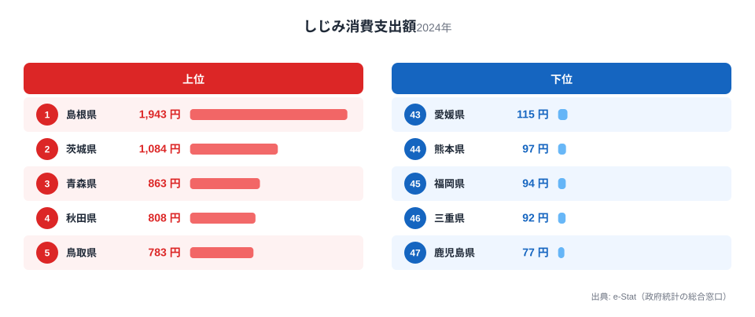
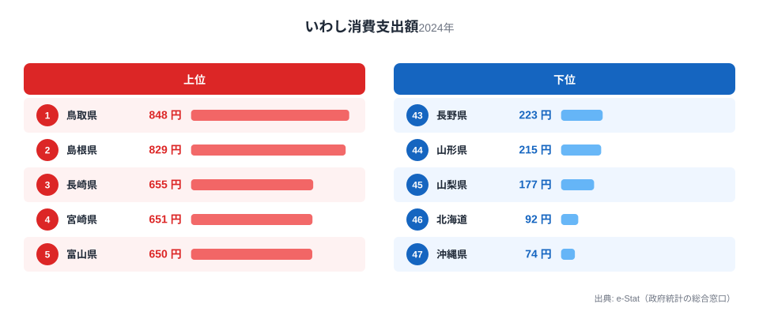
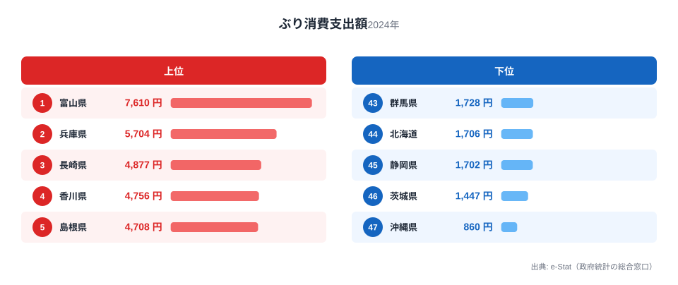
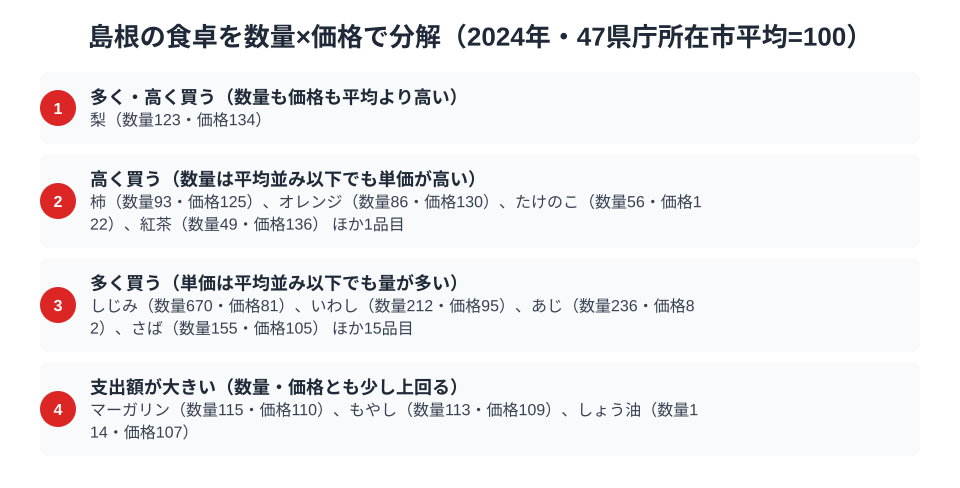

島根県の食卓を家計調査の数字でのぞくと、ある一貫した傾向が見えてきます。宍道湖のしじみ、日本海のいわし、そしてぶり。いずれも全国有数の消費支出額を記録しており、島根の家庭が「水と魚」に囲まれた暮らしをしていることが数字からくっきり浮かび上がるのです。

なぜここまで水産物に偏るのでしょうか。答えの鍵は、島根が汽水湖の宍道湖と荒々しい日本海という2つの異なる漁場を同時に持つ、全国でも珍しい地理条件にあります。この記事では総務省「家計調査」の品目別データから、しじみ・いわし・ぶりという3つの水の幸を切り口に、島根の食卓を貫く軸を探ります。

> [!NOTE]
> 本記事の数値は総務省統計局「家計調査（品目別支出額）」2024年、都道府県庁所在市（島根県は松江市）の二人以上世帯における年間消費支出額です。実際の消費量ではなく金額ベースの統計である点に注意してください。

## しじみ — 全国1位1943円、宍道湖の恵みが圧倒的

<source-link href="/ranking/freshwater-clam-consumption-expenditure">しじみ消費支出額ランキングをもっと見る</source-link>

島根県のしじみ消費支出額は年間1943円で全国1位です。2位の茨城県は1084円で、実に1.8倍の差をつけています。最下位の鹿児島県は77円で、約25倍という開きがあり、しじみが島根の食卓に定着していることが数字にはっきり表れています。

この圧倒的な差の背景には、宍道湖という国内有数のしじみ漁場の存在があります。宍道湖は海水と淡水が混じり合う汽水湖で、ヤマトシジミの生育に適した環境が広がっています。松江市の家庭では味噌汁の具として日常的にしじみを使う習慣が根づいており、単なる名産品ではなく食卓の定番として消費支出額に反映されていると考えられます。2位の茨城県も涸沼という汽水湖を抱える産地であり、しじみ消費上位県が汽水湖の有無と重なる点は興味深い構造です。

## いわし — 全国2位829円、日本海側の鮮魚文化

<source-link href="/ranking/sardine-consumption-expenditure">いわし消費支出額ランキングをもっと見る</source-link>

いわし消費支出額では、島根県は829円で全国2位につけています。首位は鳥取県で848円、島根とはわずか19円差で、両県がほぼ並んで日本海側のいわし消費を牽引している構図です。最下位の沖縄県は74円で、11倍を超える開きがあります。

隣県の[鳥取と島根の食卓を並べて見ると](/blog/tottori-food-culture)、日本海に面した山陰地方全体がいわし消費の濃い地域であることがわかります。いわしは冷凍・加工技術が発達する以前から沿岸部で日常的に食べられてきた大衆魚で、鮮度の高いものが手に入りやすい漁港近くの地域ほど消費支出額が高くなる傾向があります。松江・鳥取両市場ともに山陰沖の好漁場に近く、新鮮ないわしが安定して食卓に上る環境がそろっている点が、両県の消費支出額を押し上げていると考えられます。

## ぶり — 全国5位4708円、日本海の寒ブリ文化圏

<source-link href="/ranking/yellowtail-consumption-expenditure">ぶり消費支出額ランキングをもっと見る</source-link>

ぶり消費支出額は4708円で全国5位です。首位は富山県で7610円、島根の1.6倍の差をつけていますが、島根も上位5県に食い込んでおり、最下位の沖縄県は860円で、5.5倍の開きがあります。

[富山のぶり文化](/blog/toyama-food-culture)ほど突出してはいないものの、島根が上位に入るのは日本海の回遊ルート上に位置することが大きな理由です。ぶりは冬になると脂が乗り、「寒ブリ」として日本海側の各地で珍重される魚です。島根の沖合も回遊ルートに近く、冬場の鮮魚として食卓に上る機会が多いことが、消費支出額を押し上げる要因になっていると見られます。しじみ・いわしと合わせ、島根の家計は「その季節にとれる地元の魚」を選ぶ傾向が強いことがうかがえます。

> [!WARNING]
> 家計調査の消費支出額は金額ベースであり、消費量そのものを示す指標ではありません。単価の高い魚種ほど支出額が実際の消費量以上に大きく見える可能性がある点に注意してください。また、しじみ料理・いわし料理として個別集計されない加工品（つくだ煮や干物など）の消費は、本記事で扱う品目別の数字には反映されていません。

## 島根の食卓を貫くもの

しじみ・いわし・ぶりの3品目を並べると、島根の食卓を貫く軸が見えてきます。それは「汽水湖と日本海という2つの異なる水域から、日常的に新鮮な水産物を取り込む食生活」です。宍道湖のしじみは淡水と海水が交わる特殊な環境の産物であり、いわしとぶりは日本海の沿岸漁業・回遊漁業の恵みです。つまり島根は、湖と海という性質の異なる2つの漁場を同時に活用できる、全国でも珍しい立地条件を持つ県だといえます。

同じ水産県でも、[富山はぶり・いか・昆布・餅と幅広い品目で1位](/blog/toyama-food-culture)を占め、[鳥取はいわしに加えて梨・かに・かれいでも1位](/blog/tottori-food-culture)を独占する「多冠型」です。それに対して島根は、しじみという唯一無二の1位品目を軸に、いわし・ぶりで僅差の上位に食い込む「集中型」の食文化を持つ点が対照的です。

> [!TIP]
> しじみが1位になった背景には汽水湖という特殊地形がありますが、いわし・ぶりの上位進出は「日本海側に面している」という地理条件だけで説明できます。つまり島根の食卓の強みは、宍道湖という固有資源と、日本海沿岸という汎用的な地の利の両方が重なっている点にあります。片方だけでは全国1位にはなりにくく、2つの水域が重なる島根だからこそ生まれた食文化のパターンだと読み解けます。

## 数量×価格で分解する松江市の食卓

<source-link href="/ranking/freshwater-clam-consumption-quantity">しじみ消費量ランキングをもっと見る</source-link>

支出額の高さだけを見ると、それが「たくさん食べているから」なのか「単価の高いものを選んでいるから」なのかは区別がつきません。家計調査の品目別データを「数量指数」と「価格指数」に分解すると、その内訳が見えてきます。指数はいずれも47都道府県庁所在市の単純平均を100とした相対値です。

しじみ消費量の数量指数は670で、平均の6倍以上を消費している計算になります。一方で価格指数は81にとどまり、平均より安い単価で買われています。松江の食卓では「高い品を少し」ではなく「安いものをたくさん」食べる形でしじみが消費されていることがわかります。いわしも同じ傾向で、数量指数は212、価格指数は95と、こちらも量で支出額を押し上げている品目です。

ぶりだけは様子が異なります。数量指数は123、価格指数は117と、どちらも平均をわずかに上回るだけで突出はしていません。それでも支出額の全国順位が5位まで上がるのは、数量と価格の両方が少しずつ平均を超え、掛け合わさった結果と考えられます。しじみ・いわしのように「量で稼ぐ」品目と、ぶりのように「量と価格の両方で少しずつ稼ぐ」品目が、松江の食卓には同居しているのです。

> [!TIP]
> 支出額の順位だけを見ていると、それが「量」によるものか「単価」によるものかは判断できません。しじみ・いわしは価格指数が平均以下でも数量指数が突出して高く、逆にぶりは数量・価格のどちらも平均を少し上回る程度です。同じ「支出額が多い」品目でも、内訳を分解すると全く違う消費パターンが隠れていることがわかります。

> [!NOTE]
> 数量指数・価格指数は47都道府県庁所在市の単純平均を100とした相対値であり、家計調査が公表する全国平均そのものではありません。価格指数は支出額を数量で割った単価をもとにした相対値なので、購入している品種やブランドの違いも反映されており、店頭価格そのものの高低を示す指標ではない点に注意してください。数値はいずれも二人以上世帯・松江市の年間値です。

## まとめ

- しじみ消費支出額は年間1943円で全国1位（2位茨城1084円の1.8倍）
- いわし消費支出額は829円で全国2位（1位鳥取848円とわずか19円差）
- ぶり消費支出額は4708円で全国5位（1位富山7610円の1.6倍）
- 3品目とも水産物で、宍道湖と日本海という2つの漁場を持つ地理条件が共通の背景にある

島根の地域プロフィールは[島根県のページ](/areas/32000)で他の指標も確認できます。家計消費や物価に関する他の統計は[経済カテゴリ一覧](/category/economy)からたどれます。

## データ出典

総務省統計局「家計調査（品目別）」2024年、都道府県庁所在市（二人以上世帯）。e-Stat（政府統計の総合窓口）経由で取得したデータをもとに作成しています。
