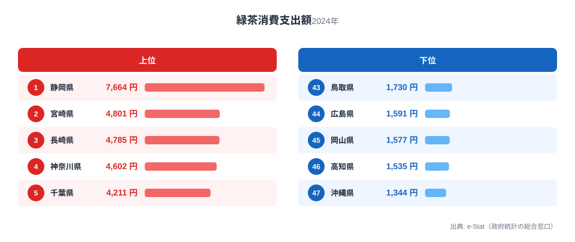
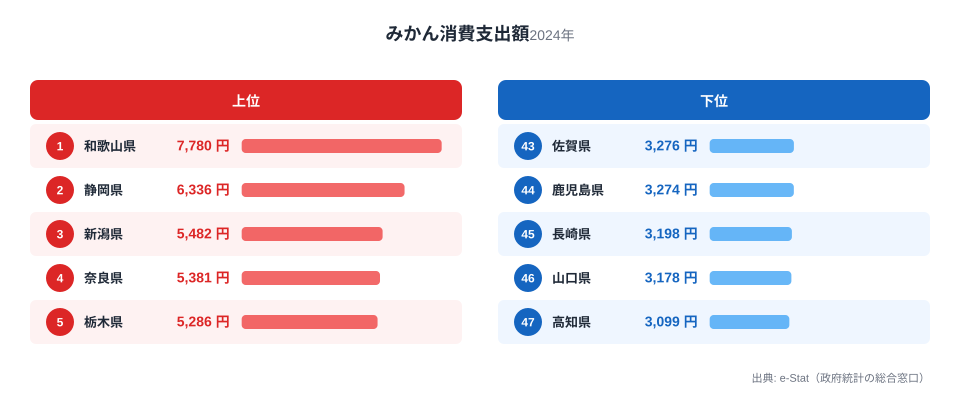

静岡県といえば、まず思い浮かぶのはお茶でしょう。実際、総務省の家計調査（品目別）で静岡市の二人以上世帯を見ると、緑茶の消費支出額は7,664円で全国1位。日本一の茶どころのイメージは数字にもはっきり表れています。

ところが静岡の食卓の実力は、お茶だけにとどまりません。まぐろの消費支出額も11,635円で全国1位、みかんも全国2位と、海の幸・山の幸のいずれでも全国トップクラスなのです。この記事では、緑茶・まぐろ・みかんという3つの品目を横断しながら、「お茶の国」というイメージを超えた静岡県民の豊かな食卓を読み解きます。

> [!NOTE]
> 家計調査の都道府県データは、県庁所在市（静岡県は静岡市）の二人以上世帯を対象にした年間支出額です。県全体ではなく静岡市在住世帯の家計簿から見た傾向であり、支出「金額」であって消費「量」そのものではない点にご注意ください。

## 緑茶 — 全国1位7,664円、日本一の茶どころ

<source-link href="/ranking/green-tea-consumption-expenditure">緑茶消費支出額ランキングをもっと見る</source-link>

静岡県の緑茶消費支出額は7,664円で全国1位です。2位の宮崎県4,801円を大きく引き離し、最下位の沖縄県1,344円と比べると5.7倍もの開きがあります。静岡は牧之原台地をはじめとする広大な茶園を抱える日本最大の茶産地であり、生産量・消費額ともに他県を圧倒しています。

静岡では、来客時はもちろん日常的にお茶を淹れて飲む習慣が深く根づいています。食事のたびに急須で緑茶を淹れる家庭が多く、茶葉そのものへの支出額が全国一という数字は、茶産地に暮らす人々の生活そのものを映し出しています。地元で良質な茶葉が手頃に手に入る環境が、家庭での消費を支えているのです。

## まぐろ — 全国1位11,635円、清水港の水揚げ

<source-link href="/ranking/tuna-consumption-expenditure">まぐろ消費支出額ランキングをもっと見る</source-link>

お茶のイメージが強い静岡ですが、実はまぐろの消費支出額も11,635円で全国1位です。2位の山梨県8,336円を上回り、最下位の大分県1,034円とは11倍以上の差があります。静岡市の清水港は、冷凍まぐろの水揚げ量で全国トップクラスを誇る「まぐろの街」です。

遠洋まぐろ漁業の基地である清水港には、世界の海で獲れたまぐろが大量に水揚げされます。地元にはまぐろ料理の専門店が集まる市場もあり、家庭でも刺身や漬け、づけ丼などでまぐろを日常的に食べる文化が根づいています。内陸県の山梨が2位に入るのも、静岡・清水港からまぐろが運ばれる流通ルートの影響と考えられ、「産地から近い地域ほどまぐろ消費が高い」という構図が見えてきます。

## みかん — 全国2位6,336円、温暖な斜面の恵み

<source-link href="/ranking/mandarin-consumption-expenditure">みかん消費支出額ランキングをもっと見る</source-link>

果物でも静岡は上位です。みかんの消費支出額は6,336円で全国2位。首位は和歌山県（1位・7,780円）で、静岡はそれに次ぐ2位につけています。静岡は三ヶ日みかんに代表される温州みかんの一大産地で、駿河湾に面した温暖な斜面がみかん栽培に適しています。

産地であると同時に消費地でもある点は、和歌山県と共通する構図です（[みかん消費支出の記事](/blog/mandarin-expenditure-ranking)で産地と消費地の関係を詳述）。地元でとれた新鮮なみかんが手頃に手に入り、冬の食卓に欠かせない果物として定着していることが、全国2位という支出額を支えています。緑茶・まぐろ・みかんと、静岡は「山の恵み」と「海の恵み」の両方で全国トップクラスに並ぶ、稀有な食の県なのです。

> [!WARNING]
> 家計調査は支出金額の調査であり、消費量そのものではありません。物価や単価の違いも金額に影響します。特にまぐろや緑茶は品質による価格差が大きいため、「支出額が高い＝量を多く消費している」とは限らない点にご注意ください。

## 静岡の食卓を貫くもの

静岡県民の食卓を貫くのは、「山と海、両方の恵みに囲まれた豊かさ」です。牧之原台地の茶、清水港のまぐろ、駿河湾に面した斜面のみかん。温暖な気候と変化に富んだ地形が、緑茶・まぐろ・みかんという性格の異なる3つの品目すべてで全国トップクラスの消費を生み出しています。

高知の「黒潮のかつお特化」、北海道の「海と大地の豊穣型」と並べると、静岡は「山の茶と海のまぐろ、両極の恵みを併せ持つ県」。ひとつの県のなかで、これほど多彩な食材が全国一・二を占める例は多くありません。

> [!TIP]
> 「お茶の県」というイメージだけで静岡を捉えると、まぐろ全国1位という一面を見逃します。県の食文化を数字で見るときは、代表的なイメージの品目だけでなく、意外な品目の順位もあわせて確認すると、その土地の地理と産業の全体像が見えてきます。

## まとめ

- 緑茶消費支出額は静岡県が全国1位（7,664円）、日本一の茶どころ
- まぐろも全国1位（11,635円）、清水港の水揚げを背景にした「まぐろの街」
- みかんは全国2位（6,336円）、首位は和歌山県（1位・7,780円）
- 山の茶・海のまぐろ・斜面のみかんと、性格の異なる3品目すべてで全国トップクラスの豊かな食卓

静岡県の他の統計は[静岡県の地域プロフィール](/areas/22000)、食品・家計消費の地域差は[経済カテゴリ一覧](/category/economy)からご覧いただけます。

## データ出典

総務省統計局「家計調査（品目別）」（2024年、都道府県庁所在市 二人以上世帯）をもとに、e-Stat（政府統計の総合窓口）経由で整備したデータを使用しています。
