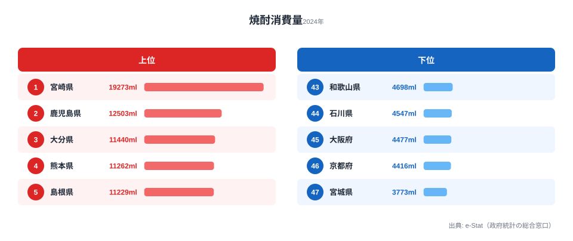

総務省「家計調査」の焼酎購入量データ(2024年・2人以上世帯1世帯あたり年間ml)を都道府県別に比較しました。1位の**[宮崎県](/areas/45000)は19,273ml**で、2位鹿児島県(12,503ml)を6,770ml引き離す圧倒的トップです。最下位の[宮城県](/areas/04000)(3,773ml)とは**5.11倍の格差**が開きました。上位は南九州を筆頭に山陰・東北・北陸・沖縄が並び、下位は[京都府](/areas/26000)・大阪・宮城など日本酒文化圏の都市部が占めます。同じ蒸留酒でも、なぜ南九州だけがこれほど突出するのか。本記事では焼酎消費の地域偏在を「気候・原料・酒造文化」の視点で読み解きます。

> [!NOTE]
> 本データは総務省「家計調査」の品目別年間支出・購入数量から得たもので、対象は各都道府県庁所在市の二人以上世帯です。家計調査の「焼酎」項目には沖縄の泡盛も含まれるため、沖縄の数値は泡盛消費を反映しています。また、県全体の平均ではなく「県庁所在市の世帯」の購入量であり、外食・飲食店での消費は含まれません。

## 宮崎が鹿児島を6,770ml差で独走、最下位は宮城

まず上位5県と下位5県を見てみましょう。1位は宮崎県（19,273ml）で、2位鹿児島（12,503ml・1位比64.9%）を6,770ml引き離します。続いて大分（11,440ml）・熊本（11,262ml）・島根（11,229ml）が並び、下位は宮城（3,773ml・47位）・京都（4,416ml・46位）・大阪（4,477ml・45位）・石川（4,547ml・44位）・和歌山（4,698ml・43位）が占めます。

<source-link href="/ranking/shochu-consumption-quantity">焼酎消費量ランキングをもっと見る</source-link>

上位の地域分布が鮮明です。**南九州4県(宮崎・鹿児島・大分・熊本)が1〜4位を独占**し、5位以下にも山陰(島根)・東北(秋田10,845ml・青森10,554ml)・北陸(富山9,062ml)・沖縄(8,890ml)といった、米焼酎・芋焼酎・蕎麦焼酎・泡盛など地酒文化の根付く地域が並びます。とくに宮崎の19,273mlは2位鹿児島(12,503ml)の約1.54倍で、芋焼酎発祥圏の中でも突出した値です。沖縄の8,890mlは家計調査の「焼酎」項目に泡盛が含まれるための値で、地酒文化が消費量に直結する典型例といえます。

この上位グループに共通するのは、いずれも地元に蔵元を抱え、その土地の原料(芋・麦・米・蕎麦・黒糖)から造る焼酎が日常の晩酌に根づいている点です。とりわけ宮崎・鹿児島の芋焼酎圏は、焼酎を「お湯割り・水割りで毎晩飲む酒」として家庭に定着させており、ビールや日本酒よりも焼酎を主役に据える食文化が購入量の母数を押し上げていると見られます。観光や贈答ではなく、家計の定常的な購入として焼酎が組み込まれていることが、19,273mlという他県の2〜5倍に達する数字の背景にあります。

> [!TIP]
> 上位に東北(秋田・青森)や北陸(富山)が入る点は意外に見えますが、これらは米焼酎の産地です。同じ「焼酎」でも原料は南九州の芋とは異なります。地図上で離れた地域が並ぶときは、原料の自給と地元蔵元の流通圏という共通項で読むと地域パターンが見えてきます。

## 最下位グループ：京都・大阪・宮城は4,000ml前後

最下位は宮城県（3,773ml・1位比19.6%）で、京都府（4,416ml・46位）・大阪府（4,477ml・45位）が続きます。いずれも1位宮崎の2割前後にとどまります。

最下位の宮城県(3,773ml)は1位宮崎の約**5分の1**で、家計1世帯あたり年間で15Lを超える差があります。京都・大阪・宮城に共通するのは**日本酒の生産・消費が伝統的に強い地域**であることです。宮城は浦霞・一ノ蔵などの清酒蔵元を擁し、[京都府](/areas/26000)は伏見の酒どころ、大阪は近畿の日本酒消費圏に位置します。家庭の晩酌で日本酒やビールが選ばれやすく、焼酎が「もう一つの選択肢」になりにくい構造が、購入量の低さに表れています。

注目すべきは、下位グループが必ずしも「酒を飲まない地域」ではない点です。これらの都市部は外食頻度が高く、飲食店での飲酒比率も大きいと考えられます。家計調査が捉えるのはあくまで家庭での購入量なので、居酒屋で焼酎ハイボールやサワーを飲む消費は数字に乗りません。つまり下位グループの低さは「焼酎を飲まない」ことの直接の証拠ではなく、「家庭で焼酎の瓶を買う習慣が薄い」ことを示していると解釈するのが正確です。

> [!WARNING]
> 家計調査は各都道府県庁所在市の世帯を対象としており、県全体の消費傾向を完全に代表するわけではありません。特に宮崎県の場合、宮崎市以外の農村部では焼酎消費がさらに高い可能性があります。また家庭での購入量データのため、居酒屋・飲食店での消費は含まれません。年によって順位は変動することがあります。

## 焼酎消費は「気候・原料・酒造伝統」の三層で決まる

**[仮説] 焼酎消費量の地域偏在は、(1)蒸留酒に適した温暖湿潤な気候、(2)芋・米・蕎麦・黒糖など原料の自給、(3)地元酒造の流通圏という三つの要因が重なる地域で高くなる**という見立てが立てられます。宮崎・鹿児島の芋焼酎、大分・熊本の麦/米焼酎、島根の蕎麦焼酎、秋田・青森の米焼酎、沖縄の泡盛はいずれも地場原料と蔵元を持ちます。一方、京都・大阪・宮城は清酒文化が確立されており、家庭の晩酌に焼酎が入り込む余地が小さいと考えられます。

この仮説は、清酒との「住み分け」を予測します。日本酒文化が強い地域ほど焼酎の家庭消費が低い、という負の相関が成り立つなら、酒類の地域差は「総量の多寡」ではなく「どの酒を主役に据えるか」という選好の地図として読めるはずです。検証は次の手順で行います。

- 清酒消費量との負の相関を確認: `/ranking/sake-consumption-quantity` と本データのスピアマン順位相関を算出
- 期日: 2026-06末までに相関係数 < -0.4 であれば仮説支持、|r| < 0.2 なら棄却して次仮説(可処分所得・年齢構成)を検証

宮崎が他県を1.54倍以上引き離す要因も「県内蔵元数の多さ + 焼酎を晩酌の主役にする食文化」の積と見られますが、本記事の範囲では断定せず継続観察とします。地域ごとの所得や世帯人員、高齢化率も飲酒量に影響しうるため、単一の原因に帰着させず複数の交絡要因を踏まえて読むことが大切です。

## まとめ

- 1位**宮崎県は19,273ml**、2位鹿児島(12,503ml)を6,770ml差で独走
- 最下位は**宮城県3,773ml**、宮崎との**格差5.11倍**
- 上位は**南九州4県 + 山陰・東北・北陸・沖縄**で構成され、地酒文化圏と一致
- 下位は**京都・大阪・宮城**など日本酒文化が強い都市部・東北南部
- 焼酎消費は気候・原料・酒造伝統の三層が重なる地域で高い([仮説]、清酒消費との負相関で検証予定)

## データ出典

- 総務省統計局「家計調査(2人以上の世帯)」2024年・1世帯あたり年間購入量(焼酎、ml)
- e-Stat 経由で都道府県別に整備

本記事の対象データ: [関連カテゴリ](/category/economy)
