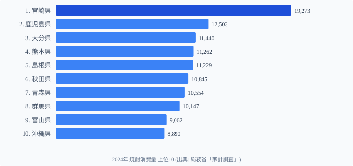

総務省「家計調査」の焼酎購入量データ(2024年・2人以上世帯1世帯あたり年間ml)を都道府県別に比較した。1位の**[宮崎県](/areas/45000)は19,273ml**で、2位鹿児島県(12,503ml)を6,770ml引き離す圧倒的トップ。最下位の[宮城県](/areas/04000)(3,773ml)とは**5.11倍の格差**が開いた。上位は南九州を筆頭に山陰・東北・北陸・沖縄が並び、下位は[京都府](/areas/26000)・大阪・宮城など日本酒文化圏の都市部が占める。本記事では焼酎消費の地域偏在を「酒造文化」の視点で読み解く。

> [!NOTE]
> 本データは総務省「家計調査」の品目別年間支出・購入数量から得たもので、対象は各都道府県庁所在市の二人以上世帯です。家計調査の「焼酎」項目には沖縄の泡盛も含まれるため、沖縄の数値は泡盛消費を反映しています。また、県全体の平均ではなく「県庁所在市の世帯」の購入量であり、外食・飲食店での消費は含まれません。

<source-link href="/ranking/shochu-consumption-quantity">焼酎消費量ランキングをもっと見る</source-link>

## TOP10：宮崎が鹿児島を6,770ml差で独走

<source-link href="/ranking/shochu-consumption-quantity">焼酎消費量ランキングをもっと見る</source-link>

1位は宮崎県（19,273ml）で2位鹿児島（12,503ml・1位比64.9%）を6,770ml引き離す。続いて大分（11,440ml）・熊本（11,262ml）・島根（11,229ml）が並び、さらに秋田（10,845ml）・青森（10,554ml）・群馬（10,147ml）・富山（9,062ml）・沖縄（8,890ml）が上位10を構成する。

TOP10の地域分布が鮮明だ。**南九州4県(宮崎・鹿児島・大分・熊本)が1〜4位を独占**し、5位以下にも**山陰(島根)・東北(秋田・青森)・北陸(富山)・沖縄**といった「米焼酎・芋焼酎・蕎麦焼酎・泡盛」など地酒文化の根付く地域が並ぶ。とくに宮崎の19,273mlは鹿児島（次点12,503ml）の約1.54倍で、芋焼酎発祥圏の中でも突出している。沖縄の8,890mlは家計調査の「焼酎」項目に泡盛が含まれるための値で、地酒文化が消費量に直結する典型例といえる。

## 最下位グループ：京都・大阪・宮城は4,000ml前後

最下位は宮城県（3,773ml・1位比19.6%）で、京都府（4,416ml・46位）・大阪府（4,477ml・45位）が続く。いずれも1位宮崎の2割前後にとどまる。

最下位の宮城県(3,773ml)は1位宮崎の約**5分の1**で、家計1世帯あたり年間で15Lもの差がある。京都・大阪・宮城に共通するのは**日本酒の生産・消費が伝統的に強い地域**であること。宮城は浦霞・一ノ蔵などの清酒蔵元、[京都府](/areas/26000)は伏見の酒どころ、大阪は近畿の日本酒消費圏に位置する。焼酎が「もう一つの選択肢」になりにくい構造が、購入量の低さに表れている。

> [!WARNING]
> 家計調査は各都道府県庁所在市の世帯を対象としており、県全体の消費傾向を完全に代表するわけではありません。特に宮崎県の場合、宮崎市以外の農村部では焼酎消費がさらに高い可能性があります。また家庭での購入量データのため、居酒屋・飲食店での消費は含まれない点にも注意が必要です。年によって順位は変動することがあります。

## 発見：焼酎消費は「気候・原料・酒造伝統」の三層で決まる

**[仮説] 焼酎消費量の地域偏在は、(1)蒸留酒に適した温暖湿潤な気候、(2)芋・米・蕎麦・黒糖など原料の自給、(3)地元酒造の流通圏という三つの要因が重なる地域で高くなる**と考えられる。宮崎・鹿児島の芋焼酎、大分・熊本の麦/米焼酎、島根の蕎麦焼酎、秋田・青森の米焼酎、沖縄の泡盛はいずれも地場原料と蔵元を持つ。一方、京都・大阪・宮城は清酒文化が確立されており、家庭の晩酌に焼酎が入り込む余地が小さい。

検証コマンド例:
- 清酒消費量との負の相関を確認: `/ranking/sake-consumption-quantity` と本データのスピアマン順位相関を算出
- 期日: 2026-06末までに相関係数 < -0.4 であれば仮説支持、|r| < 0.2 なら棄却して次仮説(可処分所得・年齢構成)を検証

宮崎が他県を1.54倍以上引き離す要因も「県内蔵元数の多さ + 焼酎を晩酌の主役にする食文化」の積と見られるが、本記事の範囲では断定せず継続観察とする。

## まとめ

- 1位**宮崎県は19,273ml**、2位鹿児島(12,503ml)を6,770ml差で独走
- 最下位は**宮城県3,773ml**、宮崎との**格差5.11倍**
- TOP10は**南九州4県 + 山陰・東北・北陸・沖縄**で構成、地酒文化圏と一致
- 下位は**京都・大阪・宮城**など日本酒文化が強い都市部・東北南部
- 焼酎消費は気候・原料・酒造伝統の三層が重なる地域で高い([仮説]、清酒消費との負相関で検証予定)

## データ出典

- 総務省統計局「家計調査(2人以上の世帯)」2024年・1世帯あたり年間購入量(焼酎、ml)
- e-Stat 経由で都道府県別に整備

本記事の対象データ: [関連カテゴリ](/category/economy)
