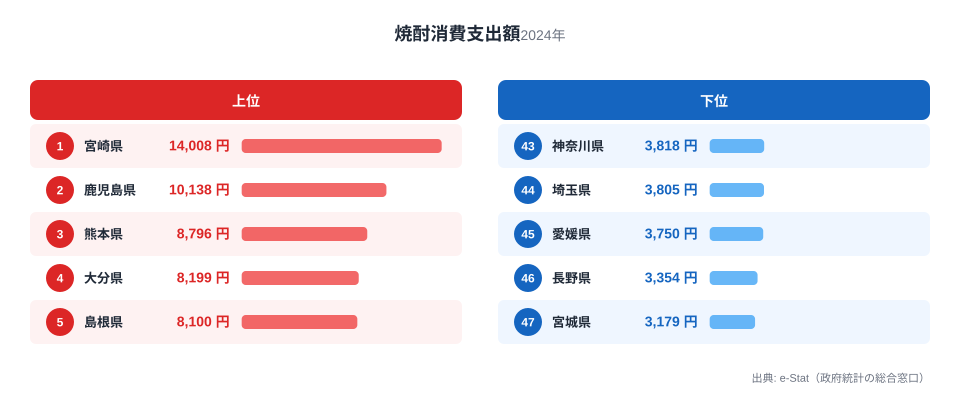
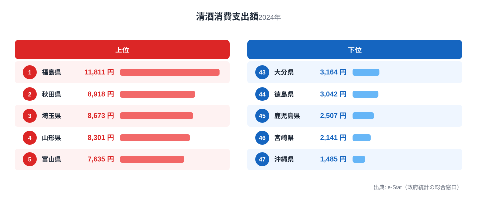

焼酎の年間消費支出額で全国1位なのは宮崎県の14,008円です。ところが同じ宮崎県を清酒の消費支出額ランキングで見ると、46位の2,141円まで沈みます。清酒1位の福島県11,811円と比べると5倍以上の差です。1つの県が「片方は日本一、もう片方はほぼ最下位」という逆転構造を見せるのは、単なる好みの違い以上の理由がありそうです。

総務省の家計調査（二人以上世帯、2024年）から、焼酎と清酒それぞれの年間消費支出額を都道府県別に並べ、どこで逆転が起きているかを見ていきます。

> [!NOTE]
> ここでの「消費支出額」は家計調査における二人以上の世帯が1年間に購入した金額（円）です。飲食店での消費や贈答用は含まれず、家庭での購入行動を反映した数値です。焼酎消費「量」（ml）とは別の指標なので、量のランキングとは順位が一致しない場合があります。

## 焼酎の消費支出額ランキング

<source-link href="/ranking/shochu-consumption-expenditure">焼酎消費支出額ランキングをもっと見る</source-link>

1位の[宮崎県](/areas/45000)14,008円を筆頭に、2位[鹿児島県](/areas/46000)10,138円、3位熊本県8,796円、4位大分県8,199円と、上位4県がすべて南九州で占められています。九州の中でも芋焼酎の産地として知られる宮崎・鹿児島は、麦焼酎中心の大分・米焼酎中心の熊本と製法は異なりますが、いずれも焼酎が食卓の定番として根付いている地域です。焼酎の消費量（ml）で見た地域差は「[焼酎は宮崎が宮城の5倍、なぜ南九州だけ突出するのか](/blog/shochu-consumption-prefecture-gap)」でも詳しく扱っています。

一方で最下位は宮城県3,179円、46位長野県3,354円、45位愛媛県3,750円と、東北や内陸・四国が下位に並びます。最大の宮崎県と最小の宮城県では4.4倍の開きがあり、支出額でも「焼酎文化圏」とそうでない地域がはっきり分かれています。

5位に島根県、6位に秋田県、7位に沖縄県が入っている点も見逃せません。南九州以外にも焼酎への支出が多い地域が点在しており、九州一極集中というより「複数の焼酎産地が並存している」という見方の方が実態に近いといえます。

## 清酒の消費支出額ランキング

<source-link href="/ranking/sake-consumption-expenditure">清酒消費支出額ランキングをもっと見る</source-link>

清酒では焼酎とまったく異なる顔ぶれが上位に来ます。1位[福島県](/areas/07000)11,811円、2位[秋田県](/areas/05000)8,918円、3位埼玉県8,673円、4位山形県8,301円、5位富山県7,635円。東北（福島・秋田・山形）と北陸（富山）が上位を占め、日本酒の名だたる酒処が並ぶ、いわば「教科書通り」の結果です。

そして最下位に沖縄県1,485円、46位宮崎県2,141円、45位鹿児島県2,507円と、焼酎ランキングの上位県がそのまま清酒ランキングの下位に沈んでいます。清酒の最大・最小倍率は8.0倍で、焼酎の4.4倍よりも地域差が大きい点も特徴です。

## 焼酎と清酒が入れ替わる構造

2つのランキングを重ねると、宮崎・鹿児島は「焼酎は日本一クラス、清酒はほぼ最下位」という完全な逆転関係にあることがわかります。反対に秋田県は、清酒2位（8,918円）でありながら焼酎でも6位（7,521円）に入っており、両方をよく飲む数少ない県です。

この逆転の背景には気候と原料があります。南九州はサツマイモの栽培に適した温暖な気候と、稲作よりも畑作が中心の土地条件を持ち、江戸期から芋焼酎づくりが根付いてきました。対して東北・北陸は良質な米と雪解け水に恵まれ、清酒の産地として発展した歴史があります。「どちらの酒が地元の産業として定着したか」が、そのまま消費支出額の逆転として表れている形です。

> [!TIP]
> 焼酎の消費支出額上位県は、単価ではなく消費数量の多さで上位に立つ「量で稼ぐ」県ばかりです。清酒3位の埼玉県のように単価の高さで支出額を押し上げている県とは対照的に、上位の顔ぶれが「高級な酒処」ではなく「地元で定着した産地」で占められている点が特徴です。

秋田県のように焼酎・清酒どちらも上位に入る県がある一方、清酒消費支出額3位の埼玉県のように地元に酒どころの歴史がなくても支出額が高い県も存在します。ただし埼玉県の清酒消費数量は15位にとどまり、後述するように支出額を押し上げているのは数量ではなく単価の高さです。産地の有無だけでは説明しきれない要因が混ざっている点は、次の数量と単価の分解で詳しく見ていきます。

> [!WARNING]
> 家計調査は都道府県庁所在地及び政令指定都市が調査対象の中心であり、都道府県全域の消費動向を完全に代表するものではありません。また年による変動があるため、単年（2024年）の数値であることに留意してください。本記事は消費側のデータのみを扱っており、産地の分布と消費額の対応は相関の指摘であって因果の検証ではありません。

## 支出額を数量と単価に分解すると

家計調査の消費支出額は「消費数量×単価」に分解できます。焼酎と清酒それぞれの消費数量（ml）を重ね合わせると、支出額ランキングだけでは見えなかった「量で稼ぐ県」と「単価で稼ぐ県」の違いが浮かび上がります。

> [!NOTE]
> ここでいう「単価」は、消費支出額（円）を消費数量（ml）で割って算出した参考値であり、家計調査が公表している指標そのものではありません。世帯によって購入する銘柄や容量はさまざまなので、実際の店頭価格を表す数値ではなく、都道府県間の相対的な傾向をつかむための目安として扱ってください。また、本章で示す全国値は47都道府県の値を単純合計・単純平均したものであり、家計調査が公表する全国平均（世帯数で重み付けされた値）とは一致しません。

47都道府県の値を単純合計すると、焼酎は消費数量35万9,119ml・消費支出額27万1,457円で、単価はおよそ0.76円/mlです。清酒は消費数量26万3,180ml・消費支出額25万9,162円で、単価はおよそ0.98円/mlと焼酎よりおよそ1.3倍高くなります。1世帯あたりの消費量でみても焼酎は清酒よりおよそ1.4倍多く、単価は逆に2割ほど安いというのが47都道府県平均でみた構図です。清酒は少ない量をやや高い単価で買う酒、焼酎はより多い量を手頃な単価で買う酒という違いが、支出額の内訳に表れています。

宮崎県の焼酎消費支出額が全国1位なのは、単価が特別高いからではありません。宮崎県は焼酎の消費数量でも全国1位で、その量は47都道府県平均の1世帯あたりおよそ7,641mlの2.5倍以上にのぼります。単価は47都道府県平均をやや下回る水準にとどまり、「量で稼ぐ」1位県だといえます。同じ構図は清酒1位の福島県にも当てはまり、福島県は清酒の消費数量でも全国1位、単価は47都道府県平均に近い水準です。別々の酒でトップに立つ2県が、どちらも単価ではなく量で首位を獲得しているのは興味深い一致です。

一方で、焼酎の消費支出額で7位の沖縄県は、消費数量でみると10位まで順位を落とします。数量の順位より支出額の順位が上がっているのは、沖縄県の焼酎の単価が47都道府県平均よりやや高いためです。[仮説] 沖縄県で流通する焼酎には泡盛など単価の高い銘柄が含まれている可能性がありますが、家計調査のデータだけでは購入銘柄までは分からず、検証には別データが必要です。

埼玉県の清酒についても、数量ではなく単価が支出額を押し上げているパターンに当てはまります。埼玉県の清酒消費数量は15位で決して多くありませんが、単価は47都道府県中でも上位に入るほど高く、宮崎県や福島県のような「量で稼ぐ」パターンとは対照的です。[仮説] 東京圏のベッドタウンとして高価格帯の清酒を選んで購入する層が一定数いる可能性がありますが、これも家計調査のデータだけでは検証できません。

さらに極端な例が清酒の沖縄県です。清酒の消費支出額・消費数量とも全国最下位ですが、単価だけは47都道府県で最も高くなっています。焼酎（泡盛を含む）を日常的に飲む沖縄県では、清酒はごく一部の人が高めの銘柄を選んで買う、特別な酒という位置づけがうかがえます。

あわせて見る: [焼酎消費量ランキング](/ranking/shochu-consumption-quantity) / [清酒消費量ランキング](/ranking/sake-consumption-quantity)

## まとめ

- 焼酎消費支出額1位は宮崎県14,008円、最下位は宮城県3,179円で4.4倍差
- 清酒消費支出額1位は福島県11,811円、最下位は沖縄県1,485円で8.0倍差
- 宮崎・鹿児島は焼酎で上位、清酒で最下位級という完全な逆転構造
- 焼酎上位は南九州（宮崎・鹿児島・熊本・大分）に加え島根・秋田・沖縄が点在
- 清酒上位は東北（福島・秋田・山形）と北陸（富山）の伝統的な酒処が中心
- 焼酎は清酒より1世帯あたりの消費量が約1.4倍多く単価は約2割安い酒で、支出額1位の宮崎県・清酒1位の福島県はどちらも消費数量でも1位という「量で稼ぐ」構図
- 清酒3位の埼玉県や清酒最下位の沖縄県は、消費量ではなく単価の高さが支出額を左右している

お酒に関する他の指標は[家計調査（品目別）の調査ハブ](/survey/kakei-chousa)からもたどれます。

## データ出典

総務省統計局「家計調査」（二人以上の世帯、2024年）を基に、e-Stat（政府統計の総合窓口）経由で整備したデータを使用しています。
