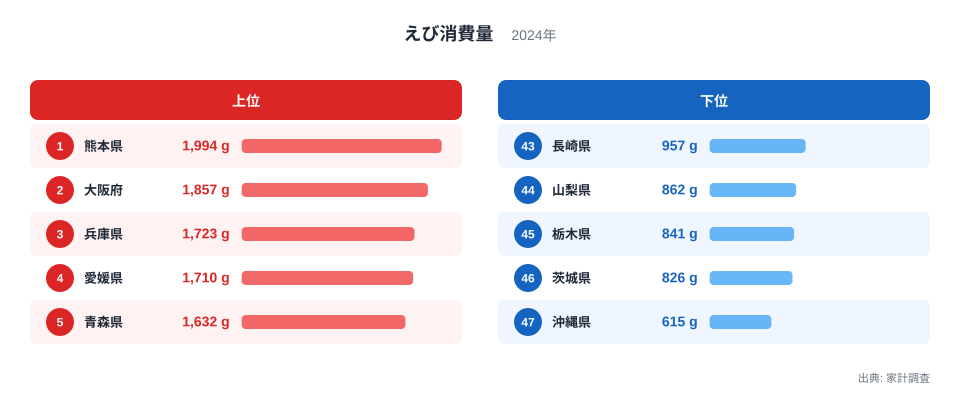
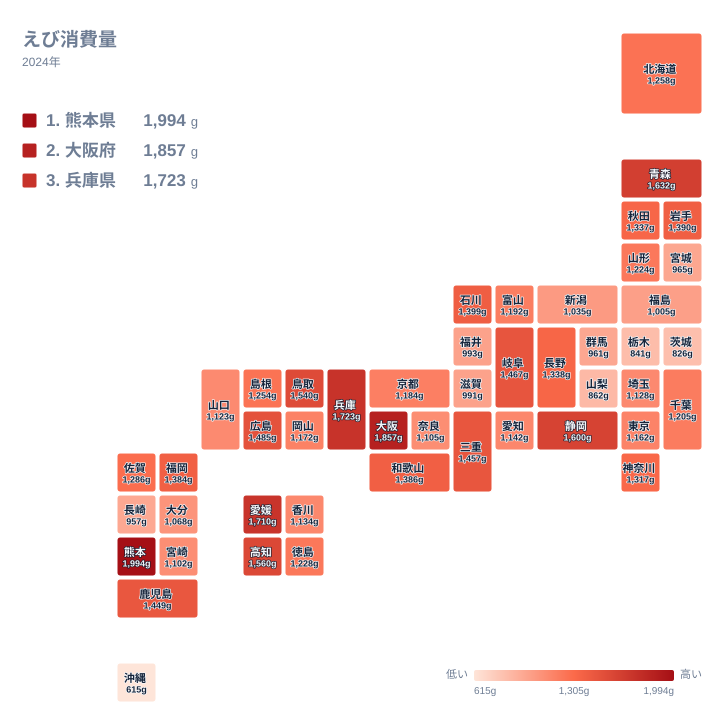

夏から冬にかけて食卓に並ぶえびですが、家庭でどれだけ買って食べているかは、都道府県によって大きく異なります。総務省の家計調査が示す2024年のえび消費量を見ると、上位の県と下位の県のあいだには、ひと目でわかるほどの開きがあります。

全国1位は熊本県で、年間の購入量は1,994グラムにのぼります。一方、最下位の沖縄県は615グラムにとどまり、同じ日本国内でありながら、家庭で買うえびの量には大きな隔たりがあることがわかります。この記事では、上位県と下位県の顔ぶれを確認しながら、なぜこれほどの差が生まれるのかを、産地や食文化の観点から読み解いていきます。

> [!NOTE]
> ここでの「えび消費量」は、家計調査で2人以上の世帯が1年間に購入したえびの量をグラムで示したものです。むきえびや冷凍のむき身も含めて集計されているため、殻付きで購入する家庭が多い地域と、むき身を中心に買う地域とでは、同じグラム数でも食卓に上る回数の感覚が異なる場合があります。

## 上位と下位に見えるえび消費量の格差

<source-link href="/ranking/shrimp-consumption-quantity">えび消費量ランキングをもっと見る</source-link>

上位5県の顔ぶれを見ると、熊本県に続いて大阪府が1,857グラムで2位、兵庫県が1,723グラムで3位、愛媛県が1,710グラムで4位、青森県が1,632グラムで5位となっています。西日本の府県が上位に並ぶ一方で、青森県のように東北の県も5位に入っており、単純に「西日本だから多い」とは言い切れない顔ぶれになっています。6位以下も静岡県が1,600グラム、高知県が1,560グラム、鳥取県が1,540グラム、広島県が1,485グラムと続いており、上位10県のほとんどを太平洋側や瀬戸内海沿岸の県が占めていることがわかります。

下位を見ると、47位の沖縄県615グラムに続いて、46位の茨城県が826グラム、45位の栃木県が841グラム、44位の山梨県が862グラム、43位の長崎県が957グラムという順に並びます。栃木県や山梨県、茨城県は海に面していない、あるいは漁港の少ない内陸寄りの県なので下位に来やすいと想像できますが、長崎県は数多くの漁港を抱える県でありながら43位にとどまっている点が目を引きます。上位と下位のあいだにある大きな差は、単なる地理的な条件だけでは説明しきれない要素を含んでいることがうかがえます。

## 地理でみるえび消費の分布

タイルマップで全国の分布を見ると、熊本県や大阪府、兵庫県、愛媛県といった西日本の府県に加えて、静岡県や高知県、鳥取県、広島県といった太平洋側や瀬戸内海沿岸の県が上位に近い色で並んでいることがわかります。これらの地域は古くから漁業が盛んで、えびを含む水産物が食卓に上りやすい土地柄だと考えられます。

一方で、10位の岐阜県は海に面していない内陸県でありながら1,467グラムと上位に近い水準にあります。同じ内陸に近い県でも、42位の群馬県は961グラム、45位の栃木県は841グラムと、順位には差が出ています。地図の上では西の県が濃く、東の内陸県が薄い傾向が見て取れますが、岐阜県のような例外があることから、消費量には海までの距離だけでなく、地域ごとの食習慣も影響していると考えられます。

> [!WARNING]
> この数値は家庭での購入量を集計したものであり、飲食店で食べたえびの天ぷらやえびフライ、コンビニの総菜として食べたえびは含まれていません。長崎県のように漁業が盛んでも家庭での購入量が少ない県は、外食や加工品として消費している可能性があり、順位だけで地域の「えび好き」の度合いを判断することはできません。

## なぜ熊本や大阪でこれほど食べられているのか

1位の熊本県は、天草地域を中心に車えびの養殖が盛んな土地として知られています。[仮説] 地元で水揚げされたえびが日常的に手に入りやすい環境にあることが、家庭での購入量の多さにつながっている可能性がありますが、この点は本データだけでは確認できず、今後の検証が必要です。[熊本県のデータ](/areas/43000)では、水産業に関連する他の指標もあわせて確認できます。

2位の大阪府は熊本県のような産地ではありませんが、天ぷらやえびフライなど、えびを使った料理が家庭でも外食でもなじみ深い土地です。江戸時代から続く市場文化を背景に、鮮魚や乾物を扱う商店が多く、えびを含む水産物が流通しやすい環境が整ってきました。[大阪府のデータ](/areas/27000)を見ると、消費に関する他の指標との関係も見えてきます。

3位の兵庫県や4位の愛媛県も、瀬戸内海に面した漁業の盛んな地域です。瀬戸内海は波が穏やかでえびの養殖や底引き網漁に適しており、こうした地理的な条件が消費量の高さに結びついていると考えられます。

> [!TIP]
> ランキングを読み解くときは、その県が実際にえびの産地かどうかも合わせて確認すると理解が深まります。地元で水揚げされる県と、遠方から仕入れて家庭で消費する県とでは、同じ順位でも背景がまったく異なります。[同じカテゴリの統計一覧](/category/economy)から、関連する消費支出の指標もあわせて確認できます。

## 内陸県でも分かれる明暗、そして沖縄が最下位である理由

順位を見ていくと、内陸県だからといって一様に消費量が少ないわけではないことに気づきます。10位の岐阜県は1,467グラムと上位に近い一方、45位の栃木県は841グラム、46位の茨城県は826グラムにとどまります。[仮説] 岐阜県では慶事や年末年始の料理にえびを使う習慣が根強く残っている可能性がありますが、この点は本データだけでは確認できず、今後の検証が必要な仮説です。

最も消費量が少ないのは、海に囲まれた沖縄県です。沖縄県は他の都道府県と異なる独自の食文化を持ち、豚肉や島野菜を中心とした料理が家庭の食卓の中心になってきました。[仮説] えびを使った料理が本土ほど日常的ではないことが、消費量の少なさにつながっている可能性がありますが、これも追加の調査が必要な仮説であり、断定はできません。

また、数多くの漁港を抱える43位の長崎県が、上位ではなく中位より下にとどまっている点も興味深い結果です。[仮説] 長崎県では、えび以外の魚介類が食卓の中心になっている可能性があり、水産業が盛んな地域だからといって、必ずしもえびの消費量が多いとは限らないことを示しています。

## まとめ

- 全国1位は熊本県で、年間のえび消費量は1,994グラムです
- 最下位は沖縄県で、615グラムにとどまります
- 上位5県は熊本県、大阪府、兵庫県、愛媛県、青森県で、西日本と瀬戸内海沿岸の府県が目立ちます
- 下位5県は沖縄県、茨城県、栃木県、山梨県、長崎県で、内陸寄りの県だけでなく漁業が盛んな長崎県も含まれます
- 10位の岐阜県のように内陸県でも上位に近い県があり、地理的条件だけでは説明できない食文化の違いがうかがえます

## データ出典

出典は総務省の家計調査です。対象年は2024年で、都道府県庁所在市および政令指定都市を対象とした2人以上の世帯における、えびの年間購入量（グラム）を集計したものです。
