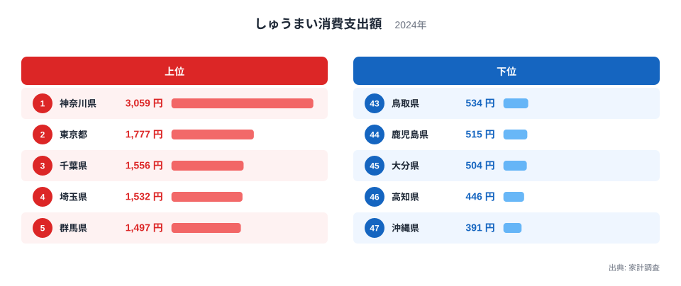
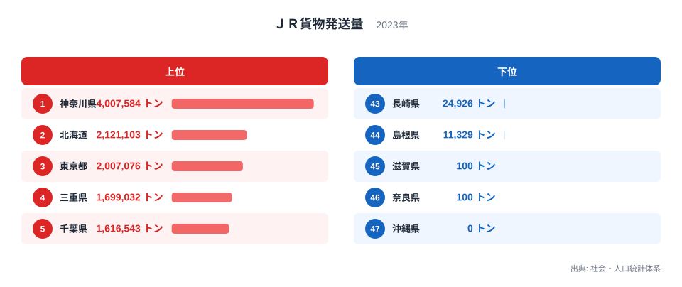
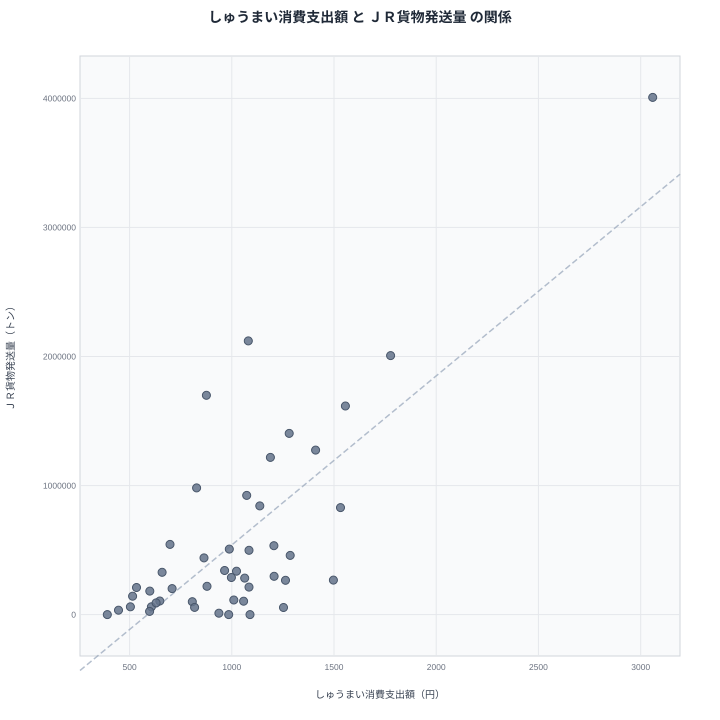

しゅうまいの消費支出額とＪＲ貨物発送量は、家庭の食卓と鉄道の物流という、一見まったく交わらない2つの世界を映す指標です。ところが2024年のしゅうまい消費支出額と2023年のＪＲ貨物発送量を都道府県別に並べてみると、驚くほど似た顔ぶれが浮かび上がります。

先に結論を示すと、しゅうまい消費支出額とＪＲ貨物発送量はどちらも神奈川県が1位、沖縄県が最下位です。この記事では、この符合が偶然の一致なのか、それとも神奈川県という地域が持つ共通の性格を映しているのかを見ていきます。

## しゅうまい消費支出額の上位と下位

<source-link href="/ranking/shumai-consumption-expenditure">しゅうまい消費支出額ランキングをもっと見る</source-link>

しゅうまい消費支出額の1位は神奈川県で3,059円です。2位は東京都で1,777円、3位は千葉県で1,556円と続きます。神奈川県の突出ぶりは際立っており、2位の東京都に1,282円の差をつけています。神奈川県は横浜発祥のしゅうまいで知られる地域であり、地元企業の商品が日常的に食卓へ並ぶ食文化が根付いています。

最下位は沖縄県で391円です。46位は高知県で446円、45位は大分県で504円と続きます。1位の神奈川県と47位の沖縄県のあいだには、2,668円という8倍近い開きがあります。

## ＪＲ貨物発送量の上位と下位

ＪＲ貨物発送量の1位は神奈川県で4,007,584トンです。2位は北海道で2,121,103トン、3位は東京都で2,007,076トンと続きます。神奈川県はここでも突出しており、2位の北海道に1,886,481トンの差をつけています。神奈川県には横浜港をはじめとする物流拠点が集積し、貨物列車の発着拠点としての役割も担っています。

最下位は沖縄県で0トンです。46位は奈良県で100トン、45位は滋賀県で100トンと続きます。1位の神奈川県と47位の沖縄県のあいだには、4,007,584トンという圧倒的な開きがあります。

## 見かけの相関と真因

散布図を見ると、しゅうまい消費支出額が多い県ほどＪＲ貨物発送量も多いという右肩上がりの傾向がはっきりと見えます。神奈川県はどちらの指標でも1位、東京都はしゅうまい消費支出額で2位、ＪＲ貨物発送量で3位と、両方の上位に位置する県が重なっています。

> [!WARNING]
> しゅうまい消費支出額とＪＲ貨物発送量の重なりは相関であって、貨物輸送が盛んだからしゅうまいを食べる、あるいはしゅうまいを食べるから貨物が増える、という因果関係ではありません。両者を結びつけている本当の要因を分けて考える必要があります。

この重なりを生んでいる要因は、実は2つの異なる背景に分かれます。まず、ＪＲ貨物発送量が多い神奈川県、北海道、東京都、三重県、千葉県といった県は、いずれも大規模な港湾や工業地帯を抱え、貨物輸送の拠点となる地理的条件を持っています。人口規模や経済規模が大きい地域ほど、貨物の発送量も自然と多くなる傾向があります。一方、しゅうまい消費支出額が神奈川県で突出しているのは、貨物輸送とは無関係に、横浜発祥のしゅうまいという地域固有の食文化が根強く残っているためです。つまり、神奈川県が両方の指標で1位になっているのは、経済規模の大きさというマクロな要因と、地元の食文化というミクロな要因が、たまたま同じ県で重なった結果だと考えられます。

## 沖縄県が最下位である構造的な理由

しゅうまい消費支出額とＪＲ貨物発送量のどちらも沖縄県が最下位になっている点には、他の県とは異なる構造的な理由があります。しゅうまい消費支出額の低さは食文化の違いによるものですが、ＪＲ貨物発送量が0トンになっているのは、沖縄県にはそもそもＪＲの鉄道路線が存在しないためです。海を隔てているという地理的な条件が、鉄道による貨物輸送そのものを不可能にしています。

> [!TIP]
> 都道府県別のデータを比較するときは、数値が0や極端に低い場合、その理由が制度や地理条件による構造的なものなのか、単なる需要の少なさなのかを見分けると理解が深まります。

## 47都道府県を俯瞰して見えること

しゅうまい消費支出額とＪＲ貨物発送量を47都道府県で並べてみると、両者を結びつけているのは食べ物と輸送という表面的な共通点ではなく、神奈川県という1つの県が持つ複数の顔だと理解できます。神奈川県は横浜港や川崎の工業地帯を抱える日本有数の物流拠点であると同時に、横浜発祥のしゅうまいという独自の食文化を育んできた地域でもあります。この2つの性格は本来まったく別々のものですが、どちらも神奈川県という同じ土地の上で育まれてきたため、統計上は同じ県が両方の指標で1位に立つという結果になっています。

もし他の指標で同じような重なりを見つけたとしても、必ずしも両者に直接的な関係があるとは限りません。むしろ、その県が持つ複数の産業や文化的な特徴が、それぞれ別々の理由で似たような順位を生み出している可能性を疑うことが大切です。

## 上位県の顔ぶれから見える別の共通点

ＪＲ貨物発送量の上位には、神奈川県のほかに北海道、東京都、三重県、千葉県といった県が並んでいます。これらの県に共通しているのは、いずれも大規模な港湾施設や工業団地を持ち、原材料や製品を大量に輸送する需要が高いという点です。一方、しゅうまい消費支出額の上位には神奈川県に続いて東京都、千葉県といった首都圏の県が並んでいますが、これは食文化が近接する地域に広がりやすいという別の理由によるものです。同じ首都圏の県が両方のランキングに顔を出す背景には、経済規模の大きさと食文化の伝播という、それぞれ独立した要因が存在しています。

## データ出典

しゅうまい消費支出額は家計調査の2024年データ、ＪＲ貨物発送量は社会・人口統計体系の2023年データを使用しています。

> [!NOTE]
> ＪＲ貨物発送量は鉄道による貨物輸送量であり、トラックや船舶による輸送は含まれません。物流全体の規模を示す指標ではなく、鉄道輸送に限定した数値である点に注意が必要です。

[ＪＲ貨物発送量ランキング](/ranking/jr-freight-shipment)や[同じカテゴリの統計一覧](/category/economy)もあわせてご覧ください。しゅうまい消費支出額とＪＲ貨物発送量の両方で1位となった[神奈川県のデータ](/areas/14000)、しゅうまい消費支出額2位の[東京都のデータ](/areas/13000)では、それぞれの県の他の指標も確認できます。
