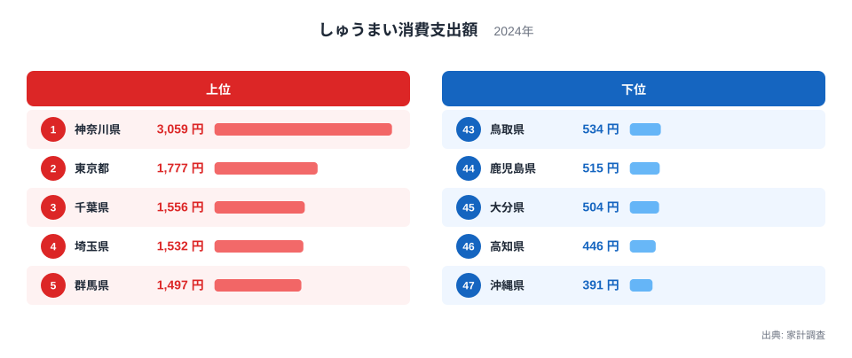
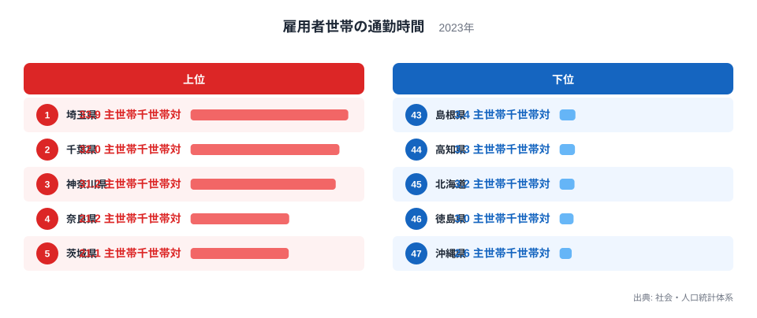
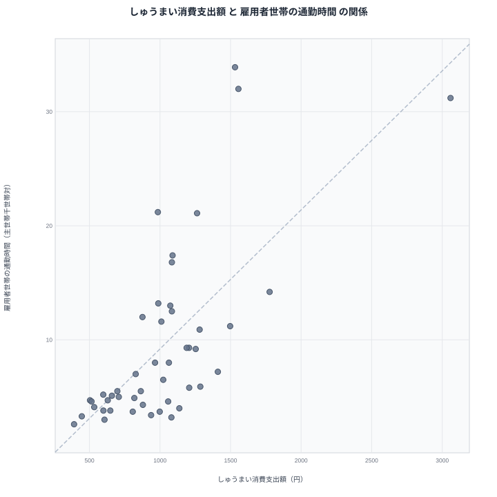

## しゅうまいと通勤、首都圏に偏る2つのランキング

しゅうまいの消費支出額ランキングを見ると、1位は神奈川県で、2位以下に東京都、千葉県、埼玉県と続きます。上位4県がそのまま首都圏の1都3県で占められているのが特徴です。一方で、雇用者を主な稼ぎ手とする世帯（主世帯）のうち通勤時間が1時間30分（90分）以上かかる世帯の割合を示す「雇用者世帯の通勤時間」の指標を見ても、1位は埼玉県、2位は千葉県、3位は神奈川県となっており、こちらも上位を首都圏の県が独占しています。

まったく異なるはずの「しゅうまいをどれだけ買うか」と「通勤にどれだけ時間がかかるか」という2つの指標が、なぜこれほど似た顔ぶれで並ぶのでしょうか。この記事では、両者の関係を実際のデータで確かめながら、見かけの相関の裏にある本当の理由を探ります。

## しゅうまい消費支出額のランキングを見る

<source-link href="/ranking/shumai-consumption-expenditure">しゅうまい消費支出額ランキングをもっと見る</source-link>

しゅうまい消費支出額の1位は神奈川県で、3,059円という数字です。2位の東京都は1,777円、3位の千葉県は1,556円、4位の埼玉県は1,532円、5位の群馬県は1,497円と続きます。1位の神奈川県が突出して高く、2位以下との差が大きい点も特徴的です。

下位を見ると、最も低いのは沖縄県で391円、次いで高知県が446円、大分県が504円、鹿児島県が515円、鳥取県が534円と続いています。西日本や南九州、沖縄の県が下位にまとまっている様子がうかがえます。

しゅうまいは横浜を代表とする神奈川県の名物として知られており、崎陽軒の看板商品としても全国に浸透しています。神奈川県が突出した1位であることは、この地域色を色濃く反映した結果だといえます。2位以下に東京都や千葉県、埼玉県が続くのは、神奈川県で定着した食文化が近隣の首都圏地域にも広がっている、あるいは首都圏の商圏でしゅうまいを扱う店舗や商品が手に入りやすいことが影響していると考えられます。

## 雇用者世帯の通勤時間のランキングを見る

雇用者世帯の通勤時間の1位は埼玉県で33.9主世帯千世帯対、2位は千葉県で32主世帯千世帯対、3位は神奈川県で31.2主世帯千世帯対です。4位の奈良県は21.2主世帯千世帯対、5位の茨城県は21.1主世帯千世帯対と続きます。上位3県が首都圏の中でも東京都に隣接する県で占められている点が目を引きます。

下位を見ると、最も低いのは沖縄県で2.6主世帯千世帯対、次いで徳島県が3主世帯千世帯対、北海道が3.2主世帯千世帯対、高知県が3.3主世帯千世帯対、鹿児島県と秋田県が4.6主世帯千世帯対で並んでいます。地方圏の県が下位に集中しています。

この指標は、雇用者を主な稼ぎ手とする世帯（主世帯）のうち、通勤時間が1時間30分（90分）以上かかる世帯の割合を、主世帯1000世帯あたりの数値で示したものです。平均的な通勤時間そのものではなく、長時間通勤する世帯がどれだけいるかを表しています。埼玉県や千葉県が上位に来ているのは、これらの県が東京都心へ通勤する人を数多く抱えるベッドタウンとしての性格を持ち、90分以上かけて都心へ移動する世帯が多いためだと考えられます。

## 散布図で相関を確かめる

散布図を見ると、しゅうまい消費支出額が高い県ほど雇用者世帯の通勤時間の指標も高くなる、右肩上がりの傾向が確認できます。神奈川県、東京都、千葉県、埼玉県はどちらの指標でも上位に位置し、点は右上に集まっています。沖縄県や高知県、鹿児島県のような県はどちらの指標でも下位に位置し、点は左下に集まっています。

ただし、この相関を「しゅうまいをよく買う世帯ほど通勤が長い」という因果関係として読むのは誤りです。しゅうまいの消費と通勤時間のあいだに、家計の行動として直接つながる理由はありません。両者が同じ方向に動いて見えるのは、どちらも首都圏という同じ地理的な条件に強く影響されているためです。

見かけの相関を生んでいるのは、首都圏という地域そのものが持つ2つの特徴です。ひとつは、神奈川県を発祥とするしゅうまいの食文化が首都圏一帯に浸透していること。もうひとつは、首都圏が広域な通勤圏を形成しており、郊外の県から都心へ長時間かけて通勤する世帯が多いことです。この2つの特徴がたまたま同じ地域(首都圏)に集中しているために、統計上は相関があるように見えているのです。

## なぜ首都圏でこれほど数値が突出するのか

首都圏でしゅうまい消費支出額が高くなる理由は、地域の食文化の定着度に求められます。しゅうまいは他の地域でも購入されていますが、神奈川県の名物として長年親しまれてきた歴史から、首都圏の消費者にとってはなじみの深い惣菜・弁当のおかずとして定着しています。地域の食習慣がそのまま消費支出に反映される典型的な例だといえます。

一方、雇用者世帯の通勤時間の指標が首都圏で高くなる理由は、都市圏の構造そのものにあります。東京都心部は地価や家賃が高いため、多くの雇用者世帯は郊外の埼玉県や千葉県、神奈川県に居住地を構え、そこから都心へ通勤するという生活パターンを取ります。通勤圏が広がるほど、長時間通勤する世帯の比率は高くなります。地方圏ではこうした広域の通勤圏が形成されにくく、職住が近接している世帯が多いため、この指標は低く出やすくなります。

つまり、しゅうまい消費支出額と雇用者世帯の通勤時間は、それぞれまったく別の理由で首都圏という同じ地域に集中しているにすぎません。片方が食文化の定着、もう片方が都市圏の住宅事情という、まったく異なる背景から生まれた2つの現象が、統計上は似た並びとして観測されているのです。

> [!NOTE]
> 雇用者世帯の通勤時間は、通勤時間が1時間30分（90分）以上かかる主世帯の割合を、主世帯1000世帯あたりの数値で示した指標です。平均通勤時間そのものではなく、長時間通勤する世帯がどれだけいるかを表している点に注意してください。

> [!WARNING]
> しゅうまい消費支出額と雇用者世帯の通勤時間のあいだに、家計調査上の直接的なつながりはありません。両者が似た並びになっているのは、首都圏という同じ地域条件を共有しているためであり、一方が他方の原因になっているわけではないことに注意してください。

> [!TIP]
> 2つの指標が同じ地域で高くなっている場合は、その地域が持つ複数の異なる特徴(食文化・住宅事情・産業構造など)を切り分けて考えると、見かけの相関に惑わされずに読み解くことができます。

## まとめ

しゅうまい消費支出額は神奈川県、東京都、千葉県、埼玉県の順に高く、雇用者世帯の通勤時間の指標は埼玉県、千葉県、神奈川県の順に高いという結果でした。どちらも首都圏の県が上位を占め、沖縄県や高知県、鹿児島県といった地方圏の県が下位に集まる点が共通していました。

散布図では両者にはっきりとした相関が見られましたが、これはしゅうまいの消費と通勤時間のあいだに直接の因果関係があるからではありません。しゅうまいの食文化が神奈川県を起点に首都圏へ広がったことと、東京都心への通勤圏が郊外の県まで広がっていることは、それぞれ独立した現象です。たまたま両方が首都圏という同じ地域で強く現れているために、統計上は似た並びとして観測されているにすぎません。

## データ出典

しゅうまい消費支出額は家計調査の2024年データ、雇用者世帯の通勤時間は社会・人口統計体系の2023年データをもとにしています。

あわせて見る: [雇用者世帯の通勤時間ランキング](/ranking/main-household-ratio-main-earner-employee-commute-90min) / [同じカテゴリの統計一覧](/category/economy) / [神奈川県のデータ](/areas/14000) / [東京都のデータ](/areas/13000)
