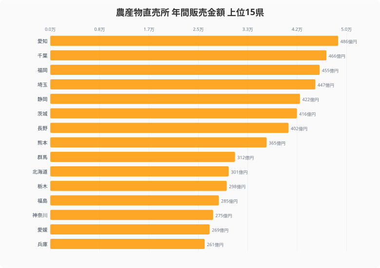
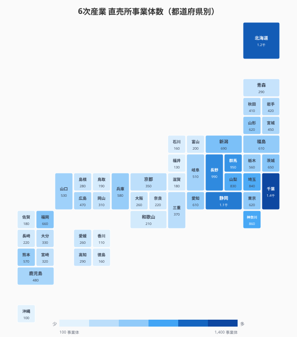
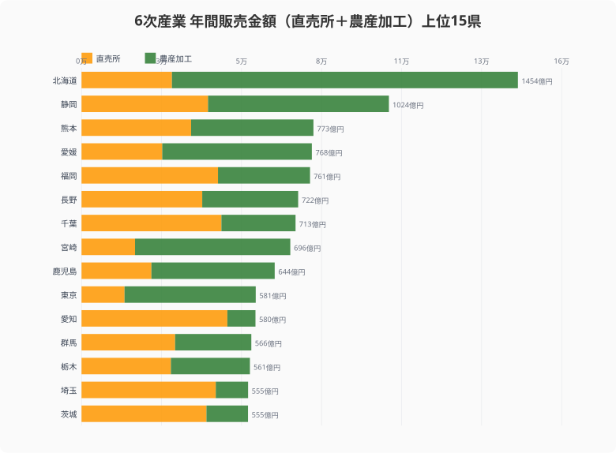
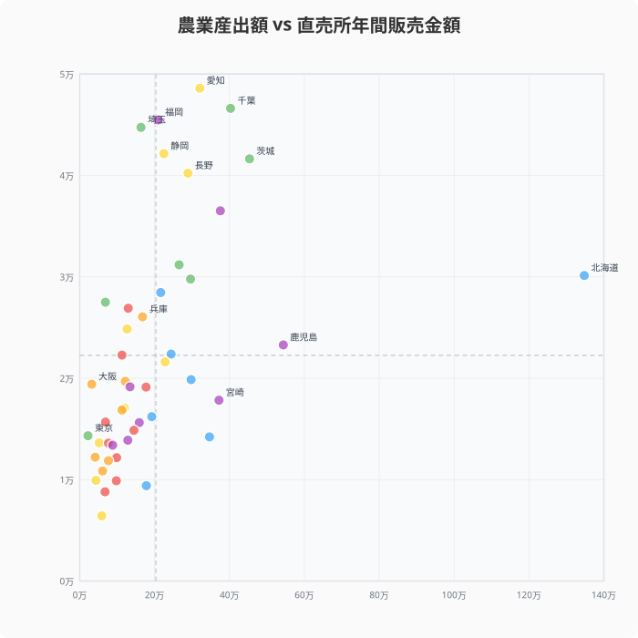
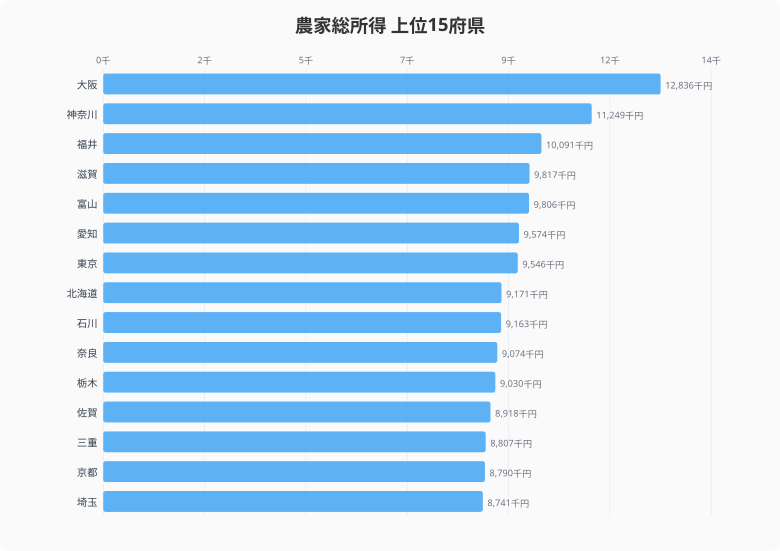
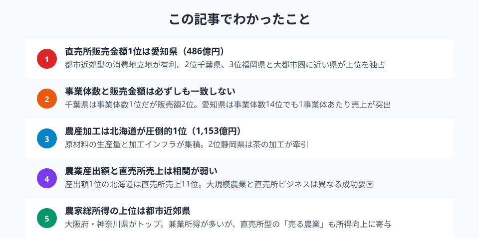

「作るだけ」の農業は、もう限界に来ている。

農林水産省の6次産業化総合調査（2021年度）によると、農産物直売所の年間販売金額で全国1位は**愛知県の約486億円**。一方、農業産出額で圧倒的1位の北海道は直売所売上では10位にとどまる。農業の「強さ」と、直売所で「稼ぐ力」は、まったく別の構造を持っているのだ。

本記事では、6次産業化（直売所・農産加工）の事業体数と年間販売金額、農業産出額、農家総所得の7指標から、都道府県ごとの「売る農業」の実態を可視化する。

## 農産物直売所 年間販売金額ランキング

まず、農産物直売所の年間販売金額を都道府県別に見てみよう。

<data-source url="https://www.e-stat.go.jp/dbview?sid=0000010103" label="e-Stat 社会・人口統計体系"></data-source>

1位の[愛知県](/areas/23000)（約486億円）に続き、千葉県（約466億円）、福岡県（約455億円）、埼玉県（約447億円）、静岡県（約422億円）がトップ5に並ぶ。いずれも大消費地に近い都市近郊型の農業県だ。

注目すべきは、農業産出額トップの北海道が10位（約301億円）にとどまっている点である。北海道は大規模畑作・酪農が主体であり、農協やJA経由の出荷が中心。消費者に直接販売する直売所モデルとは、そもそもビジネス構造が異なる。

直売所で稼げる県の共通点は明確だ。**大消費地への近さ** と **多品目の野菜・果樹生産** の2つが揃っている地域ほど、販売金額が大きい。

<source-link href="/ranking/annual-sales-6th-industry-agri-direct-sales">47都道府県の農産物直売所 年間販売金額ランキングをもっと見る</source-link>

## 直売所事業体数マップ

次に、直売所の事業体数を47都道府県のタイルマップで俯瞰してみよう。

<data-source url="https://www.e-stat.go.jp/dbview?sid=0000010103" label="e-Stat 社会・人口統計体系"></data-source>

事業体数のトップは千葉県（1,400事業体）で、北海道（1,220）、静岡県（1,050）、長野県（990）が続く。関東甲信と東海地方に色の濃いエリアが集中していることが読み取れる。

ここで興味深いのが、**事業体数と販売金額の順位が一致しない** 点だ。

愛知県は販売金額1位にもかかわらず、事業体数は610で全国15位。1事業体あたりの年間販売金額を計算すると**約8,000万円** と、全国平均（約2,700万円）の約3倍に達する。大規模な産直施設が効率的に売上を稼いでいる構造が見える。

逆に千葉県は事業体数1位だが、1事業体あたり約3,300万円。小規模な直売所が広く分散している形だ。愛媛県は事業体数260で全国31位ながら販売金額14位（269億円）と健闘しており、1事業体あたり約1億300万円で全国トップクラスの効率を示す。

<ad-slot></ad-slot>

## 直売所＋農産加工 合計販売金額

6次産業化には直売所だけでなく、農産加工も含まれる。両者の合計販売金額を積み上げ棒グラフで見てみよう。

<data-source url="https://www.e-stat.go.jp/dbview?sid=0000010103" label="e-Stat 社会・人口統計体系"></data-source>

合計で見ると、景色が一変する。**北海道が約1,454億円で圧倒的1位** だ。直売所は約301億円にとどまるが、農産加工が約1,153億円と突出している。乳製品、でんぷん、砂糖など、広大な農地で生産された原材料を加工品として付加価値をつけて販売する構造だ。

2位の静岡県（約1,024億円）は、茶の加工が6次産業化の柱となっている。直売所約422億円に加え、農産加工が約603億円を占める。

一方、愛知県は直売所単独では1位だったが、合計では11位（約580億円）。農産加工が約94億円と相対的に小さく、「直売所特化型」であることがわかる。

宮崎県は直売所売上こそ約178億円（全国24位）だが、農産加工が約517億円と3位に入り、合計では8位（約696億円）。畜産加工が牽引していると考えられる。

<source-link href="/ranking/annual-sales-6th-industry-agri-processing">47都道府県の農産加工 年間販売金額ランキングをもっと見る</source-link>

## 農業産出額と直売所売上の関係

農業の規模と直売所の売上にはどのような関係があるのだろうか。散布図で確認する。

<data-source url="https://www.e-stat.go.jp/dbview?sid=0000010103" label="e-Stat 社会・人口統計体系"></data-source>

> [!NOTE]
> 農業産出額は2023年度、直売所販売金額は2021年度のデータであり、年次が異なります。傾向の把握を目的としたクロス集計です。

右上の[北海道](/areas/01000)は農業産出額が群を抜いて高い（約1兆3,478億円）が、直売所売上は中位にとどまる。農業産出額の詳細は[都道府県別 農業産出額ランキング](/ranking/agricultural-output)を参照。全体的に見ると、産出額と直売所売上の相関は弱い。

右下に位置する鹿児島県・宮崎県は産出額が高い割に直売所売上が低めで、農協ルートの出荷比率が高いことを示唆する。逆に左上寄りの愛知県・千葉県・福岡県・埼玉県は、産出額の規模以上に直売所で売上を伸ばしている。

この散布図は、**大規模農業と直売所ビジネスの成功要因が根本的に異なる** ことを示している。直売所で稼ぐには、生産量よりも消費者へのアクセスと商品の多様性が重要だ。

<source-link href="/ranking/agricultural-output">47都道府県の農業産出額ランキングをもっと見る</source-link>

<ad-slot></ad-slot>

## 農家総所得ランキング

6次産業化の最終的な目的は農家の所得向上にある。農家総所得のデータを見てみよう。

<data-source url="https://www.e-stat.go.jp/dbview?sid=0000010212" label="e-Stat 社会・人口統計体系"></data-source>

> [!NOTE]
> 農家総所得のデータは2003年度時点のものであり、現在とは状況が異なる可能性があります。構造的な傾向の参考としてご覧ください。

1位は大阪府（約1,284万円）、2位は神奈川県（約1,125万円）。上位に都市近郊県が並ぶのは、兼業所得（農外所得）が大きいためだ。農業所得だけの比率で見ると、北海道が46%で圧倒的1位であり、大阪府や神奈川県は10%未満にすぎない。

興味深いのは、直売所販売金額の上位県（愛知県・千葉県・静岡県など）が農家総所得でも中〜上位に位置していることだ。愛知県は約957万円で6位。直売所での直接販売は、中間マージンが少ない分、農家の手取り所得を押し上げる効果がある。

## まとめ

6次産業化のデータから、日本農業の「稼ぎ方」の地域差が浮き彫りになった。

直売所で稼ぐ県と、農産加工で稼ぐ県では、成功の構造がまったく異なる。愛知県型の「都市近郊・直売所特化」モデルと、北海道型の「大規模農業・加工品付加価値」モデルは、いずれも6次産業化の成功パターンだが、必要な経営資源が違う。

農業の「作るだけ」から「作って・加工して・売る」への転換は、農家所得の向上に直結する。消費地に近い県は直売所、原材料が豊富な県は農産加工と、地域の強みに応じた6次産業化の戦略が求められている。

**データ出典:**

<data-source url="https://www.e-stat.go.jp/dbview?sid=0000010103" label="e-Stat 社会・人口統計体系"></data-source>

## データ出典

本記事のデータはe-Stat（政府統計の総合窓口）を基に作成しています。

本記事の対象データ: [関連カテゴリ](/category/agriculture)
