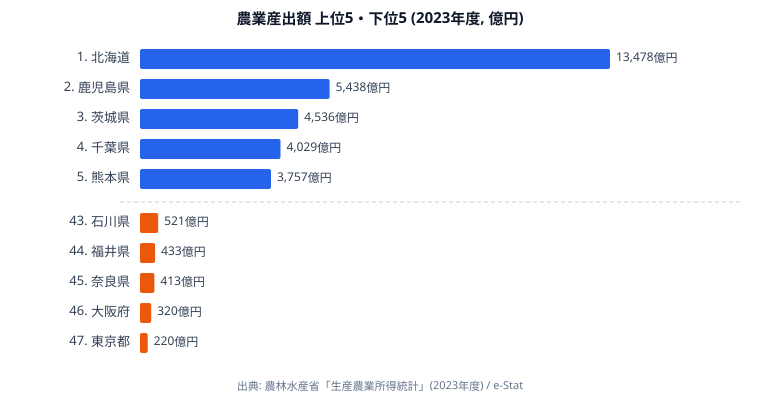
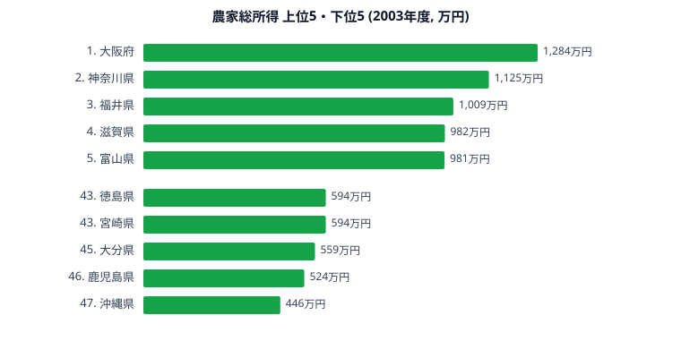

「同じ日本でも、作る農業の規模はこれほど違うのか」。データを並べると、そう驚かされます。

農林水産省の生産農業所得統計（2023年度）によると、農業産出額で全国トップは**北海道の約1兆3,478億円**です。一方、最下位の東京都はわずか約220億円。その差は実に**61倍**にのぼります。同じ「都道府県」という単位でありながら、農業の規模はこれほどまでに違うのです。

この記事では、農業産出額の都道府県差を出発点に、どの地域が「作る農業」で突出しているのかを押さえます。そのうえで、作った農産物が最終的に農家の手元にどれだけ残るのか（農家総所得）まで重ね、「規模」と「手取り」が必ずしも一致しないことを見ていきます。

## 農業産出額は北海道が突出｜東京とは61倍の開き

まず、農業そのものの規模を表す農業産出額の上位5県・下位5県を見てみましょう。

<source-link href="/ranking/agricultural-output">47都道府県の農業産出額ランキングをもっと見る</source-link>

トップの[北海道](/areas/01000)は約1兆3,478億円で、2位の鹿児島県（約5,438億円）に2.5倍近い差をつけています。3位は茨城県（約4,536億円）、4位は千葉県（約4,029億円）、5位は熊本県（約3,757億円）と続きます。広大な農地で畑作・酪農・畜産を大規模に展開する北海道、そして畜産が盛んな南九州（鹿児島・熊本）が上位を占めています。地形と気候に恵まれ、まとまった農地を確保できる地域ほど産出額が大きくなる構造が、はっきりと見て取れます。

下位に目を移すと、47位の[東京都](/areas/13000)が約220億円で、北海道とは61倍もの開きがあります。46位は大阪府（約320億円）、45位は奈良県（約413億円）、44位は福井県（約433億円）、43位は石川県（約521億円）と続き、農地に乏しい大都市圏や、面積の小さい県が並びます。市街化が進んで農地が限られる地域では、そもそも「作る量」を増やしにくいのです。北海道と東京の61倍差は、農業が地形・面積という動かしがたい条件に強く規定されていることを物語っています。

> [!NOTE]
> 農業産出額は、その都道府県で生産された農産物の販売金額の総額（農林水産省「生産農業所得統計」2023年度）です。「県内でどれだけ農業が行われているか」という規模を表す指標であり、農家がいくら手元に残したか（所得）とは別物です。ここを混同すると、次に見る農家総所得との食い違いを読み違えてしまいます。

## 「作る規模」と「手元に残る額」は一致しない

では、産出額が大きい県ほど、農家の手取りも多いのでしょうか。答えは「ノー」です。農家総所得の上位5県・下位5県を見ると、産出額とはまったく違う顔ぶれが並びます。

<source-link href="/ranking/total-farm-household-income">47都道府県の農家総所得ランキングをもっと見る</source-link>

農家総所得でトップに立つのは、なんと農業産出額では最下位グループの[大阪府](/areas/27000)で約1,284万円です。2位は神奈川県（約1,125万円）、3位は福井県（約1,009万円）、4位は滋賀県（約982万円）、5位は富山県（約981万円）と続きます。産出額で日本一の北海道や、2位の鹿児島県の名前はここには見当たりません。むしろ鹿児島県は農家総所得では46位（約524万円）、最下位は沖縄県（約446万円）です。

この逆転が起きるのは、「農家総所得」が農業以外の収入（農外所得）を含むためです。大阪府や神奈川県のような都市近郊では、農業の規模は小さくても、勤め先からの給与など兼業による収入が世帯の所得を大きく押し上げます。つまり、ここで上位に立つ県の高さは「農業で稼いだ」結果ではなく、「都市部で兼業しやすい」結果という側面が強いのです。逆に北海道は、農業専業の比率が高く、所得に占める農業の割合が大きい県です。総所得の順位だけを見て「北海道は稼げていない」と読むのは早計といえます。

> [!WARNING]
> 農業産出額（2023年度）と農家総所得（2003年度）は調査年度が異なります。直接の比較ではなく、「規模の大きい県」と「総所得の高い県」の顔ぶれがそもそも一致しないという構造を読み取るための並置です。また農家総所得は農外所得を含むため、この順位の高さがそのまま「農業で稼ぐ力」を意味するわけではありません。

## 規模に頼らず「売り方」で稼ぐ道はあるか

産出額の規模は地形と面積に強く縛られ、農家の手取りは兼業の有無に左右される――そうだとすれば、農地に恵まれない県や、規模だけでは勝てない県に打つ手はないのでしょうか。

ここで注目されているのが「6次産業化」です。農産物を作って出荷するだけ（1次産業）でなく、加工（2次）や直売・販売（3次）まで農家自身が手がけることで、中間マージンを取り込み付加価値を高める取り組みを指します。農産物直売所や、農産加工による商品づくりがその代表例です。

> [!TIP]
> **[仮説]** 大消費地に近く多品目の野菜・果樹を生産する都市近郊県（愛知・千葉・埼玉など）は、直売所での直接販売を伸ばしやすい一方、大規模畑作・酪農が主体でJA経由の大口出荷が中心の北海道は、加工による付加価値づくりに強みがある――という地域ごとの「売り方」の違いが想定されます。ただし本記事で扱った産出額・農家総所得のデータからは、この直売所・加工別の販売力までは確認できません。直売所や農産加工の年間販売金額（農林水産省「6次産業化総合調査」）を都道府県別に突き合わせた検証が必要です。

規模で勝てない県でも、消費地への近さや作目の多様性、加工技術といった別の資源を活かせば、「作る量」とは異なる軸で稼ぐ余地があります。農業を「産出額の大小」だけで見ていては、こうした「売り方の地図」は見えてきません。地域ごとの強みに応じた6次産業化の戦略こそ、規模の格差を補う鍵になりうるのです。

## まとめ

農業産出額と農家総所得のデータから、日本農業の地域差が浮かび上がりました。要点を整理します。

- 農業産出額は北海道が約1兆3,478億円で日本一。最下位の東京都（約220億円）とは約61倍の開きがあります。
- 上位は北海道・鹿児島・茨城・千葉・熊本。広い農地を確保できる北海道と、畜産の盛んな南九州が突出します。
- 下位は東京・大阪・奈良・福井・石川。農地に乏しい大都市圏や面積の小さい県が並びます。
- 農家総所得（2003年度）の上位は大阪・神奈川・福井など。農外所得を含むため、産出額の規模とは一致しません。
- 規模で勝てない県の活路として、直売所・加工による6次産業化が注目されますが、その販売力の地域差は別データでの検証が必要です。

農業を「どれだけ作るか」という規模の物差しだけで測ると、地形に恵まれた一部の県だけが目立ちます。しかし「手元にいくら残るか」「どう売るか」という軸を重ねると、まったく別の地図が見えてきます。規模の格差をどう補うか――その問いに、データは静かにヒントを示しています。

## データ出典

- 農林水産省「生産農業所得統計」（2023年度、農業産出額） — e-Stat（政府統計の総合窓口）経由
- 農家総所得は社会・人口統計体系に基づく（2003年度。農外所得を含むため傾向把握の参考値）
- 関連カテゴリ: [農業](/category/agriculture)
