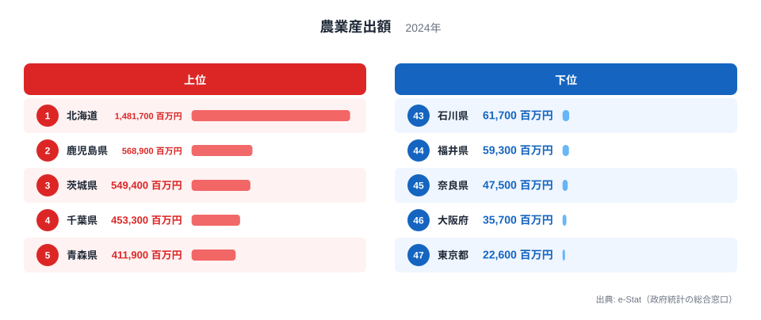
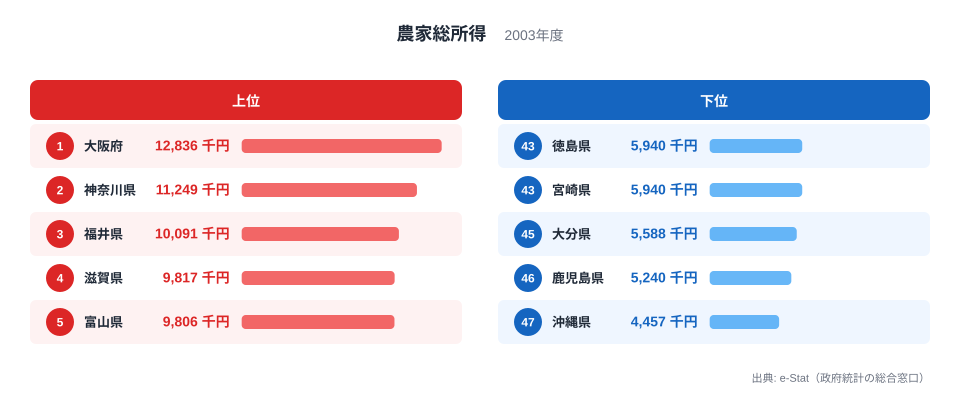
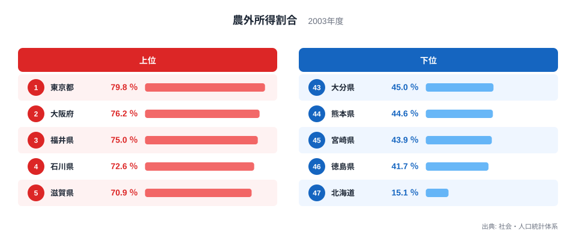

「農業日本一の北海道なら、農家の所得も日本一なのでしょうか」。データを並べると、その答えは意外な形で返ってきます。

農林水産省の生産農業所得統計（2024年）によると、農業産出額で全国トップは**北海道の約1兆4,817億円**です。一方、最下位の東京都は約226億円で、その差は約**66倍**にのぼります。ところが農家総所得（2003年度）で見ると、北海道は47都道府県中8位で、1位は農業産出額で46位の大阪府でした。産出額の順位と農家総所得の順位は、ほとんど重なりません。

この記事では、農業産出額の都道府県差を押さえたうえで、農家総所得の順位と並べ、「作る規模」と「農家の所得」の関係を確かめます。さらに、同じ統計表にある農外所得割合を重ね、所得の順位が産出額と離れる手がかりを探ります。なお、産出額（2024年）と、農家総所得・農外所得割合（2003年度）は年が離れています。その理由は、農家総所得の節の後にある注意書きで説明します。

## 農業産出額は北海道が突出｜東京とは約66倍の開き

まず、農業そのものの規模を表す農業産出額の上位5道県・下位5都府県を見てみましょう。

<source-link href="/ranking/agricultural-output">47都道府県の農業産出額ランキングをもっと見る</source-link>

トップの[北海道](/areas/01000)は約1兆4,817億円で、2位の鹿児島県の約5,689億円に対して約2.6倍です。3位は茨城県で約5,494億円、4位は千葉県で約4,533億円、5位は青森県で約4,119億円と続きます。上位5道県は北海道、九州、関東、東北に分かれており、特定の一地方だけに偏っているわけではありません。九州では鹿児島県が2位、熊本県が6位、宮崎県が7位と、3県が上位10位以内に入っています。

下位に目を移すと、47位の[東京都](/areas/13000)が約226億円で、北海道とは約66倍の開きがあります。46位は大阪府で約357億円、45位は奈良県で約475億円、44位は福井県で約593億円、43位は石川県で約617億円です。東京都と大阪府は400億円を下回ります。農地の面積が小さいことが背景にある可能性はありますが、今回のデータには農地面積が含まれておらず、このデータだけでは確かめられません。また、上位の産出額がどの作物や畜産物から生まれているのかも、この図からは読み取れません。

> [!NOTE]
> 農業産出額は、1月から12月（暦年）の農業生産の金額です（農林水産省「生産農業所得統計」2024年）。「県内でどれだけ農業が行われているか」という規模を表す指標であり、農家の手取りである所得とは別物です。ここを混同すると、次に見る農家総所得との食い違いを読み違えてしまいます。

## 産出額の順位が高い県ほど、農家総所得が高いとは限らない

では、産出額が大きい県ほど、農家総所得も高いのでしょうか。47都道府県の順位どうしの関係を調べると、向きは「やや逆」で、関係は弱いものでした。同じ2003年で見た産出額と農家総所得の順位相関係数は、マイナス0.23です（暦年の産出額と年度の所得を合わせたもので、期間は3か月ずれます）。産出額が2024年のものでも、マイナス0.29で大きな違いはありません。マイナスは、産出額の順位が高い県ほど農家総所得の順位が低くなる傾向がわずかにある、という意味です。ただし絶対値が0.3に届かないため、はっきりした傾向とは言えず、因果関係を示すものでもありません。

<source-link href="/ranking/total-farm-household-income">47都道府県の農家総所得ランキングをもっと見る</source-link>

農家総所得でトップに立つのは、農業産出額では46位の[大阪府](/areas/27000)で、約1,284万円です。2位は神奈川県で約1,125万円、3位は福井県で約1,009万円、4位は滋賀県で約982万円、5位は富山県で約981万円と続きます。神奈川県は産出額で42位、福井県は44位、滋賀県は38位、富山県は39位で、上位5県はいずれも産出額では下位に位置します。

産出額で日本一の北海道は、農家総所得では8位で約917万円でした。47都道府県の中では上位に入っており、「北海道は稼げていない」とは言えません。一方、産出額2位の鹿児島県は農家総所得では46位で約524万円、最下位は沖縄県で約446万円です。1位の大阪府と最下位の沖縄県の差は約2.9倍でした。

なお、農家総所得は北海道でも約917万円のように、1つの県で1,000万円前後の値になります。北海道の農業産出額が1兆4,817億円であることと比べると、県全体の合計ではなく、農家1戸あたりのような平均的な水準を表す値と読めます。ただし、e-Stat の項目名「農家総所得」には対象や分母の表記がなく、この記事ではそこまでは確かめられていません。順位の食い違いの理由は、次の節で農外所得との関係から探ります。

> [!WARNING]
> 農業産出額は2024年（暦年）、農家総所得は2003年度（年度）で、21年のずれがあります。農家総所得は、本サイトが収録している系列が2003年度までのため、最新の年でも2003年度になります。順位を直接比べて「今の北海道の所得は8位」と読むことはできません。ここでは、規模の順位と所得の順位が離れていることを、2003年（暦年）の産出額と2003年度の農家総所得の順位相関でも確かめました。2つの期間は3か月ずれます。

## 農家総所得が高い県は、農外所得の割合も高い

産出額で測れない所得の差は、何から生まれているのでしょうか。手がかりになるのが、同じ社会・人口統計体系の表に収録された農外所得割合です。農業以外から得た所得の割合を都道府県別に並べたのが、次の図です。何に対する割合か（分母）は、統計の項目名からは確かめられていません。年度は農家総所得と同じ2003年度です。

<source-link href="/ranking/non-agricultural-income-ratio">47都道府県の農外所得割合ランキングをもっと見る</source-link>

農外所得割合が最も高いのは東京都で79.8％です。2位は大阪府で76.2％、3位は福井県で75.0％、4位は石川県で72.6％、5位は滋賀県で70.9％と続きます。反対に最も低いのは北海道の15.1％で、46位は徳島県の41.7％、45位は宮崎県の43.9％、44位は熊本県の44.6％、43位は大分県の45.0％でした。農家総所得で上位5府県に入った大阪府、福井県、滋賀県、神奈川県、富山県は、農外所得割合がそれぞれ2位、3位、5位、6位、8位で、すべて上位8位以内です。47都道府県の順位どうしの相関係数は0.76で、農家総所得の順位と農外所得割合の順位は同じ向きに動きます。産出額との相関がマイナス0.23からマイナス0.29にとどまることと比べると、はっきり強い関係です。

産出額で上位の九州の県は、この関係の反対側にいます。産出額2位の鹿児島県は農外所得割合が40位の45.8％で、農家総所得は46位でした。産出額6位の熊本県も農外所得割合は44位で、農家総所得は39位です。農外所得の割合が高くない県は、農業産出額が大きくても農家総所得が低めになる傾向が、このデータでは読み取れます。ただし、これは2003年度の47都道府県の傾向であり、農外所得が所得を押し上げた因果関係を示すものではありません。

> [!NOTE]
> 農外所得割合は割合であり、農外所得の金額そのものではありません。農業所得が小さい県では、農外所得の金額が同じでも割合は高く出ます。また、農業所得割合と農外所得割合を足しても100％にはなりません（北海道は46％と15.1％で61.1％です）。残りの内訳はこのデータにありません。農外所得が農家総所得をどれだけ押し上げているかは、金額のデータで確かめる必要があります。

北海道はこの傾向の例外です。農外所得割合は最下位の15.1％ですが、農業所得割合は46％で全国1位です。次いで高い高知県でも26％にとどまり、北海道が農業所得に寄った構造であることが分かります。それでも農家総所得は8位の約917万円で、農外所得に頼らずに上位に入っています。農業の規模が大きいことが所得を支えている可能性がありますが、農業所得の金額が分からないため、このデータだけでは確かめられません。東京都や大阪府は農業産出額が小さく、農外所得の割合が高い側にいます。農業そのものの規模が小さくても、農外の収入を含む農家の総所得は高く出る場合がある、というのがこの図から読み取れる範囲です。

## 規模に頼らず「売り方」で稼ぐ道は、このデータでは見えない

産出額の規模で勝てない県が所得を伸ばす方法として、加工や直売まで農家自身が手がけて付加価値を高める「6次産業化」が注目されています。ただし、この記事のデータには、直売や加工の販売金額は含まれていません。

> [!TIP]
> 6次産業化が農家総所得を押し上げているかを確かめるには、直売所や農産加工の年間販売金額（農林水産省「6次産業化総合調査」）を都道府県別に並べ、農家総所得や産出額と突き合わせる必要があります。別の統計を取り込むことが、次の課題です。

## まとめ

農業産出額と農家総所得のデータから、地域差が浮かび上がりました。要点を整理します。

- 農業産出額（2024年）は北海道が約1兆4,817億円で日本一です。最下位の東京都は約226億円で、約66倍の開きがあります。
- 上位は北海道、鹿児島県、茨城県、千葉県、青森県です。九州では熊本県が6位、宮崎県が7位に入ります。
- 下位は東京都、大阪府、奈良県、福井県、石川県です。東京都と大阪府は400億円を下回ります。
- 農家総所得（2003年度）の1位は大阪府で、北海道は8位、鹿児島県は46位でした。産出額の順位との相関はマイナス0.23で、弱い逆向きの関係です。
- 農家総所得と農外所得割合（2003年度）の順位相関は0.76で、所得が高い県は農外所得の割合も高い傾向があります。ただし割合であり、因果関係までは分かりません。
- 北海道は農外所得割合が最下位の15.1％、農業所得割合が1位の46％で、農外所得に頼らずに農家総所得で8位に入る例外です。
- 6次産業化の効果は今回のデータでは確かめられず、別の統計での検証が必要です。

農業を「どれだけ作るか」という規模の物差しだけで測っても、農家の所得の順位は分かりません。「どこから所得を得ているか」という軸を重ねると、規模とは別の地図が見えてきます。

## データについて

倍率と順位相関は、ランキングデータから次のように計算しました。農業産出額の約66倍は、2024年の北海道の1,481,700百万円を東京都の22,600百万円で割った65.6倍を丸めた値です。鹿児島県との差の約2.6倍は、北海道の値を鹿児島県の568,900百万円で割った値です。農家総所得の約2.9倍は、2003年度の大阪府の12,836千円を沖縄県の4,457千円で割った値です。順位相関係数はスピアマンの順位相関係数で、同順位は平均順位として47都道府県で計算しました。農家総所得と農外所得割合の順位相関0.76は、どちらも2003年度の値で計算しています。産出額と農家総所得の相関は、暦年の産出額と年度の所得を組み合わせています。計算の式と入力の元値は、図と同じフォルダの出典ファイルに残しています。
