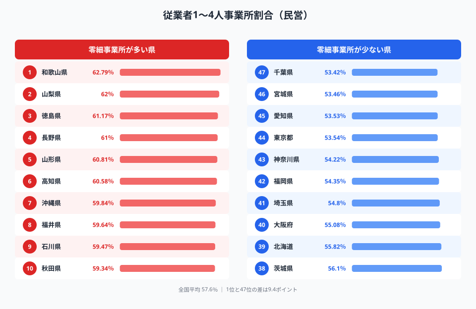
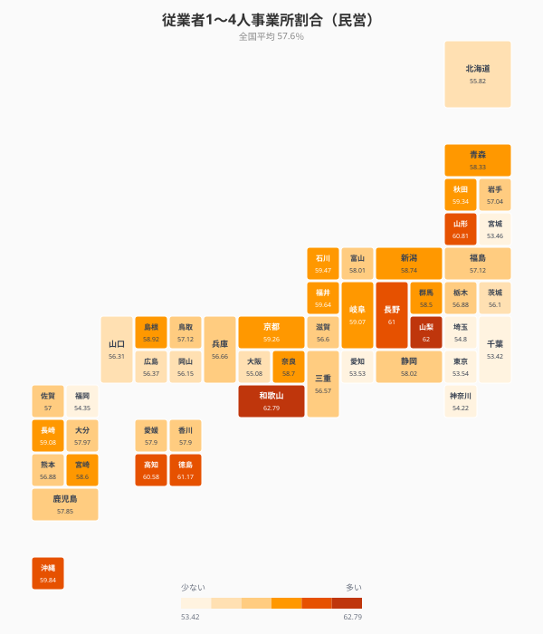
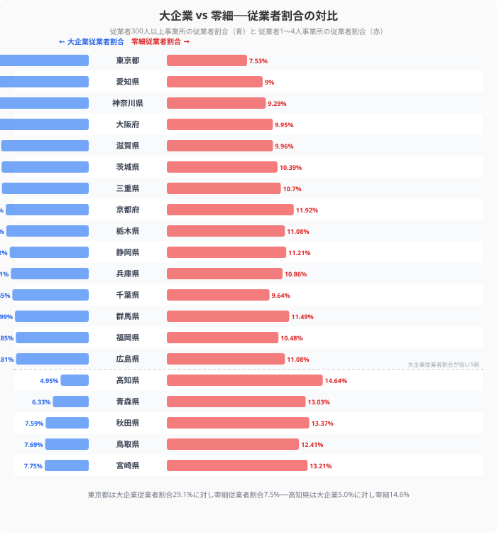
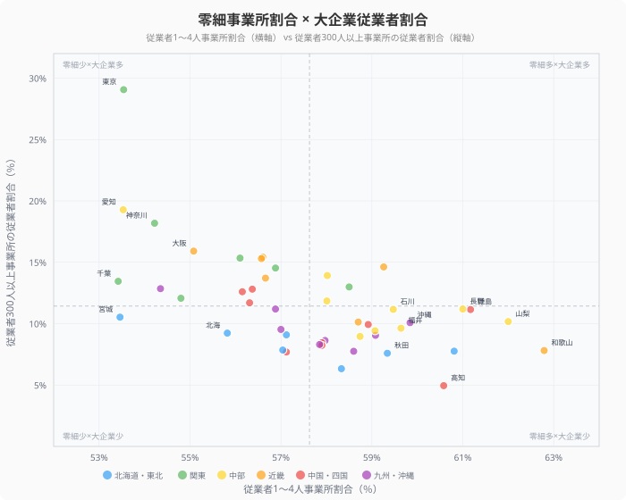
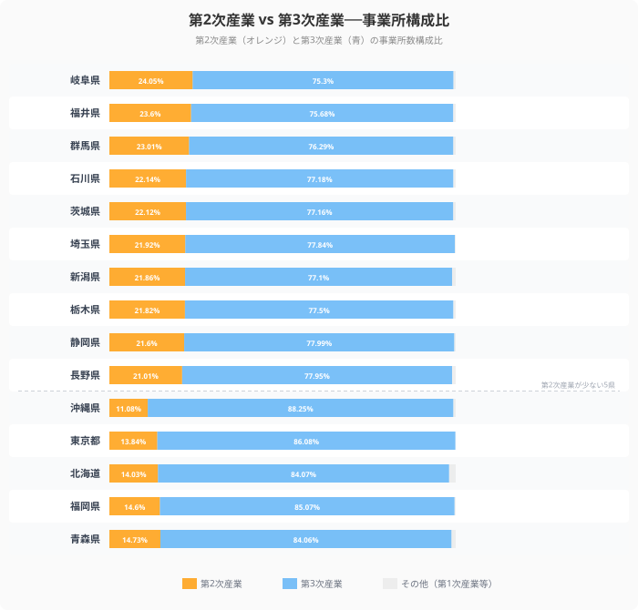
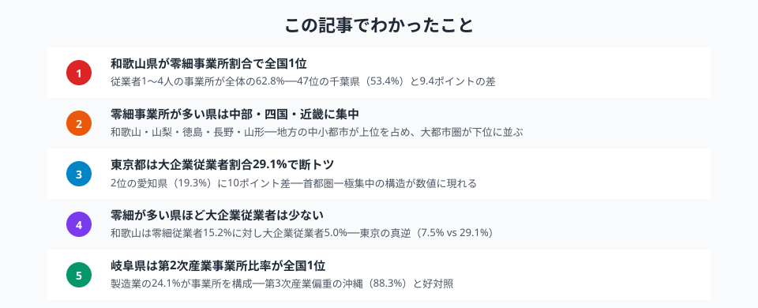

日本の事業所の半数以上は「従業者4人以下」の零細事業所です。しかしその割合は都道府県によって大きく異なり、地方の中小都市では6割を超える一方、大都市圏では5割強にとどまります。

この記事では、経済センサスのデータをもとに**従業者1〜4人の事業所割合**を都道府県別に比較し、さらに大企業（300人以上）の事業所・従業者割合、第2次・第3次産業の構成比を重ねることで、零細企業が支える地方経済の構造と大都市圏との格差を明らかにします。

## 零細事業所割合ランキング（従業者1〜4人）

<data-source url="https://www.e-stat.go.jp/dbview?sid=0000010203" label="e-Stat 社会・人口統計体系"></data-source>

**零細事業所の割合が最も高いのは[和歌山県](/areas/30000)**（62.79%）。2位の山梨県（62.00%）、3位の徳島県（61.17%）と、地方の中小都市が上位を占めます。4位は長野県（61.00%）、5位は山形県（60.81%）で、いずれも農林業や地場産業が盛んな地域です。

一方、**最も低いのは千葉県**（53.42%）。宮城県（53.46%）、愛知県（53.53%）、[東京都](/areas/13000)（53.54%）と、大都市圏やその周辺県が下位に集中しています。1位の和歌山県と47位の千葉県では**9.4ポイントの差**があります。

<source-link href="/ranking/establishment-ratio-1-4-employees-private">従業者1〜4人事業所割合ランキング</source-link>

> [!NOTE]
> ここでいう「零細事業所」は従業者1〜4人の民営事業所を指します。個人商店・小規模工房・士業事務所などが含まれ、地域の雇用と生活を支える基盤です。割合が高いことが必ずしもネガティブではなく、地域に根差した多様な経済活動の表れでもあります。

## 都道府県マップ──零細事業所の「地域パターン」

<data-source url="https://www.e-stat.go.jp/dbview?sid=0000010203" label="e-Stat 社会・人口統計体系"></data-source>

マップから3つのパターンが読み取れます。

- **近畿・四国が濃い帯**──和歌山・徳島・高知が軒並み濃色。紀伊半島から四国にかけて零細事業所が集中する一帯が形成されている
- **中部・北陸も高め**──山梨・長野・福井・石川が60%前後。地場産業（宝飾・精密機械・繊維・伝統工芸）の小規模事業者が多い
- **関東・東海の大都市圏が薄い**──千葉・東京・神奈川・愛知・宮城が全国で最も低水準。大企業の本社・工場が集積し、チェーン店や大規模サービス業が事業所構成を押し上げている

同じ近畿でも大阪府（55.08%）は和歌山県（62.79%）より7.7ポイント低く、大都市と地方の差が隣接県でも明確に出ています。

<ad-slot></ad-slot>

## 大企業 vs 零細──従業者割合の対比

<data-source url="https://www.e-stat.go.jp/dbview?sid=0000010203" label="e-Stat 社会・人口統計体系"></data-source>

事業所数の割合だけでなく、**従業者（働く人）の割合**で見ると、大企業と零細の格差はさらに鮮明になります。

- **東京都は大企業従業者割合29.06%で断トツ1位**──2位の愛知県（19.28%）に約10ポイントの大差。東京で働く人の約3人に1人は従業者300人以上の大企業に勤務している
- **[高知県](/areas/39000)は大企業従業者割合4.95%で最下位**──零細事業所の従業者割合（14.64%）は全国2位。働く人の約7人に1人が従業者4人以下の事業所に属する
- **東京と高知の対比**──大企業従業者割合は29.06% vs 4.95%で**約5.9倍の差**。零細従業者割合は7.53% vs 14.64%で約1.9倍

大企業の本社・支社が集中する東京と、個人商店や小規模事業者が地域経済を担う高知。この構造的な差は、賃金水準・雇用の安定性・税収にも直結します。

<source-link href="/ranking/establishment-ratio-300plus-employees-private">従業者300人以上事業所割合ランキング</source-link>

<source-link href="/ranking/employee-ratio-1-4-employee-establishments-private">従業者1〜4人事業所の従業者割合ランキング</source-link>

<source-link href="/ranking/employee-ratio-300plus-employee-establishments-private">従業者300人以上事業所の従業者割合ランキング</source-link>

## 零細事業所割合 × 大企業従業者割合──散布図で見る構造

<data-source url="https://www.e-stat.go.jp/dbview?sid=0000010203" label="e-Stat 社会・人口統計体系"></data-source>

横軸に零細事業所割合、縦軸に大企業従業者割合をとると、都道府県の産業構造が4象限に分かれます。

- **左上（零細少×大企業多）**: 東京・愛知・神奈川・大阪──大企業が集積し、零細事業所が少ない「都市型経済」
- **右下（零細多×大企業少）**: 和歌山・高知・徳島・山梨・秋田──零細事業所が多く大企業がほとんどない「地方型経済」
- **左下（零細少×大企業少）**: 千葉・宮城・北海道──大都市のベッドタウンや広域分散型。大企業も零細も中間的
- **右上（零細多×大企業多）**: 該当する県はほぼなく、零細割合と大企業従業者割合は**強い逆相関**を示す

この散布図は、**零細事業所が多い県ほど大企業に雇用される人の割合が低い**という構造を明確に示しています。地方で大企業の進出が少ないことが、零細事業所の高い割合として表れているのです。

<ad-slot></ad-slot>

## 第2次産業 vs 第3次産業──事業所の産業構成

<data-source url="https://www.e-stat.go.jp/dbview?sid=0000010203" label="e-Stat 社会・人口統計体系"></data-source>

事業所の産業構成比を見ると、零細事業所割合の背景にある産業構造がさらに見えてきます。

- **岐阜県は第2次産業が全国1位**（24.05%）──刃物・陶磁器・繊維など伝統的な製造業の小規模事業者が多い。零細事業所割合も57.67%と全国25位で、製造業の小規模事業所が下支えしている
- **福井県は第2次産業2位**（23.60%）──眼鏡フレーム・繊維産業の集積地。零細事業所割合は59.64%で全国8位
- **沖縄県は第3次産業が全国1位**（88.25%）──観光・飲食・サービス業が圧倒的に多く、第2次産業はわずか11.08%。零細事業所割合は59.84%で全国7位と高い
- **東京都も第3次産業が86.08%**──サービス業が主体だが、大企業のチェーン店・本社が多いため零細割合は53.54%と低い

沖縄と東京はどちらも第3次産業が85%超で同じ「サービス経済」ですが、**零細割合は6.3ポイントの差**。大企業のチェーンか個人商店かで、同じ産業構造でも事業所の規模感がまったく異なります。

<source-link href="/ranking/secondary-industry-establishment-ratio">第2次産業事業所数構成比ランキング</source-link>

<source-link href="/ranking/tertiary-industry-establishment-ratio">第3次産業事業所数構成比ランキング</source-link>

## まとめ

> [!TIP]
> 零細事業所割合は地域経済の課題を示すだけでなく、事業承継・デジタル化支援・協業促進など政策の対象を絞るための有効な指標でもあります。[商業カテゴリ](/category/commercial)では関連指標を一覧できます。

零細事業所割合・大企業従業者割合・産業構成比の3つの視点から、都道府県の産業構造と企業規模の地域差を分析しました。

零細事業所の割合は、単なる企業規模の指標ではなく、**地域の産業構造・雇用形態・経済的自立性**を映す鏡です。和歌山県のように事業所の6割超が従業者4人以下という地域は、個人商店や小規模工房が地域の雇用と生活を支えています。

一方で、零細事業所の多さは大企業の進出が少ないことの裏返しでもあり、賃金水準や雇用の安定性に課題を残します。地方創生の議論では、零細事業所の「数の多さ」をどう活かすか──事業承継支援・デジタル化支援・協業促進といった施策が重要になります。

<data-source url="https://www.e-stat.go.jp/dbview?sid=0000010203" label="e-Stat 社会・人口統計体系"></data-source>

## データ出典

本記事のデータはe-Stat（政府統計の総合窓口）を基に作成しています。
