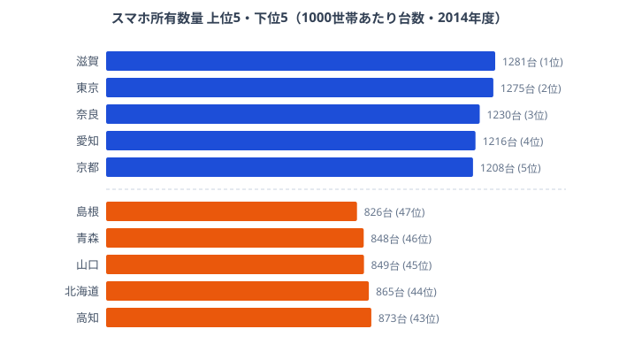

「スマホをいちばん持っているのは東京だろう」──そう思って 47 都道府県のデータを開くと、首位は東京ではありませんでした。2014 年度、二人以上の世帯 1000 世帯あたりのスマートフォン所有台数で首位に立ったのは **滋賀県の 1281 台**です。東京都は 1275 台でわずか 6 台届かず 2 位でした。

ここでいう「1000 世帯あたりの台数」とは保有率（%）ではなく、**1000 世帯が合計で何台のスマホを持っているか**を表します。滋賀の 1281 台は、1 世帯あたり平均 1.28 台のスマホがある計算です。一方で最下位の **島根県は 826 台**（1 世帯あたり 0.83 台）でした。最大と最小で **約 1.6 倍**（1281 ÷ 826 ≒ 1.55）の差がついています。

この記事で見えてくるのは、「デジタル格差は大都市 vs 地方という単純な構図ではない」という点です。上位には東京・大阪・神奈川といった大都市圏が並ぶ一方で、それを上回ったのは滋賀・奈良・京都という近畿の県でした。なぜこの並びになるのかを、データに即して読み解いていきます。

> [!NOTE]
> このデータは総務省統計局「社会・人口統計体系」（statsDataId: 0000010212）に基づきます。対象は「二人以上の世帯」で、単身世帯は含みません。値は **1000 世帯あたりの所有台数（台）** であり、世帯普及率（%）とは別の指標です。1000 を超える値は「1 世帯あたり平均 1 台超」を意味します。

## スマホ保有数 上位5と最下位5

まず全体像を、上位 5 県と下位 5 県で押さえます。

<source-link href="/ranking/smartphone-ownership-multi-person-households-per-1000">スマートフォン所有数量ランキングをもっと見る</source-link>

上位 5 県を見ると、**滋賀（1位・1281台）・奈良（3位・1230台）・京都（5位・1208台）**と近畿が 3 県を占めます。これに愛知（4位・1216台）を加えた中京・近畿圏が上位の中核でした。首都圏の東京（2位・1275台）も健在ですが、首位を譲っている点は象徴的です。上位 10 位まで広げると、埼玉（6位）・神奈川（7位）・大阪（8位）・茨城（9位）・福井（10位）が続き、近畿は滋賀・奈良・京都・大阪の 4 県が顔を出します。「スマホをいちばん持つのは大都市」という先入観が、ここで裏切られています。

なぜ滋賀や奈良が東京を上回るのでしょうか。鍵は本指標が「世帯あたりの合計台数」である点にあります。首位の[滋賀県](/areas/25000)と 3 位の奈良はそれぞれ京阪神・大阪のベッドタウンで、働く世代の子育て世帯が比較的多い地域です。世帯人数が多ければ、家族 1 人ずつがスマホを持つことで「1 世帯あたりの合計台数」が押し上げられます。同じ理屈で、首都圏の埼玉・神奈川・茨城も通勤圏として上位に並びました。一方の東京や大阪は単身に近い小規模世帯（ただし本指標は二人以上世帯が対象）の比重が相対的に高く、世帯人数で稼ぎにくかったと読めます。下位の県との差が「台数」として表れているのが、このランキングの構造です。

> [!TIP]
> このランキングは「保有率の高さ」ではなく「1 世帯にスマホが何台あるか」を映します。上位陣がほぼ 1200〜1281 台に集中する一方、下位は 826〜873 台にとどまります。世帯あたり 1 台前後で頭打ちになっている地域と、家族の人数分だけ複数台を持つ地域の差が、そのまま順位差になっていると読むのが正確です。

## 最下位グループ：下位はどこか

最下位の **[島根県](/areas/32000)（826台）** をはじめ、青森（46位・848台）・山口（45位・849台）・北海道（44位・865台）・高知（43位・873台）が下位 5 県でした。島根・青森・高知はいずれも高齢化率が高く人口減少が続く県で、二人以上世帯のうち高齢夫婦世帯の比率が高いほど、世帯あたりのスマホ台数は伸びにくくなります。高齢の夫婦だけの世帯では、家族の人数分の端末を持つ機会そのものが少ないからです。

下位に **北海道（44位）** が入っている点は注目に値します。札幌という大都市を抱えながらも、広大な面積と高齢世帯の多い農村部を含む道全体の平均では下位に沈みました。県内に大都市があっても、平均値は県全体の世帯構成に引っ張られるため、「大都市を持つ＝上位」とは限らないことを示す好例です。山口が下位に入るのも、瀬戸内の都市部だけでなく中山間の高齢世帯を多く含むためと読めます。下位の顔ぶれは、地理的にも東北・山陰・四国・北海道と散らばっており、「特定の地方ブロックがまるごと低い」のではなく、世帯の高齢化という共通項で結びついているのが実態です。

> [!WARNING]
> 下位の値が低い背景には、対象が「二人以上の世帯」である点が関わります。高齢の夫婦世帯ではスマホよりフィーチャーフォン（ガラケー）の所有が残りやすく、世帯あたりの台数が伸びにくい傾向があります。また 2014 年度はスマホ普及の途上期で、地域差が大きく出た時期です。最新年の数値ではないため、現在の保有状況とは順位も水準も異なる可能性があります。下位だからといって「スマホが使われていない地域」と読み違えないようにしてください。

## なぜ「大都市 vs 地方」ではないのか

このランキングの最大の発見は、上位の主役が東京ではなく **近畿の県（滋賀・奈良・京都）** だったことです。なぜこの並びになるのか、データから読める構造を整理します。

第一に、**上位は「大都市の通勤圏」が強い**という点です。滋賀（1位）と奈良（3位）はそれぞれ京阪神・大阪のベッドタウンで、子育て世帯が多く世帯人数が比較的多い地域です。世帯人数が多いほど 1 世帯の合計台数が増えやすいため、世帯あたり台数で稼げます。首都圏の埼玉（6位）・神奈川（7位）・茨城（9位）も同じ理由で上位に並びました。

第二に、**下位は人口減少・高齢化地域に集中する**という点です。島根（47位）・青森（46位）・高知（43位）はいずれも高齢化率が高く、二人以上世帯のうち高齢夫婦世帯の比率が高いほど、世帯あたりのスマホ台数は伸びにくくなります。上位と下位を分けているのは「都会か田舎か」ではなく、「世帯に何人いて、そのうち何人がスマホを持つか」という世帯構成の違いだと言えます。

第三に、**上下の差は約 1.6 倍にとどまる**という点も見逃せません。所得や物価の地域格差が数倍に開く指標が多いなか、スマホ所有台数は 1 位 1281 台と最下位 826 台で約 1.55 倍です。デジタル機器は全国に広く行き渡っており、「持つ／持たない」の断絶ではなく「1 世帯に何台あるか」という程度の差になっていることがわかります。デジタル格差を語るときに思い浮かべがちな「都市が圧倒的で地方が取り残される」という構図は、少なくとも 2014 年度のスマホ所有台数では当てはまりませんでした。

> [!NOTE]
> [仮説] 滋賀・奈良が東京・大阪を上回る要因として「世帯人数の多さ（複数台所有）」が効いている可能性があります。本指標は世帯あたり台数のため、家族人数が多いほど 1 世帯の合計台数が増えやすい構造です。ただし世帯人数別の検証データが別途必要で、本記事のデータだけでは断定できません。世帯人数と所有台数を突き合わせる追加検証が必要です。

経済カテゴリには、世帯収入や消費の地域差を扱うランキングが揃っています。スマホ所有台数を「世帯の豊かさ・構成」の一断面として見るなら、あわせて確認すると理解が深まります。

<source-link href="/ranking/smartphone-ownership-multi-person-households-per-1000">スマートフォン所有数量ランキングをもっと見る</source-link>

## まとめ

- 首位は **滋賀県 1281 台**（二人以上の世帯 1000 世帯あたり、2014 年度）。東京都は 1275 台で 2 位です。
- 最下位は **島根県 826 台**。1 位との差は **約 1.6 倍**（1281 ÷ 826 ≒ 1.55）です。
- 上位 10 のうち近畿が 4 県（滋賀・奈良・京都・大阪）。大都市そのものよりも**通勤圏・近畿の県**が強い分布でした。
- 下位は **島根・青森・山口・北海道・高知** など人口減少・高齢化地域に集中します。北海道は大都市を抱えながら 44 位でした。
- 本指標は保有率（%）ではなく **1000 世帯あたり所有台数（台）** です。1000 超は 1 世帯平均 1 台超を意味します。

## データ出典

- 総務省統計局「社会・人口統計体系」（statsDataId: 0000010212、e-Stat 経由で整備）
- 対象: 二人以上の世帯 / 単位: 1000 世帯あたり所有台数（台）/ 集計年度: 2014 年度
- 関連: [経済カテゴリのランキング一覧](https://stats47.jp/category/economy) / [都道府県プロフィール（滋賀県）](https://stats47.jp/areas/25000)
