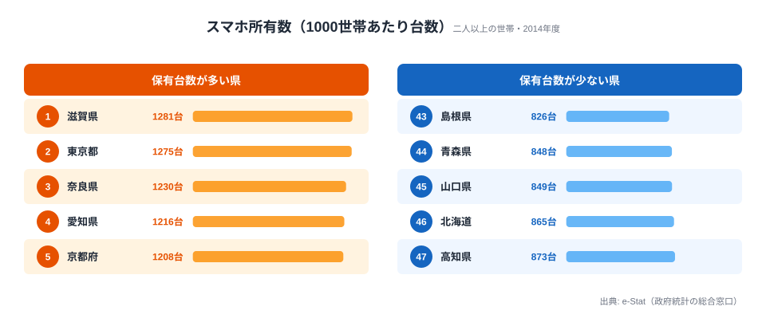

「スマホをいちばん持っているのは東京だろう」──そう思って 47 都道府県のデータを開くと、首位は東京ではありませんでした。2014 年度、二人以上の世帯 1000 世帯あたりのスマートフォン所有台数で先頭に立ったのは **滋賀県の 1281 台**です。東京都は 1275 台で、わずか 6 台届かず 2 番手に甘んじました。

ここでいう「1000 世帯あたりの台数」とは保有率（%）ではなく、**1000 世帯が合計で何台のスマホを持っているか**を表します。滋賀の 1281 台は、1 世帯あたり平均 1.28 台のスマホがある計算です。一方で最下位の **島根県は 826 台**（1 世帯あたり 0.83 台）でした。最大と最小では約 **1.5 倍**（1281 ÷ 826 ≒ 1.55）の開きがあります。

この記事で見えてくるのは、「デジタル格差は大都市 vs 地方という単純な構図ではない」という点です。上位には東京・大阪・神奈川といった大都市圏が並ぶ一方で、それを上回ったのは滋賀・奈良・京都という近畿の周辺県でした。なぜこの並びになるのかを、データに即して読み解いていきます。

> [!NOTE]
> この指標は「保有率（%）」ではなく **1000 世帯あたりの所有台数（台）** です。1000 を超える値は「1 世帯あたり平均 1 台超」を意味し、1 世帯で複数台を持つ世帯が多い地域ほど値が大きくなります。対象は「二人以上の世帯」で単身世帯を含まないため、世帯人数の多寡が順位に影響しやすい点に注意して読んでください。

## スマホ保有数の上位と下位

まず全体像を、保有台数が多い 5 県と少ない 5 県のカード型で押さえます。

<source-link href="/ranking/smartphone-ownership-multi-person-households-per-1000">スマートフォン所有数量ランキングをもっと見る</source-link>

首位の[滋賀県](/areas/25000)（1281 台）に対し、2 番手の東京は 1275 台で差はわずか 6 台。続く奈良（1230 台）・愛知（1216 台）・京都（1208 台）と、近畿と中京の県が上位を占めます。**滋賀・奈良・京都・大阪**という近畿勢が上位 10 県の中に 4 県も入り、首都圏の東京・埼玉・神奈川・茨城と肩を並べています。先頭を譲ったのが東京だった点は象徴的です。さらに 10 位には **福井県**（1160 台）が入っており、「上位＝大都市」という先入観を裏切る顔ぶれになっています。全 47 県の順位は[スマートフォン所有数量ランキング](/ranking/smartphone-ownership-multi-person-households-per-1000)で確認できます。

下位に目を移すと、最下位の島根（826 台）、青森（848 台）、山口（849 台）と、人口減少や高齢化が進む地域が並びます。上位が 1160〜1281 台に集中するのに対し、下位は 826〜873 台あたりに沈んでいます。世帯あたり 1 台前後で頭打ちになっている地域との差が、そのまま順位差として表れています。

> [!TIP]
> 「1000 世帯あたり台数」が 1000 を超える県は、1 世帯で複数台を所有する世帯が多いことを示します。世帯あたり 1 台超か 1 台未満かが、上位と下位を分ける境目になっています。順位の絶対値より「1 世帯に何台あるか」という密度の視点で見ると、地域ごとの普及の厚みがつかみやすくなります。

## 最下位グループはどこに集まるのか

最下位の **[島根県](/areas/32000)（826 台）** をはじめ、青森（46 位・848 台）・高知（43 位・873 台）など、人口減少と高齢化が進む地域が下位に集まっています。なかでも注目したいのは **北海道（44 位・865 台）** です。札幌という大都市を抱えながらも、広大な面積と高齢世帯の多い農村部を含む道全体の平均では下位に沈みました。大都市を持つことが、必ずしも世帯あたりの保有台数を押し上げるわけではないとわかります。

山口（45 位・849 台）が下位に入っている点も、瀬戸内工業地帯を抱える県という印象とは裏腹で、県全体の世帯構成が反映された結果と読めます。下位グループに共通するのは「大都市の有無」より「高齢夫婦世帯の比率の高さ」だと考えられます。

> [!WARNING]
> 下位の値が低い背景には、対象が「二人以上の世帯」である点が関わります。高齢の夫婦世帯ではスマホよりフィーチャーフォン（ガラケー）の所有が残りやすく、世帯あたりの台数が伸びにくい傾向があります。また 2014 年度はスマホ普及の途上期であり、地域差が大きく出た時期です。最新年の数値ではないため、現在の保有状況とは異なる可能性があります。

## デジタル格差は「大都市 vs 地方」ではなかった

このランキングの最大の発見は、上位の主役が東京ではなく **近畿の周辺県（滋賀・奈良・京都）** だったことです。なぜこの並びになるのか、データから読める構造を 3 つに整理します。

**1. 上位は「大都市の通勤圏」が強い。** 滋賀（1 位）と奈良（3 位）は、それぞれ京阪神・大阪のベッドタウンです。働く世代の子育て世帯が多く、世帯人数が比較的多いことで「世帯あたりの台数」が押し上げられたと考えられます。同様に首都圏の埼玉（6 位・1178 台）・神奈川（7 位・1175 台）・茨城（9 位・1166 台）も、通勤圏として上位に並んでいます。

> [!NOTE]
> [仮説] 滋賀・奈良が東京・大阪を上回る要因として「世帯人数の多さ（複数台所有）」が効いている可能性があります。本指標は世帯あたりの台数のため、家族人数が多いほど 1 世帯の合計台数が増えやすい構造です。世帯人数別の検証データが別途必要で、本記事のデータだけでは断定できません。

**2. 下位は人口減少・高齢化地域に集中する。** 島根（47 位）・青森（46 位）・高知（43 位）はいずれも高齢化率が高く、人口減少が続く県です。二人以上世帯のうち高齢夫婦世帯の比率が高いほど、世帯あたりのスマホ台数は伸びにくくなります。下位の顔ぶれは、所得や産業構造というより世帯構成によって決まっていると読めます。

**3. 上下の差は約 1.5 倍にとどまる。** 注目したいのは開きの「小ささ」です。所得や物価の地域差が数倍に開く指標が多いなか、スマホ所有台数は首位 1281 台と最下位 826 台で **約 1.55 倍**でした。デジタル機器は全国に広く行き渡っており、「持つ／持たない」の断絶ではなく「1 世帯に何台あるか」という程度の差にとどまっていることがわかります。デジタル格差を語るときに思い浮かべがちな大きな断絶は、保有の量という側面では生じていなかったのです。

## まとめ

- 首位は **滋賀県 1281 台**（二人以上の世帯 1000 世帯あたり、2014 年度）。東京都は 1275 台で 2 番手でした。
- 最下位は **島根県 826 台**。首位との開きは **約 1.5 倍**（1281 ÷ 826 ≒ 1.55）です。
- 上位 10 県のうち近畿が 4 県（滋賀・奈良・京都・大阪）を占め、大都市圏というより**通勤圏・近畿周辺県**が強い分布でした。
- 下位は **島根・青森・高知** など人口減少・高齢化地域に集中し、北海道も 44 位と低い位置でした。
- 本指標は保有率（%）ではなく **1000 世帯あたり所有台数（台）** であり、1000 超は 1 世帯平均 1 台超を意味します。

世帯あたりの消費や所得など、近畿の周辺県が上位に来る背景を別の角度から見たい場合は、[経済カテゴリのランキング一覧](/category/economy)もあわせてご覧ください。

## データ出典

- 総務省統計局「社会・人口統計体系」（statsDataId: 0000010212、e-Stat 経由で整備）
- 対象: 二人以上の世帯 / 単位: 1000 世帯あたり所有台数（台）/ 集計年度: 2014 年度
