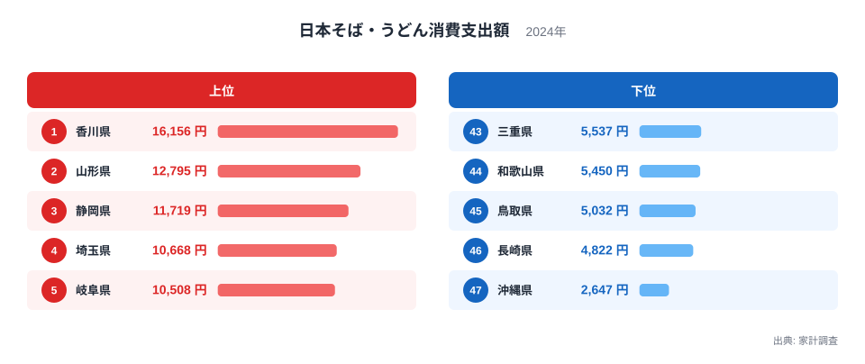
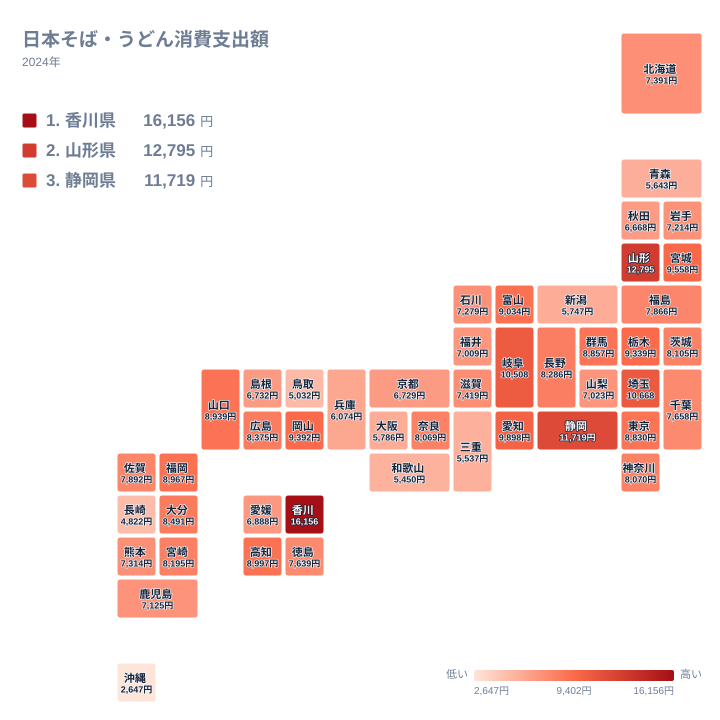

うどん県として知られる香川県は、家計調査による日本そば・うどん消費支出額でも全国1位に立っています。ただしその差は想像以上に大きく、最下位の沖縄県と比べると6倍以上の開きがあります。うどんの本場として名高い香川県が突出している一方で、なぜ沖縄県はこれほど支出額が少ないのでしょうか。47都道府県の実データから、そば・うどんをめぐる地域差の背景を読み解いていきます。

## 日本そば・うどん外食費のランキング

<source-link href="/ranking/soba-udon-dining-consumption-expenditure">日本そば・うどん消費支出額ランキングをもっと見る</source-link>

家計調査による日本そば・うどん消費支出額で全国1位となっているのは香川県で、年間16,156円を支出しています。2位は山形県で12,795円、3位は静岡県で11,719円と続き、4位の埼玉県は10,668円、5位の岐阜県は10,508円です。1位の香川県は、2位以下の県を大きく引き離す突出した数値になっています。1位の香川県について詳しく知りたい方は[香川県のデータ](/areas/37000)もあわせてご覧ください。

上位10県をあらためて見ると、香川県、山形県、静岡県、埼玉県、岐阜県に続き、6位の愛知県、7位の宮城県、8位の岡山県、9位の栃木県、10位の富山県が並びます。四国・中部・関東・東北の各地域からまんべんなく県が入っており、支出額の高さが特定の地方だけに偏っているわけではないことがわかります。

一方で最も支出額が少ないのは沖縄県で、2,647円にとどまっています。46位の長崎県は4,822円、45位の鳥取県は5,032円、44位の和歌山県は5,450円、43位の三重県は5,537円と、下位の県はいずれも西日本や九州・沖縄地方に多く見られます。1位の香川県と最下位の沖縄県を比べると、支出額には約6.1倍の開きがあります。この指標は都道府県庁所在市の二人以上世帯を対象にした外食としての支出額なので、自宅での調理や購入分の消費は含まれていません。

> [!NOTE]
> 日本そば・うどん消費支出額は家計調査の「外食」分類にあたる支出額です。スーパーなどで生麺や乾麺を購入して自宅で調理する分は含まれておらず、そば店やうどん店で食べた分だけを反映した数値である点に注意が必要です。

## 地理分布で見る東西の差

地図で見ると、支出額が多い県は四国から中部・関東にかけて広く分布しており、特に香川県を中心とした四国地方と、埼玉県や東京都といった首都圏で高い水準が続いています。一方で九州や沖縄では、支出額が低い県が目立ちます。46位の長崎県、45位の鳥取県だけでなく、38位の秋田県や39位の兵庫県のように、必ずしも東西で単純に分かれているわけではなく、県ごとの食文化の違いが色濃く反映されている様子がうかがえます。

> [!WARNING]
> このデータは都道府県庁所在市に住む二人以上世帯だけを対象にした調査です。同じ県でも地域によって食文化には差があるため、県庁所在市以外の実態をそのまま示しているわけではない点に留意してください。

## なぜ香川がこれほど突出しているのか

香川県が突出して高い背景には、讃岐うどんという確立された食文化があります。香川県には数多くのうどん専門店が集まっており、地元では日常的にうどんを食べる習慣が根付いています。製麺業が地場産業として発達してきた歴史も長く、県全体で「うどん県」というブランドを打ち出すほど、うどんが県の生活に深く組み込まれています。こうした食文化の厚みが、家計調査の支出額にも表れていると考えられます。

2位の山形県も、そばの名産地として知られる県です。冷涼な気候がそばの栽培に適しており、板そばと呼ばれる独自の食べ方が県内各地で親しまれてきました。埼玉県や東京都、岐阜県といった上位の県にも、古くからそば店やうどん店が根付いてきた土地柄があり、外食としてのそば・うどん文化が根強く残っている点が共通しています。山形県の他の統計データは[山形県のデータ](/areas/06000)からも確認できます。

> [!TIP]
> 支出額の順位を見るときは、単純な倍率だけでなく、その県にどのような麺文化が根付いているかを合わせて考えると、数字の背景がより立体的に見えてきます。

## 関連する食文化との対比

最下位の沖縄県が突出して低い理由の一つとして考えられるのは、沖縄県には沖縄そばという独自の麺料理があることです。沖縄そばは小麦粉のみで作られる麺で、家計調査における「日本そば・うどん」という分類には含まれない別の食文化として扱われています。県内で麺料理を食べる機会自体は多くても、そのほとんどが沖縄そばに向かっているため、日本そば・うどんの支出額としては低く出やすいと考えられます。

また下位に並ぶ長崎県や鳥取県、和歌山県といった県では、ちゃんぽんや皿うどん、鳥取和牛を使った郷土料理など、麺料理以外の外食文化が発達していることも影響している可能性があります。地域ごとに根付いた食文化の違いが、日本そば・うどんという特定の品目の支出額に色濃く表れていると言えます。

このように、日本そば・うどん消費支出額のランキングは、単なる好みの差ではなく、それぞれの県が長い年月をかけて育んできた麺文化の厚みを映し出しているとも読めます。うどんの本場である香川県と、そばの名産地である山形県が上位を占める一方で、独自の郷土麺文化を持つ沖縄県が下位に位置するという構図は、日本各地の食文化の多様性をよく表していると言えるでしょう。

## まとめ

- 日本そば・うどん消費支出額の1位は香川県で16,156円、最下位は沖縄県で2,647円です。
- 1位の香川県と最下位の沖縄県には、約6.1倍の開きがあります。
- 上位には香川県、山形県、静岡県、埼玉県、岐阜県が並び、うどんやそばの食文化が根付いた県が目立ちます。
- 下位には沖縄県、長崎県、鳥取県、和歌山県、三重県が並び、麺料理以外の郷土食文化が発達している地域が多く見られます。
- 沖縄県の低さには、沖縄そばという独自の麺文化が別分類として扱われている点が関係していると考えられます。[同じカテゴリの統計一覧](/category/economy)では、家計調査に基づく他の消費データも比較できます。

## データ出典

- 日本そば・うどん消費支出額: 家計調査（2024年）
