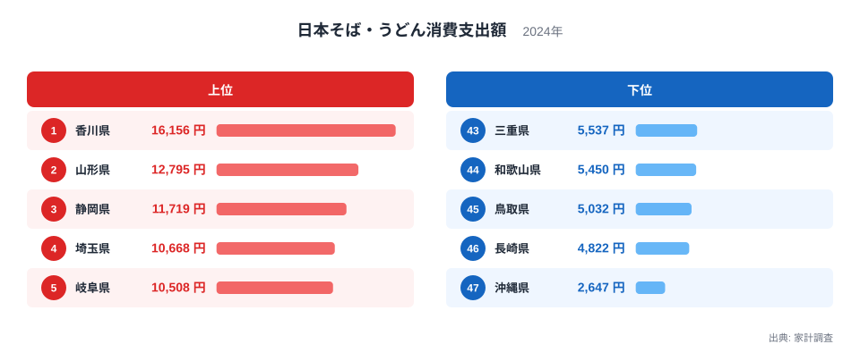
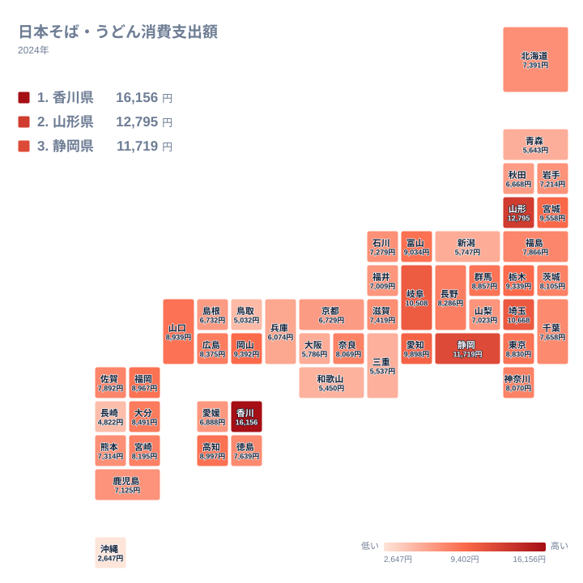

うどん県として知られる香川県は、家計調査による日本そば・うどん消費支出額でも全国1位に立っています。ただしその差は想像以上に大きく、最下位の沖縄県と比べると6倍以上の開きがあります。うどんの本場として名高い香川県が突出している一方で、なぜ沖縄県はこれほど支出額が少ないのでしょうか。47都道府県の実データから、そば・うどんをめぐる地域差の背景を読み解いていきます。

## 日本そば・うどん外食費のランキング

<source-link href="/ranking/soba-udon-dining-consumption-expenditure">日本そば・うどん消費支出額ランキングをもっと見る</source-link>

家計調査による2024年の日本そば・うどん消費支出額で全国1位となっているのは香川県で、年間16,156円を支出しています。2位は山形県で12,795円、3位は静岡県で11,719円と続き、4位の埼玉県は10,668円、5位の岐阜県は10,508円です。1位の香川県は、2位以下の県を大きく引き離す突出した数値になっています。1位の香川県について詳しく知りたい方は[香川県のデータ](/areas/37000)もあわせてご覧ください。

上位10県をあらためて見ると、香川県、山形県、静岡県、埼玉県、岐阜県に続き、6位の愛知県、7位の宮城県、8位の岡山県、9位の栃木県、10位の富山県が並びます。四国・中部・関東・東北の各地域からまんべんなく県が入っており、支出額の高さが特定の地方だけに偏っているわけではないことがわかります。

一方で最も支出額が少ないのは沖縄県で、2,647円にとどまっています。46位の長崎県は4,822円、45位の鳥取県は5,032円、44位の和歌山県は5,450円、43位の三重県は5,537円と、下位5県はいずれも西日本(九州・沖縄を含む)の県です。1位の香川県と最下位の沖縄県を比べると、支出額には約6.1倍の開きがあります。なお、この記事で「47市の平均」と書くときは、47都道府県庁所在市の値を単純に平均した7,954円(生うどん・そば消費量は9,918g)を指し、家計調査が公表する全国平均とは別の数字です。この指標は都道府県庁所在市の二人以上世帯を対象にした外食としての支出額なので、自宅での調理や購入分の消費は含まれていません。

> [!NOTE]
> 日本そば・うどん消費支出額は、家計調査の外食(食事代)のうち、品目「日本そば・うどん」に分類された支出額です。品目は店の業態ではなく料理の種類で分けられるため、「そば店・うどん店での支出」と同じとは限りません。スーパーなどで生麺や乾麺を購入して自宅で調理する分は含まれません。

## 地理分布で見る県ごとのばらつき

地図で見ると、1位から14位までの上位の帯には、四国の香川県が1位、高知県が11位、中国の岡山県が8位、山口県が13位、九州の福岡県が12位、中部の静岡県が3位、岐阜県が5位、愛知県が6位、富山県が10位、関東の埼玉県が4位、栃木県が9位、群馬県が14位、東北の山形県が2位、宮城県が7位で入ります。一方、下位の帯は、沖縄県が47位、長崎県が46位、鳥取県が45位、和歌山県が44位、三重県が43位、青森県が42位、新潟県が41位、大阪府が40位、兵庫県が39位、秋田県が38位と続き、西日本にも東日本にも広がっています。

地方単位で見ても、まとまった傾向は読み取れません。四国で47市の平均である7,954円を上回るのは香川県と高知県の2県で、徳島県は26位で7,639円、愛媛県は35位で6,888円と平均を下回ります。九州では福岡県が12位、大分県が16位、宮崎県が19位で平均を上回る一方、長崎県は46位で、沖縄県は最下位です。東北でも山形県が2位、宮城県が7位と上位に入る一方、秋田県は38位、青森県は42位です。東日本の山形県と西日本の香川県がともに上位にあり、東日本の秋田県と西日本の鳥取県がともに下位にあるように、支出額は東西や地方で単純に分かれるのではなく、県ごとにまだらに分かれています。

> [!WARNING]
> このデータは都道府県庁所在市に住む二人以上世帯だけを対象にした調査です。同じ県でも地域によって食文化には差があるため、県庁所在市以外の実態をそのまま示しているわけではない点に留意してください。

## 香川県はどれだけ突出しているのか

香川県の16,156円は、2位の山形県の12,795円より3,361円多く、47市の平均である7,954円の約2.0倍にあたります。1位が2位を大きく引き離していることが、このランキングの最大の特徴です。**[仮説]** 讃岐うどんの外食文化が根付いていることが背景にある可能性がありますが、店舗数・利用頻度・1食あたりの価格といったデータはこの記事にはなく、支出額のどこまでを説明できるかは検証できていません。

2位の山形県は、後述するように生うどん・そば消費量も11,453gと47市の平均である9,918gを上回っており、外食でも自宅用でも麺類の購入が多い県です。3位の静岡県は11,719円、4位の埼玉県は10,668円、5位の岐阜県は10,508円、6位の愛知県は9,898円ですが、これらの県についても、なぜ高いのかを示す数値は、このデータにはありません。山形県の他の統計データは[山形県のデータ](/areas/06000)からも確認できます。

> [!TIP]
> 支出額の順位を見るときは、単純な倍率だけでなく、その県にどのような麺文化が根付いているかを合わせて考えると、数字の背景がより立体的に見えてきます。

## なぜ沖縄県は最下位なのか：沖縄そばは自宅用の分類では「中華麺」です

沖縄県の2,647円は、1位の香川県の16,156円と比べて6.1倍の差があるだけでなく、47市の平均である約7,954円の3分の1ほどにとどまります。ここで注目したいのは、最下位だけが飛び抜けて低いことです。46位の長崎県は4,822円、45位の鳥取県は5,032円、44位の和歌山県は5,450円、43位の三重県は5,537円で、下位の2位から5位までは約700円の幅に収まっています。これに対して沖縄県は、次に低い県との差が2,175円と、その幅の約3倍も離れており、下位グループの中でも一段外れた位置にあります。

この飛び抜けた低さを説明する候補として、まず思い浮かぶのが沖縄そばです。沖縄そばは小麦粉の太い麺を使う独自の料理です。家計調査の収支項目分類(2020年1月改定と2025年1月改定のどちらも同じ記載)を確認すると、自宅で調理する麺の品目では、沖縄そばは品目133「中華麺」の例示(生中華そば、チャンポン玉、冷麺、沖縄そば)に入っており、品目130「生うどん・そば」(玉うどん、玉そば、きしめん、ほうとう)には入りません。

一方、外食の品目390「日本そば・うどん」には定義も例示も書かれておらず、外食で食べた沖縄そばがどの品目に計上されるのかは、分類表の例示からは分かりません。外食の品目391「中華そば」には「ラーメン、焼きそば、皿うどん」の例示があり、沖縄そばは載っていません。**[仮説]** 外食の沖縄そばが「日本そば・うどん」以外の品目(品目391や、390と391に分類されない麺類の外食を受ける品目392など)に計上されているなら、沖縄県の値は低く出ますが、これは分類表だけでは確かめられません。

自宅用の指標も見ておきます。[生うどん・そば消費量](/ranking/fresh-udon-soba-consumption-quantity)では、沖縄県は4,378gで最下位です。47市の平均である約9,918gの半分に届かず、次に低い熊本県の6,638gと比べても大きく離れています。ただし、品目130「生うどん・そば」も沖縄そばを含まない定義なので、この最下位は、外食の低さが分類の影響かどうかを判断する材料にはなりません。どちらの指標も沖縄そばを含まない以上、両方が低いことは分類の影響と矛盾しないからです。ここから言えるのは、「日本そば・うどん」という品目で見る限り、沖縄県は外食でも自宅用でも最も少ないという点までで、沖縄県の麺類の消費が少ないとは読み取れません。

長崎県も、外食費は沖縄県に次ぐ低さで、生うどん・そば消費量も6,894gと低めに並び、どちらの指標でも低めです。外食の分類では皿うどんが品目391「中華そば」の例示に入っているため、ちゃんぽんや皿うどんのように、日本そば・うどんとは別の麺料理が根づいていることが背景にある **[仮説]** も考えられますが、この指標だけでは確認できません。

## 「そば県」と「うどん県」の意外な順位：長野18位、新潟41位

「そばどころ」のイメージと外食費の順位は、きれいには重なりません。長野県は18位で8,286円と、47市の平均を約330円上回る程度です。新潟県は41位で5,747円にとどまり、2位の山形県の12,795円の半分にも届きません。出雲そばの島根県は36位、越前そばの福井県は34位で、そばの名産地として知られる県が外食費では下位寄りに並んでいます。

この順位は、自宅で食べる生麺の量と並べると見え方が変わります。生うどん・そば消費量では、長野県が12,213g、島根県が12,016g、新潟県が11,014gで、3県とも47市の平均(約9,918g)を上回り、上位の3分の1ほどに入ります。外食費の順位と見比べると、長野県は18位から、島根県は36位から、新潟県は41位から、それぞれ大きく順位が上がっています。つまり、これらの県は外で食べる金額こそ伸びていないものの、自宅用の生麺はよく買われています。一方、福井県の生うどん・そば消費量は8,553gで平均を下回り、外食費と同じく低めです。山形県は外食費で2位、生うどん・そば消費量も11,453gと平均を上回っており、外でも家でも麺類をよく食べる県だといえます。

ただし、外食費は金額、生うどん・そば消費量は重さの指標なので、順位をそのまま同じ物差しで比べることはできません。また、生うどん・そば消費量は玉麺・半生・冷凍の生麺で、乾麺(品目131)は含まず、そばとうどんは合算です。長野県・島根県・新潟県の自宅用の高さが、そばによるのかうどんによるのかは、このデータからは読めません。新潟県や長野県の外食費が低いのが、そば店に通う回数の少なさによるのか、1食あたりの価格の違いによるのかも、このデータからは切り分けられません。確かなのは、外食費の順位だけで「そばを食べる県」かどうかを判断すると、実際の麺の食べ方を見誤りかねないという点です。

## 関東圏が意外に健闘：埼玉4位、東京15位の背景

関東の1都6県を並べると、埼玉県が4位で10,668円、栃木県が9位で9,339円、群馬県が14位で8,857円、東京都が15位で8,830円、茨城県が20位で8,105円、神奈川県が21位で8,070円、千葉県が25位で7,658円です。47市の平均の約7,954円を下回るのは千葉県だけで、7都県のうち6都県が平均以上に入ります。とくに北関東の栃木県・群馬県・茨城県は、3県とも47市の平均を上回り、上位の半分に入っています。

埼玉県は3位の静岡県の11,719円に次ぐ水準で、1位の香川県とは5,488円の差があるものの、東京都の8,830円より約1.2倍高くなっています。埼玉県にはうどんの食文化があるため日常的に店を使う世帯が多い **[仮説]**、東京都は外食の選択肢が多く、そば・うどん以外へ支出が分散する一方で昼食需要が支出を押し上げる **[仮説]**、といった説明は考えられますが、どちらもこのデータだけでは検証できません。

近畿は関東と対照的です。兵庫県が39位で6,074円、大阪府が40位で5,786円、和歌山県が44位で5,450円と、下位寄りの県が目立ちます。ただし近畿でも、奈良県は22位で8,069円、滋賀県は27位で7,419円と平均前後にあり、京都府は37位で6,729円です。「近畿は麺類の外食が少ない」と一括りにはできず、同じ地方の中でも県によって大きく分かれています。

> [!TIP]
> 地方ごとの傾向を読むときは、県庁所在市の二人以上世帯という調査の範囲を忘れないことが大切です。関東の上位に出る埼玉県はさいたま市、茨城県は水戸市の世帯だけを反映しており、県全体の食習慣と同じとは限りません。

## まとめ

- 日本そば・うどん消費支出額の1位は香川県で16,156円、最下位は沖縄県で2,647円です。
- 1位の香川県と最下位の沖縄県には、約6.1倍の開きがあります。
- 上位には香川県、山形県、静岡県、埼玉県、岐阜県が並び、うどんやそばの食文化が根付いた県が目立ちます。
- 下位には沖縄県、長崎県、鳥取県、和歌山県、三重県が並び、沖縄県だけが、ほかの下位4県の群れから大きく離れています。
- 沖縄そばは自宅用の分類では品目133「中華麺」に入り、外食の「日本そば・うどん」に入るかは分類表の例示から分かりません。沖縄県の低さに分類が関係しているかは **[仮説]** のままで、生うどん・そば消費量の最下位は、それを否定も裏づけもしません。長野県・島根県・新潟県は外食費より自宅用の生麺の順位が高く、「そばどころ」は外食費だけでは測れません。[同じカテゴリの統計一覧](/category/economy)では、家計調査に基づく他の消費データも比較できます。
