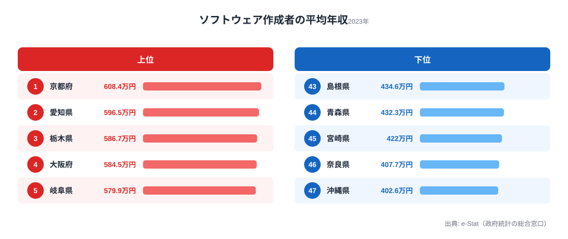
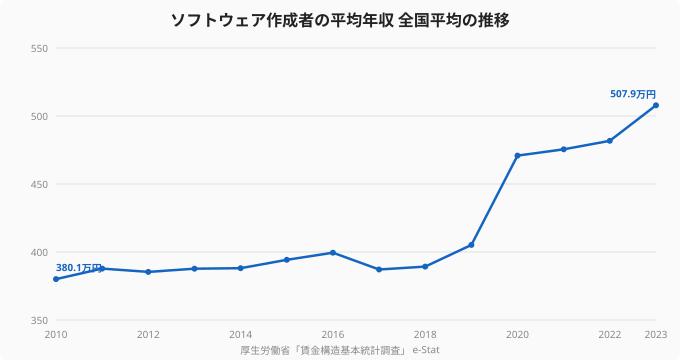

「ソフトウェアエンジニアとして年収を上げたいなら、やっぱり東京だろう」——IT人材の求人も給与水準も東京に集中している、という直感は多くの人が共有しているはずだ。ところが厚生労働省「賃金構造基本統計調査」の2023年データを都道府県別に並べると、その直感は裏切られる。ソフトウェア作成者の平均年収が最も高いのは**京都府の608.4万円**。東京都は571.7万円で**6位**にとどまり、頂点ではない。

一方、最下位は沖縄県の402.6万円。トップの京都府とは約1.5倍の開きがある。同じ「ソフトウェアを作る仕事」でも、住む県によって年収の前提がこれだけ違う。本記事では、2023年のソフトウェア作成者年収を47都道府県で読み解き、なぜ東京が1位ではないのか、そして地域による年収格差がどこから生まれるのかという構造に踏み込む。

> [!NOTE]
> データは厚生労働省「賃金構造基本統計調査」のソフトウェア作成者（システムエンジニア・プログラマ等を含む職種区分）の平均年収です。きまって支給する現金給与額×12＋年間賞与から算出した推計値で、企業規模10人以上の事業所が対象。あくまで都道府県内の事業所所在地ベースの平均であり、個々人の年収レンジの広さは反映されません。

## ソフトウェアエンジニア年収ランキングの全体像 — 京都と沖縄で約1.5倍

まず2023年の全体像を押さえる。1位は京都府（608.4万円）、最下位は沖縄県（402.6万円）。その差は約1.5倍で、上位は京都・愛知・栃木・大阪・岐阜と、必ずしも「大都市圏の中心」だけが並ぶわけではない点が目を引く。

<source-link href="/ranking/software-engineer-annual-income">ソフトウェア作成者の平均年収ランキングを詳しく見る</source-link>

| 順位 | 都道府県 | 平均年収 |
|---:|---|---:|
| 1 | 京都府 | 608.4万円 |
| 2 | 愛知県 | 596.5万円 |
| 3 | 栃木県 | 586.7万円 |
| 4 | 大阪府 | 584.5万円 |
| 5 | 岐阜県 | 579.9万円 |
| 6 | 東京都 | 571.7万円 |
| … | … | … |
| 45 | 宮崎県 | 422.0万円 |
| 46 | 奈良県 | 407.7万円 |
| 47 | 沖縄県 | 402.6万円 |

## なぜ東京がトップではないのか — 「平均値」が映すものと映さないもの

IT求人の数では圧倒的な東京が、平均年収では6位に沈む。ここには「平均値」という指標の性質が関係している。

第一に、賃金構造基本統計調査の数値は**事業所単位の平均**であり、スタートアップから大手SIerの下請けまで、賃金水準の異なる事業所が大量にある東京では平均が中位に引き寄せられやすい。第二に、京都・愛知・栃木のように特定の大手メーカーや研究開発拠点を抱える県では、相対的に高給の正社員エンジニアの比率が高く、平均を押し上げる。

> [!WARNING]
> 「東京の方が稼げない」という結論には飛びつかないこと。平均年収は分布の中心を示すだけで、東京には1,000万円を超える高年収エンジニアも、それ以上に多数存在する。重要なのは「自分のスキルと働き方なら、どの市場で評価されるか」であって、県の平均値は出発点に過ぎない。

つまりこのランキングは「どの県に住めば自動的に高年収になるか」ではなく、「地域の賃金水準には構造的な差がある」という事実を示している。生活コスト（特に家賃）まで考慮すれば、額面の順位と手元に残る金額の順位はさらに入れ替わる。

<source-link href="/ranking/avg-salary-all-prefecture">県別の平均給与（全産業）ランキングと比べてみる</source-link>

## 全国平均は13年で約1.3倍に — エンジニア賃金は上昇局面

地域差と並んで見逃せないのが、時系列の変化だ。ソフトウェア作成者の全国平均年収は、2010年の380.1万円から2023年の507.9万円へと、約1.3倍に上昇している。とりわけ2019年（405.2万円）から2020年（470.9万円）にかけての伸びが大きい。

この上昇は、DX需要の高まりとエンジニア不足を背景に、IT人材の市場価値が全国的に底上げされてきたことを映している。裏を返せば、**長く同じ職場にとどまっているほど、上昇した市場相場と自分の給与のギャップに気づきにくい**。相場が動いている局面ほど、自分の年収が「いまの市場価値」に見合っているかを確認する意味は大きい。

## 年収だけでなく「リモート」と「残業」も県で違う

エンジニアの働き方を考えるとき、年収と同じくらい重要なのが「どこで働けるか」「どれだけ働くか」だ。これらにも明確な地域差がある。

テレワークの普及率は都市部と地方で大きく開き、労働時間（残業の多寡）も県によって異なる。年収が地域に縛られるのと同様に、リモートで働けるかどうかも、これまでは「住んでいる場所」に強く依存してきた。

<source-link href="/ranking/telework-rate">都道府県別テレワーク実施率ランキングを見る</source-link>

<source-link href="/ranking/monthly-average-actual-working-hours-male">月間平均実労働時間（男性）ランキングを見る</source-link>

> [!TIP]
> 「年収は地域の相場で頭打ち」「リモートできる求人が地元にない」「残業が常態化している」——この3つは、いずれも**勤務地に縛られる働き方**が前提になっている。フルリモート前提の求人を選べば、地方に住みながら都市部水準の年収を狙う、という選択肢が現実的になる。

## 自分の年収は「地域の相場」で決まっていないか

ここまで見てきたように、ソフトウェアエンジニアの年収は (1) 住む県、(2) リモート可否、(3) 労働時間という、本人のスキルとは別の「環境要因」に大きく左右されている。京都608万・沖縄402万という1.5倍差は、その象徴だ。

だが、全国平均が上昇を続けている事実が示すとおり、市場全体ではエンジニアの価値は上がっている。地域の相場や現職の給与テーブルに縛られず、リモート・年収・残業の条件を見直すことは、上昇している市場価値を自分の手取りに反映させる最短ルートになりうる。エンジニアに特化した転職エージェントを使えば、年収レンジやリモート可否、残業実態といった条件で求人を絞り込めるため、まずは「いまの自分の市場価値」を客観的に把握するところから始めるとよい。

### 関連記事・次に読むデータ

- [システムコンサルタントの年収ランキング](/ranking/system-consultant-annual-income) — より上流の高年収職はどこに多いか
- [県別の世帯あたり年間収入ランキング](/ranking/annual-income-per-household) — エンジニア年収を生活水準の文脈で見る
- [京都府のエリアプロフィール](/areas/26000) — 1位の京都はどんな経済構造か
- [沖縄県のエリアプロフィール](/areas/47000) — 最下位の沖縄の産業・所得の背景
- [労働・賃金カテゴリの統計一覧](/category/laborwage) — 賃金・雇用の関連ランキングをまとめて見る

## データ出典

- 厚生労働省「賃金構造基本統計調査」（e-Stat 統計データ、2010〜2023年）
- ソフトウェア作成者の平均年収は、きまって支給する現金給与額×12＋年間賞与特別給与額から算出した推計値（企業規模10人以上）
