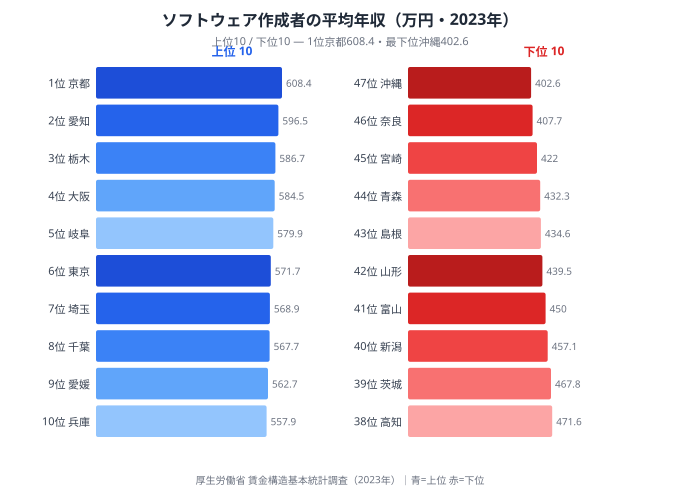
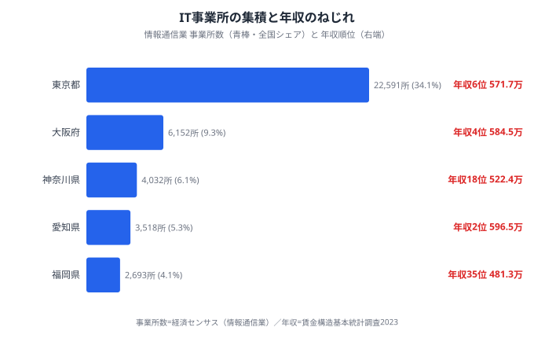
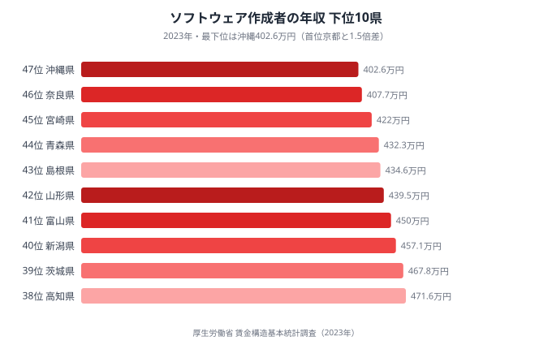
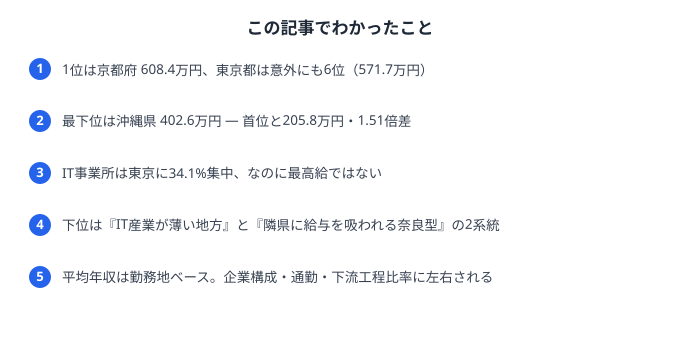

「IT エンジニアとして一番稼げるのは、やっぱり東京だろう」──そう考える人は多いはずです。実際、情報通信業の事業所の **約3割（34.1%）が東京都に集中** しており、IT 産業の中心が首都圏であることは間違いありません。

ところが、ソフトウェア作成者（プログラマ・システムエンジニア等）の **平均年収** を都道府県別に並べると、意外な順位が現れます。2023年の賃金構造基本統計調査によれば、1位は **京都府の608.4万円**。東京都は **571.7万円で6位** にとどまり、京都とは36.7万円の差をつけられているのです。

最下位の沖縄県（402.6万円）と京都府の差は **205.8万円、倍率にして1.51倍**。同じ職種でも住む県によって年収が1.5倍変わるこの構造は、どこから生まれるのでしょうか。

> [!NOTE]
> ここでの「ソフトウェア作成者」は賃金構造基本統計調査（厚生労働省）の職種区分で、プログラマやシステムエンジニアを含むソフトウェア開発従事者を指します。年収は「きまって支給する現金給与額×12＋年間賞与」で算出した推計値で、勤務先の所在地ベースで集計されています。

## ソフトウェア作成者の年収ランキング──首位は京都

<data-source url="https://www.mhlw.go.jp/toukei/itiran/roudou/chingin/kouzou/" label="厚生労働省 賃金構造基本統計調査（2023年）"></data-source>

上位を見ると、1位の京都府（608.4万円）に続いて、**愛知県（596.5万円）が2位、栃木県（586.7万円）が3位、大阪府（584.5万円）が4位、岐阜県（579.9万円）が5位** と並びます。東京都はようやく6位です。

注目すべきは、3位の栃木県・5位の岐阜県・9位の愛媛県（562.7万円）といった、いわゆる IT 集積地とは言いがたい県が上位に食い込んでいることです。一方で、全国の IT 事業所の3割を抱える東京は中位の上にとどまり、IT エンジニアの「数」と「給与水準」は必ずしも一致しないことがわかります。

全国の中央値は500.0万円。三大都市圏に含まれる8県（東京・神奈川・埼玉・千葉・愛知・大阪・京都・兵庫）の順位は1・2・4・6・7・8・10位と上位に集中しますが、その中でも **神奈川県だけは18位（522.4万円）** と沈んでいます。

<source-link href="/ranking/software-engineer-annual-income">ソフトウェア作成者の平均年収 全47都道府県を比較する</source-link>

## なぜ東京が最高給ではないのか──IT事業所の集積とのねじれ

<data-source url="https://www.mhlw.go.jp/toukei/itiran/roudou/chingin/kouzou/" label="厚生労働省 賃金構造基本統計調査（2023年）／総務省・経済産業省 経済センサス（情報通信業 事業所数）"></data-source>

情報通信業の事業所数を見ると、東京都が22,591事業所で全国の34.1%を占め、2位の大阪府（6,152）を大きく引き離して圧倒的1位です。「IT 産業の中心地」としての東京の地位は揺るぎません。

それにもかかわらず東京の平均年収が6位にとどまる背景には、いくつかの構造的な要因が考えられます。

> [!TIP]
> 平均年収は「高給の上級職」だけでなく、若手や派遣・受託の下流工程まで含めた全従事者の平均です。東京には大規模な受託開発・SES（システムエンジニアリングサービス）企業が集中し、経験年数の浅い層や下請け構造の従事者が分母を大きくしている可能性があります。一方、京都・愛知のように特定の有力企業（ゲーム・製造業系 IT・研究開発部門など）が高給の専門職を抱える県では、平均が押し上げられやすい構造です。

> [!NOTE]
> **[仮説]** 京都・愛知・栃木の高さは「特定の大手企業・研究開発拠点が地域の平均を牽引している」可能性がある。検証には事業所規模別・企業別の賃金データが必要で、本記事のデータ（職種別・都道府県別の平均値）だけでは断定できない。

つまり、東京は「IT の仕事が最も多い県」ではあっても「平均的なエンジニアが最も高く評価される県」ではない、というねじれがこのデータには表れています。

<source-link href="/ranking/number-of-establishments-information-communication">情報通信業の事業所数 都道府県ランキングを見る</source-link>

<ad-slot></ad-slot>

## 下位に並ぶ県──通勤と産業構造のダブルパンチ

<data-source url="https://www.mhlw.go.jp/toukei/itiran/roudou/chingin/kouzou/" label="厚生労働省 賃金構造基本統計調査（2023年）"></data-source>

最下位グループは、沖縄県（402.6万円・47位）、奈良県（407.7万円・46位）、宮崎県（422.0万円・45位）、青森県（432.3万円・44位）、島根県（434.6万円・43位）と続きます。

地理的に見ると、地方圏（沖縄・宮崎・青森・島根）と、大都市圏の「ベッドタウン県」（奈良）という、性質の異なる2つのグループが混在しているのが特徴です。

地方圏の県では、高給を支払う大規模 IT 企業や研究開発拠点が乏しく、地元自治体・中小企業向けの受託開発やサポート業務が中心になりやすいことが、平均を押し下げていると考えられます。

> [!WARNING]
> 奈良県（46位）が最下位グループに入る点は注意が必要です。**[仮説]** 奈良県は大阪・京都への通勤者が多い「ベッドタウン」であり、高給のエンジニアは勤務先の大阪府・京都府で集計される一方、奈良県内の事業所には相対的に給与水準の低い職場が残る、という通勤構造の影響が考えられる。神奈川県が三大都市圏で唯一18位と沈むのも同じ構造（都内勤務分が東京に計上）の可能性がある。いずれも勤務地ベース集計の限界によるもので、居住者の実収入とは異なる点に留意してほしい。

このように、ランキング下位は「IT 産業が薄い地方」と「給与が隣県に吸い上げられるベッドタウン」という2つの異なるメカニズムで形成されています。

## まとめ──「数」と「給与」は別の地図

ソフトウェア作成者の平均年収ランキングから見えてきたことを整理します。

- **1位は京都府（608.4万円）**、2位愛知県、3位栃木県と続き、東京都は6位（571.7万円）にとどまる
- 最下位は沖縄県（402.6万円）で、**首位との差は205.8万円・1.51倍**
- 情報通信業の事業所は **東京に34.1%が集中** するが、平均年収の地図とは一致しない
- 下位グループは「IT 産業の薄い地方」と「給与が隣県に吸われるベッドタウン（奈良など）」の2系統
- 平均年収は勤務地ベースの全従事者平均であり、企業構成・通勤・下流工程の比率に大きく左右される

IT 人材の「集まる場所」と「高く報われる場所」は別の地図を描いている──このことは、移住やリモートワークを前提に働き方を考えるエンジニアにとっても、地域の IT 振興を考える自治体にとっても示唆に富むデータと言えるでしょう。

### 関連記事

- [携帯契約数が人口を超える県](/blog/mobile-contracts-over-population)
- [デジタル格差の複合分析](/blog/ict-digital-divide-composite-analysis)
- [通信費が家計を最も圧迫する県](/blog/communication-cost-burden)
