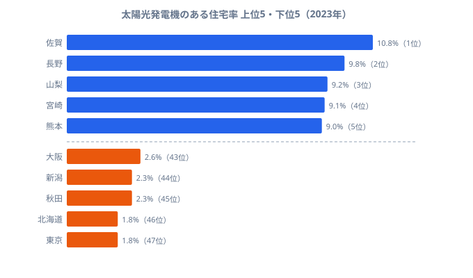
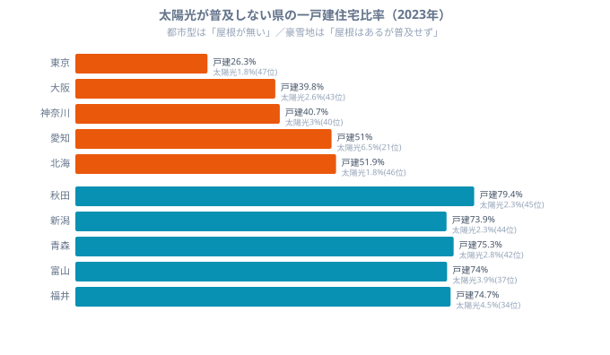
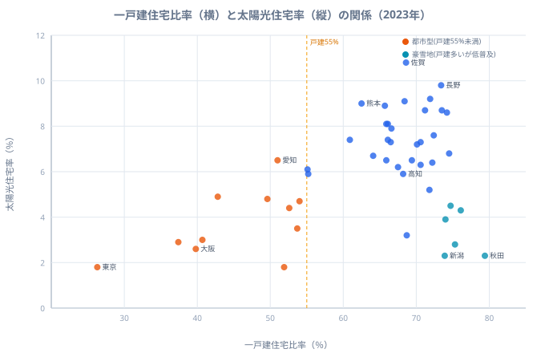
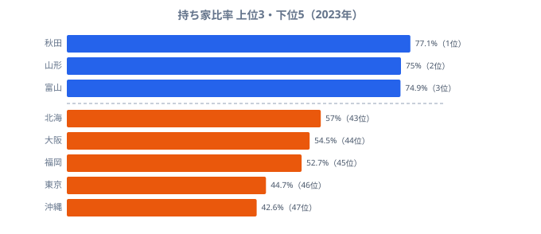

太陽光パネルを載せられるかどうかは、まず「自分の屋根を持っているか」で決まります。屋根が無ければ、どれだけ日が照ろうと、補助制度が手厚かろうと、パネルは載りません。2023年の住宅・土地統計調査でわかる「太陽光発電機のある住宅率」を都道府県別に並べると、この当たり前の前提が、実は順位の下半分をきれいに説明してしまうことが見えてきます。

太陽光発電機のある住宅率とは、各都道府県の住宅のうち太陽光を利用した発電機器（屋根置きパネル等）を備える住宅の割合を指します。1位は[佐賀県](/areas/41000)の10.8%、最下位は[東京都](/areas/13000)と北海道の1.8%で、その差は**6.0倍**にもなります。同じ日本でも、住む県によって屋根の上の景色がここまで変わるのです。

この記事の核心を先にお伝えします。最下位に沈む県には、**一戸建住宅が少ない**という共通点があります。マンション・アパートが中心の都市では、世帯あたりの「載せられる屋根」がそもそも足りません。逆に上位は、屋根を持てる戸建てが多い県に偏っています。ただし「戸建てが多ければ必ず普及する」わけではない点にも、後半で踏み込みます。日射量との関係は[姉妹記事](/blog/sunshine-solar-housing-correlation)に譲り、本記事は**住宅構造（一戸建・持ち家）から普及率を読む**ことに専念します。

## 太陽光住宅率ランキング 上位5と下位5

<source-link href="/ranking/solar-panel-housing-rate">太陽光発電機のある住宅率ランキングをもっと見る</source-link>

上位は1位佐賀県（10.8%）を筆頭に、2位長野県（9.8%）・3位山梨県（9.2%）・4位宮崎県（9.1%）・5位熊本県（9.0%）と続きます。九州北部から中部内陸にかけての県が目立ちます。一方の下位5県は、東京都（1.8%・47位）と北海道（1.8%・46位）が同率で最下位、続いて秋田県（2.3%・45位）・新潟県（2.3%・44位）、大阪府（2.6%・43位）です。

ここで注目したいのは下位の顔ぶれです。東京・大阪という大都市が並ぶ一方で、秋田・新潟という雪国も入っています。性格のまったく異なる県が同じ「最下位グループ」に同居しているのです。この二者を分けて読むことが、太陽光住宅率という指標を理解する鍵になります。まずは大都市側、つまり「屋根が足りない」グループから見ていきます。

> [!NOTE]
> ここでの「住宅率」は世帯数や設備容量（kW）ではなく、**住宅に占める太陽光発電機保有住宅の割合**です。総務省「住宅・土地統計調査」（2023年）に基づきます。分母には太陽光を載せにくい集合住宅も含まれるため、一戸建てが少ない地域は住民の意欲とは無関係に割合が低く出る点に注意してください。

## なぜ下位は都市県なのか：一戸建が少ないと載せる屋根がない

太陽光住宅率の下位を、一戸建住宅比率（同じ2023年・住宅・土地統計調査）と並べて見ると、構造がくっきり浮かびます。

<source-link href="/ranking/detached-house-ratio">一戸建住宅比率ランキングをもっと見る</source-link>

太陽光が普及しない大都市は、軒並み一戸建住宅比率が低い県です。最下位の東京都は一戸建比率が**26.3%（全国最下位の47位）**しかありません。大阪府39.8%（45位）、神奈川県40.7%（44位）、愛知県51.0%（41位）と、太陽光下位の都市はすべて一戸建比率でも下位に沈んでいます。マンション・アパートに住む世帯は屋根を専有していないため、太陽光を載せる物理的な余地がそもそも無いのです。

これは一県の偶然ではありません。一戸建住宅比率が55%を下回る11県（東京・沖縄・大阪・神奈川・福岡・兵庫・愛知・北海道・千葉・京都・埼玉）を集計すると、**太陽光住宅率の平均はわずか3.7%**にとどまります。全国の太陽光上位10県を裏返してみても、すべて一戸建比率55%超の県で占められています。屋根を持てる戸建てが一定割合なければ、太陽光は数字として立ち上がってこない──普及の「足切りライン」が住宅構造にあることが見て取れます。

> [!WARNING]
> 下位に並ぶ都市県の数値を「環境意識が低い」と読むのは適切ではありません。これは全住宅に対する割合なので、集合住宅の多い都市は住民の意欲とは無関係に分母が膨らみ、割合が低く出ます。賃貸住宅では居住者が設置を判断できないという所有構造の問題も重なります。神奈川県が日射に恵まれた太平洋側でありながら3.0%（40位）にとどまるのは、屋根を持てる戸建てが少ないことが主因です。

## 戸建てが多ければ普及するのか：屋根はあるが載らない雪国

ここまでで「一戸建が少ない都市は普及しない」ことがわかりました。では逆に、戸建てが多い県は必ず普及するのでしょうか。答えは「いいえ」です。ここに住宅構造だけでは説明しきれない、もうひとつの構造があります。

一戸建住宅比率と太陽光住宅率を全47都道府県で散布図にすると、両者の関係がはっきりします。

戸建率55%のラインより左側（都市型）には、太陽光率が高い県がひとつもありません。屋根が足りない都市は、例外なく低普及です。ところが55%より右側に目を移すと、点は縦に大きくばらけます。戸建てが多くても太陽光率が3〜10%まで広く散らばっているのです。つまり一戸建住宅比率は普及の**前提条件（足切り）ではあっても、普及の高さそのものを決める要因ではない**ということです。

これを象徴するのが雪国です。一戸建住宅比率が全国1位の秋田県（**79.4%**）は、屋根なら十分すぎるほどあるのに、太陽光住宅率は2.3%（45位）と最下位級です。同じく戸建率上位の新潟県（73.9%・戸建8位）が太陽光44位、青森県（75.3%・戸建3位）が42位、富山県（74.0%・戸建7位）が37位、福井県（74.7%・戸建4位）が34位。**戸建率の高い県が太陽光では下位に並ぶ**逆転現象が、日本海側の豪雪地帯に集中して現れます。冬の積雪はパネルの発電量を落とし、雪下ろしや屋根への荷重の問題もあるため、屋根はあっても設置に踏み切りにくいのです。

> [!TIP]
> 自分の県の太陽光住宅率を読むときは、二段構えで考えると腑に落ちます。まず「一戸建が多いか」で載せられる屋根があるかを確認し（足切り）、次に「豪雪地でないか」で実際に載せる気になる気候かを確認します。屋根があり、かつ雪が少ない九州北部・中部内陸が上位を占めるのは、この二条件を両方クリアしているからです。

## 持ち家比率も「載せられるか」を左右する

一戸建と並んで、もうひとつ住宅構造で効くのが持ち家比率です。賃貸住宅では、居住者が太陽光の設置を決められません。屋根があっても、それを所有して工事を判断できる人が住んでいなければ、パネルは載らないからです。

持ち家比率を見ると、太陽光最下位の東京都は持ち家比率も**44.7%（46位）**と全国でも最低水準です。沖縄県（42.6%・47位）、大阪府（54.5%・44位）、北海道（57.0%・43位）と、太陽光下位の都市は持ち家比率でも下位に沈みます。屋根を持てる戸建てが少ないうえ、その住宅も借りている世帯が多い──都市部では「載せる屋根」と「載せる権利」の両方が不足しているのです。

<source-link href="/ranking/owner-occupied-housing-ratio">持ち家比率ランキングをもっと見る</source-link>

一方で、持ち家比率が高い県がそのまま太陽光上位になるわけではない点は、一戸建のときと同じです。持ち家比率1位の秋田県（77.1%）が太陽光45位であることが、それを物語ります。持ち家・一戸建という住宅構造は、太陽光普及の**必要条件をそろえるが十分条件にはならない**、と整理するのが正確です。

## 上位と下位を分ける住宅構造のまとめ方

ここまでを住宅構造の視点で整理すると、太陽光住宅率は次のように読み解けます。

1. **足切り条件は一戸建・持ち家** — 一戸建が少なく賃貸の多い都市県（東京・大阪・神奈川）は、載せる屋根と判断する権利が不足し、構造的に低くなります。戸建率55%未満の11県は平均3.7%にとどまります。
2. **足切りを満たしても気候で割れる** — 戸建てが多くても、豪雪地（秋田・新潟・青森・富山）は設置に踏み切りにくく、太陽光では下位に沈みます。戸建率と太陽光率の散布図が右側で縦に散らばるのはこのためです。
3. **上位は両条件をクリアした県** — 屋根を持てる戸建てが一定あり、かつ豪雪でない九州北部・中部内陸（佐賀・長野・山梨・宮崎・熊本）が上位を占めます。

「日射量が多いから多い」という単純な図式ではなく、まず**住宅構造が載せられる県を絞り込み、そのうえで気候が普及の高さを決める**、という二段構えで6.0倍の格差が生まれていると読むのが妥当でしょう。日射量との関係そのものを掘り下げた分析は[姉妹記事「日照日本一の高知、なぜ太陽光は普及しないのか」](/blog/sunshine-solar-housing-correlation)を、都道府県ごとの[住宅まわりのデータ](/category/construction)も併せてご覧ください。

## まとめ

- **1位は佐賀県の10.8%**、最下位は**東京都と北海道の1.8%**（同率）で、差は**6.0倍**です。
- 下位の都市県は一戸建住宅比率が低く、東京都は戸建比率26.3%（47位）・持ち家比率44.7%（46位）と全国最低水準です。
- 一戸建住宅比率55%未満の11県（東京・大阪・神奈川など）は、太陽光住宅率の平均が**わずか3.7%**にとどまります。
- ただし戸建てが多ければ普及するわけではなく、戸建率1位の秋田県（79.4%）は太陽光45位。**屋根はあるが載らない豪雪地**が下位に並びます。
- 太陽光住宅率は、**一戸建・持ち家という住宅構造が「載せられる県」を絞り込み、気候が「載る高さ」を決める**二段構えで読むのが正確です。

## データ出典

総務省「住宅・土地統計調査」（2023年）。e-Stat 経由で整備した都道府県別データを使用。「太陽光発電機のある住宅率」は各都道府県の住宅に占める太陽光発電機保有住宅の割合（単位：％）、「一戸建住宅比率」「持ち家比率」も同調査の都道府県別値（単位：％）です。
