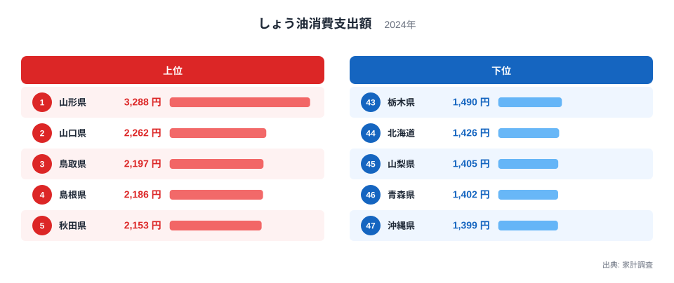
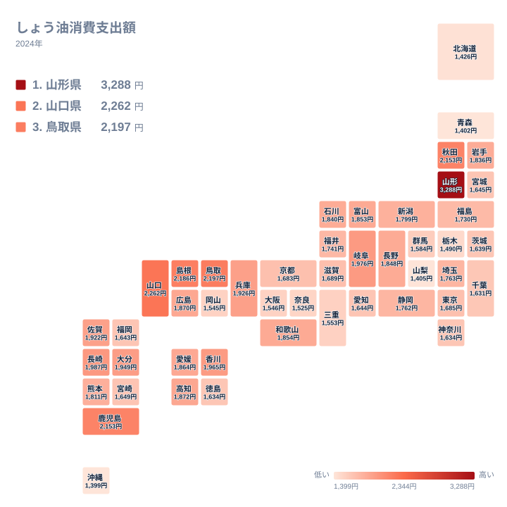

家計調査が集計する「しょう油消費支出額」は、1世帯が1年間にしょう油の購入に使った金額を示す指標です。しょう油は和食に欠かせない調味料ですが、地域によって好まれる種類や使う量には大きな差があります。

2024年の全国データを見ると、1位の県と47位の県の間には2倍を超える開きがあります。しょう油という同じ調味料でありながら、なぜこれほど消費支出に差が出るのでしょうか。

この記事では、上位と下位のグループを比較しながら、地理的な広がりと食文化との関係を読み解きます。単純に「東北地方は消費が多い」とは言い切れない意外な事実も見えてきます。

## しょう油消費支出額、上位と下位の県

<source-link href="/ranking/soy-sauce-consumption-expenditure">しょう油消費支出額ランキングをもっと見る</source-link>

1位は山形県で、1世帯あたり3,288円です。2位の山口県2,262円を1,000円以上引き離しており、突出した数字になっています。[山形県のデータ](/areas/06000)を見ると、郷土料理にしょう油を多用する食文化が背景にあると考えられます。山形県では「だし醤油」などしょう油をベースにした調味料が家庭で広く使われており、味付けの濃い郷土料理が多いことが支出額を押し上げている可能性があります。この点はあくまで仮説であり、家計調査の数値だけから断定できるものではありません。

2位から6位までは山口県、鳥取県、島根県、秋田県、鹿児島県と続きます。とくに山口県、鳥取県、島根県は中国地方の日本海側に位置しており、隣接する3県が上位に集まっている点が目立ちます。[山口県のデータ](/areas/35000)を含むこの山陰・瀬戸内の一帯は、古くから醤油醸造業が盛んな地域としても知られています。地元に醤油の産地を持つ県ほど、家庭での消費量や購入価格が高くなりやすいという傾向が働いているのかもしれません。ただしこれも一つの見方であり、産地の有無だけで説明が尽きるわけではありません。

> [!NOTE]
> この指標は「消費量」ではなく「消費支出額」、つまり金額です。同じ量を購入しても価格の高いしょう油を選ぶ世帯が多い県ほど数値が上がるため、量の多さと支出額の大小は必ずしも一致しません。

上位10県を地方別に見ると、東北地方が2県、中国地方が3県、九州地方が3県、中部地方と四国地方が1県ずつとなっており、特定の地方に偏っているわけではありません。しょう油の消費支出額は、単純な地域区分よりも、個々の県の食文化や醸造業の有無に左右されている可能性が高いといえます。

## 最下位グループの特徴

最下位は沖縄県で1,399円です。沖縄県は独自の食文化を持つ地域で、豚肉料理や泡盛など、しょう油以外の調味料や食材を中心とした食文化が根付いています。しょう油そのものへの依存度が本州の食文化に比べて低いことが、支出額を押し下げている一因と考えられます。

46位の青森県、44位の北海道は、いずれも東北・北海道地方に位置しています。同じ東北地方でありながら、1位の山形県や5位の秋田県と大きく異なる結果になっている点は注目に値します。東北地方だから消費が多い、と一括りにはできないことがこの順位から読み取れます。

45位の山梨県と43位の栃木県は、いずれも内陸の中部・関東地方です。海に面していない地域だからしょう油の消費が少ない、という単純な説明も成り立ちません。実際、同じく内陸県の岐阜県は8位、長野県は18位と、むしろ上位に近い順位に位置しています。

> [!WARNING]
> 家計調査は都道府県内のすべての世帯ではなく、原則として県庁所在市の世帯を対象に集計されています。県全体の消費傾向を完全に代表しているわけではない点に注意してください。

## 地理的に見るしょう油消費の広がり

タイルマップで見ると、上位の県は日本列島の広い範囲に点在しています。中国地方の山口県、鳥取県、島根県は隣接する3県がまとまって濃い色になっており、地域的なまとまりが見て取れます。一方で、東北地方は山形県と秋田県が上位に入る一方、同じ東北の青森県は最下位に沈んでおり、隣り合う県同士でも大きな差が生まれています。

下位の県に目を移すと、沖縄県、青森県、北海道といった日本列島の南北の端に位置する県が並んでいます。ただし、山梨県や栃木県のように本州の中央部に位置する県も下位に入っており、単純に「端の地域だから消費が少ない」とは説明できません。地理的な位置よりも、各県固有の食文化や醸造業の集積が消費支出額に強く影響していると考えられます。

> [!TIP]
> しょう油には濃口、淡口、たまりなど複数の種類があり、種類によって価格が異なります。支出額だけを見て「しょう油好きな県」と決めつけず、どんな種類のしょう油が好まれているかも合わせて考えると、より深く地域差を理解できます。

## 発見: 東北がひとくくりにできない理由

今回のデータで最も興味深い発見は、東北地方の中での差です。山形県は1位、秋田県は5位と上位に入る一方、青森県は47県中46位という最下位に近い順位でした。同じ東北地方という広い括りでは説明できないほどの差が、隣接する県の間に存在しています。

山形県や秋田県では郷土料理にしょう油を使う頻度が高く、家庭での調味料としての位置づけが強いのに対し、青森県では別の調味料や食材が食文化の中心を占めている可能性があります。この点については、味噌など他の調味料の消費データと合わせて検証する必要がある仮説にとどまります。

## 味噌との対比から見える食文化

しょう油と同じ発酵調味料の味噌も、地域による消費の差が大きいことで知られています。しょう油の消費支出額が高い山形県や秋田県といった東北地方の一部の県は、味噌についても伝統的に自家製造や消費が盛んな地域とされており、発酵調味料全般への親しみが強い食文化を持っている可能性があります。

ただし、この記事で使ったデータはしょう油の支出額だけです。味噌との関係については、別のデータで確認する必要がある仮説にとどめておきます。しょう油以外の家計消費データについては、[同じカテゴリの統計一覧](/category/economy)から他の指標も確認できます。

## まとめ

- 1位は山形県で3,288円、47位は沖縄県で1,399円で、約2.3倍の差があります
- 2位から6位までは山口県、鳥取県、島根県、秋田県、鹿児島県で、特定の地方に偏らず全国に散らばっています
- 山口県、鳥取県、島根県の中国地方3県は隣接してまとまって上位に入っています
- 同じ東北地方でも山形県・秋田県は上位、青森県は最下位に近く、地域区分だけでは説明できません
- しょう油消費支出額は消費量そのものではなく、種類や価格の違いも反映した金額なので、注意が必要です

## データ出典

家計調査（総務省統計局、2024年）をもとに作成しています。
