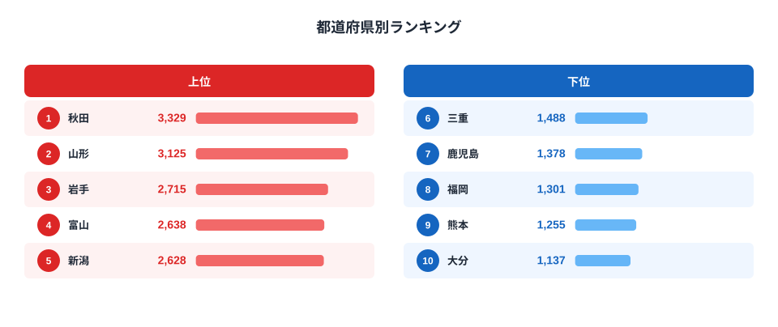

「野菜をよく食べる県」と聞いて、真っ先に思い浮かぶのはどこでしょうか。2024年の家計調査（二人以上世帯・都道府県庁所在市）でほうれんそう消費量1位だったのは[山形県](/areas/06000)でした。年間4,166gと、最下位の大分県1,458gの2.9倍にのぼります。

このランキングが面白いのは、上位の顔ぶれです。山形・秋田・岩手・富山という、実は別の全国調査でも常連として名前が挙がる県が並んでいます。この記事では、なぜこの4県がほうれんそう消費でも上位に食い込むのか、そして最新の全国学力テストのデータと突き合わせるとその符合がどこまで本当なのかを、消費量と支出額という2つの指標から見える地域差の構造とあわせて読み解きます。

> [!NOTE]
> このランキングは総務省「家計調査」の品目別購入数量データが元になっています。調査対象は**都道府県庁所在市の二人以上世帯**で、県内全域の消費実態そのものではありません。また外食で食べたほうれんそうは含まれない「家庭内の購入量」ベースの数字です。

## 上位と下位の対比

<source-link href="/ranking/spinach-consumption-quantity">ほうれんそう消費量ランキングをもっと見る</source-link>

2024年の1位は山形県で4,166g、2位は[秋田県](/areas/05000)で4,137g、3位は[岩手県](/areas/03000)で3,629gでした。4位は京都府で3,308g、5位は富山県で3,291g、6位は新潟県で3,155gと続き、8位には宮城県も3,108gで入り、上位10県のうち東北勢が4県、北陸勢が2県を占めています。

一方で下位グループは、大分県が1,458gで最下位、熊本県は1,679gで46位、香川県は1,736gで45位、鹿児島県は1,738gで44位、福岡県は1,802gで43位という顔ぶれです。九州勢が下位5県のうち4県を占める結果になっており、東日本と西日本の間にはっきりした地域差が見えます。ほうれんそうは寒冷地でも育てやすく霜に当たると甘みが増す性質を持つ野菜で、東北・北陸のような寒冷地は産地としても消費地としても強い地域です。地元で採れる新鮮なほうれんそうが食卓に上りやすい環境が、家庭での購入量を押し上げていると考えられます。

## なぜ大分・熊本など九州勢が下位に沈むのか

九州は温暖な気候を活かした野菜生産が盛んな地域ですが、ほうれんそうに限っては消費量が伸び悩んでいます。背景として考えられるのは、九州で家庭料理によく使われる葉物野菜が、ほうれんそうよりも小松菜や春菊、あるいは白菜など別の品目に分散している可能性です。加えて、ほうれんそうは他の葉物と比べて低温・涼しい気候での栽培に向いた作物のため、温暖な地域では地場での旬の時期が短く、家庭での「日常使い」の頻度が下がりやすい面もあります。

ここから先は推測ですが、九州の家庭では小松菜や白菜など代替の葉物野菜への支出が相対的に高い可能性があります。これは今回のほうれんそう消費量データだけでは検証できず、他の葉物野菜のランキングと突き合わせて初めて確認できる仮説です。

> [!WARNING]
> 家計調査は毎年の抽出調査であり、サンプル世帯の入れ替わりや天候不順による野菜価格の変動によって順位が動くことがあります。1年だけの順位を「その県の食文化」と断定するのは早計で、複数年の傾向を見ることをおすすめします。

## 消費量と支出額は同じ順位になるのか

支出額ランキングでも消費量ランキングとほぼ同じ顔ぶれが上位に並びます。

<source-link href="/ranking/spinach-consumption-expenditure">ほうれんそう消費支出額ランキングをもっと見る</source-link>

支出額の倍率も2.9倍で、消費量の倍率とほぼ一致します。1位の秋田県は3,329円、最下位の大分県は1,137円です。これは1gあたりの購入単価が全国的に大きくは変わらず、「買う量そのものの差」が支出額の差に直結していることを示しています。つまり秋田・山形の家庭は、単価の高いほうれんそうを買っているわけではなく、シンプルに量を多く買っているということです。

> [!TIP]
> 消費量ランキングと支出額ランキングの順位がほぼ一致する品目は、地域による価格差より「食べる頻度・量」の差が支配的だと読み解けます。逆に順位が大きくズレる品目があれば、地域ごとの単価差（輸送コストや地場産の有無）が効いている可能性があります。

## 学力テスト上位県とほうれんそう消費県は実際どこまで重なるのか

ほうれんそう消費量ランキングでとりわけ話題になりやすいのが、上位の顔ぶれです。教育関連の書籍や記事では「学力テストの成績が良い県ほど、栄養価の高い野菜をよく食べている」という見方がしばしば紹介され、ほうれんそう消費上位の秋田・山形・岩手・富山の4県は、その代表例として語られることが多い顔ぶれです。

そこで文部科学省・国立教育政策研究所が公表する最新（2025年度）の全国学力・学習状況調査データと実際に突き合わせてみました。結果は一部にしか当てはまりません。全国学力テスト平均正答率で秋田県と富山県はともに4位・5位（同率）と確かに上位に入りますが、ほうれんそう消費量1位の山形県は39位、3位の岩手県は40位にとどまり、学力テスト上位の常連というイメージほどには順位が高くありませんでした。学力テスト自体の1位は東京都、2位は石川県、3位は福井県で、ほうれんそう消費上位県とはほぼ重ならない結果です。

あわせて見る: [全国学力テスト平均正答率ランキング](/ranking/academic-achievement-test-average-rate)

> [!WARNING]
> 「学力上位県はほうれんそうを食べている」という見方は、秋田県と富山県には当てはまりますが、消費量1位の山形県・3位の岩手県には実際のデータでは当てはまりません。2県分の一致だけをもって「学力とほうれんそう消費に関係がある」と結論づけるのは早計です。仮に何らかの相関があったとしても、それは因果関係を示すものではなく、教育熱心さ・世帯所得・地域の食文化など他の要因が両方に影響している可能性のほうが高いと考えられます。

「教育熱心な家庭ほど栄養価の高い野菜を食卓に載せている」という物語は、栄養成分の説明よりも直感的に響きやすく、マーケティングの切り口としてたびたび使われてきました。今回のように実際のデータで確認すると、秋田・富山では成り立つ一方、山形・岩手では成り立たないというのが実態です。学力を左右する要因は家庭の学習環境や地域の教育投資など多岐にわたり、ほうれんそう消費量そのものが学力を高めているわけではありません。それでも「似た顔ぶれの県が2つの全く異なるランキングでどこまで重なるか」を実データで確かめてみる作業は、統計を読む面白さの一つだといえます。

## まとめ

- 2024年のほうれんそう消費量1位は山形県で4,166g、最下位は大分県で1,458gとなり2.9倍の差
- 上位10県のうち東北勢4県・北陸勢2県が占め、寒冷地ほど消費量が多い傾向
- 下位5県は大分・熊本・香川・鹿児島・福岡で、うち4県を九州勢が占める（香川のみ四国）
- 消費量ランキングと支出額ランキングはほぼ同じ順位構造で、価格差より購入量の差が支配的
- 全国学力テスト平均正答率（2025年度）では秋田県が4位、富山県が5位と上位に入るが、消費量1位の山形県は39位、3位の岩手県は40位にとどまり、「学力上位県はほうれんそう好き」という符合が成り立つのは4県中2県にすぎない

主食を離れて野菜以外の食習慣に地域差がどう表れるかは、[米消費量ランキング](/blog/rice-consumption-quantity-ranking)でも確認できます。米は東北・北陸で消費が多い一方、ほうれんそうは同じ地域でも産地条件や旬の長さによって順位の付き方が異なる部分があり、単一の「東北=食が濃い」という単純な図式では説明しきれない多様さがうかがえます。

## データ出典

総務省「家計調査」の品目別データを、e-Stat（政府統計の総合窓口）経由で取得・集計しています。集計年は2024年、対象は都道府県庁所在市の二人以上世帯です。学力テストのデータは文部科学省・国立教育政策研究所「全国学力・学習状況調査」（2025年度）の都道府県別結果を用いています。平均正答率は小学校・中学校の各教科の正答率を平均した値のため、小数第2位まで表示されます。
