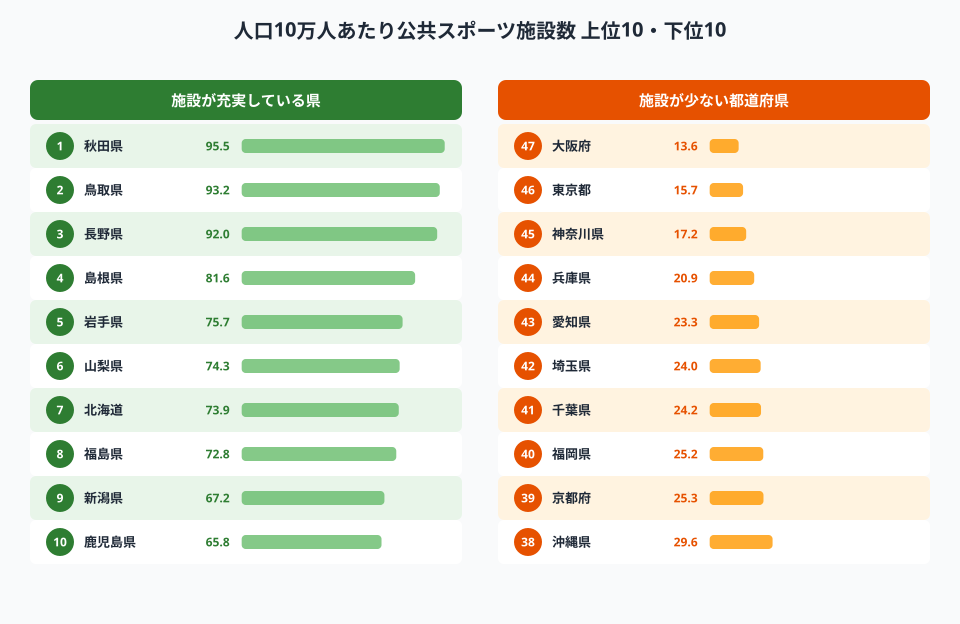
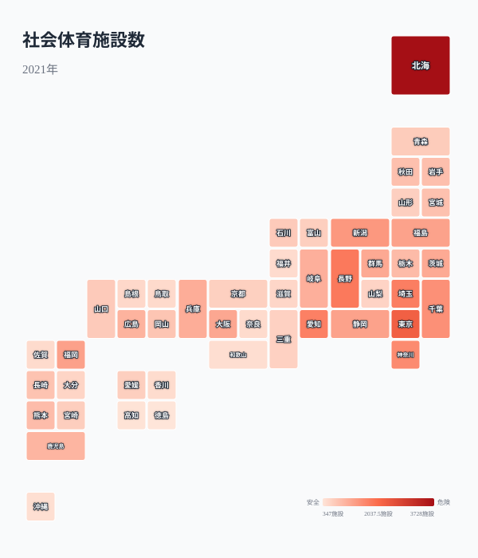
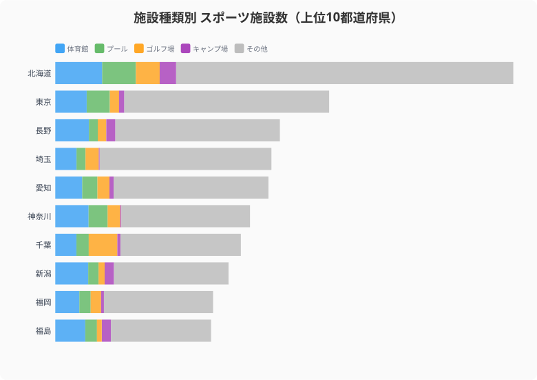
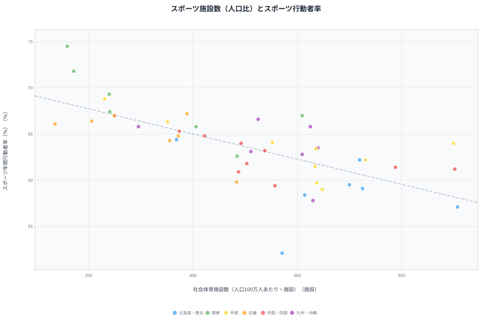
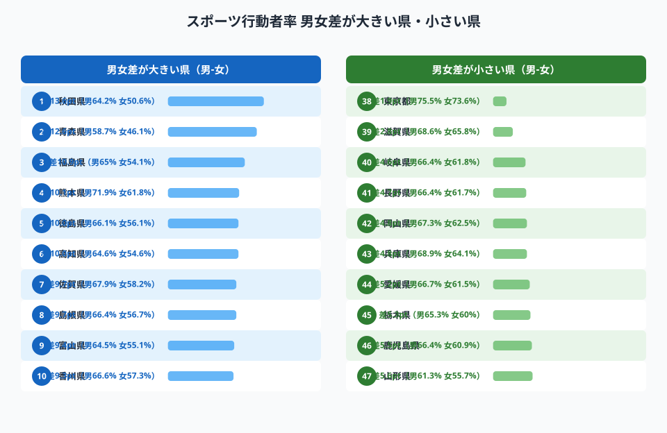
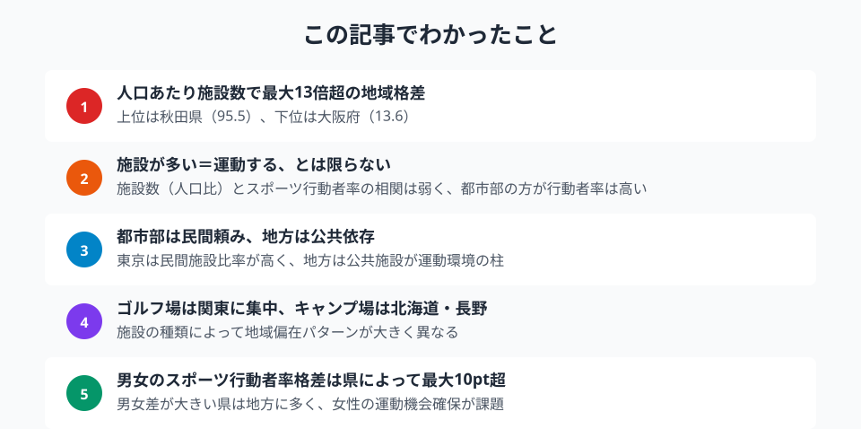

人口10万人あたりの公共スポーツ施設数は、秋田県の95.5に対し大阪府は13.6。約7倍の格差がある。住む場所で運動環境はこれほど違う。都道府県別スポーツ施設データで「運動格差」を明らかにする。

## 公共スポーツ施設ランキング -- 地方が圧倒的に充実、都市部は深刻な不足

人口10万人あたりの社会体育施設数を都道府県別にランキングすると、上位は秋田県（95.5）、鳥取県（93.2）、長野県（92.0）と地方県が占める。いずれも人口が少ない県で、施設の絶対数は少なくても人口比では充実している。

一方、下位は[大阪府](/areas/27000)（13.6）、[東京都](/areas/13000)（15.7）、神奈川県（17.2）と大都市圏が並ぶ。人口密度が高い地域では、用地確保の困難さが施設整備を阻んでいる。

> [!NOTE]
> 「社会体育施設」は公共が設置・管理するスポーツ施設（体育館・武道場・水泳プール・グラウンド等）を指し、民間フィットネスクラブやゴルフ場（民間）は含みません。都市部の施設数が少なく見える理由の一つは、民間施設が補完的役割を担っているためです。

<source-link href="/ranking/social-sports-facility-count">47都道府県の社会体育施設数ランキングをもっと見る</source-link>

## 全国分布で見るスポーツ施設の偏在

タイルグリッドマップで社会体育施設数の全国分布を見ると、絶対数では北海道（3,728施設）と東京都（2,229施設）が突出する。ただし人口比では正反対の結果になる点に注意が必要だ。

<ad-slot></ad-slot>

## 施設の種類で見る地域性 -- ゴルフ場は関東、キャンプ場は北海道・長野

施設を種類別に見ると、地域ごとの特色が浮かぶ。上位10都道府県の施設構成を比較すると、北海道はキャンプ場が多く、長野県は体育館とキャンプ場がバランスよく分布している。東京都は体育館が中心で、アウトドア施設は少ない。

ゴルフ場（民間）は千葉・兵庫・北海道に集中しており、都市近郊の娯楽施設としての性格が強い。キャンプ場（公共）は北海道・長野・静岡に多く、自然資源と連動した分布パターンを示す。

<source-link href="/ranking/public-gymnasium-count">47都道府県の体育館数（公共）ランキングをもっと見る</source-link>

## 施設が多い県は本当に運動する？ -- スポーツ行動者率との相関分析

人口あたり施設数が多い県の住民は実際に運動しているのか。施設数（人口比）とスポーツ行動者率の散布図を描くと、意外にも明確な正の相関は見られない。

スポーツ行動者率の上位は[東京都](/areas/13000)（74.5%）、神奈川県（71.8%）、埼玉県（69.3%）と都市部が占める。人口あたり施設数で下位のこれらの都道府県は、民間フィットネスクラブや商業スポーツ施設が充実しており、公共施設に頼らない運動環境が形成されている。

逆に、施設数が多い[秋田県](/areas/05000)（57.1%）や青森県（52.1%）はスポーツ行動者率が低い。高齢化率の高さや冬季の気候条件が運動習慣に影響している可能性がある。

> [!WARNING]
> スポーツ行動者率と施設数の間に明確な正の相関がないことは、[仮説] 施設の「量」よりアクセス・プログラム・費用面が行動を規定している可能性を示唆します。ただしこの散布図は相関を示すに過ぎず、因果関係の確認には別途検証が必要です。

<source-link href="/ranking/sports-activity-rate-10plus">47都道府県のスポーツ行動者率ランキングをもっと見る</source-link>

<ad-slot></ad-slot>

## 男女のスポーツ行動者率格差

スポーツ行動者率の男女差を県別に見ると、格差の大きい県と小さい県が明確に分かれる。

男女差が大きい県は地方に多く、女性がスポーツに参加する機会や環境が相対的に不足している可能性がある。一方、都市部では男女差が小さい傾向にあり、民間フィットネス施設の充実が女性の運動参加を後押ししていると考えられる。

## まとめ

スポーツ施設と運動環境のデータから見えてくるポイントを整理する。

人口減少が進む地方では公共スポーツ施設の維持コストが課題となり、統廃合の議論が避けられない。一方で施設数を増やせば運動する人が増えるという単純な構図ではないことをデータは示している。住民の運動習慣を促進するには、施設の「量」だけでなく、プログラムの充実やアクセスの改善といった「質」の向上が求められる。

**データ出典:**
- [社会生活統計指標（e-Stat）](https://www.e-stat.go.jp/dbview?sid=0000010107)（2021年）

## データ出典

本記事のデータはe-Stat（政府統計の総合窓口）を基に作成しています。

本記事の対象データ: [関連カテゴリ](/category/tourism)
